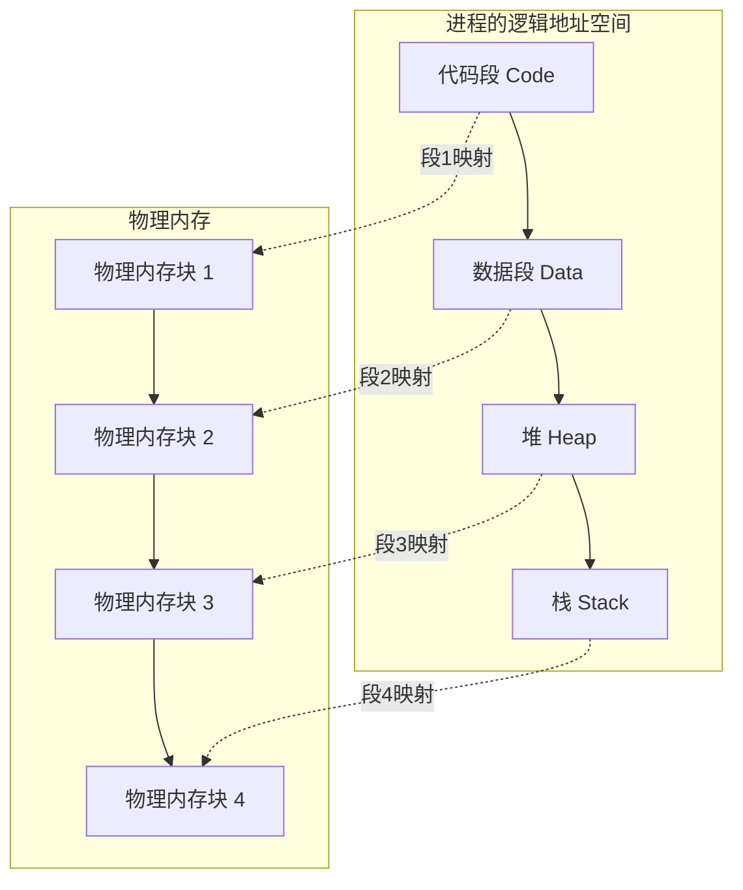

# 内存分页与分段深度剖析

## 从一个问题开始

想象你走进一家图书馆，想借阅《深入理解计算机系统》这本书。

管理员问你："你要第几层书架、第几格？"

你愣了一下——你只知道书名是《深入理解计算机系统》，并不知道它具体放在哪里。

这个场景，恰恰就是内存管理要解决的核心问题：**程序只知道自己的"逻辑地址"（书名），但物理内存需要的是"物理地址"（书架位置）**。

操作系统就像那个图书馆管理员，需要维护一张映射表，把"书名"翻译成"具体位置"。分页和分段，就是两种不同的"翻译策略"。

【直观类比】
- **分段**：按书籍类别管理。《计算机》放在A区，《文学》放在B区。同一本书的所有章节必须连续存放。
- **分页**：把每本书切成固定大小的章节页（假设每章正好10页）。《深入理解计算机系统》可能第1-3章在A区，第4-6章在B区，完全打散存放。

## 一、分段机制

### 1.1 什么是分段

分段（Segmentation）是一种内存管理技术，它根据程序的**逻辑结构**来划分内存。每个段代表程序中的一个具有完整意义的单元，比如代码段、数据段、堆、栈等。



### 1.2 段表结构

分段机制使用**段表**来存储逻辑段到物理地址的映射：

```
逻辑地址格式：<段号, 段内偏移>

段表项包含：
┌─────────────┬─────────────┬──────────┬────────┐
│ 段基地址    │ 段界限      │ 权限位   │ 状态位 │
├─────────────┼─────────────┼──────────┼────────┤
│ 0x00100000  │ 0x00005000  │ R/X      │ Valid  │
└─────────────┴─────────────┴──────────┴────────┘
```

### 1.3 地址转换过程

分段地址转换步骤：

```c
// 逻辑地址：(段号, 偏移量)
// 物理地址 = 段表[段号].基地址 + 偏移量

物理地址 = 段表[段号].base + offset
```

**举例**：访问逻辑地址 `(2, 0x1000)`：
1. 查找段表，找到段2的基地址 `0x08000000`
2. 检查偏移量 `0x1000` 是否小于段界限
3. 物理地址 = `0x08000000 + 0x1000 = 0x08001000`

【直观类比】
分段就像按房间划分公寓。每个房间（段）有独立的用途：卧室、厨房、客厅。你可以随时调整房间的大小，但同一房间内的物品必须连续摆放。

### 1.4 分段的优点与缺点

| 优点 | 缺点 |
|------|------|
| 符合程序的逻辑结构 | 外部碎片 |
| 段长可变，可动态调整 | 内存分配复杂 |
| 便于代码和数据的保护 | 段表占用额外内存 |

## 二、分页机制

### 2.1 什么是分页

分页（Paging）将物理内存和逻辑内存都划分为**固定大小**的块。物理内存的块称为**页框（Page Frame）**或**物理页**，逻辑内存的块称为**页（Page）**。

```mermaid
graph LR
    subgraph 逻辑地址空间（4KB页）
        L1[页0 0-4KB] --> L2[页1 4-8KB]
        L2 --> L3[页2 8-12KB]
        L3 --> L4[页3 12-16KB]
    end
    
    subgraph 页表映射
        M1[页0 → 帧3]
        M2[页1 → 帧7]
        M3[页2 → 帧1]
        M4[页3 → 帧5]
    end
    
    subgraph 物理内存（4KB帧）
        P1[帧0] --> P2[帧1]
        P2 --> P3[帧2]
        P3 --> P4[帧3]
        P4 --> P5[帧4]
        P5 --> P6[帧5]
        P6 --> P7[帧6]
        P7 --> P8[帧7]
    end
    
    L1 -.->|映射| M1
    L2 -.->|映射| M2
    L3 -.->|映射| M3
    L4 -.->|映射| M4
```

### 2.2 页表结构

```
逻辑地址格式：<页号, 页内偏移>

假设：逻辑地址空间 32位，页大小 4KB = 2^12

┌────────────────┬────────────────┐
│ 页号 (20位)    │ 页内偏移 (12位) │
└────────────────┴────────────────┘

页表项结构：
┌────────────┬────────────┬────┬────┬────┐
│ 物理页帧号 │ 有效位(P)  │ R/W│ U/S│ D  │
├────────────┼────────────┼────┼────┼────┤
│ 20位帧号   │ 1位是否在内存│ 1位│ 1位│ 1位│
└────────────┴────────────┴────┴────┴────┘
```

### 2.3 地址转换过程

```c
// 逻辑地址结构
// | 页号 (PAGE_SHIFT bits) | 页内偏移 (PAGE_OFFSET bits) |

// 地址转换
page_number = logical_address >> PAGE_SHIFT;
offset = logical_address & (PAGE_SIZE - 1);
frame_number = page_table[page_number].frame;
physical_address = (frame_number << PAGE_SHIFT) | offset;
```

**举例**：逻辑地址 `0x1234`（页大小4KB）：
1. 页号 = `0x1234 >> 12 = 0x1`
2. 页内偏移 = `0x1234 & 0xFFF = 0x234`
3. 页表项 `[1]` 指向帧号 `7`
4. 物理地址 = `(7 << 12) | 0x234 = 0x7234`

【直观类比】
分页就像图书馆的**复印服务**。你不需要整本书，只需要第5章第23页。图书馆把这单独一页复印给你，对应地从物理书架上找到这一页的内容。整个系统以"页"为最小单位调度，不关心内容的逻辑含义。

### 2.4 分页的优点与缺点

| 优点 | 缺点 |
|------|------|
| 无外部碎片 | 内部碎片（最后一页） |
| 内存分配简单 | 页表占用内存 |
| 便于虚拟内存实现 | 两次内存访问（查表+取数据） |

## 三、分页 vs 分段：核心区别

### 3.1 两种机制的对比

| 特性 | 分段 | 分页 |
|------|------|------|
| 划分依据 | 逻辑结构 | 固定大小 |
| 地址格式 | `<段号, 偏移>` | `<页号, 偏移>` |
| 大小 | 可变 | 固定 |
| 碎片类型 | 外部碎片 | 内部碎片 |
| 段表项 | 基地址+界限 | 帧号+控制位 |
| 保护性 | 天然按段权限 | 需额外位控制 |

### 3.2 为什么需要两者结合？

现代操作系统（如 Linux、Windows）通常采用**段页式管理**：

1. **外层段表**：标识进程的各个段区域
2. **内层页表**：每个段内部再按页管理

```
逻辑地址 → 段号 → 段表项(基地址+页表指针) → 页号 → 页表项(帧号) → 物理地址
```

**地址转换流程**：

```c
// 段页式地址转换
segment_base = seg_table[segment_num].base;           // 获取段基地址
page_table_addr = seg_table[segment_num].page_table; // 获取段内页表地址

// 检查段内偏移是否越界
if (offset >= seg_table[segment_num].limit) {
    return -1; // 越界错误
}

// 获取页号和页内偏移
page_num = offset >> PAGE_SHIFT;
page_offset = offset & (PAGE_SIZE - 1);

// 查页表获取物理帧
frame_num = page_table[page_table_addr][page_num];

// 最终物理地址
physical_addr = (frame_num << PAGE_SHIFT) | page_offset;
```

## 四、TLB：地址转换的加速器

### 4.1 为什么需要TLB？

分页机制的问题是：**每次内存访问需要两次物理内存访问**：
1. 第一次：查页表获取物理帧号
2. 第二次：用物理帧号访问实际数据

这相当于你去图书馆借书，每次还要先查目录找到书在哪，再去取书。效率太低。

**TLB（Translation Lookaside Buffer）** 就是一个**地址转换缓存**，把最近用过的页表项缓存起来。

### 4.2 TLB的工作原理

```
逻辑地址: <VPN, Offset>
         ↓
    ┌─────────┐
    │  TLB    │ ← 命中则直接返回物理地址
    │ 查找    │
    └─────────┘
         ↓ 未命中
    页表查找 → 获取 PFN → 更新 TLB → 返回物理地址
```

【直观类比】
TLB就像你桌上的**便签纸**。你经常访问的那几本书（《算法导论》、《TCP/IP详解》）的位置可能已经记在便签上了，不需要每次都去图书馆目录查。

### 4.3 TLB的性能指标

```
TLB命中率高 → 内存访问 ≈ 1次
TLB命中率低 → 内存访问 ≈ 2次（极端情况下更慢）

典型命中率：95%以上
- 程序的时间局部性越强，命中率越高
- 循环体越小、越紧凑，命中率越高
```

## 五、面试高频问题

### 5.1 问题一：分页和分段的本质区别是什么？

**标准回答**：
分页是**固定大小**的内存划分，纯粹从物理角度管理内存，消除了外部碎片但会产生少量内部碎片。分段是**可变大小**的内存划分，按程序的逻辑结构（代码段、数据段、堆、栈）来组织，更符合人的思维习惯，但会产生外部碎片。

**追问应对**：
面试官可能会追问："那为什么现代系统都用分页而不是分段？"

关键点：
1. 分页的内存分配更简单——不需要寻找连续的空闲区域
2. 分页便于实现虚拟内存——可以只把需要的页调入内存
3. 硬件支持更成熟——MMU对分页有原生支持

### 5.2 问题二：什么是内部碎片和外部碎片？

**标准回答**：
- **内部碎片**：分配给进程的内存大于实际需要的内存。比如分页系统中，一个进程需要3.2个页，系统会分配4个页，那0.8个页就是内部碎片。
- **外部碎片**：内存中总的空闲空间足够，但这些空间不连续，无法满足分配需求。比如分段系统中，内存中有多个小的空闲段，但没有一个足够大。

**记忆技巧**：
- 内部碎片（Internal）—— **I**nside the allocated unit
- 外部碎片（External）—— **E**xternal to the allocated unit

### 5.3 问题三：TLB Miss后会发生什么？

**标准回答**：
TLB Miss后，CPU会查页表获取物理页帧号，这个过程需要访问内存中的页表。如果页表项不在缓存中，还需要访问主存。获取到物理地址后，会把这个映射关系写入TLB，下次访问同一页时就能命中。

**性能影响**：
- TLB Miss的开销 ≈ 10-100个CPU周期
- L1 Cache Miss ≈ 50-200个周期
- L2 Cache Miss ≈ 200-500个周期
- 主存访问 ≈ 100,000+个周期

## 六、常见误区

### ❌ 误区一：分页完全没有碎片

很多人认为分页消除了所有碎片，这是错误的。分页会产生**内部碎片**，即分配的最后一页可能用不满。

例如：进程需要1001字节内存，页大小4KB：
- 分页系统分配1个页 = 4096字节，内部碎片 = 3095字节
- 分段系统可能分配1个段 = 2000字节，外部碎片需要合并

### ❌ 误区二：TLB和Cache是一回事

TLB（Translation Lookaside Buffer）和CPU Cache是完全不同的东西：

| TLB | CPU Cache |
|-----|-----------|
| 缓存虚拟地址→物理地址的映射 | 缓存物理内存中的数据 |
| 查找关键字是虚拟页号 | 查找关键字是物理地址 |
| 命中后才知道物理地址 | 命中后才能取数据 |

### ❌ 误区三：段表和页表同时存在

现代操作系统（如Linux）的逻辑地址到物理地址的转换，实际上是**直接用分页**，段表只是历史遗留。Linux把段寄存器设置为0，使得段基址为0，所以实际上只用到页表。

## 七、记忆技巧

### 7.1 分页 vs 分段口诀

```
分段：逻辑结构，大小可变，像公寓按房间分
分页：物理划分，大小固定，像书籍按页码分

分段管"形"，分页管"量"
形可变，量固定
```

### 7.2 地址转换三步法

```
分页地址转换：
1. 拆：VPN + Offset
2. 查：页表项 → PFN
3. 组：PFN + Offset

分段地址转换：
1. 查：段表 → 基址
2. 加：基址 + 偏移
3. 验：偏移 < 界限
```

### 7.3 TLB作用速记

```
TLB = Translation Lookaside Buffer
     ↓         ↓          ↓
     翻译      备用       缓冲

作用：地址翻译的快速通道
命中：快（1周期）
未命中：慢（需查页表）
```

## 八、实战检验

### 检验一：地址计算

假设系统采用分页管理，页大小为4KB，回答以下问题：

1. 逻辑地址 `0x3FF7` 对应的页号和页内偏移是什么？
2. 如果页表项 `[1]` 指向物理帧号 `5`，则物理地址是多少？

**答案**：
1. 页号 = `0x3FF7 >> 12 = 0x3`，页内偏移 = `0x3FF7 & 0xFFF = 0xFF7`
2. 物理地址 = `(5 << 12) | 0xFF7 = 0x5FF7`

### 检验二：碎片判断

一个系统采用分页管理，页大小8KB：
- 进程A需要17KB内存
- 进程B需要33KB内存

问：各进程会产生多少内部碎片？总共浪费多少内存？

**答案**：
- 进程A：分配3页 = 24KB，内部碎片 = 24 - 17 = 7KB
- 进程B：分配5页 = 40KB，内部碎片 = 40 - 33 = 7KB
- 总内部碎片 = 14KB

### 检验三：TLB命中率分析

一个程序访问数组 `int arr[1024]`，页大小4KB，`int` 占4字节：

1. 顺序遍历数组时，TLB命中率是多少？
2. 为什么局部性原理在这里很重要？

**答案**：
1. `arr` 占 1024 * 4 = 4KB，正好1页。顺序访问时，后续访问都在同一页，TLB命中率高。
2. 时间局部性：同一页的数据被连续访问；空间局部性：相邻数据可能在同一缓存行。

---

**总结**：分页和分段是内存管理的两种基础机制，各有优劣。现代系统通常以分页为主、段式为辅（甚至完全用分页）。理解这两种机制的本质区别——一个按固定大小物理切分，一个按逻辑结构灵活划分——是掌握内存管理的关键。

