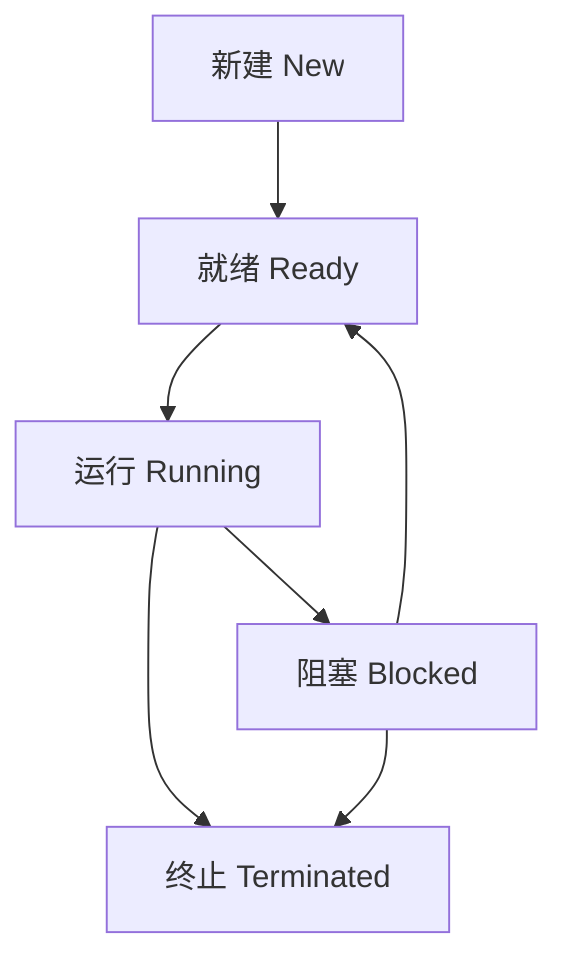
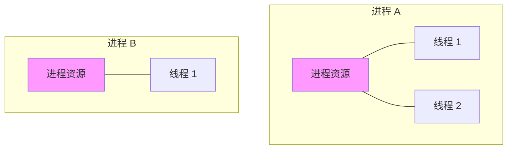

# 进程与线程区别

> 目标级别：P5/P6

面试官问：「进程和线程有什么区别？」你回答「进程是资源分配的最小单位，线程是 CPU 调度的最小单位」——然后面试官追问：「为什么线程切换比进程快？」「进程间怎么通信？」「线程间怎么同步？」

进程与线程是操作系统最核心的概念，理解它们的区别是理解并发编程的基础。

## 快速自测

面试前先问自己这三个问题：

1. **进程和线程的本质区别是什么？** 光说「资源分配 vs 调度」够不够？
2. **为什么线程切换比进程快？** 上下文切换具体包括什么？
3. **什么时候用多进程？什么时候用多线程？** 各有什么优缺点？

---

## 一、进程基础

### 1.1 什么是进程

进程（Process）是程序的一次执行实例，是系统进行资源分配和调度的基本单位。

```
进程的组成：
- 代码段（text）：程序的指令
- 数据段（data）：全局变量、静态变量
- 堆（heap）：动态分配的内存
- 栈（stack）：函数调用、局部变量
- PCB（进程控制块）：进程状态信息
```

### 1.2 进程状态



| 状态 | 说明 |
|------|------|
| 新建（New） | 进程正在创建 |
| 就绪（Ready） | 等待 CPU 调度 |
| 运行（Running） | 正在 CPU 执行 |
| 阻塞（Blocked） | 等待 I/O 或资源 |
| 终止（Terminated） | 执行完毕 |

### 1.3 进程控制块（PCB）

PCB 是操作系统为每个进程维护的数据结构：

```c
struct PCB {
    int pid;                    // 进程 ID
    int parent_pid;             // 父进程 ID
    enum process_state state;   // 进程状态
    int priority;               // 优先级
    unsigned long size;          // 进程大小
    struct file *files[NR_OPEN];// 打开的文件
    struct mm_struct *mm;       // 内存管理信息
    struct cpu_context cpu;     // CPU 上下文
    // ...
};
```

---

## 二、线程基础

### 2.1 什么是线程

线程（Thread）是进程内的执行单元，是 CPU 调度的基本单位。

```
同一进程的线程共享：
- 代码段（text）
- 数据段（data）
- 堆（heap）
- 打开的文件
- 信号处理

线程独有：
- 栈（stack）
- 程序计数器（PC）
- 寄存器（Registers）
- 线程 ID（TID）
```

### 2.2 线程 vs 进程



---

## 三、核心区别

### 3.1 资源 vs 调度

| 维度 | 进程 | 线程 |
|------|------|------|
| 资源分配 | 资源分配的基本单位 | 共享进程资源 |
| CPU 调度 | CPU 调度的基本单位 | CPU 调度的实际单位 |
| 地址空间 | 独立地址空间 | 共享地址空间 |
| 通信方式 | IPC（管道、消息、共享内存） | 共享变量、锁 |
| 创建速度 | 慢（需要分配资源） | 快（共享进程资源） |
| 切换速度 | 慢（完整上下文切换） | 快（部分上下文切换） |
| 独立性 | 高（隔离） | 低（共享地址空间） |

### 3.2 为什么线程切换比进程快

```
进程切换：
1. 保存当前进程的 CPU 上下文（寄存器、程序计数器等）
2. 更新 PCB 信息（状态、页表等）
3. 将 PCB 移入/移出调度队列
4. 切换内存管理信息（页表、TLB 刷新）
5. 加载新进程的 CPU 上下文
6. 更新新进程的地址空间

线程切换：
1. 保存当前线程的 CPU 上下文
2. 切换栈和寄存器
3. 无需切换地址空间
4. TLB（快表）缓存可能保留
```

**关键区别**：线程切换不需要切换地址空间，节省了 MMU（内存管理单元）的开销。

### 3.3 多进程 vs 多线程

| 场景 | 推荐方案 | 原因 |
|------|----------|------|
| CPU 密集型 | 多进程 | 充分利用多核 CPU |
| I/O 密集型 | 多线程 | 线程切换快，等待时切换 |
| 稳定性要求高 | 多进程 | 进程隔离，一个崩溃不影响其他 |
| 频繁通信 | 多线程 | 共享地址空间，通信方便 |
| 内存受限 | 多线程 | 线程共享资源，内存占用小 |

---

## 四、进程间通信（IPC）

### 4.1 常见 IPC 方式

| 方式 | 说明 | 速度 | 适用场景 |
|------|------|------|----------|
| 管道 | 字节流通信 | 较快 | 父子进程通信 |
| 消息队列 | 消息结构通信 | 中等 | 多进程消息传递 |
| 共享内存 | 映射同一块内存 | 最快 | 大量数据交换 |
| 信号 | 异步事件通知 | 快 | 进程控制 |
| Socket | 网络/本机通信 | 较慢 | 跨机器通信 |

### 4.2 管道通信

```c
// 父子进程管道通信
int pipefd[2];
pipe(pipefd);  // 创建管道

if (fork() == 0) {
    // 子进程：写管道
    close(pipefd[0]);  // 关闭读端
    write(pipefd[1], "hello", 5);
    close(pipefd[1]);
} else {
    // 父进程：读管道
    close(pipefd[1]);  // 关闭写端
    char buf[100];
    read(pipefd[0], buf, 100);
    close(pipefd[0]);
}
```

### 4.3 共享内存

```c
// 共享内存通信
key_t key = ftok("/tmp", 's');
int shmid = shmget(key, 1024, IPC_CREAT | 0666);

// 连接共享内存
char *shm = shmat(shmid, NULL, 0);

// 写入数据
strcpy(shm, "Hello from process 1");

// 分离共享内存
shmdt(shm);
```

---

## 五、线程同步

### 5.1 线程同步的必要性

多线程共享地址空间，存在竞态条件：

```java
// 竞态条件示例
public class Counter {
    private int count = 0;

    public void increment() {
        count++;  // 不是原子操作
    }
}

// 线程 A 执行 count++（读取、+1、写入）
// 线程 B 在 A 写入前读取，丢失一次 +1
```

### 5.2 常见同步方式

| 方式 | 说明 | 适用场景 |
|------|------|----------|
| 互斥锁 | 保证同一时刻只有一个线程访问 | 保护共享资源 |
| 读写锁 | 读多写少场景 | 读共享、写独占 |
| 信号量 | 控制并发数量 | 生产者消费者 |
| 条件变量 | 线程间事件通知 | 等待某个条件 |
| 原子变量 | 原子操作 | 计数器、标志位 |

### 5.3 互斥锁示例

```java
public class SafeCounter {
    private int count = 0;
    private final Lock lock = new ReentrantLock();

    public void increment() {
        lock.lock();
        try {
            count++;
        } finally {
            lock.unlock();
        }
    }

    public int get() {
        lock.lock();
        try {
            return count;
        } finally {
            lock.unlock();
        }
    }
}
```

---

## 六、面试题精讲

### 🔴 【高频】进程和线程的区别

**问题**：进程和线程有什么区别？

**标准答案**：

```
1. 资源分配：
   - 进程是资源分配的基本单位（内存、文件、信号等）
   - 线程是 CPU 调度的基本单位

2. 地址空间：
   - 进程有独立的地址空间
   - 线程共享进程的地址空间

3. 通信方式：
   - 进程：管道、消息队列、共享内存、Socket 等
   - 线程：共享变量、锁、信号量等

4. 开销：
   - 进程创建/切换开销大（完整上下文切换）
   - 线程创建/切换开销小（共享资源，无需切换地址空间）

5. 独立性：
   - 进程相互隔离，一个崩溃不影响其他
   - 线程共享地址空间，一个崩溃可能导致整个进程崩溃
```

### 🟡 【中频】为什么线程切换比进程快

**问题**：为什么线程切换比进程快？

**标准答案**：

```
线程切换比进程快的原因：

1. 地址空间不变
   - 进程切换需要切换页表（MMU）
   - 线程切换不需要切换地址空间
   - TLB 缓存可以保留

2. 资源不同
   - 进程需要切换：打开文件、信号处理、内存管理等
   - 线程需要切换：栈、寄存器、程序计数器

3. 上下文大小
   - 进程上下文大（包含整个地址空间信息）
   - 线程上下文小（只有少量 CPU 相关数据）

具体来说，线程切换：
- 保存/恢复寄存器
- 切换栈指针
- 更新线程调度信息

进程切换额外需要：
- 切换页表
- 刷新 TLB
- 切换内核资源
```

### 🟡 【中频】进程和线程的选择

**问题】：什么时候用多进程？什么时候用多线程？

**标准答案**：

```
选择多进程：
1. 需要隔离性：一个模块崩溃不影响其他
2. CPU 密集型：充分利用多核 CPU
3. 内存占用高：避免线程共享导致的内存问题
4. 长时间运行：进程稳定性更高

选择多线程：
1. I/O 密集型：线程切换开销小
2. 频繁通信：共享地址空间，通信方便
3. 资源共享：需要共享大量数据
4. 内存受限：线程共享资源，节省内存

实际选择需要考虑：
- 任务特性（CPU vs I/O）
- 稳定性要求（隔离 vs 共享）
- 开发复杂度（线程同步 vs IPC）
```

---

## 七、常见陷阱与易错点

### ⚠️ 陷阱一：混淆线程 ID 和进程 ID

- **PID（进程 ID）**：唯一标识进程
- **TID（线程 ID）**：同一进程内唯一，跨进程可能相同

### ⚠️ 陷阱二：忽略线程安全问题

多线程编程必须考虑线程安全，否则会出现竞态条件、死锁等问题。

### ⚠️ 陷阱三：认为线程越多越好

线程数量过多会导致：

- 上下文切换开销增大
- 内存占用增加
- 调度开销增大

### ⚠️ 陷阱四：混淆用户态和内核态线程

| 类型 | 说明 |
|------|------|
| 用户态线程 | 内核不知道线程存在，需要用户态调度 |
| 内核态线程 | 内核直接调度，切换开销大 |
| 混合线程 | 用户态线程池 + 内核线程 |

---

## 八、对比总结

### 进程 vs 线程

| 维度 | 进程 | 线程 |
|------|------|------|
| 定义 | 程序的一次执行 | 进程内的执行单元 |
| 资源分配 | 独立资源 | 共享进程资源 |
| 调度 | 操作系统调度 | 操作系统调度 |
| 地址空间 | 独立 | 共享 |
| 通信 | IPC 机制 | 共享变量 |
| 创建速度 | 慢 | 快 |
| 切换速度 | 慢 | 快 |
| 崩溃影响 | 进程隔离 | 可能导致进程崩溃 |
| 适用场景 | 稳定性、独立性 | 性能、实时性 |

### IPC 方式对比

| 方式 | 速度 | 复杂度 | 适用场景 |
|------|------|--------|----------|
| 管道 | 较快 | 简单 | 父子进程通信 |
| 消息队列 | 中等 | 中等 | 多进程消息 |
| 共享内存 | 最快 | 复杂 | 大量数据 |
| Socket | 较慢 | 复杂 | 跨机器 |

---

## 九、扩展思考

### 💡 加分话题：协程

```
协程（Coroutine）是用户态的轻量级线程：

特点：
- 用户态调度，不需要内核切换
- 切换开销极小（只有寄存器）
- 主动让出（yield）而非抢占

使用场景：
- 高并发 I/O（Go 的 goroutine）
- 游戏逻辑（Unity 的协程）
- 异步编程（Python asyncio）
```

### 💡 加分话题：纤程（Fiber）

```
纤程（Fiber）是 Windows 的用户态线程：

特点：
- 由应用程序调度
- 不需要内核切换
- 适合大量并发任务
```

> 进程和线程是操作系统最基础的概念。理解它们的区别、各自的优缺点，以及适用的场景，才能在系统设计时做出正确的选择。多线程和多进程不是非此即彼，而是根据场景灵活选择。