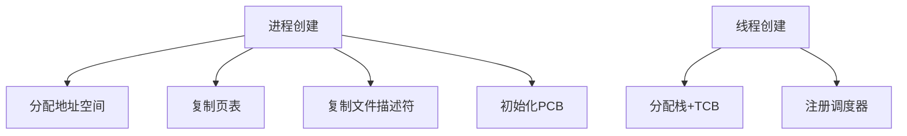

# 进程与线程的区别与联系

面试官翻到简历上"熟悉多线程编程"这一行，头也不抬地问了一句：

"进程和线程有什么区别？"

小王脱口而出："进程是资源分配的最小单位，线程是CPU调度的最小单位。"

面试官点点头，继续追问："那为什么需要线程？直接用进程不行吗？"

小王愣了一下，说："因为线程创建快？"

面试官面无表情："快多少？为什么快？"

小王开始擦汗。

这个问题，80%的候选人只能说出教科书上的定义，但真正能讲清楚"为什么需要线程"的，可能不到20%。

今天，我们把进程和线程彻底掰开揉碎讲一遍。

## 一、从一个问题开始

先来做个小测试，打开你的任务管理器（Windows按`Ctrl+Shift+Esc`，Mac按`Command+Space`搜索"活动监视器"）。

看到了什么？是不是一堆正在运行的程序？浏览器、IDE、音乐播放器...

每个运行的程序，在操作系统眼里，就是一个**进程**。

但你有没有想过：为什么浏览器可以同时播放音乐、下载文件、渲染页面？为什么音乐播放器可以在播放音乐的同时响应你的暂停操作？

答案就是**线程**。

## 【直观类比】

### 进程 = 工厂

想象一下，进程就像一座独立的工厂。

每个工厂有自己的：
- 独立厂房（独立的内存空间）
- 独立的工人配额（独立的CPU时间片）
- 独立的资源配给（独立的文件句柄、数据库连接等）

工厂和工厂之间是隔离的：一个工厂爆炸了，不会影响另一个工厂。

这就是进程的**独立性**。

### 线程 = 车间里的工人

一座工厂里可以有多个车间，每个车间里有多名工人。

这些工人（线程）共享：
- 工厂的电力系统（共享地址空间）
- 工厂的仓库（共享堆内存）
- 工厂的设备（共享文件句柄）

但每个工人有自己的：
- 工作台和工具箱（线程独立的栈）
- 当前的思考状态（线程独立的寄存器）

车间之间是合作的：一个工人在等材料时，另一个工人可以继续干活。

这就是线程的**并发性**。

### 进程与线程的关系

```
┌─────────────────────────────────────────────────────┐
│                     进程（工厂）                      │
│  ┌─────────────────────────────────────────────┐   │
│  │              共享区域（公共区域）              │   │
│  │  堆内存 | 全局变量 | 文件句柄 | 静态变量        │   │
│  └─────────────────────────────────────────────┘   │
│                                                     │
│  ┌──────────┐  ┌──────────┐  ┌──────────┐        │
│  │ 线程1    │  │ 线程2    │  │ 线程3    │        │
│  │ 栈+寄存器│  │ 栈+寄存器│  │ 栈+寄存器│        │
│  └──────────┘  └──────────┘  └──────────┘        │
│                                                     │
└─────────────────────────────────────────────────────┘
```

## 二、核心原理

### 进程的核心特性

**1. 资源分配的基本单位**

当你在Linux下运行一个程序时，操作系统会为这个程序创建一个进程，并分配：

| 资源 | 说明 |
| --- | --- |
| 独立的地址空间 | x86架构下通常是3GB（用户空间） |
| 独立的文件描述符表 | 默认最大1024个 |
| 独立的信号处理 | 每个进程有自己的信号处理器 |
| 独立的PID | 进程标识符 |

**2. 进程的创建过程**

在Linux中，创建进程主要有两种方式：

```c
// 方式1: fork - 复制当前进程
pid_t pid = fork();

// 方式2: exec - 替换当前进程的映像
execlp("ls", "ls", "-la", NULL);
```

`fork()`创建的子进程，会复制父进程的：
- 虚拟地址空间（Copy-On-Write机制）
- 文件描述符
- 寄存器状态

这个复制过程可不便宜，涉及到大量的内存复制和页表建立。

### 线程的核心特性

**1. CPU调度的基本单位**

线程是操作系统能够进行调度的最小单位。每个线程有自己的：
- 线程ID（TID）
- 独立的栈空间（通常1-8MB）
- 独立的寄存器状态
- 共享进程的地址空间

**2. 线程的创建成本**

```python
# Python创建线程
import threading

def worker():
    print("I'm a worker thread")

t = threading.Thread(target=worker)
t.start()
```

对比一下进程和线程的创建成本：

| 操作 | 耗时（相对值） |
| --- | --- |
| 进程创建 | 100-1000x |
| 线程创建 | 1x（基准） |
| 进程上下文切换 | 100-1000x |
| 线程上下文切换 | 1x（基准） |

**3. 为什么线程更快？**

因为线程共享了进程的很多资源：



关键差异在于：
- 进程需要复制整个地址空间，而线程不需要
- 进程需要建立独立的页表，而线程共享父进程的页表
- 进程的文件描述符表是独立的，线程共享这份表

### 进程与线程的本质区别

| 维度 | 进程 | 线程 |
| --- | --- | --- |
| 资源拥有 | 独立资源 | 共享进程资源 |
| 地址空间 | 独立 | 共享 |
| 通信方式 | IPC复杂 | 直接读写共享内存 |
| 创建速度 | 慢（秒级） | 快（毫秒级） |
| 切换成本 | 高 | 低 |
| 隔离性 | 强 | 弱 |
| 拓展性 | 多进程扩展 | 多线程扩展 |

## 三、边界与特例

### 1. 特殊线程：主线程

每个进程至少有一个线程，称为主线程。主线程的特殊性在于：

- 主线程退出，进程退出
- 主线程可以创建其他线程
- 主线程栈大小通常是线程栈的2倍

### 2. 协程：用户态线程

协程（Coroutine）是一种更轻量的并发单元，完全在用户态实现：

| 特性 | 线程 | 协程 |
| --- | --- | --- |
| 调度 | 操作系统 | 用户程序 |
| 切换成本 | 内核态 | 用户态（极低） |
| 阻塞影响 | 整个线程 | 只影响协程自身 |
| 编写难度 | 较低 | 较高（需要手动让出） |

### 3. 僵尸进程与僵尸线程

**僵尸进程**：子进程退出后，父进程没有调用`wait()`回收其退出状态

**僵尸线程**：同理的线程版本，现代Linux已经很少见，因为线程退出时自动清理

### 4. 多进程 vs 多线程

| 场景 | 推荐 | 原因 |
| --- | --- | --- |
| CPU密集型 | 多进程 | 规避GIL，充分利用多核 |
| IO密集型 | 多线程/协程 | 切换成本低，等待时可让出 |
| 稳定性要求高 | 多进程 | 隔离性好，一个崩了不影响其他 |
| 内存受限 | 多线程/协程 | 共享内存，省资源 |

## 四、常见误区

### ❌ 误区一：进程一定比线程安全

很多人觉得进程隔离性好，一定比线程安全。

但实际上：
- 多进程共享数据需要通过IPC，反而容易出问题
- 多线程共享数据时，通过正确的同步机制，也可以很安全

### ❌ 误区二：线程越多性能越好

这就是经典的"越多越好"误区。

线程数量过多会导致：
- 上下文切换开销增大
- 内存占用增加
- 调度开销增大

正确的公式（IO密集型）：
```
最佳线程数 = (IO等待时间 / CPU计算时间 + 1) * CPU核心数
```

### ❌ 误区三：所有语言都支持真正的多线程

Python的GIL（全局解释器锁）导致同一时刻只有一个线程执行Python字节码。

这就是为什么Python的多线程不适合CPU密集型任务。

### ❌ 误区四：进程是线程的容器

这种说法不够准确。

更准确的说法是：进程是资源的容器，线程是调度的单位。

## 五、记忆技巧

### 记忆口诀

> "进程是工厂，线程是工人"
> "工厂隔离保安全，工人协作提效率"
> "进程独立通信难，线程共享同步难"

### 对比表格速记

| 记忆点 | 进程 | 线程 |
| --- | --- | --- |
| 本质 | 程序的一次执行 | CPU调度的单位 |
| 资源 | 独立 | 共享 |
| 切换 | 慢 | 快 |
| 通信 | IPC | 直接读写 |

### 一句话总结

**进程负责分配资源，线程负责执行任务。**

## 六、实战检验

### 自检题目

**题目1**：`fork()`和`clone()`的区别是什么？

<details>
<summary>点击查看答案</summary>

`fork()`创建子进程时，会复制父进程的所有资源，包括完整的地址空间。

`clone()`是Linux特有的系统调用，可以精确控制共享哪些资源（通过flags参数），比如只共享地址空间但不共享文件描述符，这就是轻量级进程的由来。
</details>

**题目2**：为什么Redis使用单线程模型？

<details>
<summary>点击查看答案</summary>

Redis是IO密集型应用，主要瓶颈在网络IO和内存IO，而不是CPU计算。

单线程避免了锁开销，且通过IO多路复用（epoll）可以高效处理大量并发连接。Redis 6.0之后引入了多线程IO，但核心命令执行仍是单线程。
</details>

**题目3**：浏览器为什么使用多进程架构？

<details>
<summary>点击查看答案</summary>

1. **隔离性**：一个Tab崩溃不会影响其他Tab
2. **安全性**：不同源的页面在不同的进程中，无法直接访问彼此内存
3. **稳定性**：沙箱机制可以将恶意页面限制在进程中
4. **性能**：可以利用多核CPU
</details>

### 面试追问预测

| 问题 | 考察点 | 进阶追问 |
| --- | --- | --- |
| 进程间如何通信 | IPC理解 | 管道和消息队列的区别 |
| 线程同步方式 | 并发安全 | 为什么有了锁还需要volatile |
| 进程调度算法 | OS基础 | 优先级反转问题怎么解决 |

## 七、生产实战案例

### 案例：Nginx vs Apache架构选择

Nginx采用多进程（master-worker）架构，而Apache默认是多线程。

**Nginx的架构优势**：
- 每个worker进程独立，不共享内存，避免锁竞争
- 一个worker崩溃不影响其他worker
- 适合高并发场景（10k+连接）

**Apache的架构劣势**：
- 多线程共享内存，需要全局锁保护
- 线程崩溃可能影响整个进程
- 高并发下锁竞争严重

这就是为什么高性能服务器越来越多选择Nginx的多进程模型。

:::tip 💡
面试时能举出Nginx vs Apache这个例子，说明你对进程/线程模型的理解已经落地到工程实践了。
:::
