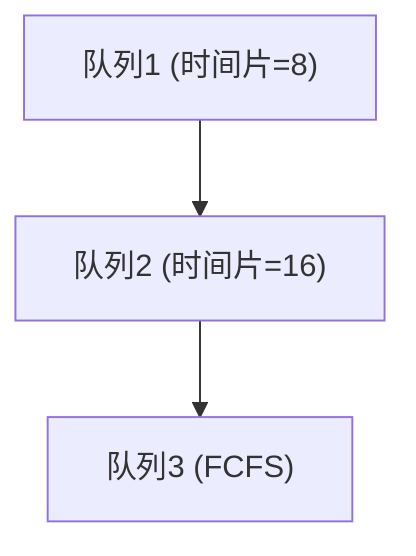

# 进程调度算法

> 目标级别：P6

面试官问：「进程调度算法有哪些？」你回答「先来先服务、时间片轮转」——然后面试官追问：「什么是实时调度和非实时调度？」「Linux 用的是什么调度算法？」「什么是多级反馈队列？」

进程调度是操作系统的核心功能，理解各种调度算法对于理解系统行为至关重要。

## 快速自测

面试前先问自己这三个问题：

1. **常见的调度算法有哪些？** 它们各自的优缺点是什么？
2. **什么是实时调度和非实时调度？** 有什么区别？
3. **Linux 使用的调度算法是什么？** CFS 是什么？

---

## 一、调度基础

### 1.1 调度的层次

```
进程调度层次：

高级调度（作业调度）
   - 从外存选作业调入内存
   - 频率低（分钟级）

中级调度（内存调度）
   - 进程换出/换入内存
   - 控制内存中的进程数量

低级调度（进程调度）
   - 从就绪队列选进程运行
   - 频率高（毫秒级）
```

### 1.2 调度指标

| 指标 | 说明 |
|------|------|
| CPU 利用率 | CPU 执行时间占总时间的比例 |
| 系统吞吐量 | 单位时间完成的进程数 |
| 周转时间 | 进程从提交到完成的总时间 |
| 带权周转时间 | 周转时间 / 实际运行时间 |
| 等待时间 | 进程在就绪队列等待的时间 |
| 响应时间 | 从提交到首次响应的时间 |

### 1.3 周转时间计算

```
进程 A：
- 提交时刻：0
- 开始运行：0
- 完成时刻：100
- 运行时间：80
- 周转时间 = 100 - 0 = 100
- 带权周转时间 = 100 / 80 = 1.25
```

---

## 二、调度算法分类

### 2.1 调度算法概览

| 算法 | 类型 | 特点 |
|------|------|------|
| FCFS | 非抢占式 | 简单、公平 |
| SJF | 非抢占式/抢占式 | 最短优先 |
| RR | 抢占式 | 时间片轮转 |
| 优先级 | 抢占式/非抢占式 | 优先级高先运行 |
| 多级反馈队列 | 抢占式 | 动态调整 |
| CFS | 抢占式（Linux） | 公平调度 |

---

## 三、典型调度算法

### 3.1 先来先服务（FCFS）

**First Come First Served**

```
调度顺序：按照进程到达时间

| 进程 | 到达时间 | 服务时间 |
|------|----------|----------|
| P1   | 0        | 10       |
| P2   | 1        | 5        |
| P3   | 2        | 8        |

执行顺序：P1 → P2 → P3

甘特图：
P1  |---------|         (0-10)
P2             |-----|    (10-15)
P3                   |--------|  (15-23)

分析：
- 平均等待时间：(0 + 10 + 15) / 3 = 8.33
- 平均周转时间：(10 + 14 + 21) / 3 = 15
- 缺点：短进程排在长进程后会导致等待时间长（护航效应）
```

**优点**：简单、公平

**缺点**：护航效应（Convoy Effect），短进程等待时间长

### 3.2 短作业优先（SJF）

**Shortest Job First**

```
非抢占式 SJF：
- 到达时，选择服务时间最短的进程

| 进程 | 到达时间 | 服务时间 |
|------|----------|----------|
| P1   | 0        | 10       |
| P2   | 1        | 5        |
| P3   | 2        | 8        |

执行顺序：P1(0-10) → P2(10-15) → P3(15-23)

分析：
- 平均等待时间：(0 + 10 + 15) / 3 = 8.33
- 平均周转时间：(10 + 14 + 21) / 3 = 15

抢占式 SJF（SRTF）：
- 新进程到达时，比较剩余时间

时间线：
0-1: P1(10-1=9)       → P1
1-2: P1(8), P2(5-1=4) → P2
2-6: P1(6), P2(3)    → P2(3-4=1)
6-7: P1(6), P2(1)    → P2
7-15: P1(6)          → P1
15-23: P3(8)         → P3
```

**优点**：平均等待时间和周转时间最短

**缺点**：长进程可能饥饿（Starvation）

### 3.3 时间片轮转（RR）

**Round Robin**

```
调度顺序：每个进程执行一个时间片，然后放回队尾

| 进程 | 到达时间 | 服务时间 |
|------|----------|----------|
| P1   | 0        | 10       |
| P2   | 1        | 5        |
| P3   | 2        | 8        |

时间片 = 4

执行顺序：
0-4: P1 (剩余 6)
4-5: P2 (剩余 1)
5-8: P1 (剩余 2)
8-12: P3 (剩余 4)
12-13: P1 (剩余 0)
13-17: P3 (剩余 0)
17-18: P2 (剩余 0)
```

**时间片大小的影响**：

| 时间片大小 | 效果 |
|------------|------|
| 太小 | 上下文切换频繁，系统开销大 |
| 太大 | 退化为 FCFS，响应时间差 |

**一般原则**：时间片大小选择为 80% 的进程在一个时间片内完成

### 3.4 优先级调度

```
调度顺序：选择优先级最高的进程

| 进程 | 优先级（越小越高） | 服务时间 |
|------|--------------------|----------|
| P1   | 3                  | 10       |
| P2   | 1                  | 5        |
| P3   | 4                  | 8        |
| P4   | 2                  | 3        |

执行顺序：P2 → P4 → P1 → P3
```

**优先级类型**：

| 类型 | 说明 |
|------|------|
| 静态优先级 | 创建时确定，不变 |
| 动态优先级 | 根据等待时间等因素调整 |

**问题**：低优先级进程可能饥饿

**解决**：等待时间越长，优先级越高（ Aging 老化）

### 3.5 多级反馈队列（MLFQ）

**Multilevel Feedback Queue**

```
多级反馈队列调度：

队列1（最高优先级）：时间片 = 8
队列2：时间片 = 16
队列3：FCFS

规则：
1. 最高非空队列的进程运行
2. 新进程进入队列1
3. 用完时间片，下降到低一级队列
4. 时间片内阻塞，回到原队列
5. 等待时间过长，提升到高一级队列
```



**优点**：

- 不需要知道进程执行时间
- 动态适应进程特性
- 兼顾响应时间和吞吐量

---

## 四、实时调度

### 4.1 实时系统

| 类型 | 说明 | 硬性要求 |
|------|------|----------|
| 硬实时 | 必须在截止时间前完成 | 是 |
| 软实时 | 尽量在截止时间前完成 | 否 |

### 4.2 实时调度算法

| 算法 | 说明 |
|------|------|
| RM（Rate Monotonic） | 周期越短，优先级越高 |
| EDF（Earliest Deadline First） | 截止时间越早，优先级越高 |

```
RM 示例：
- 任务A：周期 20ms，执行 10ms → 优先级高
- 任务B：周期 50ms，执行 20ms → 优先级低

EDF 示例：
- 任务A：截止时间 30ms
- 任务B：截止时间 45ms
- 截止时间早的任务先执行
```

---

## 五、Linux CFS 调度器

### 5.1 CFS 原理

CFS（Completely Fair Scheduler）完全公平调度器是 Linux 的默认调度器。

```
CFS 的核心思想：
- 每个进程获得 "虚拟运行时间"
- 选择虚拟运行时间最少的进程运行
- 目标：每个进程获得相等的 CPU 时间

CFS 使用红黑树管理进程：
- 键 = 虚拟运行时间（vruntime）
- 最左侧节点 = 最需要调度的进程
```

### 5.2 CFS 参数

```
nice 值影响权重：
- nice 值越低，权重越高，获得的 CPU 时间越多
- nice = 0：权重 1024
- nice = -20：权重 20755（最多）
- nice = 19：权重 78（最少）

权重计算公式：
weight = 1024 / (1.25 ^ nice)
```

### 5.3 CFS 调度过程

```c
// CFS 调度选择
struct task_struct *pick_next_task_cfs(struct rq *rq) {
    struct cfs_rq *cfs_rq = &rq->cfs;
    if (!cfs_rq->nr_running)
        return NULL;

    // 选择 vruntime 最小的进程
    struct task_struct *p = __pick_next_entity(cfs_rq);
    return p;
}
```

---

## 六、面试题精讲

### 🔴 【高频】常见调度算法及特点

**问题**：有哪些常见的进程调度算法？各自有什么优缺点？

**标准答案**：

```
1. 先来先服务（FCFS）
   - 优点：简单、公平
   - 缺点：护航效应，短进程等待时间长

2. 短作业优先（SJF）
   - 优点：平均等待时间最短
   - 缺点：长进程可能饥饿

3. 时间片轮转（RR）
   - 优点：公平、响应时间好
   - 缺点：上下文切换开销

4. 优先级调度
   - 优点：灵活
   - 缺点：低优先级进程可能饥饿

5. 多级反馈队列
   - 优点：动态适应，不需要预先知道进程长度
   - 缺点：实现复杂
```

### 🟡 【中频】调度算法选择

**问题**：如何选择调度算法？

**标准答案**：

```
选择调度算法需要考虑：

1. 系统目标
   - 吞吐量高 → SJF
   - 响应时间快 → RR、多级反馈队列
   - 公平性 → FCFS、RR

2. 进程特性
   - CPU 密集型 → 吞吐量优先
   - I/O 密集型 → 响应时间优先

3. 系统类型
   - 批处理系统 → 吞吐量优先（SJF）
   - 交互系统 → 响应时间优先（RR）
   - 实时系统 → 截止时间保证（RM、EDF）

4. 实际因素
   - 实现复杂度
   - 开销
   - 公平性
```

### 🟡 【中频】CFS 调度器

**问题**：Linux 的 CFS 调度器是怎么工作的？

**标准答案**：

```
CFS（完全公平调度器）核心思想：

1. 虚拟运行时间
   - 每个进程记录 vruntime
   - 每运行一个时间单位，vruntime 增加
   - 实际增加 = 时间单位 * (1024 / 权重)

2. 红黑树管理
   - 进程按 vruntime 插入红黑树
   - 最左侧节点 = vruntime 最小的进程 = 最需要调度的

3. 调度过程
   - 选择红黑树最左侧节点运行
   - 运行一段时间后，更新 vruntime
   - 重新插入红黑树

4. 权重（nice 值）
   - nice 值越低，权重越高
   - 高权重进程 vruntime 增长慢，获得更多 CPU 时间
```

---

## 七、常见陷阱与易错点

### ⚠️ 陷阱一：混淆抢占式和非抢占式

| 类型 | 说明 |
|------|------|
| 非抢占式 | 进程运行直到阻塞或主动让出 CPU |
| 抢占式 | 时间片耗尽或更高优先级进程到达时强制切换 |

### ⚠️ 陷阱二：忽略调度指标

调度算法的评价需要综合考虑多个指标：CPU 利用率、吞吐量、周转时间、等待时间、响应时间。

### ⚠️ 陷阱三：混淆多级反馈队列和优先级队列

多级反馈队列是多个优先级队列的组合，进程可以在队列间移动（提升或降级）。

### ⚠️ 陷阱四：忽视饥饿问题

SJF、优先级调度可能导致低优先级/长作业饥饿，需要采用老化（Aging）机制解决。

---

## 八、对比总结

### 调度算法对比

| 算法 | 抢占式 | 饥饿 | 复杂度 | 适用场景 |
|------|--------|------|--------|----------|
| FCFS | 否 | 否 | 简单 | 批处理 |
| SJF | 可选 | 是 | 简单 | 批处理 |
| RR | 是 | 否 | 简单 | 交互系统 |
| 优先级 | 可选 | 是 | 简单 | 混合 |
| 多级反馈队列 | 是 | 解决 | 复杂 | 通用 |
| CFS | 是 | 否 | 复杂 | Linux |

### 调度指标对比

| 指标 | FCFS | SJF | RR | 优先级 |
|------|------|-----|-----|--------|
| 吞吐量 | 中 | 高 | 中 | 中 |
| 响应时间 | 差 | 中 | 好 | 中 |
| 等待时间 | 中 | 优 | 好 | 差 |
| 开销 | 低 | 低 | 高 | 低 |

---

## 九、扩展思考

### 💡 加分话题：调度器演进

```
Linux 调度器演进：
- O(1) 调度器（2.6）：固定优先级队列，调度时间恒定
- CFS（2.6.23+）：完全公平调度，基于红黑树
- BFS（桌面）：适用于桌面场景
- EEVDF：最新的调度算法
```

### 💡 加分话题：多核调度

```
多核 CPU 调度考虑：

1. 负载均衡
   - 定期检查各 CPU 负载
   - 将进程迁移到空闲 CPU

2. CPU 亲和性
   - 软亲和性：尽量在同一个 CPU
   - 硬亲和性：必须指定 CPU

3. 缓存亲和性
   - 进程尽量在缓存还有效的 CPU 运行
```

> 进程调度是操作系统的核心功能。理解各种调度算法的工作原理、优缺点和适用场景，才能在系统设计时做出正确的选择。实际系统通常使用多种调度算法的组合。