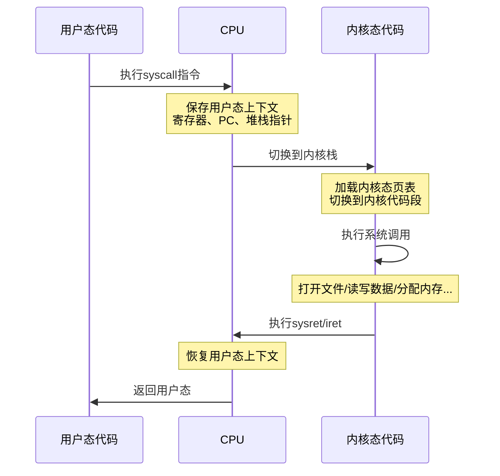

# 用户态与内核态切换

面试官问："你说IO多路复用比传统多线程高效，具体高效在哪？"

小王说："因为不需要创建那么多线程..."

面试官继续追问："那为什么需要切换到内核态？用户态和内核态有什么区别？"

小王支支吾吾："内核态...可以访问硬件？"

面试官没说话，画了一张图：

```
用户态 ──→ 系统调用 ──→ 内核态 ──→ 硬件
              ↑
           2-3微秒
```

"你知道这个切换要花多少时间吗？为什么高并发场景下这个开销很重要？"

小王彻底卡住了。

今天，我们把用户态和内核态这个概念彻底掰开揉碎讲一遍。

## 一、从一个问题开始

先看一个看似无害的操作：

```python
# 读取一个文件
with open("test.txt", "r") as f:
    content = f.read()
```

你以为这只是"读文件"，但实际上底层发生了什么？

```
用户代码调用open()
    ↓
CPU执行系统调用指令（syscall）
    ↓
触发软中断，CPU切换到内核态
    ↓
内核代码执行：检查权限、打开文件、返回文件描述符
    ↓
返回用户态
    ↓
用户代码调用read()
    ↓
再次触发系统调用...
```

每一步都涉及到**用户态到内核态的切换**，而这个切换是有代价的。

## 【直观类比】

### 用户态 vs 内核态 = 租客 vs 房东

想象你住在一栋公寓里：

```
┌──────────────────────────────────────┐
│            整栋公寓（操作系统）          │
│  ┌────────────────────────────────┐  │
│  │      公共区域（内核空间）        │  │
│  │  - 电梯（硬件访问）              │  │
│  │  - 电力系统（内存管理）          │  │
│  │  - 消防系统（异常处理）          │  │
│  └────────────────────────────────┘  │
│                                      │
│  ┌──────────┐    ┌──────────┐       │
│  │ 租客A     │    │ 租客B     │       │
│  │ (用户态)  │    │ (用户态)  │       │
│  │ 只能在自己 │    │ 只能在自己 │       │
│  │ 房间里活动 │    │ 房间里活动 │       │
│  └──────────┘    └──────────┘       │
└──────────────────────────────────────┘
```

**用户态（租客）**：
- 只能在自己的"房间"里活动
- 想用公共设施（电梯、电源），必须通过物业（内核）
- 不能直接访问其他租客的房间

**内核态（物业）**：
- 可以访问所有公共设施
- 管理所有租客的房间分配
- 负责保护租客之间的隔离

### 为什么需要这种区分？

| 问题 | 没有内核态会怎样 |
| --- | --- |
| 程序崩溃 | 一个程序崩溃可能导致整台机器挂掉 |
| 安全问题 | 恶意程序可以直接访问硬件、内存 |
| 多任务无法实现 | 多个程序会互相干扰 |
| 资源竞争 | 硬件访问会冲突 |

## 二、核心原理

### 1. CPU特权级别

现代CPU有多个特权级别：

```
┌─────────────────────────────────────┐
│            Ring 0（内核态）          │
│    最高特权：可访问所有硬件和内存      │
├─────────────────────────────────────┤
│            Ring 1                   │
│    留给虚拟机或设备驱动              │
├─────────────────────────────────────┤
│            Ring 2                   │
│    留给某些特殊驱动                  │
├─────────────────────────────────────┤
│            Ring 3（用户态）          │
│    最低特权：只能访问受限资源          │
└─────────────────────────────────────┘
```

Linux只使用了Ring 0和Ring 3：
- 内核态：Ring 0
- 用户态：Ring 3

### 2. 系统调用的触发

用户态程序如何切换到内核态？

**x86架构的触发方式**：

| 方式 | 说明 |
| --- | --- |
| `int 0x80` | 软中断（早期Linux） |
| `syscall` | 快速系统调用（x86-64） |
| `sysenter` | 快速系统调用（x86-32） |

```asm
; 传统方式（int 0x80）
mov eax, 1        ; 系统调用号（exit）
mov ebx, 0        ; 参数
int 0x80          ; 触发软中断，切换到内核态

; 现代方式（syscall）
mov eax, 60       ; 系统调用号（exit）
xor edi, edi      ; 参数
syscall           ; 快速切换到内核态
```

### 3. 切换的具体过程



### 4. 切换的成本分析

一次系统调用切换需要：

| 步骤 | 耗时 | 说明 |
| --- | --- | --- |
| 保存寄存器 | ~100ns | 保存用户态寄存器到内核栈 |
| 切换页表 | ~1000ns | TLB缓存可能失效 |
| 切换栈 | ~100ns | 切换内核栈 |
| 权限检查 | ~100ns | 内核代码执行检查 |
| 恢复寄存器 | ~100ns | 恢复用户态寄存器 |
| **总计** | **~1500-3000ns** | |

对比一下：
- 一次CPU加法：~1ns
- 一次L1缓存命中：~1ns
- 一次L2缓存命中：~4ns
- **一次系统调用**：~2000ns

系统调用比L2缓存访问慢了500倍！

### 5. 内核态能做什么用户态不能做的事？

```
┌────────────────────────────────────────────┐
│                 内核态特权                   │
├────────────────────────────────────────────┤
│  ✅ 访问任意物理内存地址                      │
│  ✅ 直接操作硬件设备（磁盘、网络、显示器）       │
│  ✅ 修改CPU特权级别                          │
│  ✅ 访问控制寄存器（如CR3，用于切换页表）       │
│  ✅ 执行特权指令（如cli禁用中断、lgdt加载段表）  │
├────────────────────────────────────────────┤
│                 用户态禁止                    │
├────────────────────────────────────────────┤
│  ❌ 直接访问硬件                             │
│  ❌ 访问其他进程的内存                        │
│  ❌ 执行特权指令                             │
│  ❌ 修改内核数据结构                          │
└────────────────────────────────────────────┘
```

## 三、边界与特例

### 1. Linux vs Windows的特权模型

**Linux**：Ring 0 + Ring 3

```
用户态代码：Ring 3
内核代码：Ring 0
设备驱动：Ring 0（Linux内核的一部分）
```

**Windows**：Ring 0 + Ring 3

```
用户态代码：Ring 3
内核代码：Ring 0
Native API：Ring 3（一些基本服务）
设备驱动：Ring 0
```

### 2. 系统调用的分类

| 类型 | 示例 | 切换次数（一次操作） |
| --- | --- | --- |
| 进程控制 | fork/exit/wait | 1次 |
| 文件管理 | open/read/write/close | 多次（每次IO） |
| 设备管理 | read/write（设备） | 多次 |
| 信息维护 | getpid/gettime | 1次 |
| 通信 | pipe/socket/send | 多次 |

### 3. 零拷贝技术减少切换

传统的数据传输需要多次内核态/用户态切换：

```
磁盘 → 内核缓冲区 → 用户缓冲区 → 内核缓冲区 → 网卡
         ↑切换1       ↑切换2       ↑切换3       ↑切换4
```

零拷贝（Zero-Copy）可以减少到：

```
磁盘 → 内核缓冲区 → 网卡
         ↑切换1       ↑切换2
```

这就是DMA（Direct Memory Access）的威力：**让硬件直接搬运数据，减少CPU参与**。

### 4. Context Switch vs Mode Switch

**Mode Switch（模式切换）**：
- 用户态 ↔ 内核态切换
- 同一个进程内
- 触发：系统调用、异常、中断

**Context Switch（上下文切换）**：
- 切换整个进程/线程
- 切换地址空间
- 触发：时间片用完、高优先级进程就绪

```
Mode Switch：用户态 ←→ 内核态（同一进程）
Context Switch：进程A → 进程B（不同进程）
```

Context Switch包含Mode Switch，但Mode Switch不一定需要Context Switch。

## 四、常见误区

### ❌ 误区一：只有IO操作才会切换到内核态

实际上，很多看似简单的操作也会触发系统调用：

```python
# 这些操作都会触发系统调用！
x = 5  # 可能触发写时复制（fork场景）

import time
time.time()  # gettimeofday系统调用

print("hello")  # write系统调用

a = [1, 2, 3]  # brk系统调用（调整堆内存）
```

### ❌ 误区二：用了内核提供的功能就是内核态

用户程序调用内核函数是通过系统调用接口，不是直接调用：

```
错误理解：
用户代码 ──→ 直接调用 ──→ 内核函数（错误！）

正确理解：
用户代码 ──→ 系统调用 ──→ 内核函数（正确）
```

用户代码和内核代码运行在不同的地址空间，不能直接调用。

### ❌ 误区三：现代CPU切换代价已经可以忽略

虽然syscall比int 0x80快了很多，但切换代价仍然存在：

| 架构 | syscal vs int 0x80 |
| --- | --- |
| x86-64 | syscall快10-20倍 |
| 但绝对值 | 仍然需要1000-2000ns |

在高并发场景下（10万QPS），每秒就要处理10万次切换，这个开销不可忽视。

### ❌ 误区四：异步IO可以完全避免切换

异步IO（如Linux的aio）可以减少等待时间，但：
- 发起IO请求时仍需要系统调用
- IO完成通知仍需要从内核态到用户态

真正的高性能IO（如epoll + 异步处理）是把切换最小化，不是完全消除。

## 五、记忆技巧

### 一句话总结

> 用户态是租户，内核态是物业，切换需要代价

### 对比速记表

| 维度 | 用户态 | 内核态 |
| --- | --- | --- |
| 特权级别 | Ring 3 | Ring 0 |
| 访问范围 | 受限 | 全部 |
| 代码来源 | 应用程序 | 操作系统内核 |
| 崩溃影响 | 只影响自己 | 影响整台机器 |
| 切换代价 | - | ~2000ns |

### 口诀

> "用户态干活受限，想用硬件找内核"
> "系统调用来敲门，切换开销记在心"
> "高并发下要优化，减少切换是真谛"

## 六、实战检验

### 自检题目

**题目1**：为什么printf比write系统调用慢很多？

<details>
<summary>点击查看答案</summary>

`printf`是C库函数，需要经历：

1. 格式化字符串（用户态）
2. 调用write系统调用
3. 切换到内核态
4. 内核写入缓冲区
5. 切换回用户态

而且`printf`通常会缓冲，不会立即调用write。

直接调用`write(1, "hello", 5)`会减少缓冲开销，但如果输出量小，printf的缓冲反而能减少系统调用次数。
</details>

**题目2**：mmap和read/write哪个更快？为什么？

<details>
<summary>点击查看答案</summary>

在大多数场景下，`mmap`更快：

1. **减少系统调用**：mmap映射后直接操作内存，不需要read/write系统调用
2. **减少数据拷贝**：传统read需要先拷贝到内核缓冲区再拷贝到用户空间，mmap直接映射

但mmap不是银弹：
- 小文件频繁读写可能更慢（页表维护开销）
- 随机访问大量小数据更合适
- 大文件顺序读写可能差不多
</details>

**题目3**：epoll_wait是阻塞调用吗？它是如何工作的？

<details>
<summary>点击查看答案</summary>

`epoll_wait`是一个阻塞调用，但它的实现很高效：

1. 用户态调用`epoll_wait`
2. 切换到内核态
3. 内核检查就绪的文件描述符
4. 如果没有就绪，内核将进程加入等待队列
5. 当IO完成，中断触发，内核标记就绪
6. 内核将进程从等待队列移出
7. 切换回用户态，返回就绪事件

关键是：**不需要轮询**，由内核主动通知。
</details>

### 面试追问预测

| 问题 | 考察点 | 进阶追问 |
| --- | --- | --- |
| 系统调用开销 | 切换成本 | 如何优化 |
| 中断处理 | 内核态工作 | 软中断vs硬中断 |
| 零拷贝原理 | 高性能IO | DMA的作用 |

## 七、生产实战案例

### 案例：Nginx如何减少内核态/用户态切换

Nginx的高性能秘密之一就是减少系统调用：

**1. 使用sendfile系统调用**：

```nginx
location /static/ {
    sendfile on;  # 零拷贝传输文件
    tcp_nopush on;  # 优化TCP包
}
```

**2. 使用epoll处理高并发**：

```
传统模式（select）：
- 每个连接一个线程
- 每次需要切换到内核态检查所有连接

epoll模式：
- 一个线程处理所有连接
- 内核主动通知就绪连接
- 切换次数 = 连接数，不是请求数
```

**3. 使用连接池**：

```
避免频繁的connect/close系统调用
维护长连接池复用连接
```

### 案例：Redis的高性能IO

Redis同样注重减少内核态/用户态切换：

```
Redis单线程模型
↓
事件循环：epoll_wait（阻塞等待）
↓
收到请求：read（单次系统调用）
↓
处理命令：纯内存操作（用户态）
↓
返回响应：write（单次系统调用）
↓
epoll_wait等待下一个请求
```

关键点：
- 系统调用次数 = 2 * 请求数（read + write）
- 内存操作全部在用户态
- 单线程避免了锁开销和上下文切换

:::tip 💡
理解内核态/用户态切换的开销，是理解高性能系统设计的基础。很多"黑科技"本质上都是在减少这种切换。
:::
