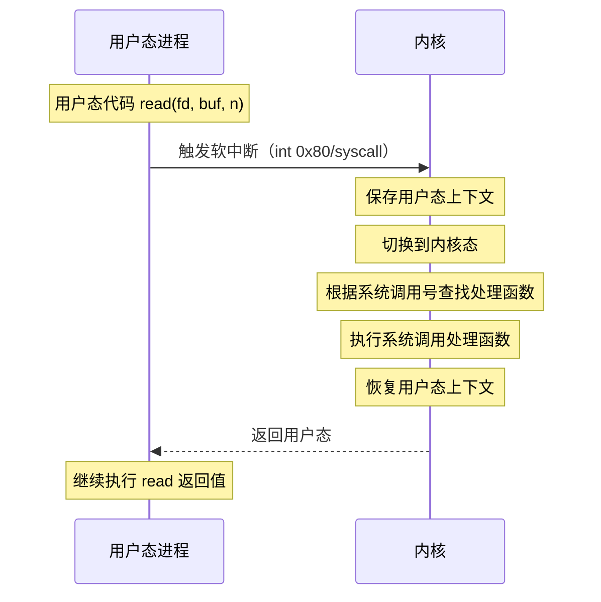

# 用户态与内核态切换

> 目标级别：P5/P6

面试官问：「什么是用户态和内核态？」你回答「内核态权限高，用户态权限低」——然后面试官追问：「为什么要区分用户态和内核态？」「切换的开销有多大？」「系统调用是怎么实现的？」

用户态和内核态是操作系统的核心概念，理解它们对于理解操作系统工作原理至关重要。

## 一、基本概念

### 1.1 特权级别

```
CPU 特权级别：

Ring 0（内核态）：
- 最高特权级别
- 可以执行所有指令
- 可以访问所有内存

Ring 3（用户态）：
- 低特权级别
- 不能执行特权指令
- 不能访问受保护内存
```

### 1.2 为什么要区分

```
区分用户态和内核态的原因：

1. 保护系统
   - 防止恶意程序破坏系统
   - 关键操作只能通过系统调用完成

2. 资源管理
   - 统一管理硬件资源
   - 避免程序直接竞争硬件

3. 稳定性
   - 单个程序崩溃不影响整个系统
   - 内核态可以终止用户态进程
```

---

## 二、系统调用

### 2.1 系统调用过程

```c
// 系统调用示例
#include <unistd.h>

// read 系统调用
ssize_t bytes = read(fd, buffer, count);

// write 系统调用
ssize_t bytes = write(fd, buffer, count);
```

### 2.2 系统调用流程



---

## 三、切换开销

### 3.1 开销来源

```
用户态到内核态切换的开销：

1. 上下文保存
   - 保存寄存器
   - 保存程序计数器
   - 保存栈指针

2. 特权级别切换
   - CPU 环切换
   - TLB 刷新（可能）

3. 缓存失效
   - CPU 缓存可能失效
   - 跳转目标缓存失效

4. 内核代码执行
   - 实际系统调用处理
```

### 3.2 减少切换策略

```
减少系统调用次数：

1. 缓冲 I/O
   - 合并多次小读写为一次大读写

2. 内存映射
   - mmap() 将文件映射到内存
   - 减少 read/write 调用

3. 异步 I/O
   - 发起请求后立即返回
   - 完成后再处理
```

---

## 四、面试题精讲

### 🔴 【高频】用户态和内核态区别

**问题**：什么是用户态和内核态？有什么区别？

**标准答案**：

```
用户态和内核态是 CPU 的两种特权级别：

用户态：
- 应用程序运行在用户态
- 特权级别低，不能执行特权指令
- 只能访问自己的内存空间

内核态：
- 操作系统内核运行在内核态
- 特权级别高，可以执行所有指令
- 可以访问所有内存和硬件

为什么要区分：
1. 保护系统核心不被破坏
2. 统一管理硬件资源
3. 提高系统稳定性
```

### 🟡 【中频】系统调用过程

**问题**：系统调用是怎么实现的？

**标准答案**：

```
系统调用过程：

1. 用户程序调用库函数（如 read()）
2. 库函数执行特殊指令（syscall/sysenter）
3. CPU 切换到内核态
4. 内核根据系统调用号查找处理函数
5. 执行处理函数
6. 返回结果，切换回用户态

常见系统调用：
- 文件操作：open, read, write, close
- 进程控制：fork, exec, exit
- 网络通信：socket, bind, listen
```

---

## 五、对比总结

### 用户态 vs 内核态

| 维度 | 用户态 | 内核态 |
|------|--------|--------|
| 特权级别 | Ring 3 | Ring 0 |
| 内存访问 | 受限 | 全部 |
| 硬件访问 | 不能 | 可以 |
| 系统调用 | 通过 API | 直接执行 |

---

## 六、扩展思考

### 💡 为什么零拷贝重要

```
零拷贝技术减少用户态和内核态之间的数据复制：

传统方式：
用户缓冲区 → 内核缓冲区 → 磁盘/网络

零拷贝方式：
内核缓冲区直接与磁盘/网络交互
避免用户态和内核态之间的数据复制
```

> 用户态和内核态的分离是操作系统安全性的基础。理解系统调用的工作原理和切换开销，有助于写出更高效的程序。