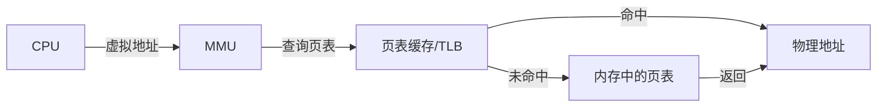
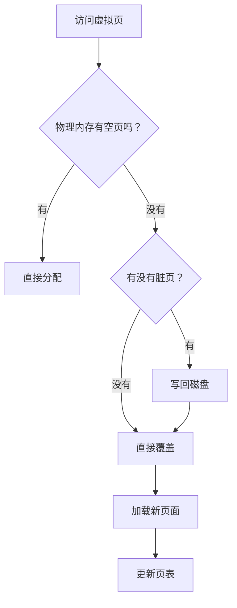

# 虚拟内存与物理内存映射

面试官问："你的程序运行时会用到很多内存，那你的64位系统最大能支持多少内存？"

小王说："64位系统支持1800万TB？"

面试官继续追问："那为什么你的电脑实际只有16GB内存，却能同时运行占用40GB内存的程序？"

小王说："用...用硬盘当内存？"

面试官又问："那虚拟地址怎么转换成物理地址？什么是TLB？"

小王彻底卡住了。

虚拟内存是操作系统最伟大的发明之一，它让每个程序都觉得自己拥有"无限"的内存，同时又能保证程序之间的隔离。今天，我们把这个概念彻底讲透。

## 一、从一个问题开始

先看一个有趣的现象：

```python
# 在64位系统上
import sys
print(sys.maxsize)  # 9223372036854775807

# 这意味着你可以创建这么大的数组吗？
# arr = [0] * (9223372036854775807)  # 绝对不行！
```

为什么64位系统理论上能访问`2^64`字节（约1800万TB），但实际用不了这么多？

答案就是**虚拟内存**。

你的程序使用的是虚拟地址，而不是物理地址。操作系统负责把虚拟地址转换成物理地址。

## 【直观类比】

### 虚拟内存 = 银行存折

想象你去银行开户：

```
┌─────────────────────────────────────────┐
│  你的存折（虚拟内存）                     │
│  显示余额：100万                          │
│  你可以开支票、消费，看起来有无限购买力     │
├─────────────────────────────────────────┤
│  银行金库（物理内存/硬盘）                 │
│  实际现金：20万                          │
│  10万现金 + 90万票据（swap）              │
└─────────────────────────────────────────┘
```

**虚拟内存的工作方式**：

1. 你开支票（程序申请内存）
2. 银行检查记录（操作系统检查页表）
3. 如果金库有现金，直接给你
4. 如果没有，可以去把票据贴现（从硬盘swap进来）
5. 你感知不到这些细节，只看到存折上的数字

### 内存分页 = 楼层+房间号

```
虚拟地址 = 楼层号 + 房间号
物理地址 = 实际楼层 + 实际房间

┌─────────────────────────────────────────┐
│  虚拟世界（程序看到的）                    │
│  5楼-301室                              │
│  5楼-302室                              │
│  5楼-303室                              │
└─────────────────────────────────────────┘
              ↓ 映射
┌─────────────────────────────────────────┐
│  物理世界（实际存在）                     │
│  1楼-105室（5楼-301室映射到这里）         │
│  1楼-201室（5楼-302室映射到这里）         │
│  3楼-003室（5楼-303室映射到这里）         │
└─────────────────────────────────────────┘
```

## 二、核心原理

### 1. MMU（内存管理单元）

MMU是CPU里的一个硬件模块，负责把虚拟地址转换成物理地址：



**工作流程**：

```
CPU：我想访问虚拟地址 0x00403000
MMU：查页表...
     虚拟页号：0x00403
     页内偏移：0x000
     
     虚拟页0x00403 → 物理页0x12345
     
     物理地址 = 0x12345000
     
返回：物理地址 0x12345000
```

### 2. 页表结构

**单级页表**（简单但浪费空间）：

```
┌────────────────────────────────────┐
│  虚拟页号（VPN）→ 物理页号（PFN）  │
├────────────────────────────────────┤
│  0x000 → 0x123                     │
│  0x001 → 0x456                     │
│  0x002 → -（未分配）                │
│  ...                               │
│  0xFFFF → 0x789                    │
└────────────────────────────────────┘
```

**问题**：32位系统，4KB页面，需要2^20=100万个页表项，每个4字节 = 4MB
**64位系统**：如果还用单级页表，需要2^52个页表项 = 太大了！

**多级页表**（节省空间）：

```
虚拟地址（48位）拆分：
┌──────┬───────┬───────┬──────────┐
│ PML4 │ PDPT │  PD   │   PT     │ Page Offset
│ 9位  │ 9位  │  9位  │   9位    │   12位
└──────┴───────┴───────┴──────────┘

4级页表：
PML4 → PDPT → PD → PT → 物理页
```

为什么多级页表省空间？
- 未分配的虚拟地址不需要页表项
- 只有实际使用的地址才有页表项

### 3. TLB（Translation Lookaside Buffer）

TLB是MMU的缓存，用来加速地址转换：

```
无TLB：每次访问内存需要查页表
         ↓ 查页表 = 访问内存1次
         ↓ 再访问实际数据
         ↓ 总共 = 访问内存2次

有TLB：热点地址缓存在TLB
         ↓ TLB命中 = 0次额外访问
         ↓ 直接得到物理地址
         ↓ 总共 = 访问内存1次
```

**TLB的命中率**：

| 场景 | TLB命中率 |
| --- | --- |
| 顺序访问数组 | ~99% |
| 随机访问大数组 | ~50-80% |
| 稀疏访问 | ~10-30% |

### 4. 页面置换

当物理内存不够时，需要把一些页面换到硬盘（swap）：



**页面置换的代价**：

| 操作 | 耗时 |
| --- | --- |
| L1缓存命中 | ~1ns |
| L2缓存命中 | ~4ns |
| 内存访问 | ~100ns |
| **SSD读写** | **~100μs** |
| **机械硬盘读写** | **~10ms** |

从硬盘swap一个页面进来的时间，相当于访问内存10万次！

## 三、边界与特例

### 1. 虚拟内存的作用

| 作用 | 说明 | 好处 |
| --- | --- | --- |
| 进程隔离 | 每个进程有独立的虚拟地址空间 | 一个进程崩溃不影响其他 |
| 简化编程 | 程序可以使用连续的虚拟地址 | 不用关心物理碎片 |
| 内存保护 | 可以设置页面的读写权限 | 防止非法访问 |
| 扩展地址空间 | 虚拟空间可以大于物理空间 | 运行更大的程序 |
| 共享内存 | 不同进程可以映射相同物理页 | 节省内存 |

### 2. 大页（Huge Pages）

普通页面大小是4KB，但可以配置更大的页面：

| 页面类型 | 大小 | 页表项数 | TLB命中率 |
| --- | --- | --- | --- |
| 普通页 | 4KB | 多 | 低 |
| 大页 | 2MB/1GB | 少 | 高 |

**适用场景**：
- Oracle数据库（大量连续内存）
- 高性能计算（减少TLB miss）

```bash
# Linux配置大页
echo 1024 > /sys/kernel/mm/hugepages/hugepages-2048kB/nr_hugepages
```

### 3. 内存映射（mmap）

`mmap`可以把文件映射到虚拟地址空间：

```c
// 映射文件到内存
int fd = open("data.bin", O_RDONLY);
void *addr = mmap(NULL, 1024, PROT_READ, MAP_PRIVATE, fd, 0);

// 读取文件就像读内存
char c = *(char *)addr;

// 解除映射
munmap(addr, 1024);
```

**mmap的用途**：

| 用途 | 说明 |
| --- | --- |
| 高效读写文件 | 直接内存访问，避免read/write系统调用 |
| 动态库加载 | 共享库的代码段映射到内存 |
| 进程间通信 | 映射同一文件实现共享内存 |
| 分配大内存 | 使用mmap分配大块内存 |

### 4. Copy-On-Write（写时复制）

fork()后，父子进程共享物理页面，直到有一方要写入：

```python
# fork后
# 父子进程共享同样的物理页面（只读）
# 一旦某方写入，触发缺页异常
# OS复制一份给写入方，原页面继续共享
```

```
fork后：
┌─────────┐         ┌─────────┐
│ 子进程   │ ──共享──│ 父进程   │
│ 虚拟页A  │         │ 虚拟页A  │
└─────────┘         └─────────┘
                    ↓
                   物理页A（只读）

子进程写入时：
┌─────────┐         ┌─────────┐
│ 子进程   │         │ 父进程   │
│ 虚拟页A  │ ──复制─→│ 虚拟页A  │
└─────────┘         └─────────┘
                    ↓
物理页A'           物理页A
```

## 四、常见误区

### ❌ 误区一：虚拟内存就是硬盘空间

虚拟内存不等同于swap。虚拟内存是：
- 虚拟地址空间（程序看到的）
- 物理内存 + swap的组合（实际存储）
- 页表映射机制（连接两者的桥梁）

swap只是物理内存不足时使用的后备存储。

### ❌ 误区二：64位系统可以无限使用内存

64位系统的虚拟地址空间确实很大，但实际受限于：

- 硬件支持（大多数CPU只实现48-52位物理地址）
- 操作系统限制（Linux通常限制在128TB）
- 物理内存+swap的大小

### ❌ 误区三：TLB miss就一定很慢

TLB miss后：
- 如果页表在L1/L2缓存 → 相对快（~10-20ns）
- 如果页表需要从内存读取 → 慢（~100ns）
- 如果需要换页 → 极慢（~10ms）

所以：
- 顺序访问：TLB命中率高 → 快
- 随机访问：TLB命中率低 + 缓存不友好 → 慢

### ❌ 误区四：禁用swap可以提升性能

swap空间在物理内存不足时作为后备：
- 有swap：物理内存满 → 换出 → 继续工作
- 无swap：物理内存满 → OOM Killer → 杀死进程

适当配置swap可以：
- 让系统更稳定
- 利用swap提升性能（冷热分离）

## 五、记忆技巧

### 一句话总结

> 虚拟内存让程序以为自己有很多内存，MMU负责把虚拟地址翻译成物理地址

### 口诀

> "虚拟地址是门牌，物理地址是实际位置"
> "MMU是翻译官，页表是字典"
> "TLB是缓存，命中就不查字典"
> "内存不够swap凑，页面换入又换出"

### 架构速记

```
虚拟地址 → [MMU + TLB] → 物理地址
     ↓           ↓
   程序用      实际位置
```

## 六、实战检验

### 自检题目

**题目1**：为什么数组访问比链表快？

<details>
<summary>点击查看答案</summary>

数组：
- 元素在内存中连续存放
- 访问arr[i]直接计算地址：`base + i * sizeof(element)`
- 只需要一次TLB查找，之后连续访问命中率高

链表：
- 元素分散在内存各处
- 每次访问下一个元素需要跟随指针
- 每个元素都可能触发TLB miss
- CPU缓存无法预取下一个元素

这就是为什么遍历用数组快，但插入删除用链表方便。
</details>

**题目2**：什么是"内存抖动"（Thrashing）？

<details>
<summary>点击查看答案</summary>

内存抖动是指物理内存严重不足，页面频繁换入换出：

1. 进程需要访问某个页面
2. 页面不在物理内存，发生缺页异常
3. 从硬盘加载页面到内存
4. 其他页面被换出
5. 进程继续执行
6. 又需要被换出的页面
7. 重复步骤2-6

后果：
- CPU大量时间在等待页面换入换出
- 实际计算时间很少
- 系统响应极慢

解决方案：
- 增加物理内存
- 优化程序内存使用
- 减少同时运行的进程数
</details>

**题目3**：Java的GC会导致虚拟内存抖动吗？

<details>
<summary>点击查看答案</summary>

会的。GC时：
- 新生代对象朝生夕死，频繁创建/回收
- 老年代对象长期存活，需要频繁扫描

如果堆设置过大：
- GC扫描时间长
- 可能触发swap

如果堆设置过小：
- 频繁GC
- 对象来不及晋升就回收

最佳实践：
- 监控GC日志
- 合理设置-Xmx和-Xms
- 选择合适的GC收集器
</details>

### 面试追问预测

| 问题 | 考察点 | 进阶追问 |
| --- | --- | --- |
| 页表结构 | 多级页表 | 4级页表vs3级页表 |
| TLB一致性 | 缓存一致性 | 进程切换时TLB怎么处理 |
| swap调优 | 系统配置 | 如何判断是否需要更多内存 |

## 七、生产实战案例

### 案例：MySQL的InnoDB Buffer Pool

InnoDB使用Buffer Pool管理磁盘数据和索引：

```sql
-- 查看缓冲池大小
SHOW VARIABLES LIKE 'innodb_buffer_pool_size';

-- 推荐设置为物理内存的70-80%
SET GLOBAL innodb_buffer_pool_size = 12884901888;  -- 12GB
```

Buffer Pool的工作原理：
- 热点数据缓存在内存
- 读取时从Buffer Pool找，找不到再从磁盘加载
- 修改数据先写Buffer Pool，后台异步刷盘

**类似虚拟内存的页表机制**：
- 虚拟页 ↔ Buffer Pool中的页
- 物理磁盘 ↔ 物理内存外的swap

### 案例：Java堆外内存

Java默认使用堆内存，但可以通过DirectByteBuffer使用堆外内存：

```java
// 分配1GB堆外内存
ByteBuffer buffer = ByteBuffer.allocateDirect(1024 * 1024 * 1024);
```

堆外内存：
- 不受JVM GC管理
- 适合大量IO操作（减少JVM和操作系统之间的数据拷贝）
- 需要手动管理生命周期

典型的使用场景：
- Netty的高性能网络通信
- Flink的状态后端
- Spark的广播变量

:::tip 💡
理解虚拟内存的原理，不仅是为了面试，更是为了写出高性能的代码。知道数据在内存中的布局，才能写出缓存友好的代码。
:::
