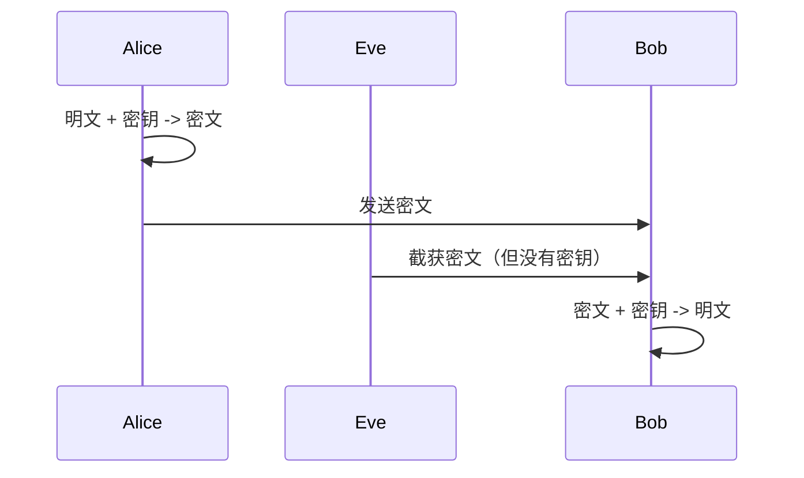

# 对称加密

凌晨三点，你收到服务器告警：数据库被人拖走了。但磁盘是加密的，备份也在。攻击者是怎么做到的？答案可能比你想象的简单——**他们拿走了密钥**。

对称加密是密码学中最古老的加密方式，也是现代密码系统的基础。它的核心思想简单直接：**用同一把钥匙加密和解密**。这把钥匙被称为「密钥」，英文是 Key。

## 什么是同态加密？

对称加密的基本公式：

```
密文 = 加密函数(明文, 密钥)
明文 = 解密函数(密文, 密钥)
```

Alice 和 Bob 共享一个密钥，Alice 用密钥加密消息发给 Bob，Bob 用同一把密钥解密。整个过程如下：



## 分组密码与流密码

对称加密分为两大类：

### 分组密码（Block Cipher）

将明文分成固定长度的块，每个块独立加密。代表算法：AES、DES、SM4。

```python
# 分组密码示意
def block_encrypt(plaintext_blocks, key):
    """
    假设分组长度 128 位（16 字节）
    plaintext_blocks: 多个 16 字节的块
    """
    ciphertext = []
    for block in plaintext_blocks:
        # 每个块单独加密
        encrypted_block = aes_encrypt(block, key)
        ciphertext.append(encrypted_block)
    return ciphertext
```

### 流密码（Stream Cipher）

逐字节或逐位加密，密钥流与明文流异或。代表算法：ChaCha20、RC4。

```python
# 流密码示意
def stream_encrypt(plaintext, key):
    """
    密钥流与明文流异或
    """
    keystream = generate_keystream(key, len(plaintext))
    ciphertext = bytes([p ^ k for p, k in zip(plaintext, keystream)])
    return ciphertext
```

## 常见对称加密算法

### DES 与 3DES

DES（Data Encryption Standard）诞生于 1977 年，密钥长度 56 位，分组长度 64 位。

:::warning
DES 已被废弃！56 位密钥在现代计算机上可以在 24 小时内被暴力破解。
:::

为什么 DES 不安全？

| 攻击方式 | 说明 |
|---|---|
| 暴力破解 | 2^56 = 7.2 × 10^16 种可能，现代 GPU 可快速遍历 |
| 差分分析 | 寻找密文差异与明文差异的统计关系 |
| 线性分析 | 近似获取密钥的密码分析技术 |

3DES（Triple DES）是对 DES 的增强，使用三把密钥：

```
密文 = DES(DES(DES(明文, 密钥1), 密钥2), 密钥3)
```

3DES 有两种模式：
- EDE3：三把独立密钥，密钥长度 168 位
- EDE2：两把密钥（密钥1 = 密钥3），密钥长度 112 位

:::warning
3DES 也已废弃！OWASP 明确禁止在 new 代码中使用 3DES。
:::

### AES

AES（Advanced Encryption Standard）于 2001 年成为标准，取代了 DES。

AES 的关键参数：

| 参数 | 值 |
|---|---|
| 分组长度 | 128 位（16 字节） |
| 密钥长度 | 128/192/256 位 |
| 轮数 | 10/12/14（对应密钥长度） |

AES 的加密过程包含四个步骤：

1. **SubBytes**：字节替换（非线性变换）
2. **ShiftRows**：行移位（扩散）
3. **MixColumns**：列混合（扩散）
4. **AddRoundKey**：轮密钥加

```python
# AES 加密示意（简化版）
def aes_round(state, round_key):
    state = sub_bytes(state)      # S 盒替换
    state = shift_rows(state)     # 行移位
    state = mix_columns(state)    # 列混合
    state = add_round_key(state, round_key)  # 轮密钥加
    return state

def aes_encrypt(plaintext, key):
    # 初始轮密钥加
    state = add_round_key(plaintext, key)

    # 主轮加密
    for round in range(10):
        state = aes_round(state, round_key[round])

    # 最后一轮（无 MixColumns）
    state = sub_bytes(state)
    state = shift_rows(state)
    state = add_round_key(state, round_key[10])

    return state
```

### SM4

SM4 是中国国家密码管理局发布的分组密码算法，于 2006 年发布，2012 年成为国家行业标准。

SM4 的参数：

| 参数 | 值 |
|---|---|
| 分组长度 | 128 位（16 字节） |
| 密钥长度 | 128 位（16 字节） |
| 轮数 | 32 |

SM4 的 Feistel 结构与 DES 类似，但：
- 密钥和轮数更多，安全性更高
- S 盒设计更优，可抵抗所有已知攻击
- 是国产化替代的核心算法之一

## 工作模式

仅有分组密码算法是不够的，直接按固定长度分块加密称为 **ECB 模式**（Electronic Codebook mode），存在严重的安全问题：

```
明文：[M1][M2][M3][M4]
加密：[C1][C2][C3][C4]
```

**ECB 的致命缺陷**：相同明文块产生相同密文块，密文模式会泄露明文结构。

### CBC 模式

CBC（Cipher Block Chaining）引入初始化向量（IV），每个密文块与前一个明文块相关：

```python
# CBC 模式加密
def aes_cbc_encrypt(plaintext_blocks, key, iv):
    ciphertext_blocks = []
    prev = iv  # 初始化向量

    for block in plaintext_blocks:
        # 当前明文与前一个密文异或
        xored = xor_bytes(block, prev)
        encrypted = aes_encrypt(xored, key)
        ciphertext_blocks.append(encrypted)
        prev = encrypted  # 传递给下一轮

    return ciphertext_blocks
```

:::tip
CBC 模式要求 IV 不可预测，通常使用随机数生成器产生。
:::

### CTR 模式

CTR（Counter mode）将分组密码转换为流密码，使用递增计数器生成密钥流：

```python
# CTR 模式
def aes_ctr_encrypt(plaintext, key, nonce):
    keystream = []
    counter = 0

    for block in plaintext_blocks:
        # 密钥流 = AES(nonce || counter)
        counter_block = nonce + counter.to_bytes(8, 'big')
        keystream_block = aes_encrypt(counter_block, key)
        keystream.append(keystream_block)
        counter += 1

    # 与明文异或
    ciphertext = xor_bytes(plaintext, concatenate(keystream))
    return ciphertext
```

### GCM 模式

GCM（Galois/Counter Mode）是现代密码系统中最常用的模式，提供：
- **加密**：CTR 模式的加密功能
- **认证**：GMAC 消息认证码

```python
# GCM 模式核心概念
def aes_gcm_encrypt(plaintext, key, iv):
    # 1. 生成认证标签
    mac = gmac(key, iv, ciphertext)

    # 2. 返回密文和认证标签
    return ciphertext + mac
```

GCM 的核心优势在于**认证加密**（AEAD），可以检测密文是否被篡改。

| 模式 | 类型 | IV/Nonce | 并行化 | 典型应用 |
|---|---|---|---|---|
| ECB | 无认证 | 不需要 | 完全并行 | **禁止使用** |
| CBC | 无认证 | 需要，随机 | 串行 | TLS 1.2（已废弃） |
| CTR | 无认证 | 需要，唯一 | 完全并行 | 高速加密 |
| GCM | AEAD | 需要，唯一 | 完全并行 | TLS 1.3、VPN |
| CCM | AEAD | 需要，唯一 | 串行 | WiFi 安全 |

## 实际应用

### Java 实现

```java
import javax.crypto.Cipher;
import javax.crypto.spec.GCMParameterSpec;
import javax.crypto.spec.SecretKeySpec;
import java.security.SecureRandom;

public class AESGCMExample {

    private static final int GCM_TAG_LENGTH = 128;
    private static final int GCM_IV_LENGTH = 12;

    public static byte[] encrypt(byte[] plaintext, byte[] key) throws Exception {
        // 生成随机 IV
        byte[] iv = new byte[GCM_IV_LENGTH];
        new SecureRandom().nextBytes(iv);

        // 初始化 cipher
        Cipher cipher = Cipher.getInstance("AES/GCM/NoPadding");
        SecretKeySpec keySpec = new SecretKeySpec(key, "AES");
        GCMParameterSpec gcmSpec = new GCMParameterSpec(GCM_TAG_LENGTH, iv);
        cipher.init(Cipher.ENCRYPT_MODE, keySpec, gcmSpec);

        // 加密
        byte[] ciphertext = cipher.doFinal(plaintext);

        // 返回 IV + 密文（IV 需要传递给解密方）
        byte[] result = new byte[iv.length + ciphertext.length];
        System.arraycopy(iv, 0, result, 0, iv.length);
        System.arraycopy(ciphertext, 0, result, iv.length, ciphertext.length);

        return result;
    }

    public static byte[] decrypt(byte[] encrypted, byte[] key) throws Exception {
        // 提取 IV
        byte[] iv = new byte[GCM_IV_LENGTH];
        byte[] ciphertext = new byte[encrypted.length - GCM_IV_LENGTH];
        System.arraycopy(encrypted, 0, iv, 0, iv.length);
        System.arraycopy(encrypted, iv.length, ciphertext, 0, ciphertext.length);

        // 解密
        Cipher cipher = Cipher.getInstance("AES/GCM/NoPadding");
        SecretKeySpec keySpec = new SecretKeySpec(key, "AES");
        GCMParameterSpec gcmSpec = new GCMParameterSpec(GCM_TAG_LENGTH, iv);
        cipher.init(Cipher.DECRYPT_MODE, keySpec, gcmSpec);

        return cipher.doFinal(ciphertext);
    }
}
```

## 安全实践

| 实践 | 说明 |
|---|---|
| 使用 AES-256-GCM | 目前最安全的对称加密组合 |
| 密钥长度 ``>=` 128 位 | 128 位是安全下限，推荐 256 位 |
| IV/Nonce 必须唯一 | 同一 IV 使用两次会导致密文泄露 |
| 使用安全的随机数 | 必须使用 CSPRNG（密码学安全随机数生成器） |
| 密钥定期轮换 | 长期使用同一密钥风险增加 |
| 密钥绝不硬编码 | 使用密钥管理服务（KMS）或环境变量 |

## 面试追问方向

- 为什么 AES 选用 128 位分组而不是 64 位？
- GCM 模式的 GMAC 认证原理是什么？
- 什么是 nonce-misuse resistance？
- 对称加密的密钥如何安全存储和分发？

> 对称加密是基础，理解它才能理解非对称加密和混合加密系统的设计初衷。
