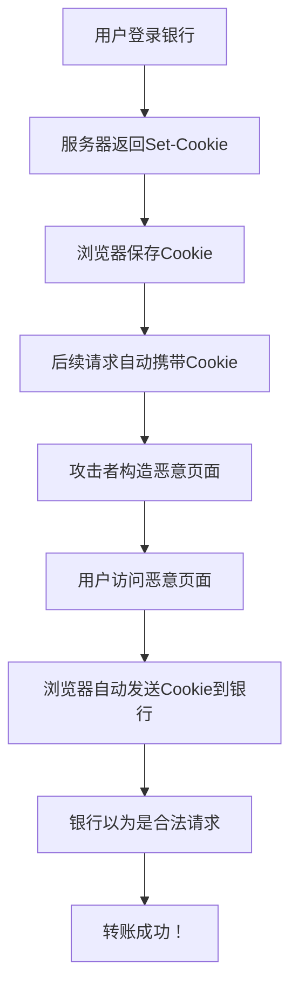
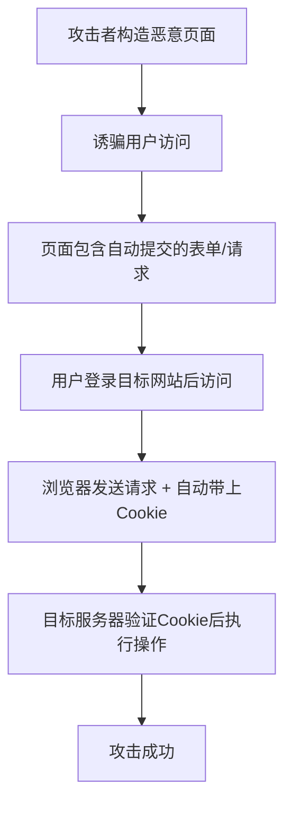
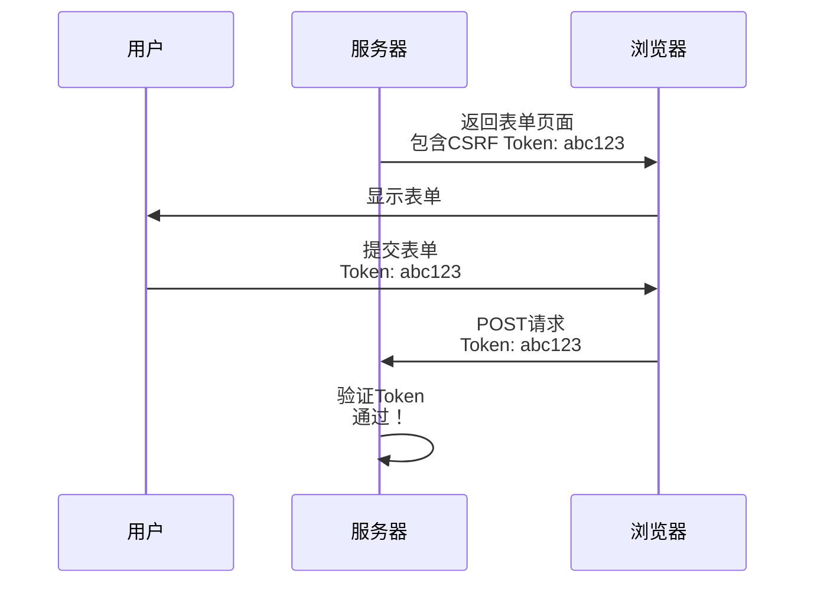

# CSRF攻击与防护

2019年，有用户反映自己的银行账户莫名其妙地向陌生账户转账。

调查后发现：这是一家银行网站的CSRF漏洞。

攻击者构造了一个恶意网页，只要用户登录银行后访问这个页面，网页就会自动发起转账请求。用户的Cookie被浏览器自动发送，服务器以为是用户本人操作，于是执行了转账。

这就是CSRF（跨站请求伪造）的可怕之处：**它不需要偷你的Cookie，只需要浏览器"帮你"发送请求**。

今天这篇文章，带你彻底理解CSRF的原理和防护。

## 从一个问题开始

想象你登录了银行网站A，正在操作转账。

这时你收到一条链接，点进去是一个"抽奖页面"。

你在这个页面上点了"参与抽奖"，但实际上这个页面的代码悄悄发送了一个请求：

```html

```

因为你的浏览器仍然保存着银行网站的Cookie，这个请求会被自动发送，服务器以为是合法请求，于是执行了转账。

**你什么都没做，但钱没了。**

## 【直观类比】

### CSRF就像"电话诈骗"

想象你给客服打过电话，客服记住了你的声音。

有一天，有人打电话给客服，自称是你，说要转账。

客服没有核对你的身份，直接执行了。

CSRF就是这样：你的浏览器保存了"身份证明"（Cookie），攻击者利用这一点，伪造你的身份发送请求。

### 为什么Cookie会"自动发送"？

这要说到HTTP的Cookie机制：



**Cookie的发送遵循"同源策略"的变种规则**：
- 请求A网站时，浏览器会自动带上A网站的Cookie
- 但**请求B网站时，也会带上A网站的Cookie**——只要是A网站的请求！

这就是CSRF能成功的根本原因。

## 核心原理

### CSRF的攻击流程



### 攻击方式1：自动提交的表单

```html
<!-- 恶意页面 -->
<html>
<body>
<form action="http://bank.com/transfer" method="POST" id="csrf-form">
    <input type="hidden" name="to" value="hacker" />
    <input type="hidden" name="amount" value="10000" />
</form>
<script>
    document.getElementById('csrf-form').submit();
</script>
</body>
</html>
```

### 攻击方式2：图片/脚本触发GET请求

```html
<!-- 图片标签触发GET请求 -->


<!-- script标签 -->
<script src="http://bank.com/logout"></script>
```

### 攻击方式3：AJAX请求

```javascript
// 攻击者页面上的JavaScript
fetch('http://bank.com/transfer', {
    method: 'POST',
    credentials: 'include',  // 携带Cookie
    headers: {
        'Content-Type': 'application/json',
    },
    body: JSON.stringify({
        to: 'hacker',
        amount: 10000
    })
});
```

## 边界与特例

### GET vs POST：哪种更容易被攻击？

| 方法 | 攻击难度 | 常见场景 |
| --- | --- | --- |
| GET | 简单（img/script标签即可） | 查询、跳转 |
| POST | 稍复杂（需要表单提交） | 数据修改 |

但**任何改变服务端状态的请求都应该防护CSRF**，不管是什么方法。

### 浏览器安全机制：Samesite Cookie

现代浏览器支持`Samesite`属性：

```http
Set-Cookie: session=abc123; Samesite=Strict
```

| 值 | 行为 | 防护效果 |
| --- | --- | --- |
| `Strict` | 任何跨站请求都不带Cookie | 最安全，但体验差 |
| `Lax` | 导航请求（链接）带Cookie，其他不带 | 平衡安全与体验 |
| `None` | 所有请求都带Cookie（需配合Secure） | 无防护，需要HTTPS |

:::tip 💡
从Chrome 80开始，默认Samesite=Lax。这是一个重要的安全变更，很多老的Web应用因此出现了跨域问题。
:::

### CORS vs CSRF：两个不同的东西

很多人搞混CORS和CSRF：

| 机制 | 作用 | 防护对象 |
| --- | --- | --- |
| CORS | 控制跨域请求是否允许 | 阻止跨域API调用 |
| CSRF | 防止跨站请求伪造 | 阻止攻击者伪造用户请求 |

**CORS不能防止CSRF**：如果目标网站允许跨域请求，CSRF攻击仍然可以成功。

### JSON API的CSRF

很多人以为JSON API不需要CSRF防护，因为：

```javascript
// JSON请求不会执行JavaScript吗？
fetch('/api/delete', {
    method: 'POST',
    headers: {'Content-Type': 'application/json'},
    body: '{"id": 123}'
});
```

实际上，**JSON请求同样可以被CSRF攻击**：

```html
<!-- 表单可以发送JSON请求 -->
<form action="/api/delete" method="POST" enctype="text/plain">
    <input name='{"id":123, "a":"' value='b"}'>
</form>
```

## 常见误区

### 误区1：CSRF需要XSS才能发起

**不是**。CSRF和XSS是两个独立的漏洞：

- XSS：在目标网站执行恶意脚本
- CSRF：利用用户在目标网站的已登录状态

攻击者可以直接构造恶意页面，不需要入侵目标网站。

### 误区2：HTTPS能防止CSRF

**不能**。HTTPS只加密传输通道，不验证请求来源。

### 误区3：只防护重要操作

**错误**。任何改变服务端状态的请求都需要防护：

- 转账：钱没了
- 修改密码：账号被劫持
- 删除数据：数据丢失
- 发帖/评论：声誉受损
- 修改邮箱：账号被绑定其他邮箱

### 误区4：Referer验证就够了

Referer可以被篡改或丢失：

```javascript
// 攻击者可以控制请求头
fetch('http://target.com/action', {
    headers: {
        'Referer': 'http://target.com/legitimate-page'
    }
});
```

而且：
- 用户可能设置了"不发送Referer"
- HTTPS页面不会发送Referer到HTTP页面
- 浏览器隐私模式可能不发送Referer

## 防护方案

### 1. CSRF Token（最常用）



服务端生成随机Token，表单中携带Token，提交时验证：

```python
# 服务端生成Token（存Session或JWT中）
session['csrf_token'] = secrets.token_hex(32)

# 表单中加入Token
# <form>
#     <input type="hidden" name="csrf_token" value="abc123...">
#     ...
# </form>

# 验证Token
def validate_csrf(request):
    token = request.POST.get('csrf_token')
    if token != session.get('csrf_token'):
        abort(403, 'CSRF token mismatch')
```

```javascript
// 前端Ajax请求时自动���带Token
$(document).ajaxSend(function(event, xhr, settings) {
    var token = $('meta[name="csrf-token"]').attr('content');
    xhr.setRequestHeader('X-CSRF-Token', token);
});
```

### 2. SameSite Cookie

```python
# Flask设置SameSite Cookie
@app.route('/login', methods=['POST'])
def login():
    response = make_response(redirect('/dashboard'))
    response.set_cookie(
        'session_id',
        session_id,
        samesite='Strict',  # 或 'Lax'
        secure=True,
        httponly=True
    )
    return response
```

### 3. 双重提交Cookie

不需要服务端存储Token，Token同时存在于Cookie和请求参数中：

```python
def validate_csrf(request):
    # 从Cookie获取
    cookie_token = request.cookies.get('csrf_token')
    # 从请求获取
    param_token = request.form.get('csrf_token')
    
    if not cookie_token or not param_token:
        abort(403)
    
    if cookie_token != param_token:
        abort(403)
```

### 4. 验证请求来源

```python
def validate_origin(request):
    origin = request.headers.get('Origin')
    referer = request.headers.get('Referer')
    
    allowed_origins = ['https://example.com']
    
    if origin and origin in allowed_origins:
        return True
    
    if referer:
        # 检查Referer是否来自允许的域名
        parsed = urlparse(referer)
        if parsed.netloc in allowed_origins:
            return True
    
    return False
```

### 5. 验证码/密码验证

对于高风险操作，要求用户重新输入密码：

```python
@app.route('/transfer', methods=['POST'])
def transfer():
    # 验证密码
    password = request.form.get('password')
    if not verify_password(session['user_id'], password):
        abort(401, '密码错误')
    
    # 验证CSRF Token
    if not validate_csrf(request):
        abort(403)
    
    # 执行转账
    return do_transfer(...)
```

### 6. 框架内置CSRF防护

```java
// Spring Security（自动防护所有POST/PUT/DELETE）
@Configuration
public class SecurityConfig extends WebSecurityConfigurerAdapter {
    @Override
    protected void configure(HttpSecurity http) throws Exception {
        http
            .csrf()  // 默认启用
            .csrfTokenRepository(CookieCsrfTokenRepository.withHttpOnlyFalse())
            .and()
            .formLogin();
    }
}
```

```python
# Django（表单自动带Token）
# settings.py
MIDDLEWARE = [
    'django.middleware.csrf.CsrfViewMiddleware',
]

# 模板中自动包含Token
# <form>
#     
#     ...
# </form>
```

```javascript
// Angular（HTTP请求自动带Token）
// 拦截器
@Injectable()
export class CsrfInterceptor implements HttpInterceptor {
    intercept(req: HttpRequest<any>, next: HttpHandler): Observable<HttpEvent<any>> {
        if (req.method !== 'GET') {
            const token = this.cookieService.get('CSRF-TOKEN');
            if (token) {
                req = req.clone({setHeaders: {'X-CSRF-TOKEN': token}});
            }
        }
        return next.handle(req);
    }
}
```

## 记忆技巧

### 口诀

> **CSRF跨站请求伪造，Cookie自动发送是根源**
> **Token验证最保险，Samesite Cookie来帮忙**
> **重要操作二次验证，框架内置防护最强**
> **Referer验证不可靠，Origin检查更有效**

### 防护方案速查

| 方案 | 优点 | 缺点 | 推荐程度 |
| --- | --- | --- | --- |
| CSRF Token | 最可靠 | 需要服务端存储 | ⭐⭐⭐⭐⭐ |
| SameSite Cookie | 浏览器原生支持 | 旧浏览器不支持 | ⭐⭐⭐⭐ |
| 双重提交Cookie | 无状态 | 稍复杂 | ⭐⭐⭐⭐ |
| 验证码 | 最安全 | 用户体验差 | ⭐⭐⭐ |
| 密码验证 | 二次确认 | 用户体验差 | ⭐⭐⭐ |

## 实战检验

### 检验1：识别CSRF漏洞

访问一个修改用户资料的页面，查看表单是否有CSRF Token：

```html
<!-- 没有Token = 可能有漏洞 -->
<form action="/profile/update" method="POST">
    <input name="email" value="">
</form>

<!-- 有Token = 相对安全 -->
<form action="/profile/update" method="POST">
    <input type="hidden" name="csrf_token" value="abc123...">
    <input name="email" value="">
</form>
```

### 检验2：绕过CSRF防护

测试常见绕过技巧：

1. **删除Token参数**：某些实现只检查Token存在性，不检查有效性
2. **Token为空**：某些实现允许空Token
3. **修改请求方法**：GET请求可能没有防护
4. **子域名绕过**：如果`a.example.com`有CSRF，`b.example.com`可能没有

### 检验3：评估防护方案

以下代码是否安全？

```python
# 检查Referer
def csrf_check(request):
    referer = request.headers.get('Referer')
    if referer and referer.startswith('https://example.com'):
        return True
    return False
```

**不安全**：
- Referer可以被设置
- HTTPS页面不会发送Referer到HTTP
- 用户可能关闭Referer发送

【面试官心理】

面试官问CSRF，其实是在测试你对"会话安全"的理解深度。知道CSRF原理是60分，知道Token机制是80分，能说出完整防护方案是90分，如果还能提到SameSite Cookie、JSON API的CSRF、与XSS的区别，那就是P7的水平了。

---

## 延伸阅读

- [XSS攻击与防护](/cs/security/xss) - 了解XSS如何辅助CSRF攻击
- [JWT结构与使用场景](/cs/security/jwt) - 了解Token的安全存储
- [SQL注入原理与防护](/cs/security/sql-injection) - 了解其他Web安全漏洞
