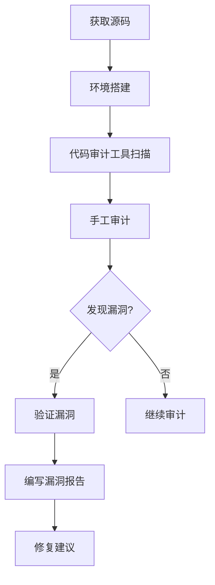

# 代码审计

渗透测试没找到漏洞，但代码审计发现了一堆问题——**上线前发现的问题，永远比上线后发现要便宜得多**。

代码审计（Code Audit）是安全测试的重要环节。它从源代码层面审查安全问题，能发现工具扫描不到的逻辑漏洞、认证绕过、敏感信息泄露等问题。本篇将详细介绍代码审计的方法论、工具使用和实战技巧。

## 代码审计方法论

### 审计流程



### 审计维度

| 维度 | 关注点 |
|---|---|
| 认证授权 | 登录、Session、权限校验 |
| 输入输出 | 参数校验、XSS、SQL 注入 |
| 数据安全 | 加密存储、传输安全 |
| 业务逻辑 | 越权、验证码绕过 |
| 敏感信息 | 日志、错误信息 |
| 第三方组件 | 依赖漏洞 |

### 代码审计要点

1. **追踪数据流**：从用户输入到数据库的完整路径
2. **关注危险函数**：SQL 查询、命令执行、文件操作
3. **检查边界条件**：空值、超长、特殊字符
4. **审视业务逻辑**：并行、事务、权限判断

## 静态代码分析工具

### SonarQube

#### 安装与配置

```bash
# Docker 部署
docker run -d --name sonarqube \
    -p 9000:9000 \
    -v sonarqube_data:/opt/sonarqube/data \
    -v sonarqube_logs:/opt/sonarqube/logs \
    sonarqube:latest

# 访问 http://localhost:9000
# 默认账号: admin / admin
```

#### Maven 集成

```xml
<!-- pom.xml -->
<plugin>
    <groupId>org.sonarsource.scanner.maven</groupId>
    <artifactId>sonar-maven-plugin</artifactId>
    <version>3.9.1.2184</version>
    <executions>
        <execution>
            <phase>verify</phase>
            <goals>
                <goal>sonar</goal>
            </goals>
        </execution>
    </executions>
</plugin>
```

```bash
# 执行扫描
mvn clean verify sonar:sonar \
    -Dsonar.host.url=http://localhost:9000 \
    -Dsonar.login=<token>
```

#### Web 应用扫描

```bash
# SonarScanner
wget https://binaries.sonarsource.com/Distribution/sonar-scanner-cli/sonar-scanner-cli-4.8.0.zip
unzip sonar-scanner-cli-4.8.0.zip

# 配置
# /opt/sonar-scanner/conf/sonar-scanner.properties
sonar.host.url=http://localhost:9000
sonar.login=<token>

# 扫描 Web 项目
sonar-scanner \
    -Dsonar.projectKey=my-webapp \
    -Dsonar.sources=src/main/java \
    -Dsonar.java.binaries=target/classes
```

### Fortify Static Code Analyzer

#### 安装

```bash
# Linux 安装
./Fortify_SCA_and_Apps_23.1.0_linux_x64.run --mode unattended \
    --accept_license yes \
    --install_dir /opt/fortify

# 配置环境变量
export PATH=$PATH:/opt/fortify/SCA/bin
export AUDIT_WORKBENCH_HOME=/opt/fortify/AuditWorkbench
```

#### 扫描

```bash
# 源代码扫描
sourceanalyzer -b myproject -java-source-level 11 \
    -cp "lib/*:target/classes" \
    src/

# 生成 FPR 报告
sourceanalyzer -b myproject -scan \
    -f results.fpr

# 转换为 HTML 报告
ReportGenerator -f results.fpr -t html -o report.html
```

## OWASP 常见漏洞代码示例

### SQL 注入

```java
// 危险代码
// 直接拼接 SQL
String sql = "SELECT * FROM users WHERE name = '" + username + "'";
Statement stmt = connection.createStatement();
ResultSet rs = stmt.executeQuery(sql);

// 攻击者输入: ' OR '1'='1
// 实际 SQL: SELECT * FROM users WHERE name = '' OR '1'='1'
```

```java
// 修复方案 1: 使用 PreparedStatement
String sql = "SELECT * FROM users WHERE name = ?";
PreparedStatement ps = connection.prepareStatement(sql);
ps.setString(1, username);
ResultSet rs = ps.executeQuery();

// 修复方案 2: 使用 JPA Criteria
CriteriaBuilder cb = entityManager.getCriteriaBuilder();
CriteriaQuery<User> query = cb.createQuery(User.class);
Root<User> root = query.from(User.class);
query.where(cb.equal(root.get("name"), username));
```

### XSS 跨站脚本

```txt
<!-- 危险代码 -->
<!-- 直接输出用户输入 -->
<p>Welcome, <%= request.getParameter("name") %></p>

<!-- 攻击者输入: <script>alert('XSS')</script> -->
```

```txt
<!-- 修复方案 1: JSTL 输出转义 -->
<p>Welcome, <c:out value="${param.name}"/></p>

<!-- 修复方案 2: Thymeleaf 自动转义 -->
<p th:text="${param.name}">...</p>

<!-- 修复方案 3: HTML 编码 -->
<%@ page import="org.owasp.encoder.Encode" %>
<p>Welcome, <%= Encode.forHtml(name) %></p>
```

```javascript
// React 自动转义
// 安全的 JSX
const Welcome = ({ name }) => <p>Welcome, {name}</p>;

// 危险的 dangerouslySetInnerHTML
const Content = ({ html }) => (
    <div dangerouslySetInnerHTML={{ __html: html }} />
);
```

### 命令注入

```java
// 危险代码
// 直接执行系统命令
String cmd = "ping " + request.getParameter("host");
Runtime.getRuntime().exec(cmd);

// 攻击者输入: 127.0.0.1; cat /etc/passwd
```

```java
// 修复方案 1: 使用白名单
String[] allowedHosts = {"google.com", "baidu.com"};
String host = request.getParameter("host");
if (!Arrays.asList(allowedHosts).contains(host)) {
    throw new SecurityException("Invalid host");
}

// 修复方案 2: ProcessBuilder 参数数组
ProcessBuilder pb = new ProcessBuilder("ping", "-c", "4", host);
pb.start();

// 修复方案 3: 禁止调用 shell
// 永远不要使用 Runtime.exec("cmd /c " + input)
```

### 文件上传漏洞

```java
// 危险代码
// 直接保存上传文件
String filename = upload.getOriginalFilename();
File file = new File("/uploads/" + filename);
upload.transferTo(file);

// 攻击者上传: shell.jsp
```

```java
// 修复方案 1: 白名单验证文件类型
String[] allowedTypes = {"jpg", "png", "gif", "pdf"};
String extension = FilenameUtils.getExtension(filename).toLowerCase();
if (!Arrays.asList(allowedTypes).contains(extension)) {
    throw new SecurityException("File type not allowed");
}

// 修复方案 2: 检测文件内容（魔数）
byte[] header = new byte[4];
FileInputStream fis = new FileInputStream(file);
fis.read(header);
String magic = bytesToHex(header);
// PNG: 89 50 4E 47
// JPEG: FF D8 FF

// 修复方案 3: 重命名文件
String safeName = UUID.randomUUID().toString() + "." + extension;
String safePath = "/uploads/" + safeName;

// 修复方案 4: 存储到对象存储，不执行
String objectKey = uploadToOSS(file);
```

### 敏感信息泄露

```java
// 危险代码
// 日志打印敏感信息
logger.info("User login: " + username + ", password: " + password);

// 异常信息泄露
catch (Exception e) {
    throw new RuntimeException("Database error: " + e.getMessage());
}

// 硬编码密钥
String apiKey = "sk_live_1234567890";
```

```java
// 修复方案 1: 日志脱敏
logger.info("User login attempt for user: {}",
    maskSensitive(username));
// 密码、Token 等永远不要打印

// 修复方案 2: 自定义异常
catch (SQLException e) {
    logger.error("Database operation failed");
    throw new ApplicationException("Operation failed");
}

// 修复方案 3: 使用密钥管理服务
import com.amazonaws.services.secretsmanager.*;
AWS SecretsManager client = AWSSecretsManagerClientBuilder.standard()
    .build();
GetSecretValueRequest request = new GetSecretValueRequest()
    .withSecretId("my-api-key");
GetSecretValueResult result = client.getSecretValue(request);
String apiKey = result.getSecretString();
```

## 认证与授权漏洞

### JWT 安全

```java
// 危险代码 1: 签名不验证
// 使用 .verify() 前不验证
String token = request.getHeader("Authorization");
DecodedJWT jwt = JWT.decode(token);  // 只解码，不验证签名！
String userId = jwt.getSubject();

// 攻击者修改 payload: {"sub":"admin"}
```

```java
// 修复方案 1: 完整验证
Algorithm algorithm = Algorithm.HMAC256("secret");
JWTVerifier verifier = JWT.require(algorithm)
    .withIssuer("my-app")
    .build();
DecodedJWT jwt = verifier.verify(token);  // 完整验证签名
String userId = jwt.getSubject();
```

```java
// 危险代码 2: 算法不锁定
// 攻击者可将 HS256 改为 none
Algorithm algorithm = Algorithm.none();  // 危险！
```

```java
// 修复方案 2: 锁定算法
// 只接受 RS256
RS256Algorithm algorithm = new RS256Algorithm(publicKey);
JWTVerifier verifier = JWT.require(algorithm).build();
```

### 越权访问

```java
// 危险代码
// 直接使用用户传入的 ID
@GetMapping("/order/{orderId}")
public Order getOrder(@PathVariable Long orderId) {
    // 没有验证当前用户是否有权限访问这个订单
    return orderRepository.findById(orderId).orElseThrow();
}
```

```java
// 修复方案 1: 业务层校验
@GetMapping("/order/{orderId}")
public Order getOrder(@PathVariable Long orderId) {
    Long currentUserId = getCurrentUserId();  // 从 Session 获取
    Order order = orderRepository.findById(orderId).orElseThrow();
    if (!order.getUserId().equals(currentUserId)) {
        throw new AccessDeniedException("No permission");
    }
    return order;
}

// 修复方案 2: 数据范围过滤
@GetMapping("/orders")
public List<Order> getMyOrders() {
    Long currentUserId = getCurrentUserId();
    return orderRepository.findByUserId(currentUserId);
}
```

## 面试追问方向

- SQL 注入的修复方案？PreparedStatement 的原理？
- XSS 的三种类型？如何防御？
- CSRF 的原理？如何防御？
- SSRF 和 CSRF 的区别？
- 如何审计一个未知代码库？
- 代码审计和渗透测试的区别？

> 代码审计是从源头消灭漏洞。好的安全意识不是靠渗透测试测出来的，而是靠编码规范和代码审计养成的。
