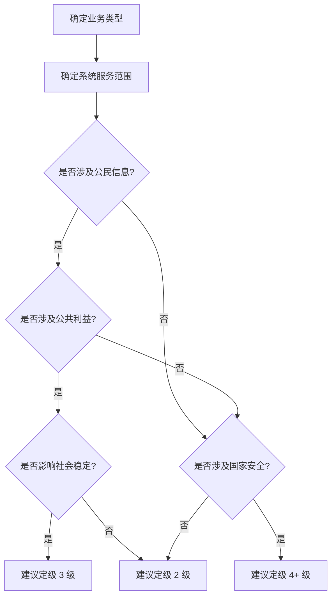
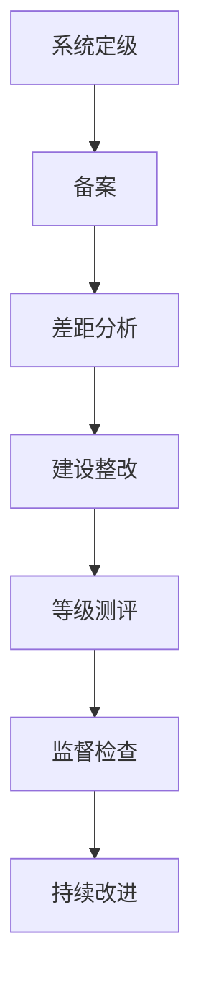

# 等保 2.0 与网络安全合规

你的公司准备 IPO，但券商提醒你：「需要提供等级保护备案证明」。你才意识到，上线两年的系统居然没有做过等保测评。

网络安全不仅是技术问题，更是合规问题。在中国，网络安全等级保护制度（等保）是每个企业都必须面对的法规要求。本篇将详细介绍等保 2.0 的要求、测评流程和实际合规建设。

## 等保 2.0 概述

### 历史背景

| 版本 | 发布时间 | 主要变化 |
|---|---|---|
| 等保 1.0 | 2007 年 | 强调分级保护 |
| 等保 2.0 | 2019 年 | 覆盖云计算、大数据、物联网、工控等新技术 |

### 等级划分

| 等级 | 名称 | 适用场景 | 监管力度 |
|---|---|---|---|
| 第一级 | 一般 | 小型系统 | 自主保护 |
| 第二级 | 重要 | 县级重要系统 | 指导监督 |
| 第三级 | 很重要 | 地市级重要系统 | 监督检查 |
| 第四级 | 特别重要 | 省级重要系统 | 强制监督 |
| 第五级 | 极端重要 | 国家级重要系统 | 专门监督 |

### 定级流程



## 技术要求

### 通用技术要求（10 大类）

| 类别 | 要求项 | 说明 |
|---|---|---|
| 安全物理环境 | 机房选址、温湿度控制、入侵报警 | 物理安全保障 |
| 安全通信网络 | 网络架构、传输加密、边界防护 | 网络层面安全 |
| 安全区域边界 | 入侵防范、访问控制、恶意代码防范 | 边界防护 |
| 安全计算环境 | 身份鉴别、访问控制、审计追溯 | 主机和应用安全 |
| 安全管理中心 | 安全管理中心、集中管控 | 安全运营 |
| 安全管理制度 | 策略、制度、规程 | 管理体系 |
| 安全管理机构 | 岗位设置、授权审批 | 组织架构 |
| 安全管理人员 | 人员录用、离职、培训 | 人员管理 |
| 安全建设管理 | 系统定级、安全规划、验收 | 建设过程 |
| 安全运维管理 | 漏洞管理、变更管理、应急响应 | 运维过程 |

### 三级系统技术要求（摘要）

#### 安全物理环境

| 要求项 | 要求内容 |
|---|---|
| 机房选址 | 避开灾害频发区域，有防震、防风、防水措施 |
| 访问控制 | 电子门禁系统、监控覆盖、专人值守 |
| 温湿度控制 | 温度 18-27°C，湿度 35%-75% |
| 电力供应 | 配备 UPS、备用发电机 |

#### 安全通信网络

| 要求项 | 要求内容 |
|---|---|
| 网络架构 | 划分安全域，关键设备冗余 |
| 传输加密 | 通信两端验证，敏感数据传输加密 |
| 边界防护 | 阻断未授权访问 |

#### 安全计算环境

| 要求项 | 要求内容 |
|---|---|
| 身份鉴别 | 最小权限、多因素认证、密码复杂度 |
| 访问控制 | 基于角色的访问控制、默认拒绝 |
| 安全审计 | 记录所有重要行为、定期分析 |
| 入侵防范 | 最小安装、主动防御、漏洞修补 |
| 数据安全 | 分类分级、加密存储、备份恢复 |

## 管理要求

### 安全管理制度

```markdown
# 制度体系建设（三级要求）

## 必要制度
1. 信息安全总体方针政策
2. 信息安全管理制度总纲
3. 信息安全管理制度（分项）
   - 人员管理制度
   - 资产管理制度
   - 设备管理制度
   - 介质管理制度
   - 变更管理制度
   - 安全运维管理制度
   - 备份与恢复管理制度
   - 应急响应管理制度
4. 安全操作规程
   - 主机操作规程
   - 数据库操作规程
   - 应用系统操作规程
5. 安全记录表单
```

### 安全管理机构

```yaml
# 组织架构要求（三级）
organization:
  决策层:
    - name: 信息安全领导小组
      role: 战略决策、资源协调
  
  管理层:
    - name: 信息安全管理部门
      role: 制度制定、日常管理
  
  执行层:
    - name: 安全管理员
      role: 安全运维、策略配置
    - name: 系统管理员
      role: 系统运维、账户管理
    - name: 审计管理员
      role: 日志审计、行为分析
  
  岗位设置要求:
    - 权限分离：管理员与审计员分离
    - 最小权限：岗位权限不超过工作需要
    - 定期轮换：关键岗位定期轮换
```

## 测评流程

### 测评阶段



### 备案材料

```yaml
# 等级保护备案材料清单
备案材料:
  1. 系统定级报告
     - 系统名称和边界
     - 业务类型
     - 服务范围
     - 系统等级及理由
  
  2. 系统拓扑图
     - 网络架构
     - 设备部署
     - 安全域划分
  
  3. 资产清单
     - 主机清单
     - 应用系统清单
     - 数据清单
  
  4. 专家评审意见
     - 二级及以上需要专家评审
```

### 测评报告结构

```markdown
# 等级测评报告结构

## 1. 测评项目概述
## 2. 测评对象
## 3. 测评指标
## 4. 测评方法与工具
## 5. 测评结果
   - 技术测评结果汇总
   - 安全管理测评结果
## 6. 整体测评结果
   - 测评项通过情况
   - 关联分析结果
## 7. 风险分析
   - 高风险项
   - 中风险项
   - 低风险项
## 8. 测评结论
## 9. 安全建设建议
## 10. 附录
```

## 网络安全法要点

### 关键条款

| 条款 | 内容 | 处罚 |
|---|---|---|
| 第21条 | 网络运营者应采取安全措施 | 警告、罚款 |
| 第24条 | 用户需真实身份认证 | 暂停业务、罚款 |
| 第25条 | 制定应急预案 | 暂停业务、罚款 |
| 第41条 | 不得泄露个人信息 | 最高 100 万罚款 |
| 第44条 | 不得非法获取数据 | 最高违法所得 10 倍罚款 |
| 第63条 | 情节严重可拘留 | 构成犯罪追究刑事责任 |

### 重要制度

```yaml
# 网络安全法核心要求
law_requirements:
  实名制:
    - 网络接入需实名
    - 用户注册需实名
    - 日志留存 6 个月
  
  数据保护:
    - 个人信息收集需授权
    - 不得泄露、篡改、损毁
    - 数据出境需评估
  
  应急响应:
    - 制定应急预案
    - 定期演练
    - 事件报告义务
  
  安全等级保护:
    - 定级备案
    - 定期测评
    - 安全建设
```

## 数据安全法与个保法

### 数据安全法要点

```yaml
# 数据分类分级
data_classification:
  一般数据:
    - 公开数据
    - 内部数据
    保护措施: 基础防护
  
  重要数据:
    - 经济数据
    - 人口数据
    - 地理信息
    保护措施: 重点防护、定期评估
  
  核心数据:
    - 关系国家安全数据
    - 重大公共利益数据
    保护措施: 最严格保护、禁止出境

# 数据安全义务
obligations:
  1. 建立数据安全管理制度
  2. 开展数据分类分级
  3. 风险监测与应急处置
  4. 安全评估与报告
  5. 数据出境安全评估
```

### 个人信息保护法要点

```yaml
# 个人信息处理原则
principles:
  - 合法、正当、必要
  - 目的限制
  - 最小必要
  - 透明公开

# 用户权利
user_rights:
  - 知情权和决定权
  - 查询权和复制权
  - 更正权和删除权
  - 限制和拒绝权
  - 可携带权

# 处理者义务
processor_obligations:
  - 制定隐私政策
  - 获取单独同意
  - 安全保障义务
  - 泄露通知义务
  - 影响评估义务
```

## 合规建设实践

### 快速合规检查清单

| 类别 | 检查项 | 三级要求 |
|---|---|---|
| 身份鉴别 | 口令复杂度 | 8 位以上，含特殊字符 |
| 身份鉴别 | 多因素认证 | 关键系统启用 MFA |
| 访问控制 | 默认账户 | 禁用或改名默认账户 |
| 安全审计 | 日志保留 | 6 个月以上 |
| 入侵防范 | 漏洞修复 | 高危漏洞 7 天内修复 |
| 数据安全 | 传输加密 | HTTPS/TLS 加密 |
| 数据安全 | 备份恢复 | 本地 + 异地备份 |

### 技术加固示例

```bash
#!/bin/bash
# 等保合规快速加固脚本

# 1. 密码策略
cat >> /etc/security/pwquality.conf <<EOF
minlen = 12
dcredit = -1
ucredit = -1
lcredit = -1
ocredit = -1
EOF

# 2. 账户锁定策略
cat >> /etc/pam.d/system-auth <<EOF
auth required pam_faillock.so preauth audit deny=5 unlock_time=300
auth [default=die] pam_faillock.so authfail audit deny=5 unlock_time=300
EOF

# 3. 历史命令记录
echo 'HISTFILESIZE=5000' >> /etc/profile
echo 'HISTSIZE=5000' >> /etc/profile
echo 'HISTTIMEFORMAT="%Y-%m-%d %H:%M:%S "' >> /etc/profile
echo 'export HISTTIMEFORMAT' >> /etc/profile

# 4. SSH 安全配置
sed -i 's/#PermitRootLogin yes/PermitRootLogin no/' /etc/ssh/sshd_config
sed -i 's/#PasswordAuthentication yes/PasswordAuthentication no/' /etc/ssh/sshd_config
sed -i 's/#X11Forwarding yes/X11Forwarding no/' /etc/ssh/sshd_config
systemctl restart sshd

# 5. 日志集中
cat >> /etc/rsyslog.conf <<EOF
*.* @@logserver.example.com:514
EOF
systemctl restart rsyslog
```

## 面试追问方向

- 等保 2.0 和 1.0 的区别？
- 等级保护定级的流程？
- 三级系统有哪些核心要求？
- 网络安全法的处罚标准？
- 数据分类分级的依据？
- 如何快速通过等保测评？

> 合规不是目的，而是手段。真正理解法规背后的安全要求，才能做到以合规促安全。
