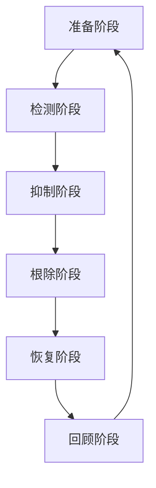
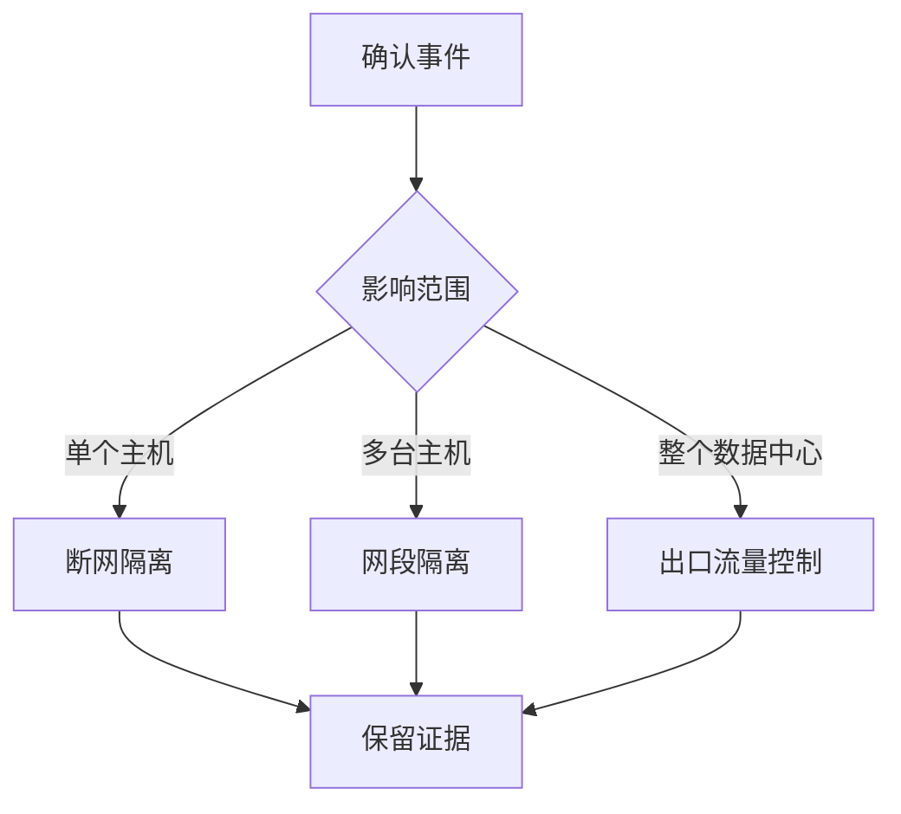

# 应急响应流程

凌晨三点，你的手机响了：「生产服务器被入侵了，数据可能被窃取了」。你该怎么办？

慌乱中关掉服务器？立刻通知管理层？还是先收集证据？**应急响应的前几分钟，往往决定了损失的大小**。本篇将详细介绍应急响应的完整流程，帮助你在危机时刻保持冷静，快速止血。

## 应急响应模型（PDCERF）



| 阶段 | 目标 | 关键活动 |
|---|---|---|
| Preparation | 做好准备 | 预案、工具、人员培训 |
| Detection | 发现问题 | 监控、告警、分析 |
| Containment | 限制扩散 | 隔离、阻断、止血 |
| Eradication | 彻底清除 | 清除后门、修复漏洞 |
| Recovery | 恢复业务 | 验证、监控、上线 |
| Follow-up | 总结改进 | 复盘、改进、文档 |

## 第一阶段：准备阶段

### 应急响应团队

```yaml
# 团队组成
team:
  - role: 应急响应负责人
    responsibilities:
      - 统筹协调
      - 决策拍板
      - 对外沟通
    contact: 7x24 小时
  
  - role: 安全分析师
    responsibilities:
      - 事件分析
      - 证据收集
      - 溯源定位
  
  - role: 系统工程师
    responsibilities:
      - 主机取证
      - 恢复操作
      - 漏洞修复
  
  - role: 网络工程师
    responsibilities:
      - 网络隔离
      - 流量分析
      - 防火墙调整

  - role: 法务/公关
    responsibilities:
      - 合规报告
      - 外部沟通
```

### 工具包准备

```bash
# 应急工具包
mkdir -p /opt/incident-response/{bin,scripts,logs}
cd /opt/incident-response

# 下载必要工具
# - volatility (内存取证)
# - autopsy (磁盘取证)
# - wireshark (流量分析)
# - yara (恶意软件识别)
# - strings (字符串分析)

# 常用命令脚本
# 保存网络连接快照
cat > scripts/netstat_snapshot.sh <<'EOF'
#!/bin/bash
echo "=== Active Connections ===" > netstat_$(date +%Y%m%d_%H%M%S).log
netstat -antp >> $_
echo "=== Listening Ports ===" >> $_
netstat -ltnp >> $_
echo "=== ARP Table ===" >> $_
arp -a >> $_
echo "=== Routes ===" >> $_
route -n >> $_
EOF

# 进程快照
cat > scripts/ps_snapshot.sh <<'EOF'
#!/bin/bash
echo "=== Process List ===" > ps_$(date +%Y%m%d_%H%M%S).log
ps auxf >> $_
echo "=== Hidden Processes ===" >> $_
ps -eo pid,ppid,user,%cpu,%mem,comm | grep -v PID >> $_
EOF
```

## 第二阶段：检测阶段

### 初步判断

收到告警后的初步判断：

| 问题 | 确认内容 |
|---|---|
| 是否误报？ | 检查监控规则、日志、告警详情 |
| 影响范围？ | 哪些系统/数据受影响 |
| 紧迫程度？ | 是否正在发生、是否数据泄露 |
| 需要升级？ | 是否需要启动应急响应 |

### 快速排查命令

```bash
# 1. 检查异常登录
# Linux
last -20
lastlog
who
cat /var/log/auth.log | grep -E "Failed|sshd|sudo"

# Windows
Get-WinEvent -FilterHashtable @{LogName='Security';Id=4624,4625,4634} -MaxEvents 50

# 2. 检查异常进程
# Linux
ps aux --sort=-%cpu | head -20
ps aux --sort=-%mem | head -20
ls -la /proc/*/exe 2>/dev/null | grep deleted  # 查看已删除但运行的进程

# Windows
Get-Process | Sort-Object CPU -Descending | Select-Object -First 10
tasklist /v | findstr "Suspicious"

# 3. 检查网络连接
# Linux
ss -tulnp
netstat -antp | grep ESTABLISHED
lsof -i -P -n

# Windows
netstat -ano | findstr ESTABLISHED
Get-NetTCPConnection | Where-Object {$_.State -eq 'Established'}

# 4. 检查计划任务/启动项
# Linux
crontab -l
cat /etc/crontab
ls -la /etc/cron.*
systemctl list-units --type=service

# Windows
schtasks /query /fo LIST /v
Get-CimInstance Win32_StartupCommand
```

### 日志分析

```bash
# Linux SSH 日志分析
cat /var/log/auth.log | grep sshd | grep -E "Failed|Accepted|Invalid"

# 分析失败登录
cat /var/log/auth.log | \
    awk '/Failed/{print $(NF-3)}' | \
    sort | uniq -c | sort -rn | head -10

# Windows 安全日志查询
# 登录事件 (4624)
Get-WinEvent -FilterHashtable @{
    LogName='Security'
    Id=4624
} -MaxEvents 100 | Select-Object TimeCreated,@{N='User';E={$_.Properties[5].Value}},@{N='IP';E={$_.Properties[11].Value}}

# 账户变更 (4720, 4726)
Get-WinEvent -FilterHashtable @{LogName='Security';Id=4720} -MaxEvents 50
```

## 第三阶段：抑制阶段

### 隔离原则



### Linux 隔离操作

```bash
# 1. 断开网络连接（保持 SSH 用于后续分析）
iptables -A INPUT -j DROP
# 或仅保留管理口
iptables -A INPUT -p tcp --dport 22 -j ACCEPT
iptables -A INPUT -j DROP

# 2. 隔离后门
chmod 000 /tmp/suspicious_file
mv /tmp/suspicious_file /tmp/quarantined/

# 3. 记录隔离时间
echo "$(date): Host isolated due to suspicious activity" >> /var/log/incident.log

# 4. 如果需要完全断网
ip link set eth0 down
```

### Windows 隔离操作

```powershell
# 1. 断开网络适配器
Get-NetAdapter | Disable-NetAdapter -Confirm:$false

# 2. 或仅禁用网络
netsh interface set interface "Ethernet" disabled

# 3. 禁用可疑账户
net user suspicious_account /active:no

# 4. 禁用可疑服务
Stop-Service -Name "SuspiciousService"
Set-Service -Name "SuspiciousService" -StartupType Disabled

# 5. 阻断恶意进程
taskkill /F /PID <suspicious_pid>
```

## 第四阶段：根除阶段

### 内存取证

```bash
# Linux 内存获取
# 使用 LiME 加载内核模块
insmod /opt/incident-response/lime-5.10.0.ko "path=/tmp/memory.lime format=lime"

# 或使用 AVML (Acquire Volatile Memory for Linux)
avml memory.lime

# Windows 内存获取
# 使用 WinPmem
winpmem_mini_x64.exe memory.raw
```

### 恶意软件分析

```bash
# 提取可疑文件
cp /tmp/quarantined/malware /opt/incident-response/evidence/

# YARA 扫描
yara -r /opt/yara-rules/malware.yar /opt/incident-response/evidence/

# 字符串分析
strings malware | head -100
strings malware | grep -E "(http|https|ftp)" | sort -u

# 哈希计算
md5sum malware
sha256sum malware

# VirusTotal 查询
curl -X POST "https://www.virustotal.com/api/v3/files" \
    -H "x-apikey: YOUR_API_KEY" \
    -F "file=@malware"
```

### 清除后门

```bash
# Linux
# 1. 清除 crontab 后门
crontab -r

# 2. 清除 SSH 密钥后门
rm ~/.ssh/authorized_keys
# 检查是否有其他后门密钥
cat ~/.ssh/authorized_keys2
cat ~/.ssh/authorized_keys

# 3. 清除 LD_PRELOAD 后门
unset LD_PRELOAD

# 4. 清除系统服务后门
systemctl stop malicious.service
systemctl disable malicious.service
rm /etc/systemd/system/malicious.service

# 5. 内核模块后门检查
lsmod | grep -v ^Module
# 卸载可疑模块
rmmod suspicious_module

# Windows
# 1. 使用 Autoruns 检查启动项
autorunsc.exe -a * > autoruns.txt

# 2. 删除恶意注册表
reg delete "HKLM\SOFTWARE\Microsoft\Windows\CurrentVersion\Run" /v "Malicious" /f

# 3. 清理 WMI 持久化
Get-WMIObject __EventFilter -Namespace "root\subscription" | Remove-WMIObject
Get-WMIObject CommandLineEventConsumer -Namespace "root\subscription" | Remove-WMIObject
```

## 第五阶段：恢复阶段

### 恢复流程


### 恢复步骤

```bash
# 1. 从备份恢复（确保备份未被感染）
# 文件备份
rsync -avz root@backup-server:/backup/ /restore/

# 数据库备份恢复
mysql -u root -p < backup.sql

# 2. 系统重装（推荐）
# 对于被 rootkit 感染的系统，重装是最安全的选择
# 使用 kickstart 或 ansible 自动重装

# 3. 修改所有密码
# 建议使用随机密码生成
openssl rand -base64 32

# 4. 更新 SSH 密钥
ssh-keygen -t rsa -b 4096

# 5. 应用安全补丁
# Linux
yum update -y
# 或
apt-get update && apt-get upgrade -y

# Windows
Get-WindowsUpdate -Install -AcceptAll
```

### 验证测试

```bash
# 1. 端口扫描确认
nmap -sV localhost

# 2. 用户账户确认
cat /etc/passwd | grep -E "^(root|daemon|bin|sys|admin)"
# 检查是否有新增管理员账户

# 3. 服务检查
systemctl list-units --type=service --state=running

# 4. 登录测试
# 测试所有账户可以正常登录
```

## 第六阶段：回顾阶段

### 事件报告模板

```markdown
# 安全事件报告

## 事件概要
- **事件编号**: INC-2024-001
- **发现时间**: 2024-03-15 02:30
- **报告人**: 安全监控团队
- **影响等级**: 高危

## 时间线
| 时间 | 事件 | 负责人 |
|------|------|--------|
| 02:30 | 监控告警：异常登录 | @张三 |
| 02:35 | 确认事件，启动应急响应 | @李四 |
| 02:40 | 隔离受影响主机 | @王五 |
| 03:00 | 完成初步分析 | @李四 |
| 05:00 | 清除后门，完成恢复 | @王五 |
| 08:00 | 事件复盘会议 | 全团队 |

## 攻击路径
1. 攻击者通过弱口令登录 SSH (端口 22)
2. 利用 sudo 权限下载恶意工具
3. 安装持久化后门
4. 尝试横向移动

## 根本原因
- SSH 密码强度不足
- 未启用 SSH 密钥认证
- 日志告警阈值设置过高

## 改进措施
| 措施 | 责任人 | 完成日期 |
|------|--------|----------|
| 修改所有 SSH 密码为强密码 | @张三 | 2024-03-15 |
| 启用 SSH 公钥认证，禁止密码登录 | @李四 | 2024-03-15 |
| 部署 fail2ban 防止暴力破解 | @王五 | 2024-03-16 |
| 调整日志告警阈值 | @李四 | 2024-03-17 |
```

## 面试追问方向

- 应急响应的六个阶段？
- 如何判断是否需要启动应急响应？
- 取证时如何保证证据完整性？
- 什么时候选择重装系统而不是清理？
- 事件报告应该包含哪些内容？
- 如何防止同类事件再次发生？

> 应急响应的质量，反映了安全建设的成熟度。最好的应急响应，是让应急响应不需要发生。
