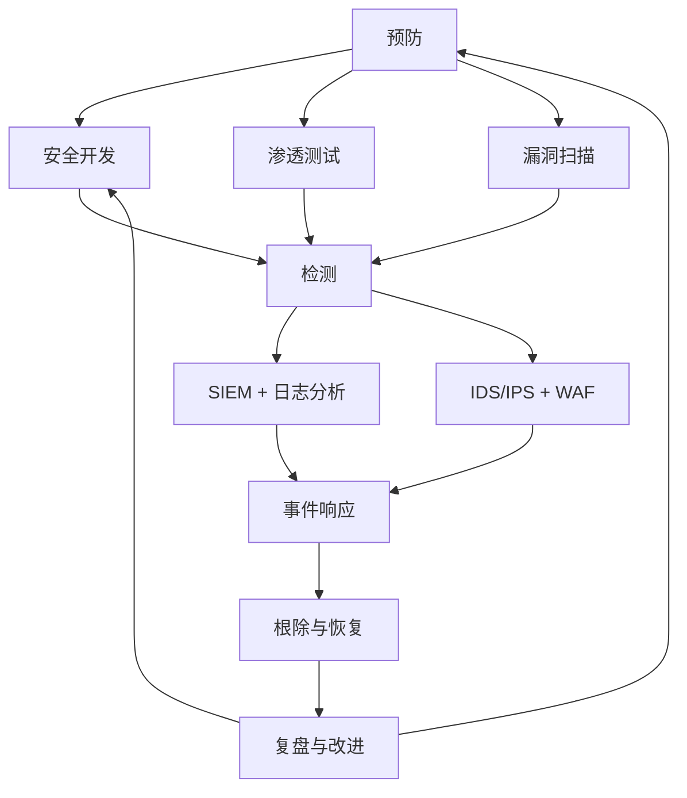

# 安全运维总览

凌晨三点，你被安全告警叫醒：生产环境检测到异常登录行为。日志显示有人从境外 IP 登录了你的服务器——但密码明明只有你知道。

这不是电影场景，而是每个安全运维工程师都可能遇到的真实情况。安全运维（SecOps）就是要在攻防对抗中，先于攻击者发现漏洞和威胁。本章将带你构建完整的安全运维知识体系，从渗透测试到应急响应，从漏洞扫描到合规建设。

## 知识图谱

本章节涵盖以下核心内容：

| 分类 | 内容 | 目标 |
|---|---|---|
| 渗透测试 | 信息收集、漏洞扫描、渗透利用、权限维持、报告输出 | 模拟攻击发现问题 |
| 漏洞管理 | 漏洞扫描、Nmap、Nessus、OpenVAS | 发现已知漏洞 |
| 代码审计 | Fortify、SonarQube、手工审计 | 从源头消灭漏洞 |
| 安全监控 | SIEM、日志分析、威胁情报 | 实时发现威胁 |
| 应急响应 | 事件分类、抑制、根除、恢复、回顾 | 快速止血 |
| 合规建设 | 等保 2.0、网络安全法 | 满足法规要求 |

## 安全运营体系

## 学习路径

建议按照以下顺序学习：

1. **先理解渗透测试方法论**：学会攻击才能更好地防御
2. **掌握漏洞扫描工具**：快速发现系统弱点
3. **学习代码审计**：从源头控制风险
4. **了解 SIEM 和日志分析**：构建监控能力
5. **掌握应急响应流程**：快速处置安全事件
6. **熟悉合规要求**：满足法规同时提升安全

## 面试要点

安全运维是面试中的高频考点，以下问题值得重点准备：

- 渗透测试的流程？各阶段用什么工具？
- 信息收集的方法？哪些信息是公开可查的？
- 漏洞扫描和渗透测试的区别？
- OWASP Top 10 有哪些？
- SIEM 的核心功能？
- 应急响应的流程？
- 等保 2.0 的几个等级？各自要求？

> 安全运维的核心是「攻」与「防」的平衡。了解攻击技术，才能构建有效的防御体系。
