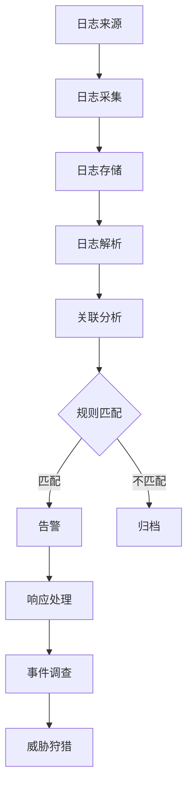
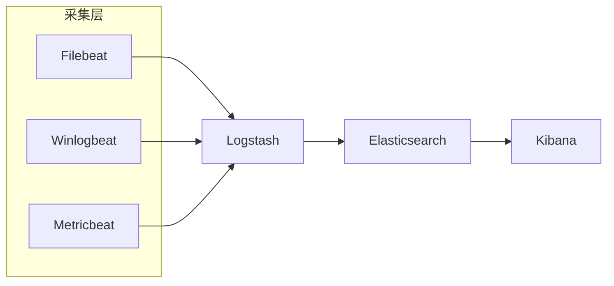

# 日志安全分析与 SIEM

凌晨两点，你被告警叫醒：「检测到异常登录」。但当你查看日志时，发现只是一个员工的正常远程办公。**误报太多，真正的问题被淹没了**。

这就是为什么需要 SIEM（安全信息和事件管理）——**将海量日志变成可操作的安全情报**。本篇将详细介绍 SIEM 的工作原理、部署架构和实战分析方法。

## SIEM 核心功能



| 功能 | 说明 |
|---|---|
| 日志采集 | 从各类设备收集日志 |
| 日志存储 | 大规模日志存储与检索 |
| 解析归一化 | 将不同格式日志标准化 |
| 关联分析 | 将相关事件关联成攻击链 |
| 实时告警 | 基于规则或异常检测告警 |
| 威胁情报 | 集成外部威胁情报 |
| 合规报告 | 生成合规报告 |

## 常见 SIEM 方案

| 方案 | 特点 | 适用场景 |
|---|---|---|
| ELK Stack | 开源、灵活、社区活跃 | 中小企业 |
| Splunk | 功能强大、商业成熟 | 大型企业 |
| Graylog | 易用、扩展性好 | 中型企业 |
| Microsoft Sentinel | 集成 Azure | Azure 云环境 |

## ELK Stack 部署

### 架构



### Docker Compose 部署

```yaml
# docker-compose.yml
version: '3.8'

services:
  elasticsearch:
    image: docker.elastic.co/elasticsearch/elasticsearch:8.10.0
    environment:
      - discovery.type=single-node
      - xpack.security.enabled=true
      - ELASTIC_PASSWORD=ElasticPassword123
    volumes:
      - es_data:/usr/share/elasticsearch/data
    ports:
      - "9200:9200"
    mem_limit: 2g

  logstash:
    image: docker.elastic.co/logstash/logstash:8.10.0
    volumes:
      - ./logstash/pipeline:/usr/share/logstash/pipeline
    ports:
      - "5044:5044"
    environment:
      - "LS_JAVA_OPTS=-Xmx512m -Xms512m"
    depends_on:
      - elasticsearch

  kibana:
    image: docker.elastic.co/kibana/kibana:8.10.0
    environment:
      - ELASTICSEARCH_HOSTS=http://elasticsearch:9200
      - ELASTICSEARCH_USERNAME=kibana_system
      - ELASTICSEARCH_PASSWORD=ElasticPassword123
    ports:
      - "5601:5601"
    depends_on:
      - elasticsearch

volumes:
  es_data:
```

### Logstash 管道配置

```ruby
# /etc/logstash/pipeline/security.conf
input {
  beats {
    port => 5044
  }
  tcp {
    port => 5000
    codec => json
  }
}

filter {
  if [event][category] == "authentication" {
    mutate {
      add_field => { "[@metadata][alert_type]" => "auth" }
    }
  }

  if [event][category] == "network" {
    mutate {
      add_field => { "[@metadata][alert_type]" => "network" }
    }
  }

  # 时间戳解析
  date {
    match => ["@timestamp", "ISO8601"]
    target => "@timestamp"
  }

  # GeoIP 地理信息
  if [source][ip] {
    geoip {
      source => "source.ip"
      target => "source.geo"
    }
  }

  # 威胁情报匹配
  threatintel {
    vendor_name => "Abuse.ch"
    feed_name => "Feodo Tracker Blocklist"
    target => "[threat][indicator]"
  }
}

output {
  elasticsearch {
    hosts => ["elasticsearch:9200"]
    user => "elastic"
    password => "${ELASTIC_PASSWORD}"
    index => "security-logs-%{+YYYY.MM.dd}"
  }
}
```

### Filebeat 采集配置

```yaml
# /etc/filebeat/filebeat.yml
filebeat.inputs:
  - type: log
    enabled: true
    paths:
      - /var/log/auth.log
    fields:
      log_type: auth
    fields_under_root: true

  - type: log
    enabled: true
    paths:
      - /var/log/nginx/access.log
    fields:
      log_type: nginx
    fields_under_root: true

  - type: log
    enabled: true
    paths:
      - /var/log/audit/audit.log
    fields:
      log_type: auditd
    fields_under_root: true

processors:
  - add_host_metadata:
      when.not.contains.tags: forwarded
  - add_cloud_metadata: ~
  - add_docker_metadata: ~

output.logstash:
  hosts: ["logstash:5044"]
```

## Splunk 查询语法

### 基础查询

```bash
# 基础搜索
index=main sourcetype=linux:auth

# 字段搜索
index=security event_id=4624
| search event_code=4624 AND account_name=admin

# 时间范围
earliest=-24h latest=now

# 多条件
index=network sourcetype=fw event=accept
| where bytes > 10000
| sort -bytes
```

### 统计与分析

```bash
# 统计 Top IP
index=network
| stats count by src_ip
| sort -count
| head 20

# 统计每分钟事件数
index=security
| timechart span=1m count

# 关联分析
index=security
| stats values(src_ip) as src_ips, count as attempts
    by user, dest_port
| where attempts > 10
```

### 安全场景查询

```bash
# 检测暴力破解
index=security sourcetype=auth_log
| rex field=message "Failed password for (?<user>\S+)"
| rex field=source_ip "(?<ip>\d+\.\d+\.\d+\.\d+)"
| stats count as attempts, values(user) as users by ip
| where attempts > 10
| eval severity=if(attempts>50, "Critical", if(attempts>20, "High", "Medium"))
| sort -attempts

# 检测异常登录
index=security event_id=4624
| rex field=_raw "Ip address.*?(?<login_ip>\S+)"
| lookup geoip clientip as login_ip OUTPUT country_name, city_name
| stats count, values(_time) as login_times, values(country_name) as countries
    by user
| where count > 5 OR mvcount(countries) > 2

# 检测数据外泄
index=network sourcetype=proxy
| where bytes_out > 10000000
| stats sum(bytes_out) as total_bytes by user, dest_domain
| where total_bytes > 100000000
| sort -total_bytes
```

## 威胁情报集成

### MISP 集成

```yaml
# /etc/elk/pipelines/threat-intel.conf
input {
  http {
    port => 9200
    type => threatintel
  }
}

filter {
  if [type] == "threatintel" {
    mutate {
      add_field => { "[@metadata][index]" => "threat-intel" }
    }

    # 提取 IOC
    if [type] == "ip" {
      mutate {
        add_field => { "[@metadata][indicator_type]" => "ip" }
      }
    }
    if [type] == "domain" {
      mutate {
        add_field => { "[@metadata][indicator_type]" => "domain" }
      }
    }
  }
}

output {
  elasticsearch {
    hosts => ["elasticsearch:9200"]
    index => "threat-intel-%{[@metadata][indicator_type]}"
  }
}
```

### Sigma 规则转换为 SIEM 查询

```yaml
# Sigma 规则示例
# sigma/rules/windows/authentication/win_suspicious_login.yml
title: Suspicious Login
logsource:
  product: windows
  service: security
detection:
  selection:
    EventID: 4624
    LogonType: 3
    IpAddress: '-'
  condition: selection
level: medium
```

```bash
# 转换为 Splunk 查询
index=windows EventCode=4624 LogonType=3 IpAddress="-"

# 转换为 Elastic DSL
{
  "query": {
    "bool": {
      "must": [
        {"term": {"event.code": "4624"}},
        {"term": {"winlog.event_data.LogonType": "3"}},
        {"term": {"source.ip": "-"}}
      ]
    }
  }
}
```

## 安全监控场景

### 监控仪表板

```json
// Kibana Dashboard 配置
{
  "title": "Security Overview",
  "panels": [
    {
      "title": "Events Over Time",
      "type": "line",
      "gridData": {"x": 0, "y": 0, "w": 12, "h": 8},
      "options": {
        "xAxis": "timestamp",
        "yAxis": "count",
        "split": "event.category"
      }
    },
    {
      "title": "Top Source IPs",
      "type": "table",
      "gridData": {"x": 12, "y": 0, "w": 12, "h": 8},
      "options": {
        "fields": ["source.ip", "count"],
        "limit": 10
      }
    },
    {
      "title": "Alert Severity",
      "type": "pie",
      "gridData": {"x": 0, "y": 8, "w": 6, "h": 8},
      "options": {
        "groupBy": "alert.severity"
      }
    }
  ]
}
```

### 自动化响应

```python
#!/usr/bin/env python3
# 自动封禁脚本
import requests
import json

class SecurityAutomation:
    def __init__(self, siem_url, siem_token):
        self.siem_url = siem_url
        self.headers = {"Authorization": f"Bearer {siem_token}"}

    def get_high_severity_alerts(self):
        """获取高危告警"""
        query = {
            "query": {
                "bool": {
                    "must": [
                        {"range": {"alert.severity": {"gte": 8}}},
                        {"range": {"@timestamp": {"gte": "now-1h"}}}
                    ]
                }
            }
        }
        response = requests.post(
            f"{self.siem_url}/alerts/_search",
            headers=self.headers,
            json=query
        )
        return response.json()['hits']['hits']

    def block_ip(self, ip):
        """在防火墙封禁 IP"""
        # Cisco ASA API
        payload = {
            "objects": [
                {"kind": "networkobject", "name": f"malicious_{ip}", "host": {"kind": "Fqdn", "value": ip}}
            ]
        }
        requests.post(
            "https://asa.example.com/api/block",
            json=payload,
            verify=False
        )

    def process_alerts(self):
        """处理高危告警"""
        alerts = self.get_high_severity_alerts()
        for alert in alerts:
            source_ip = alert['_source'].get('source', {}).get('ip')
            if source_ip:
                print(f"封禁 IP: {source_ip}")
                self.block_ip(source_ip)
```

## 面试追问方向

- SIEM 和日志平台的区别？
- 日志采集要注意什么？
- 如何减少误报？
- 什么是威胁狩猎（Threat Hunting）？
- 如何检测内网横向移动？
- EDR 和 SIEM 的关系？

> SIEM 是安全运营的眼睛。看得清才能看得准，看得准才能处理得快。
