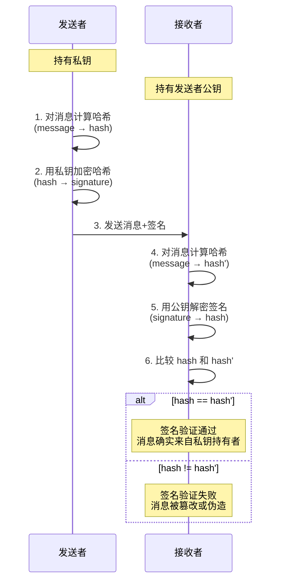
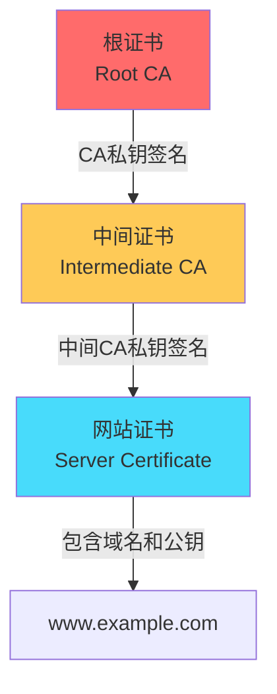

# 数字签名与数字证书

面试官问："你访问 https://www.example.com，浏览器怎么知道这个网站是真的，不是钓鱼网站？"

候选人小李说："因为有HTTPS证书。"

面试官追问："证书是什么？怎么验证的？"

小李支支吾吾："就是...有个认证机构...发的..."

面试官继续："那证书链是什么意思？为什么根证书不需要验证？"

小张彻底卡住了，场面一度尴尬...

这个问题问住的候选人不在少数。数字签名和数字证书是网络安全中最核心的信任机制，但很多人只是知道名词，不理解原理。

今天我们就来把这个彻底讲清楚。

## 【直观类比】

### 现实中的签名和印章

想象你要签一份合同：

1. 你在纸上签名 —— 证明"这是我的意愿"
2. 对方验证笔迹 —— 证明"确实是你签的"
3. 公证处盖章 —— 第三方权威证明"这个签名是有效的"

但纸质签名有个问题：**容易被伪造**。有人可以模仿你的笔迹，或者直接伪造一个假印章。

### 数字签名：不可能伪造的电子签名

数字签名要解决的核心问题：**如何证明"这确实是我发的"，而且不可能伪造？**

答案是利用**非对称加密**的数学特性：

```
私钥签名 → 只有持有私钥的人能做这件事
公钥验证 → 任何人都可以验证这件事
```

这就像：
- **私钥**：只有你能打开的保险箱
- **公钥**：任何人都能往里投信，但只有你能取出来

## 核心原理

### 数字签名的流程

数字签名的核心思想：**用私钥"加密"哈希值，任何人都可以用公钥验证**。



### 签名算法的数学原理

以RSA签名举例：

```python
# RSA签名
def rsa_sign(message, private_key):
    """
    private_key = (d, n)
    d: 私钥指数
    n: 公钥模数
    """
    # 1. 计算消息哈希
    hash_value = sha256(message)
    
    # 2. 用私钥加密哈希
    signature = pow(hash_value, private_key.d, private_key.n)
    
    return signature

# RSA验证
def rsa_verify(message, signature, public_key):
    """
    public_key = (e, n)
    e: 公钥指数 (通常为65537)
    n: 公钥模数
    """
    # 1. 用公钥解密签名，得到哈希A
    hash_a = pow(signature, public_key.e, public_key.n)
    
    # 2. 计算消息哈希，得到哈希B
    hash_b = sha256(message)
    
    # 3. 比较两者
    return hash_a == hash_b
```

**为什么这样能证明身份？**

```
如果能用公钥解开签名 → 说明签名是用对应私钥做的
只有私钥持有者才能签名 → 因此签名者就是私钥持有者
```

### 签名能证明什么？

```
✅ 能证明：
- 这份消息确实来自私钥持有者
- 消息在传输过程中没有被篡改

❌ 不能证明：
- 公钥持有者就是声明的那个人（公钥可能被伪造）
- 消息本身是合法的
```

这就是为什么需要**数字证书**来绑定公钥和身份。

## 数字证书：公钥的身份证

### 证书是什么？

**数字证书**就是公钥的"身份证"，它由**证书颁发机构（CA）**签发：

```json
{
  "subject": "www.example.com",
  "issuer": "DigiCert Inc",
  "public_key": "MIIBIjANBgkr...",
  "serial_number": "12345678",
  "valid_from": "2024-01-01",
  "valid_to": "2025-01-01",
  "signature": "base64编码的签名..."
}
```

证书的核心是：**用CA的私钥，给这份包含公钥的文件签名**。

### 证书的签名验证

```
证书内容 → SHA-256哈希 → CA私钥加密 → 签名

验证流程：
1. 提取证书中的公钥（CA的公钥）
2. 用CA公钥解密签名，得到哈希A
3. 计算证书内容的哈希，得到哈希B
4. 比较A和B，相同则证书有效
```

### 证书链：从叶子到根

浏览器验证证书时，会沿着**证书链**逐级向上验证：



**为什么需要中间证书？**

```
直接用根证书签名的问题：
1. 根证书私钥极其敏感，不能频繁使用
2. 一旦泄露，整个PKI体系崩塌

解决方案：
1. 根证书只签名中间证书（离线保护）
2. 中间证书负责签名实际使用的证书
3. 中间证书可以吊销和更新，不影响根证书
```

### 证书链验证过程

```
浏览器验证 www.example.com 证书：

Step 1: 提取证书
  网站证书 → subject=www.example.com
           → issuer=DigiCert SHA2 Extended Validation Server CA

Step 2: 找到中间证书
  在证书Store中找到 DigiCert 中间证书

Step 3: 验证网站证书签名
  用中间CA公钥验证 → 通过

Step 4: 验证中间证书签名
  用中间CA公钥找到其颁发者 → DigiCert Root CA

Step 5: 找到根证书
  在可信根证书列表中找到 DigiCert Root CA

Step 6: 验证根证书
  根证书是自签名，用内置的根公钥验证 → 通过

Step 7: 检查证书吊销
  检查CRL或OCSP，确认证书未被吊销

Step 8: 检查有效期
  当前时间在 valid_from 和 valid_to 之间

全部通过 ✅ → HTTPS连接建立
```

### 根证书：信任的起点

**根证书**是PKI体系的信任锚点，它们被**内置在操作系统和浏览器中**：

```
根证书的存储：
- 操作系统根证书Store
- 浏览器内置根证书（Firefox使用自己的Store）
- 企业自定义根证书（IT管理员可以添加）
```

根证书的私钥**绝对不能联网**，通常存储在HSM（硬件安全模块）中，由专门的团队管理。

:::tip 💡
为什么Firefox有自己的根证书Store？因为Firefox不用系统的证书Store，这样可以：
1. 不受系统更新限制，更快吊销恶意证书
2. 不受政府管控（如 Kazakhstan 曾要求系统添加监听根证书）
:::

## 证书类型：从DV到EV

### 域名验证证书（DV）

**DV证书（Domain Validation）**只验证域名所有权：

```
验证方式：
1. 邮件验证：发送验证邮件到 admin@example.com
2. DNS验证：在 DNS 中添加特定 TXT 记录
3. HTTP验证：在网站特定路径放置验证文件

颁发速度：几分钟到几小时
价格：免费到几十元/年
适用：个人网站、测试环境、内部系统
```

DV证书只证明"你控制了这个域名"，不证明"你是合法的公司"。

### 组织验证证书（OV）

**OV证书（Organization Validation）**验证域名+组织身份：

```
验证方式：
1. 验证域名所有权
2. 验证组织存在性（营业执照等）
3. 验证申请者授权

颁发速度：1-7天
价格：几百到几千元/年
适用：企业官网、电商平台
浏览器显示：显示公司名称
```

### 扩展验证证书（EV）

**EV证书（Extended Validation）**是最高级别的验证：

```
验证方式：
1. 严格的组织身份验证
2. 实际地址验证
3. 电话验证
4. 法律地位确认

颁发速度：1-4周
价格：几千到几万元/年
适用：银行、支付、大型企业

浏览器显示：
Chrome 77+ 移除了EV特有的绿色地址栏
现在EV证书只显示证书持有公司名称
```

## 证书吊销：证书的紧急刹车

### 为什么需要吊销？

证书可能在以下情况变得不可信：

```
1. 私钥泄露
   → 攻击者可能伪造你的身份

2. 证书错误签发
   → 证书发给错误的人/域名

3. 公司变更
   → 域名或组织信息变化

4. 业务终止
   → 网站不再运营
```

### 吊销列表（CRL）

**CRL（Certificate Revocation List）**是证书吊销的黑名单：

```
# CRL工作方式
DigiCert CRL Distribution Point:
http://crl3.digicert.com/DigiCertTLSHybridECCSHA3842020CA1.crl

浏览器行为：
1. 下载完整的CRL文件
2. 检查目标证书是否在列表中
3. 问题：CRL可能很大，下载慢
```

### 在线证书状态协议（OCSP）

**OCSP（Online Certificate Status Protocol）**提供实时查询：

```python
# OCSP工作流程
def check_certificate_status(certificate):
    # 1. 从证书中提取OCSP服务器地址
    ocsp_url = certificate.ocsp_responder
    
    # 2. 向OCSP服务器发送状态查询
    request = build_ocsp_request(certificate.serial_number)
    response = http_post(ocsp_url, request)
    
    # 3. 解析响应
    status = parse_ocsp_response(response)
    # status: "good" | "revoked" | "unknown"
    
    return status
```

**OCSP的问题**：
- 用户隐私：OCSP服务器知道用户访问了哪个网站
- 可用性：OCSP服务器挂了怎么办？
- 性能：每次连接都要查询

### OCSP装订（OCSP Stapling）

**OCSP Stapling**解决了OCSP的问题：

```
传统OCSP：
  浏览器 → OCSP服务器（慢，可能失败）

OCSP Stapling：
  服务器 → OCSP服务器（提前获取状态）
  浏览器 → 服务器（获取证书时顺便获取状态）
```

```
nginx 配置 OCSP Stapling：
ssl_stapling on;
ssl_stapling_verify on;
resolver 8.8.8.8;
```

## 常见误区

### 误区1：证书越贵越安全

**错误**。EV证书确实验证更严格，但价格不代表安全性。DV证书如果配置正确（AES-256、TLS 1.3），加密强度和EV是一样的。

区别在于**身份验证级别**，而不是**加密强度**。

### 误区2：有了证书就绝对安全

**错误**。证书只保证"公钥属于声称的实体"，不保证：
- 服务器本身没有漏洞
- 网站不是钓鱼网站（EV证书能证明公司，但网站内容还是要用户判断）
- 证书私钥没有被泄露

### 误区3：根证书不需要验证

**半对半错**。根证书是信任锚点，确实不需要被其他证书验证。但：
- 根证书必须在内置的可信根证书列表中
- 根证书的签名是自签名，需要CA提供证明文件
- 攻击者可能诱骗用户安装恶意根证书

### 误区4：HTTPS网站一定可信

**错误**。HTTPS只保证传输加密，不保证：
- 网站内容的合法性
- 网站不会收集用户数据
- 网站不会重定向到恶意网站

HTTPS + 可信证书 = 传输安全 ≠ 内容可信

### 误区5：证书过期就不能用了

**不完全对**。证书过期后：
- 浏览器会阻止访问（显示安全警告）
- 但技术上TLS握手仍可完成
- 只是现代浏览器强制检查有效期

## 记忆技巧

### 口诀

> **数字签名：私钥签，公钥验，证明身份不被篡改**
> **证书：CA担保，公钥属于某人，公钥不是假货**
> **证书链：叶子信中间，中间信根，根靠自己**
> **吊销：CRL是黑名单，OCSP是实时查，装订是预缓存**

### 验证流程记忆

```
浏览器验证HTTPS网站：
1. 取证书 → 看谁签的
2. 找中间 → CA是谁
3. 验签名 → 链到根
4. 查吊销 → 没被废
5. 核时间 → 在有效
6. 比域名 → 是我的
7. 全通过 → 敢连接
```

## 实战检验

### 检验1：自签名证书问题

**问题**：为什么浏览器不信任自签名证书？

**答案**：

```
自签名证书的问题：
1. 任何人都可以生成任意域名的自签名证书
2. 浏览器没有证书持有者的可信证明
3. 没有CA链可以追溯

自签名证书的用途：
1. 内部测试环境
2. 开发环境（localhost）
3. 内网系统（通过手动导入证书）

生产环境：必须使用受信任CA签发的证书
```

### 检验2：证书链不完整

**问题**：访问网站时提示"证书链不完整"是什么原因？

**答案**：

```
原因：
1. 服务器没有配置中间证书
2. 中间证书没有被正确传递

解决方案：
1. 服务器配置：将中间证书和服务器证书一起发送
2. 使用完整证书链（中间证书+根证书）
3. 在线工具检测：SSL Labs SSL Test

Nginx配置示例：
ssl_certificate /path/to/server.crt;      # 服务器证书
ssl_certificate /path/to/intermediate.crt; # 中间证书
```

### 检验3：证书透明度（CT）

**问题**：什么是证书透明度（Certificate Transparency）？

**答案**：

```
CT的提出背景：
- CA可能被攻击或滥用，签发恶意证书
- 需要一种机制让证书签发可审计

CT的工作方式：
1. CA签发证书前，必须将证书提交到CT日志服务器
2. CT日志服务器返回"SCT"（签名证书时间戳）
3. 证书必须包含SCT才能被浏览器信任

效果：
- 任何人都可以查询CT日志，发现异常证书
- Google、Bug bounties多次通过CT发现恶意证书
```

【面试官心理】

面试官问数字签名和证书，其实是在测试你对"信任机制"的理解。知道签名用私钥验证用公钥是60分，知道证书链的验证流程是80分，知道OCSP和CT的作用是90分，如果还能讲清楚根证书的保护机制，那就是P7的水平了。

---

## 延伸阅读

- [TLS握手流程](/cs/security/tls-handshake) - 证书在HTTPS连接中的具体使用
- [HTTPS与HTTP区别](/cs/security/https-vs-http) - HTTPS的整体安全机制
- [对称加密 vs 非对称加密](/cs/security/symmetric-asymmetric) - 非对称加密在签名中的应用
