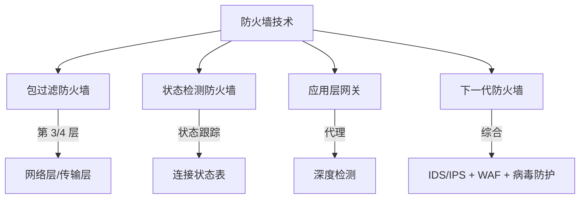
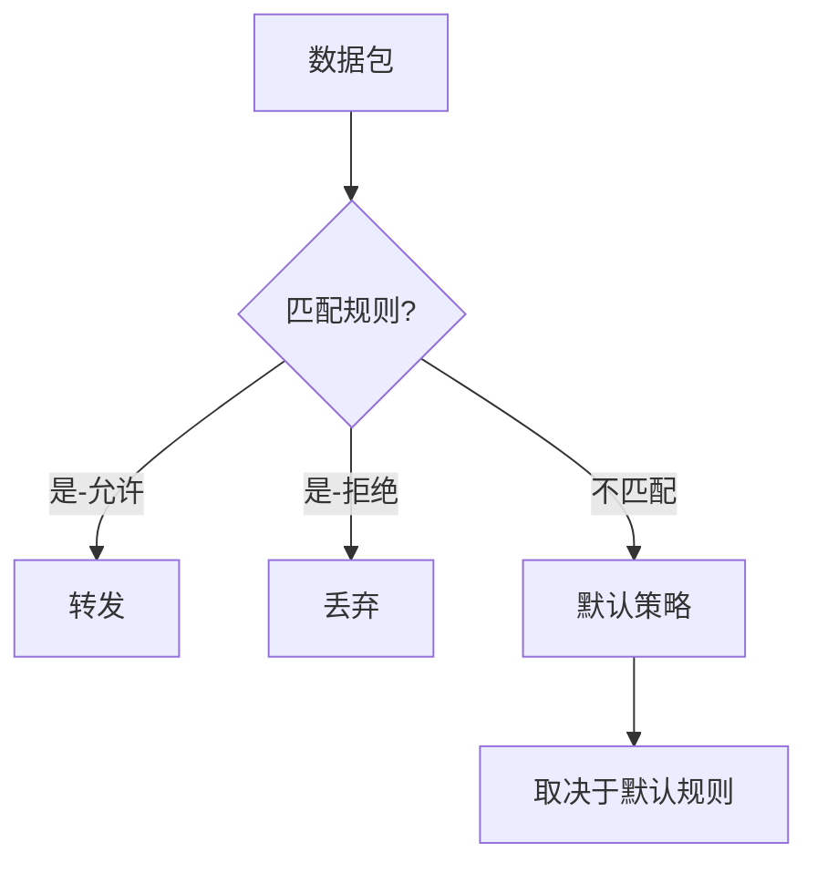
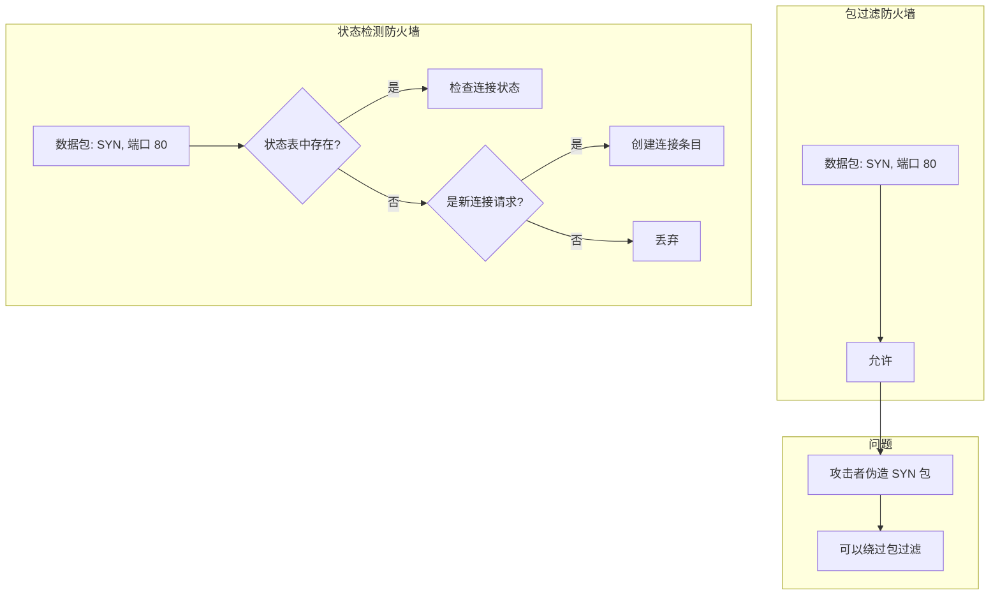
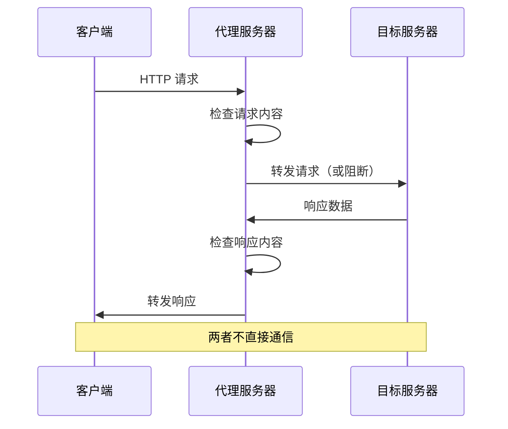
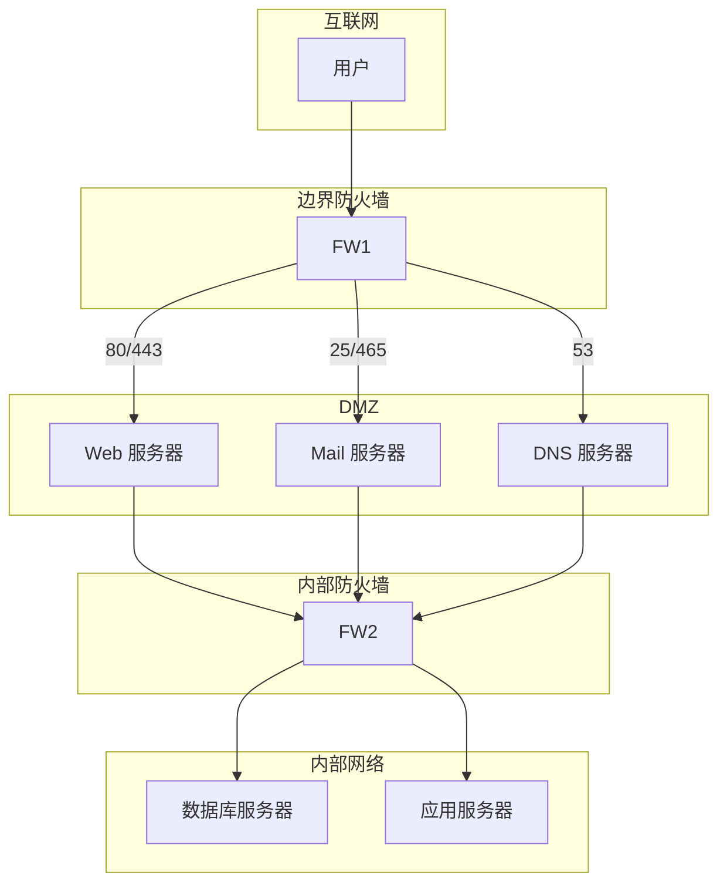

# 防火墙技术

你刚配置好服务器，开放了 80 和 443 端口。但测试时发现，来自某些 IP 的请求异常缓慢。检查日志后发现：有人在疯狂扫描你的 22 端口。

这就是为什么需要防火墙——**不仅仅是开放端口，更是构建网络边界的安全防线**。本篇将深入解析各种防火墙技术，从传统包过滤到现代应用层网关，构建完整的防火墙知识体系。

## 防火墙分类



## 包过滤防火墙

### 工作原理

包过滤防火墙工作在网络层，检查每个数据包的头部信息：

| 检查字段 | 说明 |
|---|---|
| 源 IP | 发送方 IP 地址 |
| 目标 IP | 接收方 IP 地址 |
| 源端口 | 发送方端口号 |
| 目标端口 | 接收方端口号 |
| 协议类型 | TCP/UDP/ICMP |



### iptables 示例

```bash
# 查看规则
iptables -L -n -v

# 清空规则
iptables -F
iptables -X
iptables -Z

# 默认策略
iptables -P INPUT DROP      # 默认拒绝入站
iptables -P FORWARD DROP     # 默认拒绝转发
iptables -P OUTPUT ACCEPT    # 默认允许出站

# 允许回环接口
iptables -A INPUT -i lo -j ACCEPT

# 允许已建立连接
iptables -A INPUT -m state --state ESTABLISHED,RELATED -j ACCEPT

# 允许 SSH (仅从内网)
iptables -A INPUT -s 192.168.1.0/24 -p tcp --dport 22 -j ACCEPT

# 允许 HTTP/HTTPS
iptables -A INPUT -p tcp --dport 80 -j ACCEPT
iptables -A INPUT -p tcp --dport 443 -j ACCEPT

# 允许 Ping
iptables -A INPUT -p icmp --icmp-type echo-request -j ACCEPT

# 拒绝并记录
iptables -A INPUT -j LOG --log-prefix "IPTables DROP: "
iptables -A INPUT -j DROP
```

### nftables 新一代语法

```bash
# nftables 表和链
nft add table inet filter

nft add chain inet filter input { type filter hook input priority 0 \; }

# 添加规则
nft add rule inet filter input ct state established,related accept
nft add rule inet filter input iif lo accept
nft add rule inet filter input tcp dport ssh accept
nft add rule inet filter input tcp dport { http, https } accept
nft add rule inet filter input counter drop

# 查看规则
nft list ruleset

# 持久化
nft list ruleset > /etc/nftables.conf
```

### 安全规则最佳实践

```bash
# 限制连接速率
# 每分钟最多 100 个新连接
iptables -A INPUT -p tcp --dport 80 -m state --state NEW \
    -m recent --set --name HTTP
iptables -A INPUT -p tcp --dport 80 -m state --state NEW \
    -m recent --update --seconds 60 --hitcount 100 --name HTTP -j DROP

# 限制并发连接数
# 每个 IP 最多 50 个并发连接
iptables -A INPUT -p tcp --dport 80 -m connlimit \
    --connlimit-above 50 -j REJECT

# 防止端口扫描
iptables -N BLOCKED_PORTSCAN
iptables -A BLOCKED_PORTSCAN -j LOG --log-prefix "Portscan: "
iptables -A BLOCKED_PORTSCAN -j DROP

# Syn flood 防护
iptables -A INPUT -p tcp --syn -m limit --limit 1/s --limit-burst 3 -j ACCEPT
iptables -A INPUT -p tcp --syn -j DROP
```

## 状态检测防火墙

### 为什么需要状态检测？

包过滤防火墙的问题是：**无法区分数据包是否属于合法的连接**。



### 连接状态表

```bash
# 查看连接跟踪表
cat /proc/net/nf_conntrack

# conntrack 命令
conntrack -L              # 列出所有连接
conntrack -L -p tcp --dport 80  # 查看 HTTP 连接
conntrack -F              # 清空连接表

# 连接状态
# NEW: 新建连接
# ESTABLISHED: 已建立的连接
# RELATED: 相关连接（如 FTP 数据连接）
# INVALID: 无效数据包
```

### conntrack 模块

```bash
# 启用连接跟踪
modprobe nf_conntrack

# 调整 conntrack 表大小
echo 262144 > /proc/sys/net/netfilter/nf_conntrack_max

# 连接超时时间
echo 3600 > /proc/sys/net/netfilter/nf_conntrack_tcp_timeout_established

# 允许FTP主动模式
modprobe nf_conntrack_ftp

# 允许FTP被动模式
modprobe nf_nat_ftp
```

## 应用层网关（代理防火墙）

### 代理原理

代理防火墙在应用层充当中间人，彻底隔离内网和外网：



### Squid 代理配置

```bash
# 安装
sudo apt install squid

# /etc/squid/squid.conf

# 基本配置
http_port 3128

# 访问控制
acl localnet src 192.168.1.0/24
acl blocked_sites dstdomain "/etc/squid/blocked.txt"

# 默认拒绝
http_access deny blocked_sites
http_access allow localnet
http_access deny all

# 缓存配置
cache_dir ufs /var/spool/squid 1000 16 256

# SSL 透明代理（需要编译支持）
# https_port 3129 intercept tls-bump \
#   cert=/etc/squid/ssl_cert/myCA.pem \
#   generate-host-certificates=on
```

### 反向代理配置

```nginx
# Nginx 反向代理 + 安全配置
upstream backend {
    server 127.0.0.1:8080;
    keepalive 32;
}

server {
    listen 443 ssl http2;
    server_name api.example.com;

    ssl_certificate /etc/nginx/ssl/cert.pem;
    ssl_certificate_key /etc/nginx/ssl/key.pem;
    ssl_protocols TLSv1.2 TLSv1.3;

    # 安全头
    add_header X-Frame-Options "SAMEORIGIN" always;
    add_header X-Content-Type-Options "nosniff" always;
    add_header X-XSS-Protection "1; mode=block" always;
    add_header Referrer-Policy "no-referrer-when-downgrade" always;

    # 限流
    limit_req_zone $binary_remote_addr zone=api_limit:10m rate=10r/s;
    limit_req zone=api_limit burst=20 nodelay;

    location / {
        proxy_pass http://backend;
        proxy_http_version 1.1;
        proxy_set_header Host $host;
        proxy_set_header X-Real-IP $remote_addr;
        proxy_set_header X-Forwarded-For $proxy_add_x_forwarded_for;
        proxy_set_header X-Forwarded-Proto $scheme;

        # 超时配置
        proxy_connect_timeout 10s;
        proxy_send_timeout 60s;
        proxy_read_timeout 60s;
    }
}
```

## NAT 与防火墙联动

### NAT 类型

| 类型 | 说明 | 防火墙注意事项 |
|---|---|---|
| 静态 NAT | 一对一 IP 映射 | 直接放行映射 IP |
| 动态 NAT | 池地址转换 | 需要跟踪连接状态 |
| PAT | 端口地址转换 | 需要 conntrack 支持 |

### DNAT + 端口转发

```bash
# 将外部 8080 端口转发到内部 80
iptables -t nat -A PREROUTING -p tcp --dport 8080 \
    -j DNAT --to-destination 192.168.1.100:80

# 允许转发
iptables -A FORWARD -p tcp --dport 80 -d 192.168.1.100 \
    -m state --state NEW,ESTABLISHED -j ACCEPT

# SNAT（源地址转换）
iptables -t nat -A POSTROUTING -s 192.168.1.0/24 -o eth0 \
    -j MASQUERADE
```

## 防火墙部署架构

### DMZ 架构



### Cisco ASA 配置

```txt
! 基本接口配置
interface GigabitEthernet0/0
 nameif outside
 security-level 0
 ip address 203.0.113.1 255.255.255.0

interface GigabitEthernet0/1
 nameif inside
 security-level 100
 ip address 192.168.1.1 255.255.255.0

interface GigabitEthernet0/2
 nameif dmz
 security-level 50
 ip address 10.0.0.1 255.255.255.0

! 允许出站
nat (inside) 1 192.168.1.0 255.255.255.0

! DMZ 到内网禁止
! 默认安全级别已阻止

! 端口转换
static (dmz,outside) tcp 203.0.113.10 80 10.0.0.10 80 netmask 255.255.255.255
static (dmz,outside) tcp 203.0.113.10 443 10.0.0.10 443 netmask 255.255.255.255

! 访问控制
access-group OUTSIDE_IN in interface outside
access-list OUTSIDE_IN permit tcp any host 203.0.113.10 eq 80
access-list OUTSIDE_IN permit tcp any host 203.0.113.10 eq 443
access-list OUTSIDE_IN deny ip any any
```

## 面试追问方向

- 包过滤防火墙和状态检测防火墙的区别？
- 为什么代理防火墙比包过滤更安全？
- NAT 在防火墙中的位置和作用？
- 什么是 DMZ？为什么需要 DMZ？
- iptables 四表五链是什么？
- 如何防御 SYN Flood？

> 防火墙是网络安全的第一道防线。但没有银弹，多层防御才是正解。
