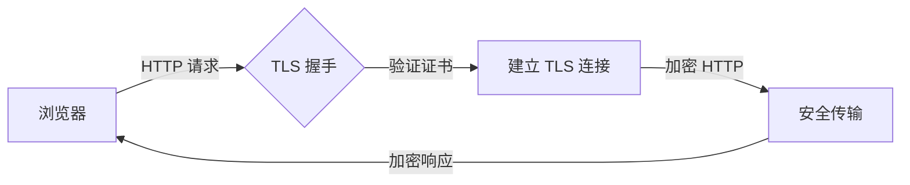
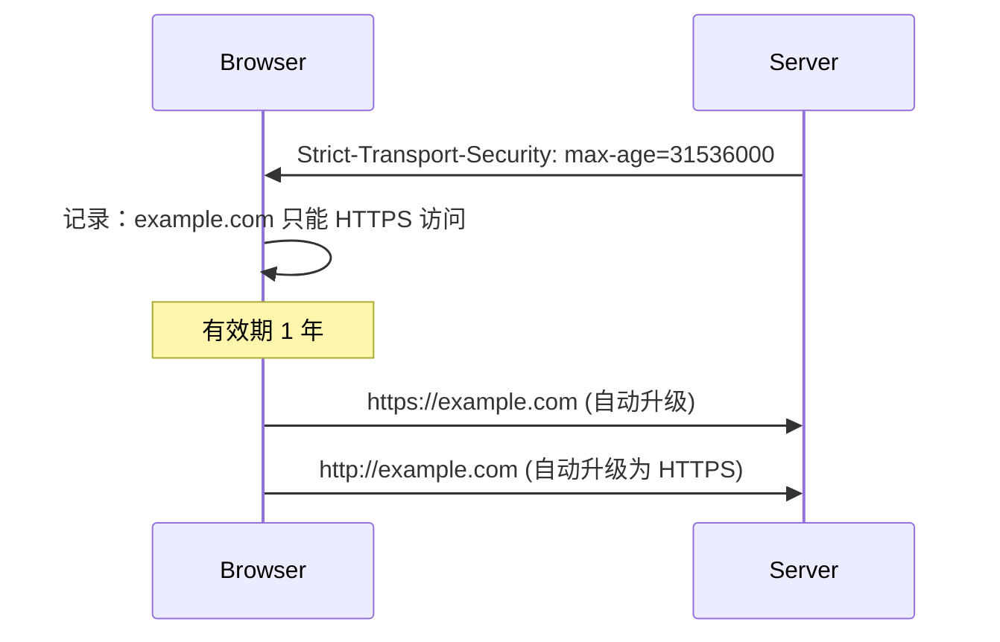

# HTTPS 证书配置与 HSTS

你部署了 HTTPS 网站，用 SSL Labs 检测评分却是 B。问题出在哪？

仔细一看：服务器支持 TLS 1.0，证书链不完整，HSTS 头缺失……这些看似微小的配置问题，可能让你的 HTTPS 形同虚设。本篇将手把手教你配置生产级别的 HTTPS，包括证书申请、HSTS、证书透明等核心知识点。

## HTTPS 工作原理

HTTPS = HTTP + TLS。它的核心价值：

- **保密性**：传输内容加密，防止窃听
- **完整性**：MAC 校验，防止篡改
- **认证**：证书验证服务器身份，防止伪造
- **抗抵赖**：数字签名，不可否认



## 证书类型

### 按域名数量分类

| 类型 | 说明 | 适用场景 |
|---|---|---|
| 单域名证书 | 仅保护一个域名 | 个人站点 |
| 通配符证书 | 保护一个域名及其所有子域名 `*.example.com` | 企业内部服务 |
| 多域名证书（SAN） | 保护多个不同域名 | SaaS 服务 |

### 按验证级别分类

| 级别 | 验证内容 | 颁发速度 | 适用场景 |
|---|---|---|---|
| DV（域名验证） | 仅验证域名控制权 | 分钟级 | 个人博客、内部服务 |
| OV（组织验证） | 验证域名 + 组织信息 | 1-3 天 | 企业官网 |
| EV（扩展验证） | 严格验证企业身份 | 3-7 天 | 金融、电商（浏览器显示绿色地址栏） |

:::info
EV 证书从 2020 年起逐步被浏览器废弃绿色地址栏显示，国内 CA 已停止签发 EV 证书。
:::

## 证书申请与配置

### 使用 Let's Encrypt（免费）

Let's Encrypt 是最大的免费 CA，由 Mozilla、Google、Cisco 维护。

```bash
# 安装 Certbot
sudo apt install certbot python3-certbot-nginx

# 申请证书（自动配置 Nginx）
sudo certbot --nginx -d example.com -d www.example.com

# 手动验证并获取证书
sudo certbot certonly --webroot -w /var/www/html -d example.com

# 证书位置
# /etc/letsencrypt/live/example.com/fullchain.pem  (证书链)
# /etc/letsencrypt/live/example.com/privkey.pem    (私钥)
```

### 自动续期

Let's Encrypt 证书有效期 90 天，需要自动续期：

```bash
# 测试续期
sudo certbot renew --dry-run

# 添加到 crontab
crontab -e
# 0 0 * * * certbot renew --quiet --deploy-hook "systemctl reload nginx"
```

### Java KeyStore 配置

```bash
# 将 PEM 转换为 PKCS12
openssl pkcs12 -export \
    -in fullchain.pem \
    -inkey privkey.pem \
    -out keystore.p12 \
    -name tomcat \
    -CAfile chain.pem \
    -canode "Let's Encrypt Authority X3" \
    -password pass:changeit

# 转换为 JKS
keytool -importkeystore \
    -srckeystore keystore.p12 \
    -srcstoretype PKCS12 \
    -srcstorepass changeit \
    -destkeystore keystore.jks \
    -deststoretype JKS \
    -deststorepass changeit
```

```yaml
# Spring Boot 配置
server:
  ssl:
    enabled: true
    key-store: classpath:keystore.jks
    key-store-password: changeit
    key-store-type: JKS
    protocol: TLS
    enabled-protocols: TLSv1.3
    ciphers: TLS_AES_256_GCM_SHA384,TLS_CHACHA20_POLY1305_SHA256,TLS_AES_128_GCM_SHA256
```

## HSTS（强制安全传输）

HTTP Strict Transport Security（HSTS）告诉浏览器：以后只能通过 HTTPS 访问这个网站。

### 工作原理



### 配置示例

```nginx
# Nginx 配置
add_header Strict-Transport-Security
    "max-age=31536000; includeSubDomains; preload" always;
```

```apache
# Apache 配置
Header always set Strict-Transport-Security
    "max-age=31536000; includeSubDomains; preload"
```

```java
// Spring Boot 配置
@Component
public class HstsFilter implements Filter {
    @Override
    public void doFilter(ServletRequest req, ServletResponse res, FilterChain chain)
            throws IOException, ServletException {
        HttpServletResponse response = (HttpServletResponse) res;
        response.setHeader("Strict-Transport-Security",
            "max-age=31536000; includeSubDomains; preload");
        chain.doFilter(req, res);
    }
}
```

### HSTS 参数详解

| 参数 | 说明 | 推荐值 |
|---|---|---|
| `max-age` | HSTS 策略有效期 | 31536000（1 年）以上 |
| `includeSubDomains` | 子域名也强制 HTTPS | 确认所有子域名都支持 HTTPS |
| `preload` | 申请加入浏览器内置列表 | 推荐添加 |

:::warning
启用 `includeSubDomains` 前，确保所有子域名都支持 HTTPS。如果某个子域名不支持 HTTPS，会导致访问失败。
:::

### HSTS Preload

HSTS Preload List 是浏览器内置的域名列表，网站会被强制 HTTPS 访问，甚至首次访问前就已生效。

申请地址：https://hstspreload.org

```bash
# 检查域名状态
curl https://hstspreload.org/api/v2/preload?domain=example.com
```

```json
{
  "status": "ready",
  "errors": [],
  "warnings": [],
  "includeSubDomains": true,
  "preload": true
}
```

## 证书透明（Certificate Transparency）

Certificate Transparency（CT）要求 CA 公开签发的每一张证书，防止错误颁发或恶意证书。

### CT 日志服务器

主流 CT 日志服务器：

| 日志服务器 | 运营者 |
|---|---|
| crt.sh | Sectigo |
| Google Argon | Google |
| Cloudflare NSS | Cloudflare |
| DigiCert Yeti | DigiCert |

```bash
# 查询证书
curl -s "https://crt.sh/?q=example.com&output=json" | jq .
```

### CT 策略配置

```nginx
# 在证书中包含至少 2 个 CT 日志服务器签名
ssl_ct on;
ssl_ct_static_scts /etc/nginx/scts;
```

## 证书吊销检查

当证书私钥泄露时，需要吊销证书。

### CRL（证书吊销列表）

```bash
# 获取并查看 CRL
openssl crl -in ca.crl -noout -text

# Nginx 配置
ssl_crl /etc/nginx/ssl/ca.crl;
```

### OCSP（在线证书状态协议）

```nginx
# 启用 OCSP Stapling
ssl_stapling on;
ssl_stapling_verify on;
resolver 8.8.8.8 8.8.4.4 valid=300s;
ssl_trusted_certificate /etc/nginx/ssl/ca-bundle.crt;
```

## 常见配置问题

### 问题一：证书链不完整

```bash
# 检测
openssl s_client -connect example.com:443 -showcerts

# 错误示例
SSL-Session:
    Protocol  : TLSv1.3
    Cipher    : TLS_AES_256_GCM_SHA384
    Verify return code: 19 (self signed certificate in certificate chain)
```

解决方案：服务器需要发送完整的证书链（中间证书）。

### 问题二：混合内容（Mixed Content）

HTTPS 页面加载了 HTTP 资源，浏览器会报警告。

```html
<!-- 错误 -->
<script src="http://cdn.example.com/jquery.js"></script>

<!-- 正确 -->
<script src="https://cdn.example.com/jquery.js"></script>
<!-- 或使用协议相对 URL -->
<script src="//cdn.example.com/jquery.js"></script>
```

### 问题三：HTTP 跳转循环

HSTS 配置不当可能导致 HTTPS 循环跳转。

```
# 正确流程
http://example.com → https://example.com

# 错误配置导致循环
https://example.com → https://www.example.com → https://example.com → ...
```

## 安全配置检查清单

| 配置项 | 要求 |
|---|---|
| TLS 版本 | 仅 TLS 1.2 和 1.3 |
| 加密套件 | AES-128-GCM 以上，禁用 3DES、RC4 |
| 前向保密 | 使用 ECDHE 或 DHE |
| HSTS | `max-age >= 31536000` |
| HSTS Preload | 推荐申请 |
| 证书链 | 完整无缺失 |
| OCSP Stapling | 启用 |
| Mixed Content | 无 HTTP 资源 |

## 面试追问方向

- HTTPS 握手过程？用了哪些密码学原语？
- 什么是 HSTS？解决了什么问题？
- HSTS 的 `max-age` 设置过长会有什么风险？
- 什么是证书透明（CT）？
- 证书链不完整会导致什么问题？
- Let's Encrypt 的工作原理？

> HTTPS 配置无小事。每一个配置项都关乎安全，面试中考察的正是这些细节。
