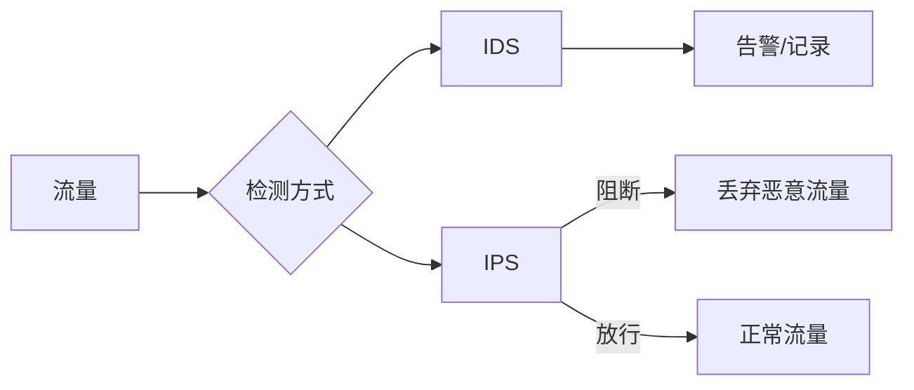

# IDS 与 IPS

你的防火墙日志显示「允许」了某个连接，但第二天发现服务器被入侵了。防火墙说「我只检查头部，流量是合法的」。这时候，你需要的是 IDS——**不仅仅检查「谁能进来」，更要检查「进来后做了什么」**。

IDS（Intrusion Detection System）和 IPS（Intrusion Prevention System）是网络安全的重要组成部分。它们通过深度检测网络流量，发现隐藏在正常流量中的攻击行为。

## IDS vs IPS



| 对比项 | IDS | IPS |
|---|---|---|
| 工作模式 | 旁路监听 | 串接拦截 |
| 对性能影响 | 较小 | 可能影响延迟 |
| 误杀风险 | 低（只告警） | 高（会阻断） |
| 响应速度 | 事后响应 | 实时阻断 |
| 适用场景 | 观察型部署 | 积极防御 |

## 检测方法

### 签名检测（Signature-based）

基于已知攻击特征库（规则库）进行匹配：

```txt
# Snort 规则示例
# 检测 SYN Flood
alert tcp any any -> $HOME_NET 80 (msg:"SYN Flood Detected"; \
    flags:S; \
    threshold:type threshold, track by_src, count 100, seconds 1; \
    sid:1000001; rev:1;)

# 检测 SQL 注入
alert tcp $EXTERNAL_NET any -> $HOME_NET $HTTP_PORTS (msg:"SQL Injection"; \
    content:"SELECT"; nocase; \
    content:"FROM"; nocase; \
    content:"WHERE"; nocase; \
    pcre:"/(union|select|insert|update|delete).*from/i"; \
    sid:1000002; rev:1;)

# 检测 webshell 上传
alert tcp $EXTERNAL_NET any -> $HOME_NET 80 (msg:"Webshell Upload Attempt"; \
    content:"POST"; \
    content:"eval"; nocase; \
    content:"base64_decode"; nocase; \
    sid:1000003; rev:1;)
```

### 异常检测（Anomaly-based）

基于正常流量建立基线，检测偏离行为：

| 检测类型 | 方法 | 优点 | 缺点 |
|---|---|---|---|
| 统计异常 | 建立流量基线 | 可检测未知攻击 | 误报率高 |
| 协议异常 | 违反协议规范 | 通用性强 | 依赖协议准确性 |
| 机器学习 | 训练模型识别 | 可发现新攻击 | 需要大量样本 |

```python
# 简单的流量异常检测示例
import numpy as np
from collections import deque

class TrafficAnomalyDetector:
    def __init__(self, window_size=60, threshold=3.0):
        self.window_size = window_size
        self.threshold = threshold
        self.packet_counts = deque(maxlen=window_size)
        self.bytes_counts = deque(maxlen=window_size)

    def add_sample(self, packet_count, byte_count):
        self.packet_counts.append(packet_count)
        self.bytes_counts.append(byte_count)

    def detect(self):
        if len(self.packet_counts) < self.window_size:
            return False, "数据不足"

        packet_mean = np.mean(self.packet_counts)
        packet_std = np.std(self.packet_counts)
        bytes_mean = np.mean(self.bytes_counts)
        bytes_std = np.std(self.bytes_counts)

        current_packets = self.packet_counts[-1]
        current_bytes = self.bytes_counts[-1]

        # 检测包数量异常（可能的 DoS）
        if packet_mean > 0 and \
           (current_packets - packet_mean) / packet_std > self.threshold:
            return True, f"包数量异常: 当前 {current_packets}, " \
                        f"均值 {packet_mean:.0f}, " \
                        f"标准差 {packet_std:.0f}"

        # 检测流量突增
        if bytes_mean > 0 and \
           (current_bytes - bytes_mean) / bytes_std > self.threshold:
            return True, f"流量突增: 当前 {current_bytes} bytes, " \
                        f"均值 {bytes_mean:.0f}"

        return False, "正常"
```

## Snort 部署与配置

### 安装

```bash
# Ubuntu/Debian
sudo apt install snort

# CentOS/RHEL
sudo yum install epel-release
sudo yum install snort

# 配置文件位置
# /etc/snort/snort.conf
```

### 配置 Snort

```bash
# /etc/snort/snort.conf

# 网络变量
ipvar HOME_NET 192.168.1.0/24
ipvar EXTERNAL_NET !$HOME_NET

# 服务端口
portvar HTTP_PORTS [80,8080,443,8443]

# 规则路径
var RULE_PATH /etc/snort/rules
include $RULE_PATH/local.rules
include $RULE_PATH/community.rules
```

### 自定义规则

```bash
# /etc/snort/rules/local.rules

# 检测 ICMP ping sweep
alert icmp $EXTERNAL_NET any -> $HOME_NET any \
    (msg:"ICMP Ping Sweep"; \
    itype:8; \
    sid:1000001; rev:1;)

# 检测 SSH 暴力破解
alert tcp $EXTERNAL_NET any -> $HOME_NET 22 \
    (msg:"SSH Brute Force Attempt"; \
    flags:S; \
    threshold:type threshold, track by_src, count 5, seconds 60; \
    sid:1000002; rev:1;)

# 检测敏感文件访问
alert tcp $HOME_NET any -> $EXTERNAL_NET any \
    (msg:"Sensitive File Accessed"; \
    content:"passwd"; \
    content:"shadow"; \
    sid:1000003; rev:1;)

# 检测恶意软件通信
alert tcp $HOME_NET any -> $EXTERNAL_NET 80 \
    (msg:"Possible Malware C2 Communication"; \
    content:"GET /"; \
    content:"User-Agent: Mozilla/4.0"; \
    content!"Accept"; \
    sid:1000004; rev:1;)
```

### 运行模式

```bash
# 监听模式（IDS）
sudo snort -A console -i eth0 -c /etc/snort/snort.conf

# 后台运行
sudo systemctl start snort

# 测试规则
sudo snort -T -c /etc/snort/snort.conf

# 抓包分析
sudo snort -r /var/log/snort/snort.log.* -X

# 导出告警
sudo snort -c /etc/snort/snort.conf -r capture.pcap -A csv -l alert.csv
```

### Barnyard2 日志集中

```bash
# 安装 Barnyard2
sudo apt install barnyard2

# 配置 /etc/snort/barnyard2.conf
config hostname: snort-sensor
config interface: eth0
output alert_fast:

# MySQL 数据库输出
output database: log, mysql, user=snort password=snort dbname=snort host=localhost

# 启动
sudo systemctl start barnyard2
```

## Suricata（现代 IDS/IPS）

### 优势

- 多线程，性能更好
- 原生支持 NFQUEUE（IPS 模式）
- 自动更新规则

```bash
# 安装
sudo apt install suricata

# /etc/suricata/suricata.yaml
vars:
  address-groups:
    HOME_NET: "[192.168.1.0/24]"
    EXTERNAL_NET: "!$HOME_NET"

# 规则更新
sudo suricata-update
sudo suricata-update list-sources

# 启用 ET Open 规则
sudo suricata-update enable-source et/open

# 启动
sudo systemctl start suricata

# 测试
sudo suricata -T -c /etc/suricata/suricata.yaml -i eth0
```

### NFQUEUE IPS 模式

```bash
# 启用 NFQUEUE
iptables -I INPUT -j NFQUEUE
iptables -I OUTPUT -j NFQUEUE

# 或仅检测特定端口
iptables -I INPUT -p tcp --dport 80 -j NFQUEUE

# 启动 Suricata IPS 模式
sudo suricata -c /etc/suricata/suricata.yaml -q 0

# 恢复
iptables -F
```

## Zeek（网络分析框架）

### 安装与使用

```bash
# 安装
sudo apt install zeek

# 配置 /etc/zeek/node.cfg
[logger]
type=logger
host=localhost

[manager]
type=manager
host=localhost

[proxy]
type=proxy
host=localhost

[worker]
type=worker
host=localhost
interface=eth0

# 启动
sudo zeekctl deploy

# 查看日志
ls /var/log/zeek/
```

### 自定义脚本

```txt
# detect-bruteforce.zeek
@load base/utils/urls

event ssh_auth_successful(c: connection, user: string)
{
    print fmt("SSH 登录成功: %s -> %s, 用户: %s",
        c$id$orig_h, c$id$resp_h, user);
}

event ssh_auth_failed(c: connection, user: string)
{
    print fmt("SSH 登录失败: %s -> %s, 用户: %s",
        c$id$orig_h, c$id$resp_h, user);
}

# 统计 SSH 暴力破解
global ssh_failures: table[addr] of count &default=0;

event ssh_auth_failed(c: connection, user: string)
{
    local src = c$id$orig_h;
    ssh_failures[src] += 1;

    if (ssh_failures[src] > 10) {
        print fmt("警告: 检测到 SSH 暴力破解尝试: %s (失败 %d 次)",
            src, ssh_failures[src]);
    }
}
```

## 企业安全运营

### SIEM 集成

```yaml
# Filebeat 配置收集 Snort 日志
filebeat.inputs:
  - type: log
    enabled: true
    paths:
      - /var/log/snort/alert
    json.keys_under_root: true

output.elasticsearch:
  hosts: ["elasticsearch:9200"]
  index: "snort-alerts-%{+yyyy.MM.dd}"

# 或输出到 Logstash
output.logstash:
  hosts: ["logstash:5044"]
```

### 安全编排自动化（SOAR）

```python
# 示例：自动封禁攻击 IP
import requests
from datetime import datetime

class SecurityOrchestrator:
    def __init__(self, siem_url, firewall_api):
        self.siem = siem_url
        self.firewall = firewall_api

    def handle_alert(self, alert):
        """处理 Snort 告警"""
        if alert['severity'] == 1:  # 高危
            # 自动封禁
            self.block_ip(alert['source_ip'])
            # 发送通知
            self.notify_security_team(alert)
            # 创建工单
            self.create_ticket(alert)

    def block_ip(self, ip):
        """在防火墙上封禁 IP"""
        # Cisco ASA API 调用
        url = f"{self.firewall}/api/block"
        requests.post(url, json={"ip": ip, "duration": "24h"})

    def notify_security_team(self, alert):
        """发送告警通知"""
        message = f"""🚨 安全告警
时间: {datetime.now()}
来源: {alert['source_ip']}
目标: {alert['dest_ip']}
告警: {alert['msg']}
严重度: {alert['severity']}"""
        # 发送到 Slack/企业微信
        requests.post(SLACK_WEBHOOK, json={"text": message})
```

## 面试追问方向

- IDS 和 IPS 的区别？各自优缺点？
- 签名检测和异常检测的区别？
- 什么是误报和漏报？如何平衡？
- Snort 的工作流程是什么？
- 如何检测加密流量中的攻击？
- 什么是 APT（高级持续性威胁）？

> IDS/IPS 是安全运营的眼睛和盾牌。没有监控的防御是不完整的，没有自动化的响应是低效的。
