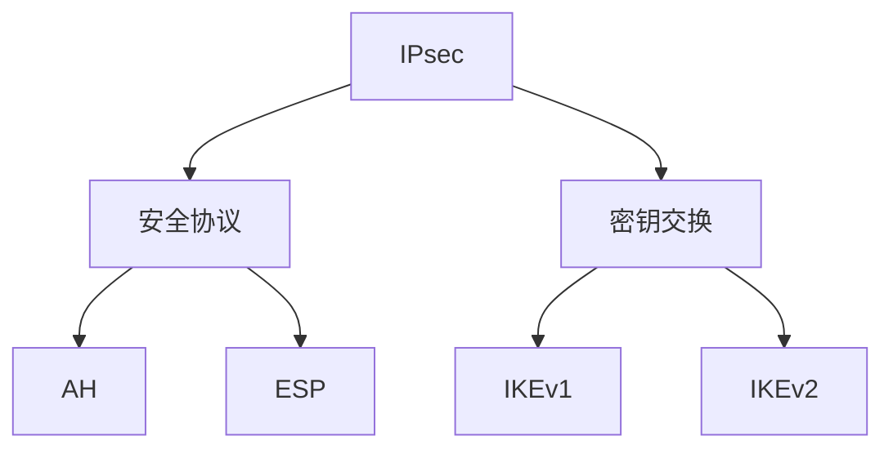
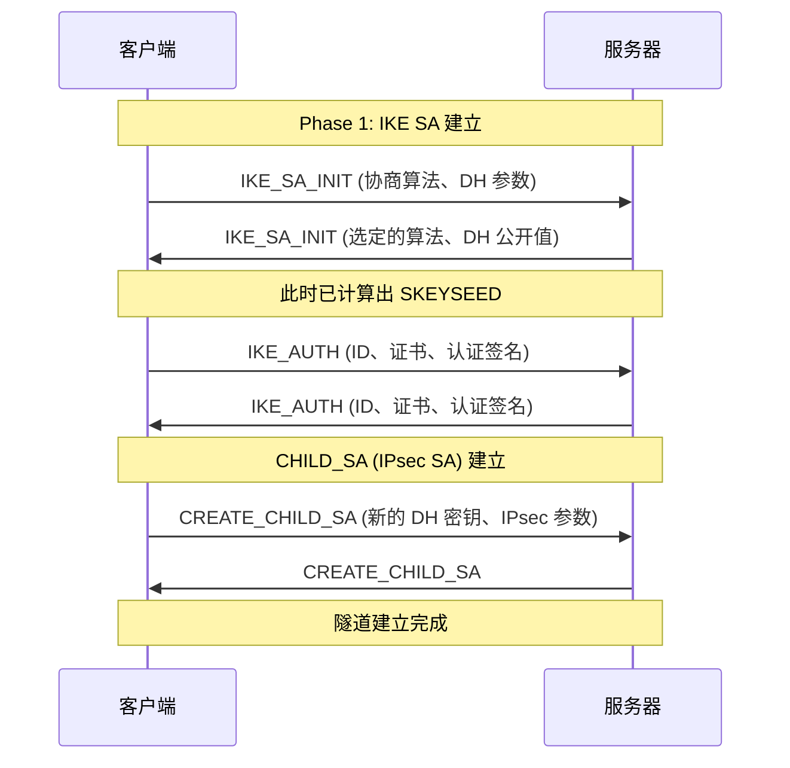
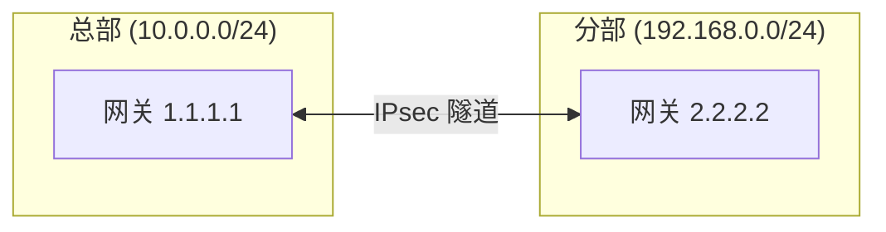

# IPsec VPN

你的团队需要远程访问公司内网，传输敏感数据。同事说「用 VPN」，但 IPsec 和 SSL VPN 有什么区别？隧道模式和传输模式怎么选？

IPsec 是最经典的 VPN 协议，被广泛应用于企业网络互联、站点间加密通信。本篇将深入解析 IPsec 的协议框架、工作模式，以及在实际场景中的配置。

## IPsec 协议框架

### 协议组成



| 协议 | 作用 | 提供功能 |
|---|---|---|
| AH | Authentication Header | 完整性校验、源认证（不加密） |
| ESP | Encapsulating Security Payload | 加密、完整性校验、源认证 |
| IKE | Internet Key Exchange | 密钥协商、SA 建立 |

### 安全关联（SA）

SA（Security Association）是 IPsec 的核心概念，定义单向的安全参数：

- 加密算法和密钥
- 认证算法和密钥
- 序列号
- 协议模式（传输/隧道）

```bash
# 查看当前 SA
ip xfrm state

# 查看安全策略
ip xfrm policy
```

## 两种工作模式

### 传输模式（Transport Mode）

传输模式只加密数据载荷，保留原始 IP 头。适用于主机到主机的通信：

```
原始 IP 包:
┌──────────┬─────────────┬───────┐
│ IP 头    │ TCP 头      │ 数据  │
└──────────┴─────────────┴───────┘

传输模式 ESP:
┌──────────┬─────────────┬─────────────┬──────────┬────────┐
│ 原IP头   │ ESP 头      │ 加密数据    │ ESP 尾   │ ESP 认证│
└──────────┴─────────────┴─────────────┴──────────┴────────┘
                           ↑ 加密              ↑ 认证
```

### 隧道模式（Tunnel Mode）

隧道模式将整个原始 IP 包加密，添加新的 IP 头。适用于网关到网关、网关到主机：

```
原始 IP 包:
┌──────────┬─────────────┬───────┐
│ IP 头    │ TCP 头      │ 数据  │
└──────────┴─────────────┴───────┘

隧道模式 ESP:
┌──────────┬─────────────┬─────────────┬──────────┬────────┐
│ 新IP头   │ ESP 头      │ 原IP包(加密) │ ESP 尾   │ ESP 认证│
└──────────┴─────────────┴─────────────┴──────────┴────────┘
```

### 对比

| 特性 | 传输模式 | 隧道模式 |
|---|---|---|
| 原 IP 头 | 保留 | 加密 |
| 应用场景 | 主机间通信 | 网关间、远程接入 |
| 性能 | 更好（开销小） | 稍差（完整加密） |
| 安全性 | 较低（IP 可见） | 更高（IP 也加密） |

## AH 协议

### AH 头部结构

```
 0                   1                   2                   3
 0 1 2 3 4 5 6 7 8 9 0 1 2 3 4 5 6 7 8 9 0 1 2 3 4 5 6 7 8 9 0 1
+-+-+-+-+-+-+-+-+-+-+-+-+-+-+-+-+-+-+-+-+-+-+-+-+-+-+-+-+-+-+-+-+
| Next Header   |   Payload Len |     Reserved      |  SPI      |
+-+-+-+-+-+-+-+-+-+-+-+-+-+-+-+-+-+-+-+-+-+-+-+-+-+-+-+-+-+-+-+-+
|                                                               |
|                      Sequence Number                          |
|                                                               |
+-+-+-+-+-+-+-+-+-+-+-+-+-+-+-+-+-+-+-+-+-+-+-+-+-+-+-+-+-+-+-+-+
|                                                               |
|                                                               |
|                    Authentication Data                        |
|                    (Variable Length)                          |
|                                                               |
|                                                               |
+-+-+-+-+-+-+-+-+-+-+-+-+-+-+-+-+-+-+-+-+-+-+-+-+-+-+-+-+-+-+-+-+
```

### AH 计算范围

AH 对以下部分计算 HMAC：

- 新的 IP 头（可变字段置零）
- AH 头（认证数据字段置零）
- 传输层数据

:::warning
AH 不提供加密，只提供完整性保护。如果只需要认证不需要加密，可以使用 AH。
:::

## ESP 协议

### ESP 头部结构

```
ESP 头:
  SPI (4 字节) + Sequence Number (4 字节)

ESP 尾:
  Padding (0-255 字节) + Pad Length (1 字节) + Next Header (1 字节)

ESP 认证:
  ICV (可变长度)
```

### ESP 加密范围

- 原 IP 头（隧道模式）
- ESP 头后面的所有数据
- ESP 尾

### ESP 认证范围

- ESP 头
- 加密的数据
- ESP 尾
- SPI 和 Sequence Number

## IKEv2 密钥交换

### IKEv2 握手过程



### 密钥层次

```mermaid
flowchart TD
    A[DH 交换] --> B[SKEYSEED]
    B --> C[SKEYSEED = prf(Ni | Nr, g^ir)]
    C --> D[密钥派生]
    D --> E[SK_d - 用于派生新的密钥材料]
    D --> F[SK_ai, SK_ar - IKE 认证密钥]
    D --> G[SK_ei, SK_er - IKE 加密密钥]
    D --> H[SK_pi, SK_pr - 认证有效载荷密钥]
    E --> I[CHILD_SA 密钥]
```

### 完美前向保密（PFS）

每次 CHILD_SA 重新协商时，使用新的 DH 交换：

```bash
# strongSwan 配置启用 PFS
# /etc/ipsec.conf
conn ipsec-ikev2
    also=ipsec-settings
    keyexchange=ikev2
    rekey=no
    # 启用 PFS
    keylife=8h
    margintime=10m
    keyingtries=3

conn ipsec-settings
    auto=add
    left=%any
    right=server.example.com
    rightsubnet=10.0.0.0/24
    # DH 组 14 (2048-bit MODP) 或更高
    esp=aes256-sha256-modp2048!
```

## Linux IPsec 配置

### strongSwan 安装与配置

```bash
# 安装
sudo apt install strongswan strongswan-pki libcharon-extra-plugins

# 生成证书
mkdir -p ~/pki/{cacerts,certs,private}
chmod 700 ~/pki

# CA 证书
strongson-pki --genkey --type ca --outfile ~/pki/private/ca-key.pem
strongson-pki --self --in ~/pki/private/ca-key.pem \
    --type ca --dn "CN=VPN Root CA" \
    --outfile ~/pki/cacerts/ca-cert.pem
```

### IPsec 配置文件

```bash
# /etc/ipsec.conf
config setup
    charondebug="ike 2, knl 2, cfg 2, net 2, esp 2, dmn 2, mgr 2"
    uniqueids=never

# IKEv2 隧道
conn %default
    keyexchange=ikev2
    ike=aes256-sha256-modp2048!
    esp=aes256-sha256!
    fragmentation=yes
    forceencaps=yes

# 客户端配置（Road Warrior）
conn ikev2-vpn
    auto=add
    type=tunnel
    left=%any
    leftid=@vpn.example.com
    leftcert=server-cert.pem
    leftsendcert=always
    right=%any
    rightauth=pubkey
    rightid=%any
    rightca=%same
    auto=route
    # EAP-MSCHAPv2 认证
    rightauth=eap-mschapv2
    eap_identity=%identity
```

### 验证连接

```bash
# 启动 IPsec
sudo systemctl start strongswan

# 检查状态
sudo ipsec status

# 查看详细日志
sudo ipsec statusall

# 测试连通性
ping -I 10.0.0.2 192.168.1.1
```

## 企业 IPsec 方案

### 站点到站点 VPN



```bash
# 总部网关配置 (Cisco IOS)
crypto isakmp policy 10
 encr aes 256
 hash sha256
 authentication pre-share
 group 14
 lifetime 86400
!
crypto ipsec transform-set TUNNEL esp-aes 256 esp-sha256-hmac
 mode tunnel
!
crypto map VPN-MAP 10 ipsec-isakmp
 set peer 2.2.2.2
 set transform-set TUNNEL
 match address VPN-TRAFFIC
!
interface GigabitEthernet0/0
 crypto map VPN-MAP
!
ip access-list extended VPN-TRAFFIC
 permit ip 10.0.0.0 0.0.0.255 192.168.0.0 0.0.0.255
```

### 远程接入 VPN

```bash
# Windows 客户端配置 (ikev2.bat)
powershell -Command "
    Add-VpnConnection -Name 'Company VPN' `
        -ServerAddress 'vpn.example.com' `
        -TunnelType IKEv2 `
        -AuthenticationMethod MachineCertificate `
        -EncryptionLevel Required `
        -RememberCredentials
"
```

## 面试追问方向

- IPsec 的传输模式和隧道模式的区别？
- AH 和 ESP 的区别？各自提供什么保护？
- IKEv2 和 IKEv1 的区别？
- 什么是完美前向保密（PFS）？
- IPsec 的 NAT 穿透问题？
- ESP 的加密和认证范围是什么？

> IPsec 是网络层安全的基石。理解它的协议栈和密钥交换机制，才能构建安全可靠的 VPN 方案。
