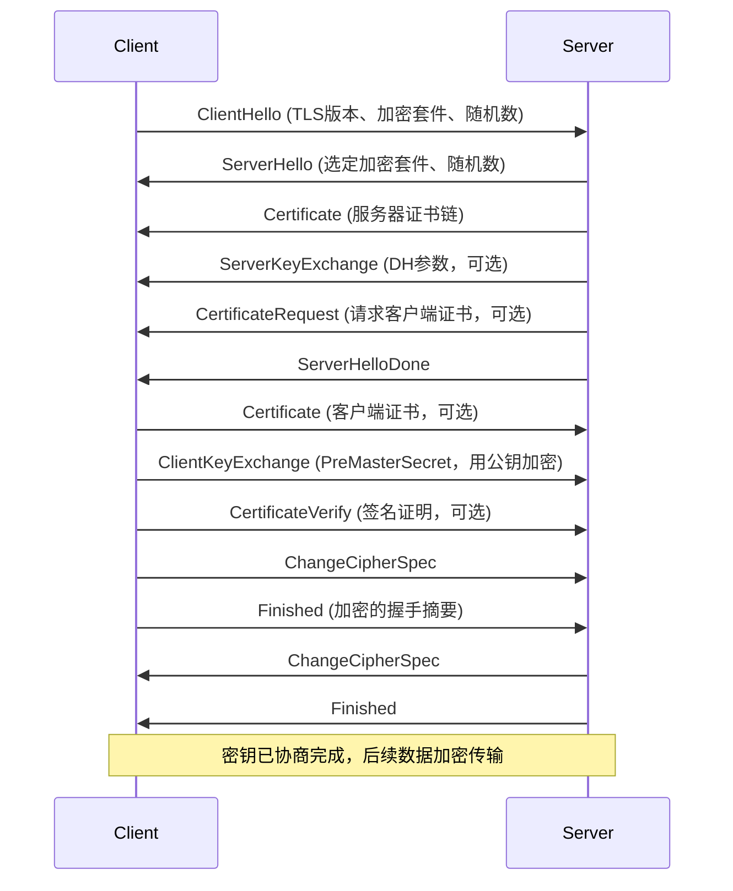
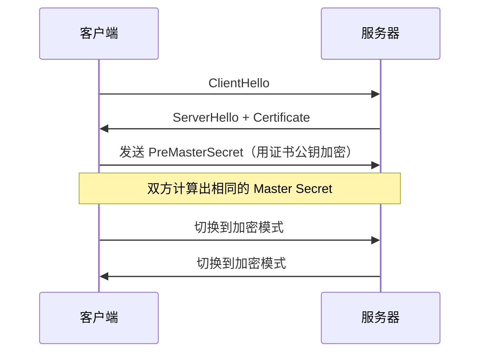
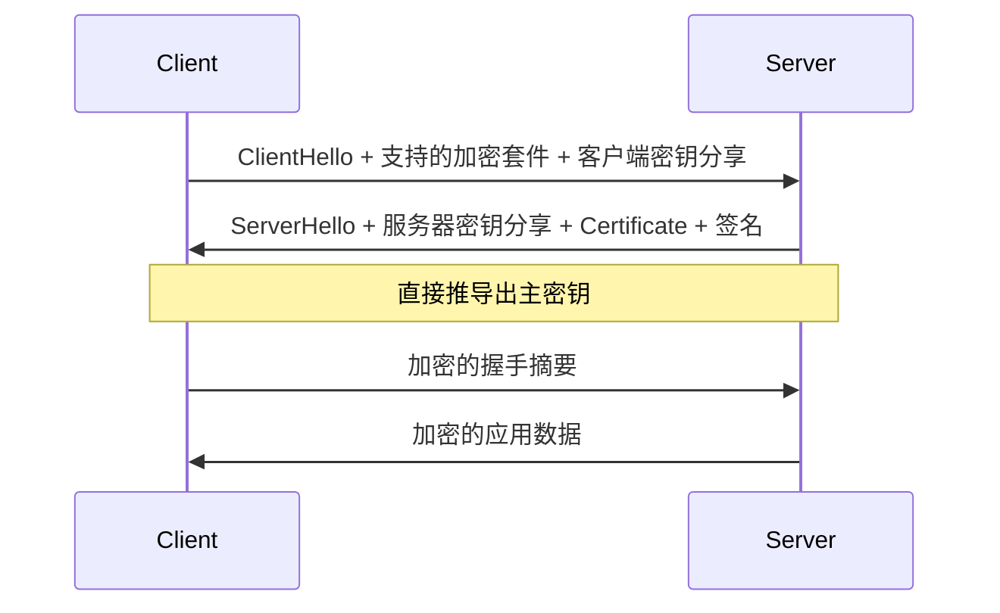
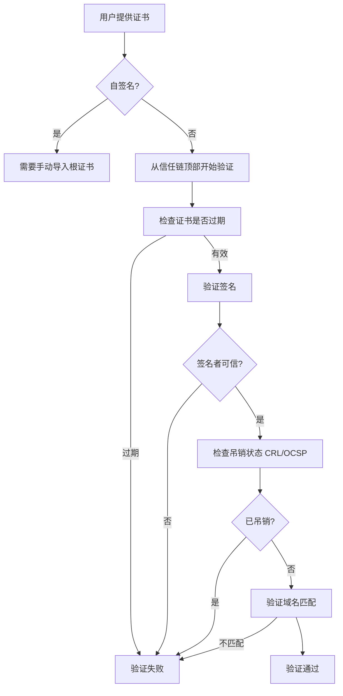

# TLS/SSL 协议详解

凌晨两点，你刚部署完新网站，用 curl 测试了一下：

```bash
curl https://example.com
```

返回正常。但当你用 Wireshark 抓包时，发现明文数据清晰可见。问题出在哪？

答案可能是你配置了 HTTPS，但使用了不安全的 TLS 版本，或者禁用了证书校验。在生产环境中，TLS 配置的每一个细节都关乎安全。本篇将深入解析 TLS/SSL 协议的原理、握手过程和最佳配置。

## SSL/TLS 的历史

SSL（Secure Sockets Layer）由 Netscape 公司于 1994 年发明，经历了 1.0、2.0、3.0 三个版本。由于 SSL 3.0 存在严重漏洞，已于 2015 年被废弃。

TLS（Transport Layer Security）是 SSL 的标准化版本：

| 版本 | 发布时间 | 状态 |
|---|---|---|
| TLS 1.0 | 1999 | 已废弃（PCI DSS 要求禁用） |
| TLS 1.1 | 2006 | 已废弃 |
| TLS 1.2 | 2008 | 仍广泛使用 |
| TLS 1.3 | 2018 | 推荐使用 |

:::tip
TLS 1.3 相比 1.2 有重大改进：握手从 2-RTT 降为 1-RTT，废除了不安全的加密算法，被主流浏览器强制推广。
:::

## TLS 协议分层

TLS 协议分为两层：

```
┌─────────────────────────────────────┐
│           TLS Application Data      │  应用层数据
├─────────────────────────────────────┤
│           TLS Handshake Protocol     │  握手协议
├─────────────────────────────────────┤
│           TLS Change Cipher Spec     │  密码规格变更
├─────────────────────────────────────┤
│           TLS Alert Protocol         │  警报协议
├─────────────────────────────────────┤
│           TLS Record Protocol        │  记录层协议
└─────────────────────────────────────┘
```

**记录层（Record Layer）**负责数据的分片、压缩、加密和 MAC 计算。

**握手协议（Handshake Protocol）**负责在传输数据前协商加密参数。

## TLS 握手过程

### TLS 1.2 握手（RSA 密钥交换）

TLS 1.2 使用 RSA 密钥交换的完整握手过程：



**简化流程**：



### TLS 1.3 握手优化

TLS 1.3 将握手优化为 1-RTT（一次往返）：



TLS 1.3 的核心改进：

1. **前向保密（Forward Secrecy）**：默认使用 ECDHE，每次会话使用不同的临时密钥
2. **废弃不安全算法**：移除 RSA 密钥交换、3DES、RC4、MD5、SHA-1 等
3. **简化加密套件**：仅保留 AES-GCM、ChaCha20-Poly1305 等安全算法
4. **0-RTT 连接**：允许在首次握手中发送加密数据（存在重放攻击风险）

## 加密套件

加密套件（Cipher Suite）定义了 TLS 连接使用的算法组合。格式为：

```
TLS_密钥交换_签名算法_加密算法_摘要算法_WITH_固定值
```

常见的 TLS 1.2 加密套件：

| 加密套件 | 说明 |
|---|---|
| `TLS_ECDHE_RSA_WITH_AES_128_GCM_SHA256` | ECDHE 密钥交换，RSA 签名，AES-128-GCM 加密 |
| `TLS_ECDHE_RSA_WITH_AES_256_GCM_SHA384` | 更强的 AES-256 |
| `TLS_ECDHE_ECDSA_WITH_AES_256_GCM_SHA384` | ECDSA 签名（ECC 证书） |

TLS 1.3 加密套件简化：

| 加密套件 | 说明 |
|---|---|
| `TLS_AES_128_GCM_SHA256` | AES-128-GCM |
| `TLS_AES_256_GCM_SHA384` | AES-256-GCM |
| `TLS_CHACHA20_POLY1305_SHA256` | ChaCha20-Poly1305 |

:::warning
TLS 1.2 中存在「降级攻击」风险：攻击者可以迫使双方使用较弱的加密套件。TLS 1.3 通过废弃 RSA 密钥交换从根本上解决了这个问题。
:::

## 证书与 PKI

### 证书结构

X.509 证书包含以下关键字段：

```bash
# 查看证书信息
openssl x509 -in certificate.pem -text -noout
```

```yaml
Certificate:
    Data:
        Version: v3
        Serial Number: 04:B1:A5:...
        Signature Algorithm: sha256WithRSAEncryption
        Issuer: Let's Encrypt Authority X3
        Validity:
            Not Before: 2024-01-01
            Not After: 2024-04-01
        Subject: CN=example.com
        Subject Public Key Info:
            Public Key Algorithm: RSA
            RSA Public Key: 2048 bits
        X509v3 extensions:
            X509v3 Subject Alternative Name:
                DNS:example.com
                DNS:www.example.com
            X509v3 Basic Constraints:
                CA:FALSE
```

### 证书验证流程



### 中间证书

服务器必须发送完整的证书链：

```bash
# 检查证书链完整性
openssl s_client -connect example.com:443 -showcerts
```

```
0 s:CN = example.com
  i:C = US, O = Let's Encrypt, CN = R3
1 s:C = US, O = Let's Encrypt, CN = R3
  i:C = US, O = Internet Security Research Group, CN = ISRG Root X1
2 s:C = US, O = ISRG, CN = ISRG Root X1
  i:C = US, O = Identrust, CN = DST Root CA X3
```

## Java 代码示例

```java
import javax.net.ssl.*;
import java.io.InputStream;
import java.security.cert.X509Certificate;

public class TLSClientExample {

    public static void main(String[] args) throws Exception {
        // 创建信任管理器
        TrustManagerFactory tmf = TrustManagerFactory.getInstance(
            TrustManagerFactory.getDefaultAlgorithm()
        );
        tmf.init((java.security.KeyStore) null);

        // 创建 SSLContext
        SSLContext sslContext = SSLContext.getInstance("TLSv1.3");
        sslContext.init(null, tmf.getTrustManagers(), null);

        // 创建 HTTPS 连接
        SSLSocketFactory factory = sslContext.getSocketFactory();
        SSLSocket socket = (SSLSocket) factory.createSocket("example.com", 443);

        // 启用强加密套件
        socket.setEnabledCipherSuites(new String[]{
            "TLS_AES_256_GCM_SHA384",
            "TLS_CHACHA20_POLY1305_SHA256",
            "TLS_AES_128_GCM_SHA256"
        });

        socket.startHandshake();

        // 获取证书信息
        SSLSession session = socket.getSession();
        for (java.security.cert.X509Certificate cert : session.getPeerCertificateChain()) {
            System.out.println("Subject: " + cert.getSubjectX500Principal());
            System.out.println("Issuer: " + cert.getIssuerX500Principal());
        }

        socket.close();
    }
}
```

## Nginx 安全配置

```nginx
server {
    listen 443 ssl http2;
    server_name example.com;

    # 证书配置
    ssl_certificate /etc/nginx/ssl/example.com.crt;
    ssl_certificate_key /etc/nginx/ssl/example.com.key;

    # TLS 版本配置（仅允许 TLS 1.2 和 1.3）
    ssl_protocols TLSv1.2 TLSv1.3;

    # 加密套件配置
    ssl_ciphers 'TLS_AES_256_GCM_SHA384:TLS_CHACHA20_POLY1305_SHA256:TLS_AES_128_GCM_SHA256';

    # ECDH 曲线
    ssl_ecdh_curve secp384r1;

    # OCSP Stapling
    ssl_stapling on;
    ssl_stapling_verify on;
    resolver 8.8.8.8 8.8.4.4 valid=300s;
    ssl_trusted_certificate /etc/nginx/ssl/ca-bundle.crt;

    # 会话票据（禁用以获得前向保密）
    ssl_session_tickets off;
    ssl_session_cache shared:SSL:10m;
    ssl_session_timeout 1d;

    # HSTS（ Strict-Transport-Security）
    add_header Strict-Transport-Security "max-age=31536000; includeSubDomains; preload" always;
}
```

## TLS 常见问题

### 为什么 TLS 1.0/1.1 被废弃？

TLS 1.0 和 1.1 存在多个安全漏洞：

- **BEAST 攻击**：利用 CBC 模式的实现漏洞
- **POODLE 攻击**：利用 CBC 模式的填充问题
- **TLS 1.0 握手无完整性保护**：可注入恶意握手消息

PCI DSS 要求 2018 年 6 月前禁用 TLS 1.0，浏览器从 2020 年起逐步淘汰。

### 前向保密（Forward Secrecy）是什么？

前向保密确保即使服务器的长期密钥被泄露，历史通信也不会被解密：

- **无 FS**：使用 RSA 密钥交换，主密钥由公钥加密传输
- **有 FS**：使用 ECDHE/DHE，每次会话生成临时密钥对

```bash
# 测试服务器是否支持前向保密
openssl s_client -connect example.com:443 -cipher 'ECDH' 2>&1 | grep "Cipher is"
```

### 什么是 OCSP Stapling？

OCSP Stapling 将证书状态查询结果直接附加到 TLS 握手中，避免客户端额外查询 CA：

```
传统流程：
1. 客户端验证证书
2. 客户端查询 OCSP 响应者 → 等待响应

OCSP Stapling：
1. 服务器定期从 CA 获取 OCSP 响应
2. TLS 握手时直接发送 OCSP 响应 → 客户端无需额外查询
```

## 面试追问方向

- TLS 1.2 和 TLS 1.3 的区别？各自有哪些优化？
- 什么是前向保密？为什么重要？
- 证书链不完整会导致什么问题？
- 什么是 OCSP Stapling？有什么优势？
- TLS 的握手过程中传输了什么数据？
- ECDHE 和 RSA 密钥交换的区别？

> TLS 是互联网安全的基石。理解它的每一个细节，才能在面试中从容应对。
