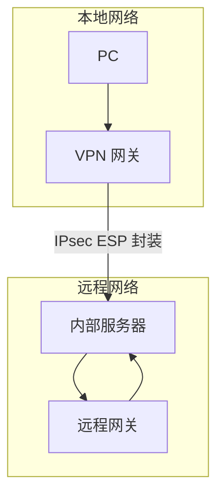
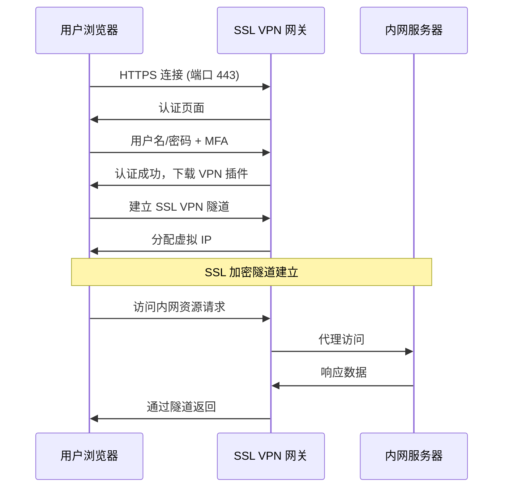
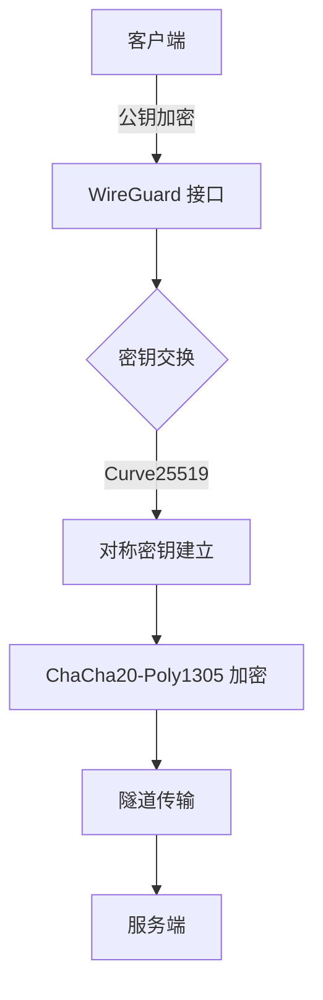
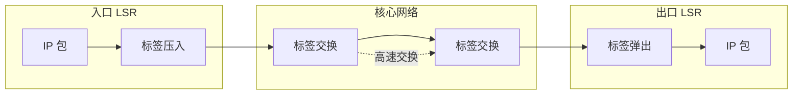
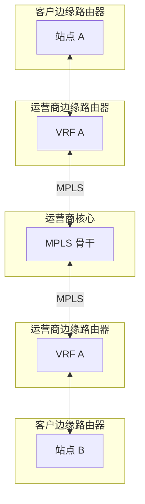

# VPN 技术

你刚入职新公司，IT 部门说「在家办公需要连接 VPN」。但 VPN 是什么？IPsec 和 SSL VPN 有什么区别？公司为什么选这个方案？

VPN（Virtual Private Network）是一种在公网上构建虚拟私有网络的技术，让你即使不在办公室，也能安全地访问公司内网资源。本篇将全面解析各种 VPN 技术，帮助你理解它们的原理和适用场景。

## VPN 核心概念

### 为什么需要 VPN？

```mermaid
flowchart TD
    A[远程员工] -->|直接访问| B[公网]
    B --> C[内网资源]
    C -->|防火墙隔离| B
    Note over A,C: 直接访问被防火墙阻断！

    A2[远程员工] -->|VPN 连接| D[VPN 服务器]
    D -->|加密隧道| E[公网]
    E --> C
    Note over A2,C: 通过 VPN 穿越防火墙，安全访问
```

VPN 的核心价值：

- **保密性**：数据加密，防止窃听
- **完整性**：数据校验，防止篡改
- **认证**：验证用户身份
- **访问控制**：细粒度的资源访问

### VPN 分类

| 类型 | 协议 | 典型场景 |
|---|---|---|
| 站点到站点 | IPsec GRE, MPLS | 企业总部与分部互联 |
| 远程接入 | IPsec IKEv2, SSL VPN | 员工远程办公 |
| 客户端到网关 | OpenVPN, WireGuard | 跨平台远程访问 |

## IPsec VPN

### 工作原理

IPsec VPN 在网络层对数据包进行加密和认证：



### IPsec VPN 两种模式

| 模式 | 适用场景 | 特点 |
|---|---|---|
| 传输模式 | 主机到主机 | 保留原 IP 头，性能好 |
| 隧道模式 | 网关到网关/远程接入 | 封装整个 IP 包，更安全 |

### 传输模式 ESP

```
原始包: [IP头][TCP][Data]
        ↓ ESP 加密
ESP包:  [IP头][ESP头][加密TCP][加密Data][ESP尾][ESP认证]
                          ↑ 加密    ↑ 加密
```

### 隧道模式 ESP

```
原始包: [IP头][TCP][Data]
        ↓ ESP 加密 + 新 IP 头
ESP包:  [新IP头][ESP头][原IP头加密][加密TCP][加密Data][ESP尾][ESP认证]
                                   ↑ 全部加密
```

## SSL VPN

### SSL VPN vs IPsec VPN

| 对比项 | SSL VPN | IPsec VPN |
|---|---|---|
| 工作层 | 应用层（SSL/TLS） | 网络层 |
| 客户端 | 无需安装专用客户端 | 需要安装客户端 |
| 穿越防火墙 | 容易（仅 443 端口） | 困难（多协议） |
| 细粒度控制 | 强（应用级） | 弱（网络级） |
| 性能 | 较低 | 较高 |
| 适用场景 | 远程接入 | 站点互联 |

### SSL VPN 工作原理



### SSL VPN 实现方式

| 类型 | 原理 | 适用场景 |
|---|---|---|
| 反向代理 | Web 页面代理内网应用 | B/S 应用 |
| 插件/小程序 | 浏览器插件代理应用 | C/S 应用 |
| 客户端软件 | 安装 VPN 软件 | 全流量访问 |

### Java SSL VPN 网关

```java
import org.springframework.boot.SpringApplication;
import org.springframework.boot.autoconfigure.SpringBootApplication;
import org.springframework.web.bind.annotation.*;
import jakarta.servlet.http.*;
import java.io.*;

@SpringBootApplication
public class SslVpnGateway {

    @RestController
    public static class VpnController {

        // 反向代理 - Web 应用
        @RequestMapping("/proxy/**")
        public void proxy(HttpServletRequest request, HttpServletResponse response,
                          InputStream requestBody) throws IOException {

            String targetUrl = extractTargetUrl(request);

            // 建立到内网服务器的连接
            URL url = new URL(targetUrl);
            HttpURLConnection conn = (HttpURLConnection) url.openConnection();
            conn.setRequestMethod(request.getMethod());
            conn.setDoOutput(true);

            // 转发请求头
            request.getHeaderNames().asIterator().forEachRemaining(name -> {
                if (!"Host".equals(name)) {
                    conn.setRequestProperty(name, request.getHeader(name));
                }
            });

            // 转发请求体
            if (requestBody.available() > 0) {
                try (OutputStream out = conn.getOutputStream()) {
                    requestBody.transferTo(out);
                }
            }

            // 转发响应
            response.setStatus(conn.getResponseCode());
            conn.getHeaderFields().forEach((name, values) -> {
                if (name != null) {
                    values.forEach(value -> response.setHeader(name, value));
                }
            });

            try (InputStream in = conn.getInputStream()) {
                in.transferTo(response.getOutputStream());
            }
        }

        // 身份认证
        @PostMapping("/api/auth/login")
        public Map<String, Object> login(@RequestBody LoginRequest req) {
            // 验证用户名密码
            // 生成 VPN 会话 token
            return Map.of(
                "status", "success",
                "token", generateSessionToken(req.getUsername()),
                "virtualIp", "10.8.0." + assignIp()
            );
        }
    }
}
```

## OpenVPN

### 特点

- 开源免费
- 基于 OpenSSL
- 跨平台（Windows、Linux、macOS、iOS、Android）
- 支持多种认证方式

### 配置示例

```bash
# 服务端配置 /etc/openvpn/server.conf
port 1194
proto udp
dev tun
ca ca.crt
cert server.crt
key server.key
dh dh.pem

# 加密配置
cipher AES-256-GCM
auth SHA256
tls-crypt ta.key  # TLS 混淆

# 客户端地址池
server 10.8.0.0 255.255.255.0

# 推送路由到客户端
push "route 192.168.1.0 255.255.255.0"

# 持久化配置
persist-key
persist-tun

# 日志
status openvpn-status.log
log /var/log/openvpn.log
verb 3
```

```bash
# 客户端配置 client.ovpn
client
dev tun
proto udp
remote vpn.example.com 1194
resolv-retry infinite
nobind
persist-key
persist-tun

cipher AES-256-GCM
auth SHA256

# 证书
ca ca.crt
cert client.crt
key client.key

# TLS 混淆
tls-crypt ta.key

# 压缩
compress lz4-v2
push "compress lz4-v2"
```

### 启动与测试

```bash
# 启动服务端
sudo systemctl start openvpn@server

# 查看状态
sudo systemctl status openvpn@server

# 客户端连接
sudo openvpn --config client.ovpn

# 验证
ip addr show tun0
ping 10.8.0.1
```

## WireGuard

### 为什么选择 WireGuard？

| 特性 | WireGuard | OpenVPN | IPsec |
|---|---|---|---|
| 代码量 | ~4000 行 | ~100,000 行 | 复杂 |
| 性能 | 极高 | 中等 | 高 |
| 安全性 | 现代密码学 | 良好 | 良好 |
| 配置 | 简单 | 复杂 | 复杂 |
| 状态 | 内核主线支持 | 用户态 | 内核/用户态 |
| 许可 | GPL | GPL | 多协议 |

### WireGuard 工作原理



### 配置示例

```bash
# 服务端配置 /etc/wireguard/wg0.conf
[Interface]
PrivateKey = <服务器私钥>
Address = 10.0.0.1/24
ListenPort = 51820
# 启动后自动配置 NAT
PostUp = iptables -A FORWARD -i wg0 -j ACCEPT; \
         iptables -t nat -A POSTROUTING -o eth0 -j MASQUERADE
PostDown = iptables -D FORWARD -i wg0 -j ACCEPT; \
           iptables -t nat -D POSTROUTING -o eth0 -j MASQUERADE

# 客户端公钥和分配 IP
[Peer]
PublicKey = <客户端1公钥>
AllowedIPs = 10.0.0.2/32

[Peer]
PublicKey = <客户端2公钥>
AllowedIPs = 10.0.0.3/32
```

```bash
# 客户端配置
[Interface]
PrivateKey = <客户端私钥>
Address = 10.0.0.2/24
DNS = 10.0.0.1

# 服务端信息
[Peer]
PublicKey = <服务端公钥>
Endpoint = vpn.example.com:51820
AllowedIPs = 10.0.0.0/24  # 路由整个 VPN 网段
PersistentKeepalive = 25
```

### 密钥生成与启动

```bash
# 生成密钥对
wg genkey | tee privatekey | wg pubkey > publickey

# 启动接口
sudo wg-quick up wg0

# 查看状态
sudo wg show

# 停止
sudo wg-quick down wg0
```

## MPLS VPN

### MPLS 原理

MPLS（Multiprotocol Label Switching）通过标签交换实现高速转发：



### MPLS VPN 架构



### VRF（虚拟路由转发）

```txt
! PE 路由器配置
ip vrf CUSTOMER_A
 rd 65000:100
 route-target export 65000:100
 route-target import 65000:100
!
interface GigabitEthernet0/0.100
 encapsulation dot1Q 100
 ip vrf forwarding CUSTOMER_A
 ip address 10.0.1.1 255.255.255.0
!
```

## VPN 选型指南

| 场景 | 推荐方案 | 理由 |
|---|---|---|
| 员工远程办公 | SSL VPN 或 WireGuard | 轻量、易部署、安全 |
| 站点互联 | IPsec 隧道模式 | 高性能、标准协议 |
| 多站点互联 | MPLS VPN | 可控 QoS、可靠 |
| 跨境访问 | OpenVPN/WireGuard | 抗封锁能力强 |
| 移动设备 | IPsec IKEv2 或 SSL VPN | 原生支持、稳定性好 |

## 面试追问方向

- IPsec VPN 和 SSL VPN 的区别？
- WireGuard 为什么比 OpenVPN 更快？
- MPLS VPN 的工作原理？
- VPN 如何实现流量分流？
- 什么是 Kill Switch？
- VPN 的 NAT 穿透问题如何解决？

> 选择 VPN 技术不是追求最新，而是选择最合适的。企业场景下，稳定性和可管理性往往比性能更重要。
