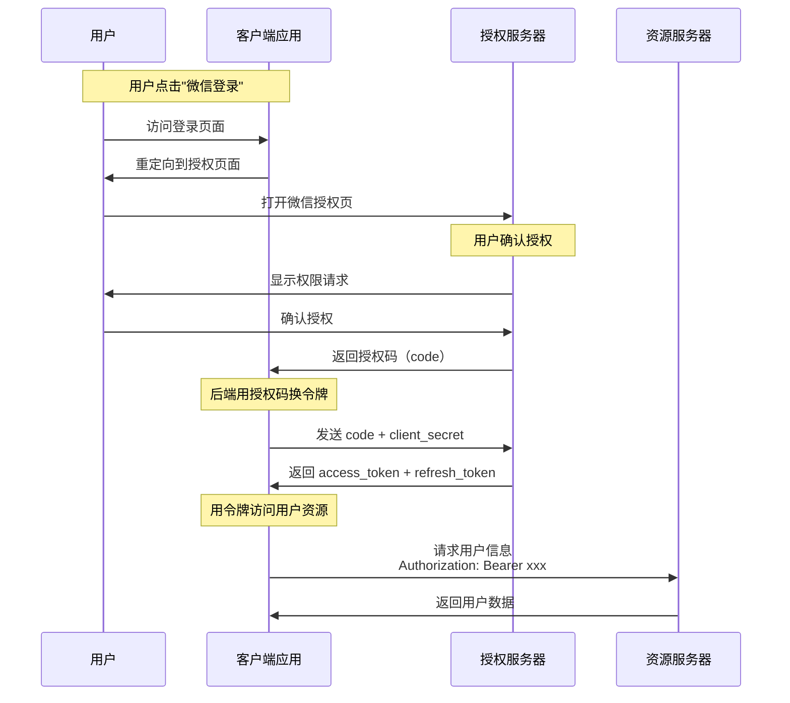
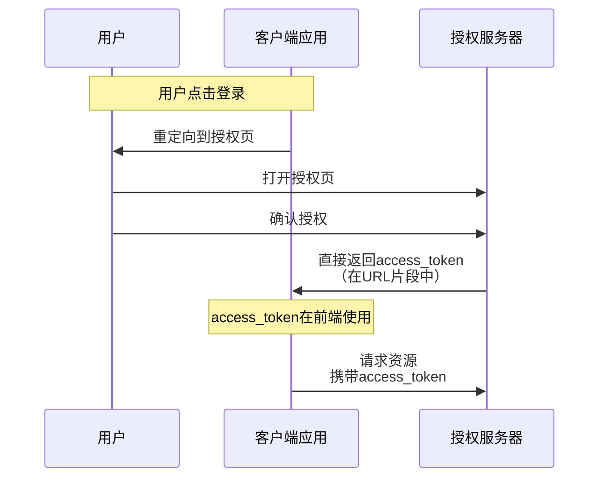
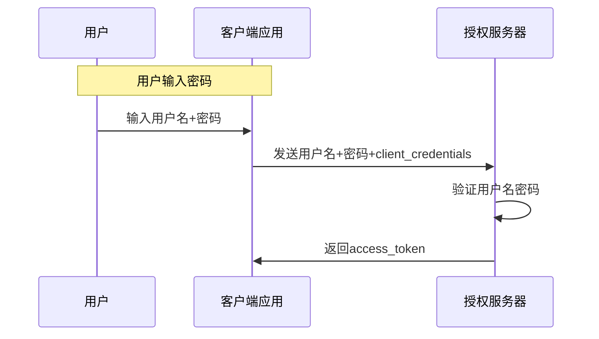
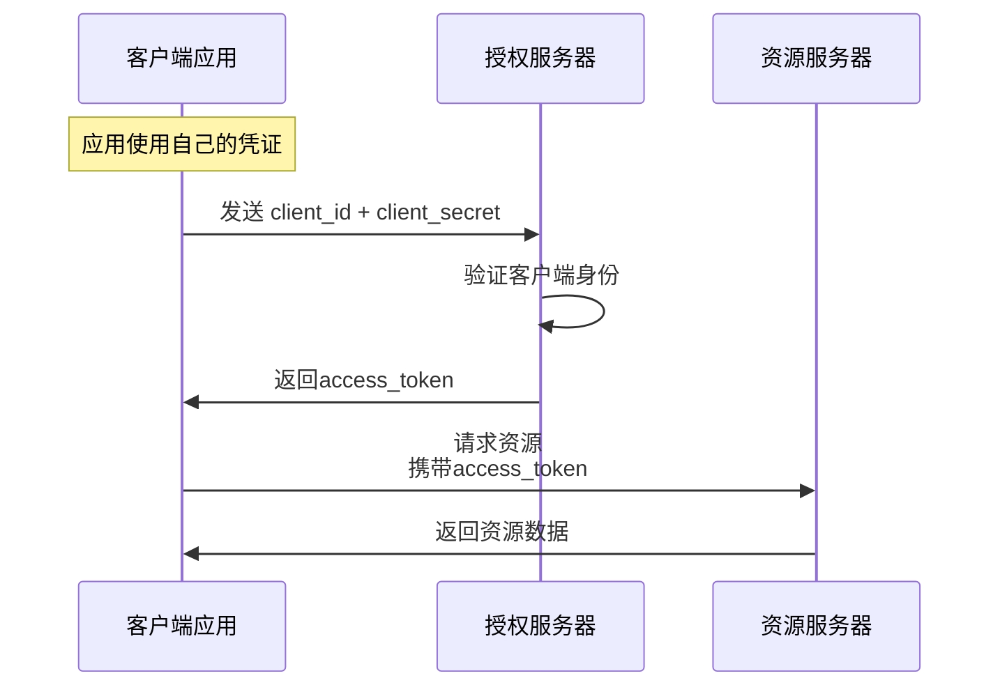

# OAuth2.0授权流程解析

候选人小李在面试时被问到："你用过微信登录吗？它的原理是什么？"

小李说："就是OAuth2.0授权。"

面试官追问："OAuth2.0有哪几种授权模式？你用的是哪种？为什么？"

小李支支吾吾："有授权码模式...还有...其他模式？"

面试官继续："为什么微信登录要用授权码模式，而不是隐式模式？"

小张彻底卡住了...

OAuth2.0是现代互联网的身份认证基础，但能把这个讲清楚的人其实不多。

今天我们就来把这个彻底讲清楚。

## 【直观类比】

### 停车场的授权

想象你去一个停车场：

1. 你走到停车场入口 → **你想访问某个服务**
2. 门卫说："你需要获得授权" → **需要身份验证**
3. 你去找物业开具授权证明 → **授权服务器**
4. 物业说："我给你一张授权卡，但不能复制" → **访问令牌（Access Token）**
5. 你拿着授权卡进入停车场 → **使用令牌访问资源**
6. 停车场管理员看到授权卡，允许你停车 → **验证令牌，授予资源**

### OAuth2.0的角色

OAuth2.0定义了四个核心角色：

```
┌────────────────────────────────────────────────────┐
│  资源所有者（Resource Owner）                       │
│  你：能够授权访问自己资源的用户                     │
├────────────────────────────────────────────────────┤
│  客户端（Client）                                  │
│  第三方应用：想要访问你的资源的应用                 │
├────────────────────────────────────────────────────┤
│  授权服务器（Authorization Server）                 │
│  微信：验证用户身份，颁发令牌                       │
├────────────────────────────────────────────────────┤
│  资源服务器（Resource Server）                      │
│  微信API：存储你的头像、昵称等资源                 │
└────────────────────────────────────────────────────┘
```

## OAuth2.0的核心概念

### 令牌（Token）

**Access Token**：访问令牌，客户端用来请求资源

```
Access Token的特点：
1. 有时效性（通常几小时）
2. 有权限范围（Scope）
3. 可以被撤销
4. 不能用于刷新
```

**Refresh Token**：刷新令牌，用于获取新的Access Token

```
Refresh Token的特点：
1. 时效更长（几天到几周）
2. 只能换取Access Token
3. 必须安全存储
4. 每次刷新后可能轮换
```

### 权限范围（Scope）

Scope定义了Token可以访问哪些资源：

```
常见Scope示例（微信）：
- snsapi_base：获取用户的openid
- snsapi_userinfo：获取用户的基本信息
- snsapi_login：网页扫码登录

常见Scope示例（GitHub）：
- repo：访问仓库
- read:user：读取用户信息
- user:email：访问用户邮箱
```

用户授权时，会看到应用请求的权限列表。

## 四种授权模式

### 模式1：授��码模式（Authorization Code）

这是**最安全、最推荐**的模式，适用于有后端服务器的应用：



**为什么授权码模式最安全？**

```
1. 授权码换取令牌在后端进行
2. client_secret不会暴露给浏览器
3. access_token不会经过用户浏览器
4. 可以实现刷新令牌
5. 支持短期令牌+长期刷新令牌
```

**微信登录的实际流程**：

```
Step 1: 生成state参数（防CSRF）
Step 2: 重定向到微信授权页
        https://open.weixin.qq.com/connect/qrconnect?
          appid=APPID&
          redirect_uri=ENCODED_URL&
          response_type=code&
          scope=snsapi_login&
          state=STATE

Step 3: 用户扫码确认
Step 4: 微信回调到redirect_uri，携带code
Step 5: 后端用code换token
        POST https://api.weixin.qq.com/sns/oauth2/access_token
        params: appid, secret, code, grant_type=authorization_code

Step 6: 用access_token获取用户信息
        GET https://api.weixin.qq.com/sns/userinfo
        params: access_token, openid
```

### 模式2：隐式模式（Implicit）

适用于纯前端应用，没有后端服务器的场景：



**URL格式示例**：

```
https://example.com/callback#access_token=xxx&expires_in=3600&state=xxx
```

**为什么叫"隐式"？**

- 不需要通过授权码换取令牌
- 令牌直接返回，跳过了code步骤
- 没有client_secret验证

**隐式模式的问题**：

:::warning ⚠️
隐式模式已被废弃（OAuth 2.1提议），原因：

1. **令牌暴露在前端**：通过URL传递，有泄露风险
2. **无法刷新令牌**：没有refresh_token
3. **无法验证令牌**：客户端无法确认令牌是否有效
4. **容易被CSRF攻击**：state参数更难保护

现代替代方案：使用**PKCE**扩展的授权码模式
:::

### 模式3：密码凭证模式（Password Credentials）

适用于**高度可信**的应用，用户直接提供用户名密码：



**使用场景**：

```
适用场景：
1. 公司内部应用（员工系统访问内部服务）
2. 操作系统原生应用（官方第一方应用）
3. 高度可信的CLI工具

不适用场景：
1. 第三方应用（你不能把密码给第三方）
2. 不受控的应用（可能有恶意行为）
```

### 模式4：客户端凭证模式（Client Credentials）

适用于**机器对机器**的认证，没有用户参与：



**使用场景**：

```
适用场景：
1. 微服务间调用
2. 后台定时任务
3. CI/CD pipeline
4. 服务器监控服务
```

## PKCE：授权码模式的安全增强

### 什么是PKCE？

**PKCE（Proof Key for Code Exchange）**是对授权码模式的扩展，用于防止令牌被劫持：

```
原始问题：
- 攻击者可以拦截授权码，换取令牌
- 如果没有client_secret，攻击者可以伪造

PKCE解决方案：
- 客户端生成一个随机数（code_verifier）
- 用哈希值（code_challenge）替代client_secret
- 换取令牌时必须提供原始随机数
```

### PKCE的流程

```python
# Step 1: 生成code_verifier和code_challenge
import hashlib
import secrets
import base64

code_verifier = secrets.token_urlsafe(32)  # 随机字符串
code_challenge = base64.urlsafe_b64encode(
    hashlib.sha256(code_verifier.encode()).digest()
).decode().rstrip('=')

# Step 2: 授权请求时发送code_challenge
# GET /authorize?code_challenge=xxx&code_challenge_method=S256

# Step 3: 换取令牌时发送code_verifier
# POST /token
# {
#   "code": "xxx",
#   "code_verifier": "原始随机字符串"
# }
```

### PKCE的应用场景

```
PKCE适用于：
1. 移动App（原生应用）
2. 单页应用（SPA）
3. 任何不能安全存储client_secret的场景

现代OAuth最佳实践：
- 授权码模式 + PKCE = 所有应用的最佳选择
- 即使有后端，也建议使用PKCE
```

## 常见授权平台的Scope对比

### 微信公众平台

```
Scope                    | 说明
-----------------------| ----------------------
snsapi_base             | 获取openid（静默登录）
snsapi_userinfo         | 获取昵称、头像等
snsapi_login            | 网页扫码登录
```

### GitHub

```
Scope                    | 说明
-----------------------| ----------------------
repo                    | 访问仓库（包括私有）
read:user               | 读取用户资料
user:email              | 访问邮箱地址
workflow                | 管理GitHub Actions
```

### Google

```
Scope                    | 说明
-----------------------| ----------------------
openid                  | OpenID Connect
email                   | 访问用户邮箱
profile                 | 访问用户基本资料
https://www.googleapis.com/auth/calendar | 日历
```

## 常见误区

### 误区1：OAuth2.0是认证协议

**错误**。OAuth2.0是**授权协议**，不是认证协议。

```
OAuth 2.0：不告诉你"你是谁"，只告诉你"你能访问什么"
OpenID Connect：在OAuth 2.0基础上加了认证层，能知道"你是谁"
```

### 误区2：access_token可以用很久

**错误**。Access Token的典型生命周期：
- 短则30分钟
- 长则2小时
- 过期后用refresh_token换取新的

原因：Token泄露后影响时间有限。

### 误区3：可以不用refresh_token

**错误**。如果没有refresh_token：
- 用户必须重新登录授权
- 用户体验差
- 每次授权都要用户操作

Refresh Token允许用户在后台自动刷新，不打扰用户。

### 误区4：Scope越全越好

**错误**。请求过多Scope的坏处：
- 用户不信任（为什么你要访问我的通讯录？）
- 审批更严格（某些Scope需要审核）
- 安全风险更大（Scope越多，泄露后损失越大）

**最佳实践**：只请求��需的最小Scope。

## JWT与OAuth2.0的关系

### JWT不是OAuth2.0的一部分

```
OAuth 2.0：授权框架（定义如何获取令牌）
JWT：令牌格式（定义令牌长什么样）

它们可以独立使用，也可以组合使用：
- OAuth 2.0 + JWT：最常见的组合
- OAuth 2.0 + 不透明Token：也常见
- 不用OAuth 2.0 + JWT：在微服务间使用JWT作为身份凭证
```

## 记忆技巧

### 口诀

> **OAuth2.0四模式，授权码是大哥大**
> **隐式已废弃，PKCE来替代**
> **密码模式自己用，凭证模式机对机**
> **Token有时效，Refresh保长久**

### 模式选择速查表

| 场景 | 推荐模式 | 原因 |
| --- | --- | --- |
| 网站登录（后端） | 授权码 | client_secret安全 |
| 移动App | 授权码+PKCE | 无后端存储secret |
| SPA | 授权码+PKCE | 不暴露secret |
| 公司内部CLI | 密码凭证 | 高度可信 |
| 微服务间调用 | 客户端凭证 | 机器对机器 |

## 实战检验

### 检验1：实现微信扫码登录

**场景**：在自己的网站实现微信扫码登录

**实现步骤**：
```
1. 申请微信开放平台账号，创建网页应用
2. 生成state参数存储在session
3. 重定向用户到微信授权页
4. 微信回调，携带code和state
5. 验证state防止CSRF
6. 用code向微信换取access_token
7. 用access_token获取用户信息
8. 创建本地会话，完成登录
```

### 检验2：设计一个OAuth授权服务

**场景**：需要为一个第三方应用提供OAuth授权

**设计要点**：
```
1. 授权端点：显示用户授权页面
2. Token端点：颁发和刷新Token
3. 验证端点：验证Token有效性
4. Scope管理：定义支持的权限
5. 存储设计：Token、用户授权记录
6. 安全措施：CSRF防护、恶意登录检测
```

### 检验3：排查OAuth失败

**场景**：用户扫码后报错"redirect_uri mismatch"

**排查思路**：
```
1. 检查微信开放平台配置的回调域名
2. 检查代码中的redirect_uri是否匹配
3. 检查URL编码是否正确
4. 检查是否有特殊字符
5. 确认是网页授权而非JS SDK授权
```

【面试官心理】

面试官问OAuth2.0，其实是在测试你对"授权体系"的理解。知道四种模式是60分，知道为什么用授权码模式是80分，知道PKCE的作用是90分，如果还能讲清楚OAuth和OIDC的区别以及JWT的关系，那就是P7的水平了。

---

## 延伸阅读

- [JWT结构与使用](/cs/security/jwt) - JWT在OAuth中的具体应用
- [JWT与Session对比](/cs/security/jwt-vs-session) - 不同身份验证方案的对比
- [CSRF攻击与防护](/cs/security/csrf) - OAuth中常见的CSRF攻击
