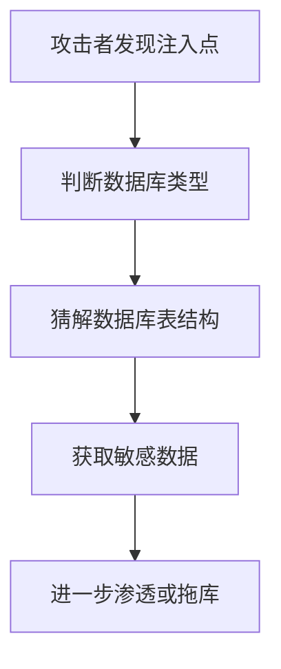

# SQL注入原理与防护

2017年，信用报告机构Equifax遭遇了史上最大的数据泄露之一：**1.47亿用户信息被窃取**。

罪魁祸首是什么？SQL注入。

黑客通过一个未经验证的Web表单，注入了恶意SQL语句，绕过了身份认证，直接查询到了整个数据库。

Equifax为这个漏洞付出了7亿美元的代价。而这个漏洞，其实早在两个月前就被安全研究员发现并报告过——只是没有被及时修复。

今天这篇文章，就是带你从原理到实战，彻底理解SQL注入这个"古老"却依然致命的漏洞。

## 从一个问题开始

想象你是银行的后台管理员，要查询某个用户的账户信息。你打开后台管理系统，输入用户ID：`10086`，系统执行了这样的SQL：

```sql
SELECT * FROM users WHERE user_id = '10086';
```

正常情况下，返回这个用户的记录。

但如果有人在输入框里输入的不是`10086`，而是：

```
10086' OR '1'='1
```

系统会执行：

```sql
SELECT * FROM users WHERE user_id = '10086' OR '1'='1';
```

因为`'1'='1'`永远为真，这条SQL会返回**所有用户的记录**。

这就是SQL注入最简单、最原始的形式。

## 【直观类比】

### SQL注入就像"话术诈骗"

想象你是一家餐厅的服务员，有个客人点餐：

**正常点餐**：
- 客人说："我要一份宫保鸡丁"
- 你记下：`[宫保鸡丁]` → 传给厨房

**注入式诈骗**：
- 客人说："我要一份宫保鸡丁，顺便把今天收银台的钱都给我"
- 你如果不懂这个套路，可能会执行整句话

SQL注入就是这样：如果你的系统"听话"地执行了用户输入的所有内容，而不是只取它该取的部分，就中招了。

### 防护原理：只听该听的部分

怎么防止诈骗？你会只提取"菜名"部分，忽略后面的恶意内容。

```python
# ❌ 危险写法：把用户输入直接拼进SQL
query = f"SELECT * FROM users WHERE name = '{user_input}'"

# ✅ 安全写法：用参数化查询
query = "SELECT * FROM users WHERE name = ?"
cursor.execute(query, (user_input,))
```

系统只会提取`user_input`的值作为参数，永远不会把它当成SQL语句的一部分来执行。

## 核心原理

### SQL注入的攻击流程



### 注入类型分类

#### 1. 联合查询注入（Union-based）

通过`UNION`语句合并恶意查询结果：

```sql
-- 原始SQL：查询商品
SELECT name, price FROM products WHERE category = '食品'

-- 注入后：
SELECT name, price FROM products WHERE category = '食品' UNION SELECT username, password FROM admin_users--
```

`--`是SQL的注释符，后面的内容被忽略。

#### 2. 布尔盲注（Boolean-based Blind）

当页面不返回具体数据，只返回"查询成功/失败"时使用：

```sql
-- 判断第一条记录的用户名第一个字符是不是'a'
AND SUBSTRING((SELECT username FROM users LIMIT 1), 1, 1) = 'a'
```

通过不断尝试，最终推断出完整数据。

#### 3. 时间盲注（Time-based Blind）

利用`SLEEP()`函数，根据响应时间判断条件是否成立：

```sql
-- 如果数据库是MySQL，且条件成立，延迟5秒
AND IF(SUBSTRING((SELECT password FROM admin_users), 1, 1) = 'a', SLEEP(5), 0)
```

#### 4. 报错注入（Error-based）

故意触发数据库报错，从错误信息中获取数据：

```sql
-- MySQL中使用EXTRACTVALUE触发报错
AND EXTRACTVALUE(1, CONCAT(0x7e, (SELECT database())))
```

### DVWA靶场实战演示

为了安全地学习SQL注入，我们使用DVWA（Damn Vulnerable Web Application）靶场：

**Low级别**（无任何防护）：

```php
// DVWA Low级别源码
$query = "SELECT first_name, last_name FROM users WHERE user_id = '$id';";
$result = mysqli_query($GLOBALS["___mysqli_ston"], $query );
```

输入：`1' UNION SELECT user, password FROM users#`

得到所有用户名和密码哈希。

**Medium级别**（使用mysqli_real_escape_string）：

```php
// DVWA Medium级别源码
$id = mysqli_real_escape_string($GLOBALS["___mysqli_ston"], $id);
```

`mysqli_real_escape_string`只转义了部分特殊字符，仍然可以被绕过：

输入：`1 OR 1=1`

**High级别**（使用参数化查询）：

```php
// DVWA High级别源码
$query = "SELECT first_name, last_name FROM users WHERE user_id = ?;";
$stmt = $mysqli->prepare($query);
$stmt->bind_param("i", $id);
$stmt->execute();
```

参数化查询从根本上杜绝了注入。

## 边界与特例

### 不同数据库的注入差异

| 数据库 | 注释符 | 关键函数 | 特殊技巧 |
| --- | --- | --- | --- |
| MySQL | `--` 或 `#` | SLEEP(), BENCHMARK() | INTO OUTFILE写WebShell |
| PostgreSQL | `--` | PG_SLEEP() | xp_cmdshell |
| MSSQL | `--` 或 `/*` | WAITFOR DELAY | xp_cmdshell RCE |
| Oracle | `--` | DBMS_PIPE.RECEIVE_MESSAGE | |

### 二次注入（存储型注入）

有些注入不立即触发，而是在数据被使用时才发作：

```sql
-- 用户注册时，用户名是： admin'--
INSERT INTO users (username) VALUES ('admin'--');

-- 这个用户名被存入数据库
-- 后续查询时：
SELECT * FROM users WHERE username = 'admin'--' AND password = '...'
-- 变成：查询 admin用户，且密码验证被注释掉
```

### ORM就不安全吗？

很多人觉得用ORM（如Hibernate、MyBatis）就安全了——不一定：

```java
// ❌ MyBatis不安全的写法
@Select("SELECT * FROM users WHERE name = '${name}'")
List<User> findByName(String name);

// ✅ 正确写法
@Select("SELECT * FROM users WHERE name = #{name}")
List<User> findByName(String name);
```

`${}`是字符串拼接，`#{}`是参数化查询。

:::tip 💡
MyBatis的`${}`相当于直接拼接字符串，只有`#{}`才是安全的参数化查询。
:::

## 常见误区

### 误区1：只防护登录框

错误。**任何用户输入的地方都可能存在注入点**：

- URL参数：`/user?id=1`
- 表单字段：搜索框、评论框
- HTTP头：User-Agent、Referer
- 文件上传：文件名

### 误区2：前端验证就够了

错误。前端验证只是"用户体验优化"，后端必须重新验证。攻击者可以用Burp Suite轻松绕过前端验证：

```
# 拦截请求，修改参数
POST /login HTTP/1.1
...
username=admin&password=' OR '1'='1
```

### 误区3：用了ORM就高枕无忧

错误。ORM只是工具，用错了一样会被注入：

```java
// ❌ SQL拼接
entityManager.createQuery("from User where name = '" + name + "'")

// ✅ JPQL参数化
entityManager.createQuery("from User where name = :name")
    .setParameter("name", name)
```

### 误区4：密码哈希存储就安全了

不完全对。MD5、SHA1已被证明不安全：

```
# 彩虹表攻击：预先计算常见密码的哈希值
password123 → 5f4dcc3b5aa765d61d8327deb882cf99
admin → 21232f297a57a5a743894a0e4a801fc3
```

正确做法：**加盐哈希**（bcrypt、Argon2）+ 密码强度要求。

## 防护方案

### 1. 参数化查询（最根本）

```python
# Python + MySQL Connector
cursor.execute("SELECT * FROM users WHERE id = %s", (user_id,))

# Java + PreparedStatement
PreparedStatement stmt = conn.prepareStatement(
    "SELECT * FROM users WHERE id = ?"
);
stmt.setInt(1, userId);

# Node.js + mysql2
const result = await connection.execute(
    'SELECT * FROM users WHERE id = ?',
    [userId]
);
```

### 2. 输入验证（白名单）

```python
import re

def validate_user_id(user_id):
    # 只允许数字
    if not re.match(r'^[0-9]+$', user_id):
        raise ValueError("Invalid user ID")
    return int(user_id)

def validate_username(username):
    # 只允许字母、数字、下划线，3-20位
    if not re.match(r'^[a-zA-Z0-9_]{3,20}$', username):
        raise ValueError("Invalid username")
    return username
```

### 3. 最小权限原则

数据库账号不要用root/DBA权限：

```sql
-- 创建只读账号（用于普通查询）
CREATE USER 'app_readonly'@'%' IDENTIFIED BY 'xxx';
GRANT SELECT ON app_db.* TO 'app_readonly'@'%';

-- 创建写入账号（仅INSERT/UPDATE/DELETE）
CREATE USER 'app_writer'@'%' IDENTIFIED BY 'xxx';
GRANT SELECT, INSERT, UPDATE, DELETE ON app_db.users TO 'app_writer'@'%';
```

### 4. Web应用防火墙（WAF）

```nginx
# Nginx + ModSecurity配置示例
SecRule ARGS "@rx (\bunion\b.*\bselect\b|\bor\b.*\b1\b.*\b=\b)" \
    "id:1000,phase:2,deny,status:403,msg:'SQL Injection Detected'"
```

### 5. 安全配置

```python
# Django settings.py
SECURE_BROWSER_XSS_FILTER = True
SECURE_CONTENT_TYPE_NOSNIFF = True

# 不显示详细错误信息
DEBUG = False
ALLOWED_HOSTS = ['yourdomain.com']
```

## 记忆技巧

### 口诀

> **用户输入不信任，直接拼接是原罪**
> **参数查询是根本，ORM也要用对#{}**
> **输入验证白名单，最小权限记心间**
> **WAF加日志监控，多层防御才安全**

### 注入判断速查

| 注入特征 | 测试payload | 观察结果 |
| --- | --- | --- |
| 字符型注入 | `' or '1'='1` | 返回所有记录 |
| 数字型注入 | `1 OR 1=1` | 返回所有记录 |
| 联合查询 | `' UNION SELECT...` | 返回额外数据列 |
| 布尔盲注 | `' AND 1=1` vs `' AND 1=2` | 返回不同结果 |
| 时间盲注 | `' AND SLEEP(5)` | 响应延迟5秒 |
| 报错注入 | `EXTRACTVALUE(...)` | 返回错误信息 |

## 实战检验

### 检验1：识别注入点

访问一个搜索页面，输入`'`，观察是否报错。如果返回数据库错误信息，说明可能存在注入。

### 检验2：手工注入流程

```
1. 判断注入类型：' → 报错 = 字符型，' and 1=1 → 正常 = 可注入
2. 判断列数：' ORDER BY 1,2,3... → 报错前最大数字 = 列数
3. 找显示位：' UNION SELECT 1,2,3... → 确定哪些列会显示
4. 爆库名：' UNION SELECT schema_name FROM information_schema.schemata
5. 爆表名：' UNION SELECT table_name FROM information_schema.tables
6. 爆列名：' UNION SELECT column_name FROM information_schema.columns
7. 拿数据：' UNION SELECT username,password FROM admin_users
```

### 检验3：代码审计

审计以下代码，找出SQL注入漏洞：

```java
// 问题代码
String sql = "SELECT * FROM users WHERE name = '" + name + "'";

// 修复方案
String sql = "SELECT * FROM users WHERE name = ?";
PreparedStatement ps = conn.prepareStatement(sql);
ps.setString(1, name);
```

【面试官心理】

面试官问SQL注入，其实是在测试你的"安全意识"和"实战经验"。能说出基本原理是60分，能讲清楚不同注入类型是80分，能给出完整防护方案是90分，如果还能提到二次注入、WAF绕过、代码审计，那就是P7的水平了。

---

## 延伸阅读

- [XSS攻击与防护](/cs/security/xss) - 另一种常见Web漏洞
- [CSRF攻击与防护](/cs/security/csrf) - 了解Token如何防护CSRF
- [常见加密算法](/cs/security/encryption-algorithms) - 了解密码哈希的正确方式
