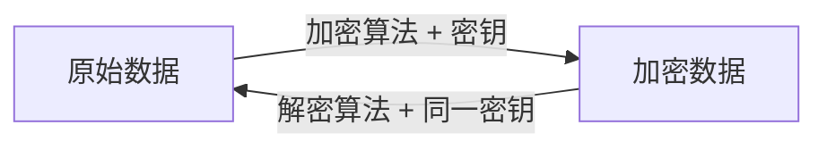
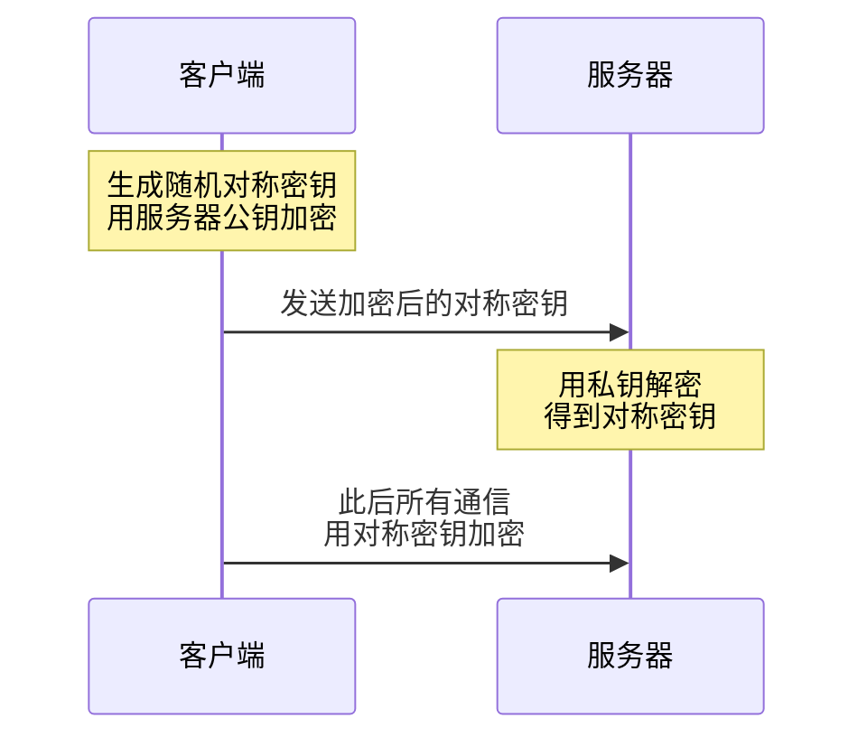

# 对称与非对称加密

候选人小李坐在字节跳动的面试间里，面试官翻到简历上"熟悉加密技术"这一行，开口问道：

"对称加密和非对称加密有什么区别？什么时候用哪个？"

小李说："对称加密用同一把钥匙，非对称加密用两把钥匙。"面试官点点头，继续追问：

"那HTTPS用的是哪种？为什么不直接用非对称加密传输所有数据？"

小李停顿了两秒，开始支支吾吾...

## 从一个问题开始

小李的卡壳很典型。他知道概念，但不知道背后的设计权衡。加密的世界里，"用什么算法"只是表象，"为什么这么用"才是真正的考点。

今天的文章，我们就从这个问题出发，把对称加密和非对称加密的本质讲清楚。

## 【直观类比】

### 对称加密：快递柜密码

想象你有一个快递柜，密码锁的设置是这样的：**设密码的人和拿快递的人用的是同一个密码**。

你设了"1234"，快递员用"1234"存进去，你用"1234"取出来。这就是**对称加密**——加密和解密用同一把钥匙。

优点很明显：**快**。密码只要设一次，操作也简单。

但问题也来了：你怎么把密码告诉快递员？如果密码在传输过程中被人偷看了怎么办？这就是对称加密的**密钥配送问题**。

### 非对称加密：带锁的信箱

再想象一个带锁的信箱。你有一把**公钥**（锁）和一把**私钥**（钥匙）。

锁是公开的，任何人都可以把信塞进信箱。但只有你有钥匙，只有你能把信取出来。这就是**非对称加密**——加密用公钥，解密用私钥。

优点：**解决了密钥配送问题**。公钥可以随便发，不需要秘密传输。

缺点：**慢**。非对称加密的计算量比对称加密大几个数量级。实测数据：AES加密比RSA快100~1000倍。

## 核心原理

### 对称加密的工作方式

对称加密的数学基础很简单：**找到一个困难的运算，其逆运算也困难**。

对称加密的核心流程：



最常见的对称加密算法是 **AES（Advanced Encryption Standard）**，它的本质是对数据进行多轮"替换-置换"操作：

```python
# 伪代码：AES加密的核心思路
def aes_encrypt(plaintext, key):
    # 1. 密钥扩展
    expanded_key = key_expansion(key)
    
    # 2. 初始轮密钥加
    state = add_round_key(plaintext, expanded_key[0])
    
    # 3. 多轮替换-置换（共10/12/14轮）
    for round in range(1, 10):
        # 字节替换（S盒）
        state = sub_bytes(state)
        # 行移位
        state = shift_rows(state)
        # 列混淆
        state = mix_columns(state)
        # 轮密钥加
        state = add_round_key(state, expanded_key[round])
    
    # 4. 最终轮（无列混淆）
    state = sub_bytes(state)
    state = shift_rows(state)
    state = add_round_key(state, expanded_key[10])
    
    return state
```

AES-128用128位密钥，可以进行`2^128`次尝试才能破解，暴力破解在有生之年基本不可能。

### 非对称加密的工作方式

非对称加密依赖的是**数学上的单向函数**——正向计算容易，逆运算极难。

最经典的非对称加密是 **RSA**，它利用的是质数乘积的因式分解难题：

```python
# 伪代码：RSA加密的核心思路
def rsa_encrypt(message, e, n):
    """
    e: 公钥指数 (通常为65537)
    n: 公钥模数 = p * q (p和q是大质数)
    """
    # 加密：message^e mod n
    ciphertext = pow(message, e, n)
    return ciphertext

def rsa_decrypt(ciphertext, d, n):
    """
    d: 私钥指数 (通过ed ≡ 1 mod (p-1)(q-1) 计算得到)
    n: 公钥模数
    """
    # 解密：ciphertext^d mod n
    message = pow(ciphertext, d, n)
    return message
```

RSA的安全性建立在：**已知`n = p * q`，很难反推出`p`和`q`**。当`p`和`q`都是300位以上的质数时，即使动用超级计算机，也需要数十年才能因式分解。

### 混合加密：取长补短

实际应用中，对称和非对称加密通常**混合使用**：



**为什么这么设计？**

1. 握手阶段：用非对称加密传输对称密钥（解决密钥配送问题）
2. 传输阶段：用对称加密传输数据（保证性能）

这就是HTTPS的加密策略，TLS握手就是完成这个过程。

## 边界与特例

### 对称加密的密钥长度问题

不是密钥越长越好。密钥越长，计算开销越大：

| 算法 | 密钥长度 | 适用场景 |
| --- | --- | --- |
| AES-128 | 128位 | 普通商业场景，性价比最高 |
| AES-192 | 192位 | 金融、政府 |
| AES-256 | 256位 | 高度敏感数据 |

2010年后，美国政府开始推荐使用AES-256，但NSA实际上更推荐AES-128——因为AES-128在密码学上已经被证明了安全性，而AES-256曾经有过理论漏洞（后来被修复）。

### 非对称加密的性能陷阱

RSA有个性能陷阱：**不能用短密钥**。

如果用512位RSA，加密确实快，但分分钟被破解。安全的RSA需要2048位以上，这意味着：

```python
# 实测对比（相同数据量）
RSA-2048:  ~10ms/次
AES-128:   ~0.01ms/次
# 性能差距：1000倍
```

所以RSA只用于加密**少量数据**（如密钥），绝对不能用于加密大文件。

### 椭圆曲线加密：非对称的另一种选择

RSA并不是唯一的非对称加密方案。**ECDSA（椭圆曲线数字签名算法）**正在成为新宠：

| 算法 | 等价RSA密钥长度 | 签名长度 |
| --- | --- | --- |
| RSA-2048 | 2048位 | 256字节 |
| ECDSA-256 | 3072位 | 64字节 |

同样的安全强度，ECDSA的密钥和签名都更短，所以更适合移动端和物联网场景。

## 常见误区

### 误区1：非对称加密更安全

这是一个常见的误解。实际上：

- **在相同密钥长度下，AES比RSA安全得多**
- RSA-2048的安全强度≈AES-112
- AES-128已经通过了几十年的密码分析验证

非对称加密的优势是**解决了密钥配送问题**，而不是"更安全"。

### 误区2：对称加密已经被淘汰

完全错误。对称加密（尤其是AES）是**目前最常用的加密算法**。HTTPS用它、TLS用它、WiFi的WPA2用它、银行加密用它。

之所以还用非对称加密，只是因为它解决了密钥配送问题。

### 误区3：公钥加密后只有私钥能解密

这是RSA的工作方式，但**不是所有非对称加密都这样**。

ECC（椭圆曲线密码学）基于完全不同的数学原理，性能更好，密钥更短，在移动端和区块链场景越来越常见。

### 误区4：非对称加密可以完全替代对称加密

理论上可以，实际上不行。

非对称加密的计算成本太高。如果HTTPS全程用RSA加密，加密和解密的耗时会让网页加载时间翻10倍。所以现实方案是**混合加密**。

## 记忆技巧

### 口诀记忆

> **对称快如闪电，密钥共享是难关**
> **非对称慢如蜗牛，密钥配送不再难**
> **HTTPS两者混，握手机密传，数据高速跑**

### 对比表格记忆

| 特征 | 对称加密 | 非对称加密 |
| --- | --- | --- |
| 密钥 | 同一把 | 公钥+私钥 |
| 速度 | 快（快100~1000倍） | 慢 |
| 密钥配送 | 困难 | 容易 |
| 典型算法 | AES、DES、3DES | RSA、ECDSA |
| 用途 | 数据加密 | 密钥交换、数字签名 |

## 实战检验

### 检验问题1

**问题**：为什么HTTPS不用RSA直接加密所有数据？

**答案**：
1. RSA-2048比AES-128慢100~1000倍
2. 用非对称加密传输对称密钥，再用对称密钥加密数据，是性能和安全的平衡
3. 对称密钥只需要在握手阶段传输一次，之后用对称加密

### 检验问题2

**问题**：Diffie-Hellman密钥交换和RSA密钥传输有什么区别？

**答案**：
- **RSA**：客户端用服务器公钥加密对称密钥发给服务器，服务器用私钥解密
- **DH**：双方通过交换参数，各自独立计算出相同的对称密钥（即使攻击者截获了所有数据，也无法计算出密钥）

DH的优势：**前向安全性**（即使服务器私钥泄露，历史通信依然安全）。RSA密钥传输如果私钥泄露，攻击者可以解密所有历史流量。

### 检验问题3

**问题**：AES-256一定比AES-128安全吗？

**答案**：不一定。实际应用中，AES-128在某些实现上反而更安全，因为AES-256的扩展密钥阶段曾经有理论漏洞（后来被修复）。选AES-128还是AES-256，取决于具体场景和合规要求。

【面试官心理】

面试官问对称和非对称加密，其实是在测试你对"工程权衡"的理解。知道用哪个算法是60分，知道为什么这么用是80分，能讲清楚混合加密的逻辑是90分，如果还能提到前向安全性，那就是P7的水平了。

---

## 延伸阅读

- [TLS握手流程](/cs/security/tls-handshake) - 了解HTTPS如何结合两种加密
- [常见加密算法](/cs/security/encryption-algorithms) - AES、DES、RSA等算法的详细对比
- [哈希算法](/cs/security/hash) - 加密和哈希的区别
