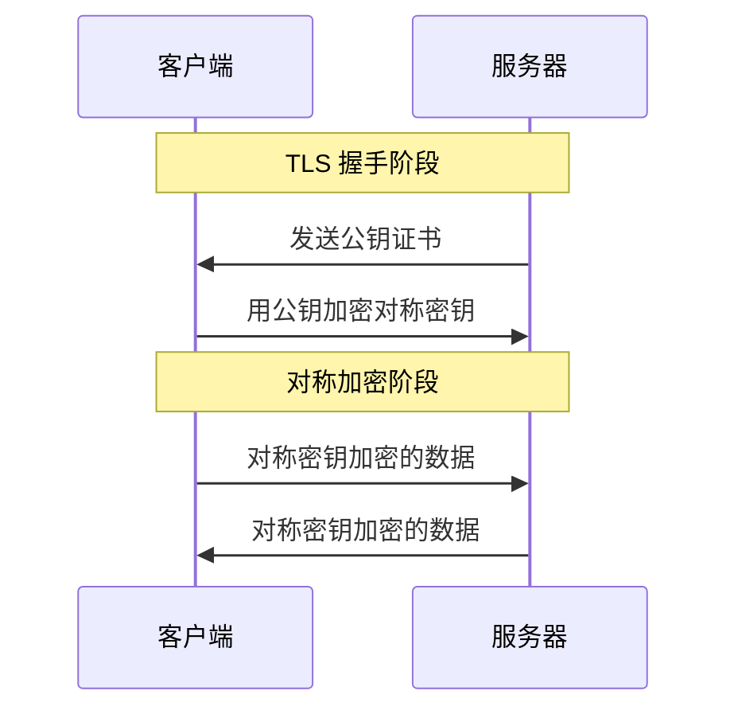

# 对称加密 vs 非对称加密

> 目标级别：P5

面试官问：「对称加密和非对称加密有什么区别？」你回答「对称加密用一个密钥，非对称用两个密钥」——然后面试官追问：「为什么 HTTPS 要混合使用两种加密？」「RSA 是怎么工作的？」「什么是非对称加密的数学基础？」

对称加密和非对称加密是密码学的基础，理解它们的区别是理解 HTTPS 等安全协议的前提。

## 一、加密基础

### 1.1 什么是加密

```
加密：将明文转换为密文的过程

明文：可以直接理解的信息
密文：经过加密后，无法直接理解的信息

加密三要素：
1. 明文
2. 密钥
3. 算法
```

### 1.2 加密目标

```
加密的目标：

1. 机密性（Confidentiality）
   - 只有授权者能读取信息

2. 完整性（Integrity）
   - 信息不被篡改

3. 认证（Authentication）
   - 验证发送者身份

4. 不可否认性（Non-repudiation）
   - 发送者不能否认发送过信息
```

---

## 二、对称加密

### 2.1 什么是对称加密

```
对称加密：加密和解密使用相同的密钥

明文 + 密钥 → 加密算法 → 密文
密文 + 密钥 → 解密算法 → 明文

密钥分发问题：
- 双方需要安全地交换密钥
- 如果密钥被截获，通信就不安全了
```

### 2.2 常见对称加密算法

| 算法 | 密钥长度 | 说明 |
|------|----------|------|
| DES | 56 位 | 已淘汰（可被暴力破解） |
| 3DES | 168 位 | DES 的三重加密，较慢 |
| AES | 128/192/256 位 | 当前标准，最常用 |
| ChaCha20 | 256 位 | 移动端性能好 |

### 2.3 AES 示例

```java
import javax.crypto.Cipher;
import javax.crypto.spec.SecretKeySpec;

public class AESExample {
    public static void main(String[] args) throws Exception {
        String key = "1234567890ABCDEF"; // 16 字节 = 128 位
        String plaintext = "Hello, World!";

        // 加密
        SecretKeySpec keySpec = new SecretKeySpec(key.getBytes(), "AES");
        Cipher cipher = Cipher.getInstance("AES/ECB/PKCS5Padding");
        cipher.init(Cipher.ENCRYPT_MODE, keySpec);
        byte[] encrypted = cipher.doFinal(plaintext.getBytes());

        // 解密
        cipher.init(Cipher.DECRYPT_MODE, keySpec);
        byte[] decrypted = cipher.doFinal(encrypted);
        System.out.println(new String(decrypted)); // "Hello, World!"
    }
}
```

---

## 三、非对称加密

### 3.1 什么是非对称加密

```
非对称加密：加密和解密使用不同的密钥

- 公钥（Public Key）：公开，可以给任何人
- 私钥（Private Key）：保密，只有所有者知道

明文 + 公钥 → 加密算法 → 密文
密文 + 私钥 → 解密算法 → 明文

密钥分发优势：
- 公钥可以公开传输
- 只有私钥持有者能解密
```

### 3.2 RSA 算法

```
RSA 算法原理：

数学基础：大整数分解的困难性

公钥 = (n, e)
私钥 = (n, d)

其中：
- n = p * q（两个大质数的乘积）
- e 和 d 满足 e * d ≡ 1 (mod φ(n))

加密：c = m^e mod n
解密：m = c^d mod n
```

### 3.3 RSA 示例

```java
import java.security.KeyPair;
import java.security.KeyPairGenerator;
import javax.crypto.Cipher;

public class RSAExample {
    public static void main(String[] args) throws Exception {
        // 生成密钥对
        KeyPairGenerator keyGen = KeyPairGenerator.getInstance("RSA");
        keyGen.initialize(2048);
        KeyPair keyPair = keyGen.generateKeyPair();

        String plaintext = "Hello, World!";

        // 公钥加密
        Cipher cipher = Cipher.getInstance("RSA");
        cipher.init(Cipher.ENCRYPT_MODE, keyPair.getPublic());
        byte[] encrypted = cipher.doFinal(plaintext.getBytes());

        // 私钥解密
        cipher.init(Cipher.DECRYPT_MODE, keyPair.getPrivate());
        byte[] decrypted = cipher.doFinal(encrypted);
        System.out.println(new String(decrypted)); // "Hello, World!"
    }
}
```

---

## 四、混合加密

### 4.1 为什么混合使用

```
对称加密的问题：密钥分发困难

非对称加密的问题：计算速度慢

混合加密的解决方案：
1. 用非对称加密安全地传输对称密钥
2. 用对称加密加密实际数据

优势：
- 密钥交换安全（非对称加密）
- 数据传输高效（对称加密）
```

### 4.2 HTTPS 加密过程



---

## 五、面试题精讲

### 🔴 【高频】对称加密和非对称加密的区别

**问题**：对称加密和非对称加密有什么区别？

**标准答案**：

```
1. 密钥数量
   - 对称加密：使用相同的密钥
   - 非对称加密：使用公钥和私钥

2. 加密速度
   - 对称加密：快（适合大量数据）
   - 非对称加密：慢（适合少量数据）

3. 密钥分发
   - 对称加密：密钥需要安全传输
   - 非对称加密：公钥可公开，私钥保密

4. 安全性
   - 对称加密：密钥是关键
   - 非对称加密：数学难题保证

5. 常见算法
   - 对称：AES、DES、3DES
   - 非对称：RSA、ECC
```

### 🟡 【中频】HTTPS 为什么混合使用

**问题**：HTTPS 为什么同时使用对称加密和非对称加密？

**标准答案**：

```
混合加密的原因：

1. 非对称加密的局限
   - 计算速度慢（比对称加密慢 100-1000 倍）
   - 不适合加密大量数据

2. 对称加密的问题
   - 密钥需要安全分发
   - 如果密钥被截获，加密无效

3. 混合方案
   - 用非对称加密安全传输对称密钥
   - 用对称密钥加密实际数据

实际效果：
- 密钥交换安全（非对称）
- 数据传输高效（对称）
```

---

## 六、对比总结

### 对称加密 vs 非对称加密

| 维度 | 对称加密 | 非对称加密 |
|------|----------|------------|
| 密钥 | 相同密钥 | 公钥 + 私钥 |
| 速度 | 快（100-1000 倍） | 慢 |
| 密钥分发 | 困难 | 简单（公钥公开） |
| 安全性 | 密钥是关键 | 数学难题 |
| 典型算法 | AES、DES | RSA、ECC |
| 适用场景 | 数据加密 | 密钥交换、数字签名 |

### RSA vs AES

| 维度 | RSA | AES |
|------|-----|-----|
| 类型 | 非对称 | 对称 |
| 密钥长度 | 2048/4096 位 | 128/192/256 位 |
| 速度 | 慢 | 快 |
| 用途 | 密钥交换、签名 | 数据加密 |

---

## 七、扩展思考

### 💡 数字签名

```
数字签名 = 非对称加密的逆向使用

签名过程：
1. 计算消息哈希
2. 用私钥加密哈希
3. 发送消息 + 签名

验证过程：
1. 用公钥解密签名
2. 计算消息哈希
3. 比较两者

作用：
- 认证发送者身份
- 保证消息完整性
- 不可否认性
```

### 💡 椭圆曲线密码学（ECC）

```
ECC 原理：
- 基于椭圆曲线上的离散对数难题
- 更短的密钥达到同等安全强度

对比 RSA：
- RSA 2048 位 ≈ ECC 224 位
- ECC 更适合移动设备

应用：
- TLS 1.3 推荐使用
- 区块链（比特币使用 ECDSA）
```

> 对称加密和非对称加密各有优缺点，理解它们的区别和应用场景是理解现代密码学的基础。HTTPS 使用混合加密，结合两者优点。