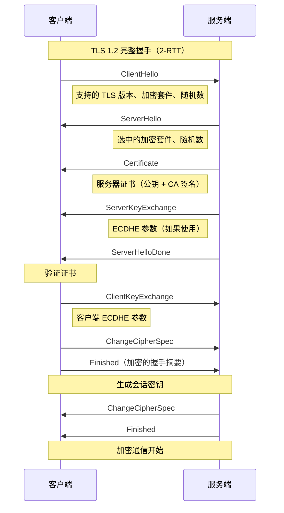
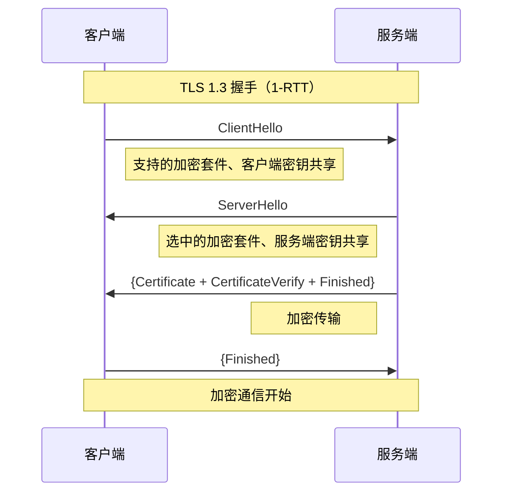

# TLS/SSL握手流程

> 目标级别： P5/P6

面试官问：「TLS 握手过程是怎样的？」你回答「交换密钥、验证证书」——然后面试官追问：「TLS 1.2 和 TLS 1.3 的区别？」「ECDHE 密钥交换是什么？」「前向保密怎么实现的？」

TLS 握手是 HTTPS 安全通信的基础，理解握手过程对于理解 Web 安全至关重要。

## 一、TLS 基础

### 1.1 TLS 是什么

```
TLS（Transport Layer Security）：
- 用于在两个通信应用程序之间提供保密性和数据完整性
- TLS 1.2 是目前最广泛使用的版本
- TLS 1.3 是最新版本，性能更好

SSL（Secure Sockets Layer）：
- TLS 的前身
- SSL 3.0 后被 TLS 1.0 取代
```

### 1.2 TLS 的目标

```
TLS 提供：
1. 机密性：加密传输，防止窃听
2. 完整性：数据不被篡改
3. 认证：验证服务器身份（可选客户端认证）
4. 前向保密：即使长期密钥泄露，历史通信仍安全
```

---

## 二、TLS 1.2 握手流程

### 2.1 完整握手流程



### 2.2 详细步骤

```
TLS 1.2 握手详细步骤：

1. ClientHello
   - 支持的 TLS 版本（如 TLS 1.2）
   - 支持的加密套件列表
   - 支持的压缩方法
   - 随机数（Client Random）

2. ServerHello
   - 选中的 TLS 版本
   - 选中的加密套件
   - 随机数（Server Random）

3. Certificate
   - 服务器证书链
   - 包含公钥

4. ServerKeyExchange（可选）
   - ECDHE 密钥交换参数
   - 不使用 RSA 密钥交换时需要

5. ServerHelloDone
   - 服务端 Hello 完成

6. 证书验证
   - 客户端验证证书链
   - 检查域名、有效期、签名

7. ClientKeyExchange
   - 客户端 ECDHE 参数
   - 或 RSA 加密的 PreMasterSecret

8. ChangeCipherSpec
   - 客户端通知开始加密

9. Finished
   - 加密的握手消息摘要

10. 服务端响应
    - ChangeCipherSpec
    - Finished
```

---

## 三、TLS 1.3 改进

### 3.1 TLS 1.3 握手流程



### 3.2 TLS 1.3 主要改进

| 改进 | TLS 1.2 | TLS 1.3 |
|------|---------|---------|
| RTT | 2-RTT | 1-RTT |
| 0-RTT | 不支持 | 支持（重连时） |
| RSA 密钥交换 | 支持 | 移除（无前向保密） |
| 加密套件 | 多种 | 仅 5 种强制前向保密 |
| 握手加密 | 部分明文 | 全部加密 |
| 兼容性 | 好 | 需要客户端支持 |

---

## 四、密钥交换

### 4.1 RSA 密钥交换

```
RSA 密钥交换（TLS 1.2）：

1. 客户端生成 PreMasterSecret
2. 用服务器公钥加密
3. 发送给服务器
4. 双方用 PreMasterSecret 生成会话密钥

问题：不支持前向保密
- 如果服务器私钥泄露
- 攻击者可以解密所有历史通信
```

### 4.2 ECDHE 密钥交换

```
ECDHE（Elliptic Curve Diffie-Hellman Ephemeral）：

原理：
- 基于 Diffie-Hellman 密钥交换
- 使用椭圆曲线
- 每次握手使用临时密钥对

前向保密：
- 服务器私钥只用于签名
- 实际密钥交换使用临时密钥
- 临时密钥用完即销毁

流程：
1. 双方各自生成临时密钥对
2. 交换公钥
3. 计算共享密钥
4. 生成会话密钥
```

### 4.3 密钥导出

```
会话密钥生成：

1. PreMasterSecret（RSA）或共享密钥（ECDHE）
2. MasterSecret = PRF(PreMasterSecret, "master secret", ClientRandom + ServerRandom)
3. 会话密钥：
   - client_write_MAC_key
   - server_write_MAC_key
   - client_write_key
   - server_write_key
```

---

## 五、证书与认证

### 5.1 证书验证流程

```
证书验证步骤：

1. 提取证书信息
   - 域名是否匹配
   - 证书是否在有效期内

2. 验证签名
   - 用 CA 公钥解密签名
   - 对比证书内容的哈希

3. 验证证书链
   - 逐级向上验证，直到根 CA
   - 根 CA 通常内置在系统/浏览器中

4. 检查吊销状态
   - CRL（Certificate Revocation List）
   - OCSP（Online Certificate Status Protocol）
```

### 5.2 证书类型

| 类型 | 说明 |
|------|------|
| 域名验证（DV） | 仅验证域名所有权 |
| 组织验证（OV） | 验证组织身份 |
| 扩展验证（EV） | 最严格，显示绿色地址栏 |

---

## 六、面试题精讲

### 🔴 【高频】TLS 握手过程

**问题**：请描述 TLS 握手的完整过程。

**标准答案**：

```
TLS 1.2 握手（2-RTT）：

1. ClientHello
   - 客户端发送支持的 TLS 版本、加密套件、随机数

2. ServerHello
   - 服务端选择加密套件，发送随机数

3. Certificate
   - 服务端发送证书链（含公钥）

4. ServerHelloDone
   - 服务端 Hello 完成

5. 证书验证
   - 客户端验证证书

6. ClientKeyExchange
   - 客户端发送密钥交换参数

7. ChangeCipherSpec + Finished
   - 双方切换到加密模式

8. 加密通信开始

TLS 1.3 改进：
- 1-RTT（减少延迟）
- 移除 RSA 密钥交换（强制前向保密）
- 0-RTT（重连时）
```

### 🟡 【中频】前向保密

**问题**：什么是前向保密？为什么重要？

**标准答案**：

```
前向保密（Forward Secrecy）：

定义：
- 即使长期密钥（服务器私钥）泄露
- 历史通信仍然安全

为什么重要：
- 服务器私钥可能被盗
- 攻击者可能记录历史通信
- 没有前向保密，攻击者可以解密历史通信

TLS 1.3 实现：
- 移除不前向保密的 RSA 密钥交换
- 强制使用 ECDHE（临时密钥交换）
- 每次握手使用不同的临时密钥

TLS 1.2 实现：
- 使用 ECDHE 密钥交换
- 不使用 RSA 密钥交换
```

---

## 七、对比总结

### TLS 版本对比

| 维度 | TLS 1.2 | TLS 1.3 |
|------|----------|---------|
| 握手 RTT | 2-RTT | 1-RTT |
| 0-RTT | 否 | 是 |
| 前向保密 | 可选 | 强制 |
| RSA 密钥交换 | 是 | 否 |
| 加密套件 | 多种 | 5 种 |
| 握手加密 | 部分 | 全部 |

### 密钥交换对比

| 方式 | 前向保密 | 性能 | 兼容性 |
|------|----------|------|--------|
| RSA | 否 | 中 | 好 |
| DHE | 是 | 差 | 中 |
| ECDHE | 是 | 好 | 好 |

---

## 八、扩展思考

### 💡 0-RTT

```
TLS 1.3 0-RTT：

原理：
- 客户端在第一次请求时带上加密数据
- 服务端直接解密
- 无需等待握手完成

限制：
- 可能遭受重放攻击
- 只能发送之前已发送过的数据

适用场景：
- HTTP POST 请求
- 需要多次往返的高延迟场景
```

### 💡 OCSP Stapling

```
OCSP Stapling 优化：

传统 OCSP：
- 浏览器实时查询 CA 的 OCSP 服务器
- 增加延迟，可能失败

OCSP Stapling：
- 服务端提前获取 OCSP 响应
- 握手时直接发送给浏览器
- 减少延迟，提高成功率
```

> TLS 是 HTTPS 的安全基础。理解 TLS 握手过程、密钥交换原理和前向保密的概念，是理解 Web 安全的关键。