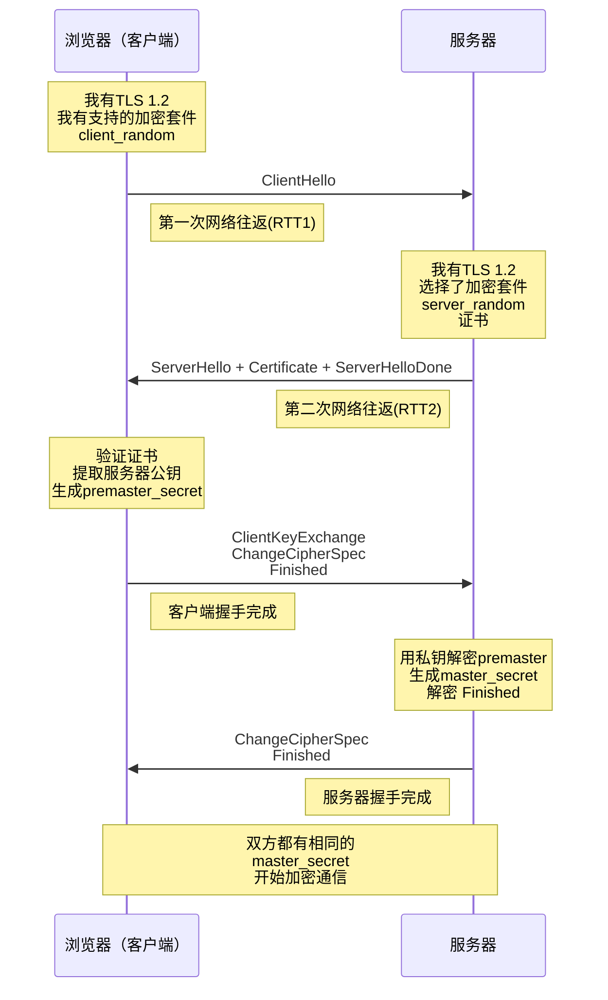
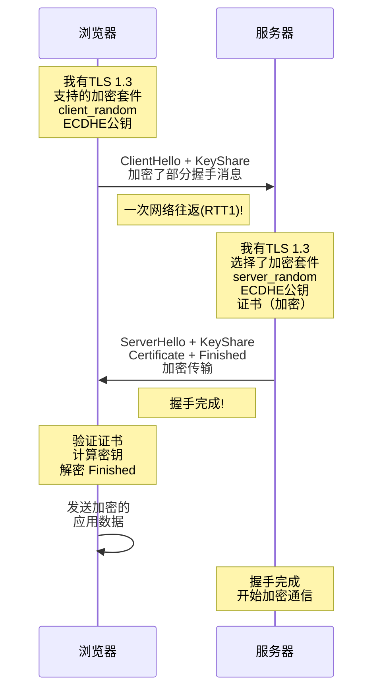
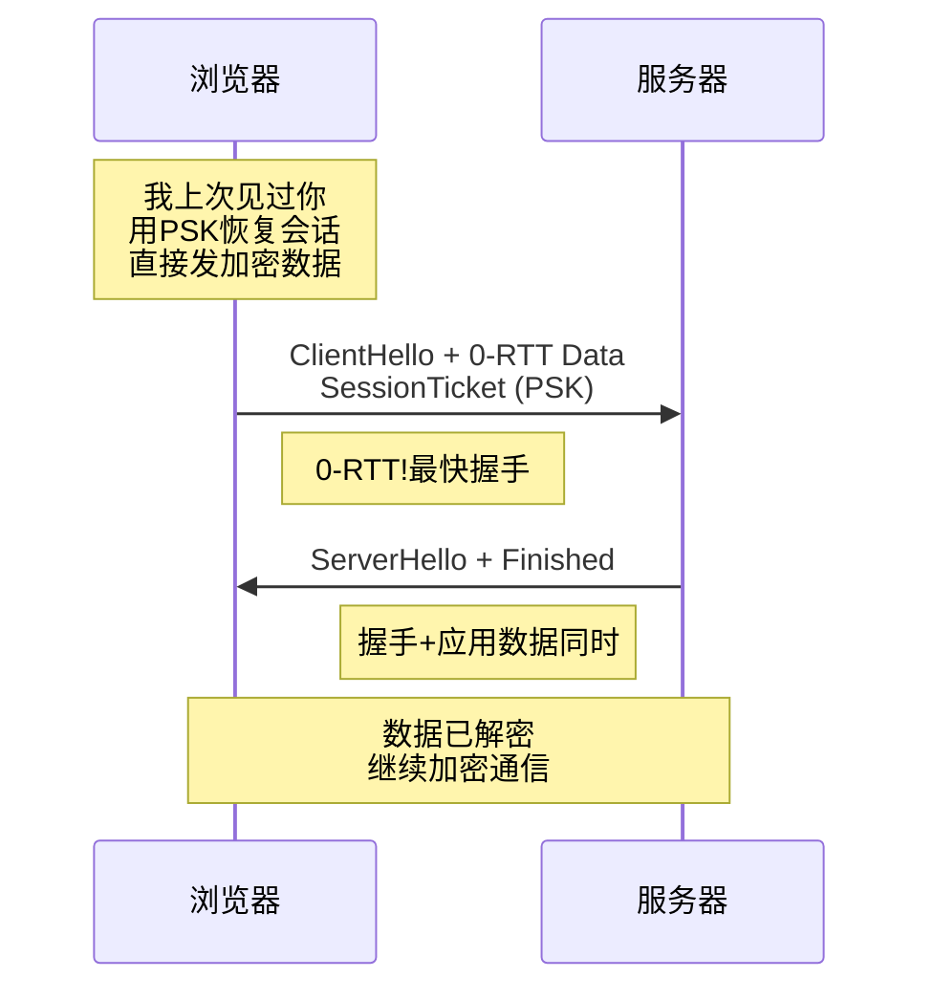

# TLS握手流程深度解析

面试官问："HTTPS的连接建立过程是怎样的？"

候选人小王说："浏览器和服务器交换密钥，然后开始加密通信。"

面试官追问："具体交换了什么？用到了哪些算法？用了几个来回？"

小王说："好像是...三次握手？不对，TLS握手...两个来回？"

面试官继续："TLS 1.3把握手优化成了几次？"

小王彻底卡住了，额头开始冒汗...

TLS握手是面试中的高频问题，很多人只知道"加密传输"，不知道背后的细节流程。

今天我们就来把这个彻底讲清楚。

## 【直观类比】

### 现实中的握手

想象你去酒店入住：

1. 你向前台出示身份证 → **证明你是谁**
2. 前台验证后，给你一张房卡 → **授权你进入房间**
3. 以后你用房卡开门 → **快速身份验证**

TLS握手就是网络世界的"入住流程"，目的是在通信开始前建立安全通道。

### 为什么需要握手？

```
问题：在不安全的网络上，如何安全地传输数据？

挑战：
1. 对称密钥怎么传递？（密钥配送问题）
2. 怎么确认对方是真实的？（中间人攻击）
3. 怎么防止数据被篡改？（完整性问题）
4. 怎么防止重放攻击？（ replay attack）

TLS握手就是为了解决这四个问题
```

## TLS 1.2 握手流程

### 完整的2-RTT握手

**TLS 1.2**的经典握手需要两次网络往返（2-RTT）：



### 详细步骤拆解

#### 第一步：ClientHello（客户端发起）

```python
# ClientHello 消息内容
client_hello = {
    "tls_version": "TLS 1.2",          # 支持的最高TLS版本
    "client_random": random(32),       # 32字节随机数
    "cipher_suites": [                  # 支持的加密套件列表
        "TLS_ECDHE_RSA_WITH_AES_256_GCM_SHA384",
        "TLS_ECDHE_RSA_WITH_AES_128_GCM_SHA256",
        "TLS_RSA_WITH_AES_256_GCM_SHA384",
        # ... 更多套件
    ],
    "extensions": {
        "sni": "www.example.com",       # 服务器名称指示
        "alpn": ["h2", "http/1.1"],    # 协议协商
        "status_request": True          # OCSP stapling
    }
}
```

**SNI（Server Name Indication）**是虚拟主机托管的关键：
- 一个IP可能有多个域名
- 没有SNI，服务器不知道返回哪个证书
- TLS 1.3和现代浏览器都强制要求SNI

#### 第二步：ServerHello + Certificate（服务器响应）

```python
# ServerHello 消息内容
server_hello = {
    "tls_version": "TLS 1.2",          # 协商后的版本
    "server_random": random(32),        # 服务器随机数
    "cipher_suite": "TLS_ECDHE_RSA_WITH_AES_128_GCM_SHA256",
    # 选择了第一个双方都支持的ECDHE套件
}

# Certificate 消息
certificate_chain = [
    server_certificate,    # 服务器证书（包含公钥）
    intermediate_ca,      # 中间证书
    # ... 可能有多级中间证书
]
```

服务器返回证书链，浏览器需要验证整个链直到根证书。

#### 第三步：ClientKeyExchange（密钥生成）

```python
# 客户端密钥生成
client_key_exchange = {
    # ECDHE密钥交换
    "client_ecdhe_params": {
        "curve": "secp256r1",          # 使用的椭圆曲线
        "public_key": G * d_client,    # 客户端公钥
    }
}

# 密钥计算
premaster_secret = ecdh_shared_secret(
    client_private_key,
    server_public_key
)

master_secret = PRF(
    premaster_secret,
    "master secret",
    client_random + server_random
)

# 生成会话密钥
session_keys = {
    "client_write_mac_key": ...,        # 客户端消息认证
    "server_write_mac_key": ...,        # 服务器消息认证
    "client_write_key": ...,           # 客户端加密密钥
    "server_write_key": ...,           # 服务器加密密钥
    "client_write_iv": ...,            # 客户端IV
    "server_write_iv": ...             # 服务器IV
}
```

#### ECDHE密钥交换的数学原理

```python
# ECDHE（Elliptic Curve Diffie-Hellman Ephemeral）
# 双方各自生成临时密钥对

# 客户端：
client_private = random_scalar()           # 随机私钥
client_public = G * client_private          # 公钥 = 基点 * 私钥

# 服务器：
server_private = random_scalar()           # 随机私钥
server_public = G * server_private         # 公钥

# 共享密钥（双方独立计算，结果相同）：
# 客户端计算：server_public * client_private
# 服务器计算：client_public * server_private
# 数学上：(G * s) * c = G * (s * c) = G * (c * s) = (G * c) * s

shared_secret = client_public * server_private
```

**ECDHE的优势：前向安全性（Forward Secrecy）**
- 即使服务器私钥泄露，历史通信仍然安全
- 因为每次连接使用不同的临时密钥对

#### 第四步：Finished（握手完成）

```python
# Finished 消息
finished = {
    "verify_data": PRF(
        master_secret,
        "client finished",
        hash(all_handshake_messages)
    )
}

# 双方验证：
# 1. 解密对方的 Finished 消息
# 2. 用握手消息的哈希验证是否被篡改
# 3. 如果验证通过，说明握手成功
```

## TLS 1.3：握手优化

### 核心改进：1-RTT握手

**TLS 1.3**把握手从2-RTT优化到了1-RTT：



### TLS 1.3 vs TLS 1.2

| 特性 | TLS 1.2 | TLS 1.3 |
| --- | --- | --- |
| 握手RTT | 2-RTT | 1-RTT |
| 密钥交换 | RSA / DH / ECDH / ECDHE | 强制ECDHE |
| 证书加密 | 明文传输 | 握手完成后加密 |
| 支持的加密套件 | 几百个 | 只有5个 |
| 0-RTT恢复 | 可选 | 支持（可选） |
| 前向安全 | 可选（ECDHE） | 强制（废弃RSA密钥传输） |

### TLS 1.3的5个加密套件

```python
# TLS 1.3 只支持5个加密套件
TLS1.3_AES_128_GCM_SHA256         # AES-128-GCM + SHA-256
TLS1.3_AES_256_GCM_SHA384         # AES-256-GCM + SHA-384
TLS1.3_CHACHA20_POLY1305_SHA256   # ChaCha20-Poly1305 + SHA-256
TLS1.3_AES_128_CCM_SHA256         # AES-128-CCM + SHA-256
TLS1.3_AES_128_CCM_8_SHA256      # AES-128-CCM-8 + SHA-256
```

### TLS 1.3的秘密密钥派生

```python
# TLS 1.3 密钥派生（更简洁）
derived_secrets = HKDF-Extract(
    ecdh_shared_secret,
    transcript_hash(ClientHello, ServerHello)
)

# 早期数据密钥（0-RTT）
early_data_key = Derive-Secret(derived_secrets, "client early traffic secret")

# 握手密钥（用于加密Server Certificate）
handshake_key = Derive-Secret(derived_secrets, "handshake traffic secret")

# 主密钥（用于加密应用数据）
application_key = Derive-Secret(
    HKDF-Expand-Label(master_secret, "derived", transcript_hash()),
    "application traffic secret"
)
```

## 0-RTT恢复：更快但有代价

### 什么是0-RTT？

**0-RTT**允许在第一次握手中就发送应用数据，完全消除了握手延迟：



### 0-RTT的问题

:::warning ⚠️
0-RTT存在**重放攻击（Replay Attack）**风险：

```
问题：
- 0-RTT数据不是前向安全的
- 攻击者可以截获并重放相同的消息
- 服务器可能把0-RTT请求当作"新的"请求处理

使用场景限制：
- 只适合幂等的GET请求
- 不适合POST等非幂等操作
- 需要业务层做幂等设计
```

GitHub在2018年禁用了0-RTT，因为发现了重放攻击的潜在风险。
:::

## TLS握手的完整验证

### 浏览器验证证书的全过程

```python
def verify_certificate(cert_chain):
    # 1. 提取证书链
    server_cert = cert_chain[0]
    intermediates = cert_chain[1:]
    
    # 2. 找到可信根证书
    root_ca = find_trusted_root(server_cert.subject)
    
    # 3. 构建完整链并验证
    # 中间证书1 → 中间证书2 → ... → 根证书
    verify_chain(intermediates + [server_cert], root_ca)
    
    # 4. 检查证书吊销
    for cert in cert_chain:
        if is_revoked(cert):
            raise CertificateRevokedError()
    
    # 5. 检查时间有效性
    if not (cert.valid_from <= now <= cert.valid_to):
        raise CertificateExpiredError()
    
    # 6. 检查域名匹配
    if not domain_matches(server_cert, target_domain):
        raise DomainMismatchError()
    
    return True
```

### 域名验证（SAN检查）

```python
def domain_matches(cert, hostname):
    """
    浏览器检查证书是否匹配域名
    """
    # 1. 检查Subject Alternative Names (SAN)
    for san in cert.san:
        if san.type == DNS_NAME:
            if match_dns_pattern(san.value, hostname):
                return True
        if san.type == IP_ADDRESS:
            if san.value == hostname:
                return True
    
    # 2. 降级到Common Name（已废弃）
    if cert.cn == hostname:
        return True
    
    return False

def match_dns_pattern(pattern, hostname):
    """
    支持通配符：*.example.com 匹配 www.example.com
    但 *.com 不匹配 www.com
    * 不能匹配有多个label的域名
    """
    if pattern.startswith('*.'):
        suffix = pattern[2:]
        return hostname.endswith(suffix) and hostname.count('.') >= suffix.count('.') + 1
    return pattern == hostname
```

## HTTPS连接的性能优化

### TCP + TLS握手总耗时

```
TCP握手：1-RTT
TLS 1.2握手：2-RTT
总计：3-RTT（TLS 1.2）

TCP握手：1-RTT
TLS 1.3握手：1-RTT
总计：2-RTT（TLS 1.3）
```

对于一个物理距离100ms的服务器，握手耗时：
- TLS 1.2：300ms
- TLS 1.3：200ms

### 优化策略

#### 1. TLS会话恢复

```python
# Session Resumption：复用之前的master_secret
# 不需要完整的密钥交换

# 方式1：Session ID
client_hello = {
    "session_id": "上次会话ID"
}
# 服务器返回相同的session_id，跳过密钥交换
# 直接用之前协商的密钥

# 方式2：Session Ticket（PSK）
client_hello = {
    "psk": "上次会话的ticket"
}
# 0-RTT可能，实现更简单
```

#### 2. OCSP装订

```python
# 服务器提前获取OCSP响应
ocsp_response = server.fetch_ocsp_from_ca()

# TLS握手时附带OCSP响应
server_hello = {
    "certificate": server_cert,
    "certificate_status": {
        "type": "ocsp",
        "response": ocsp_response
    }
}
# 浏览器不需要额外查询OCSP服务器
```

#### 3. 证书预取和预验证

```html
<!-- 在HTML中提前声明证书 -->
<link rel="preconnect" href="https://api.example.com">
<!-- 浏览器提前建立连接，验证证书 -->
```

#### 4. HTTP/2多路复用

```
HTTP/1.1：
  连接1 → GET /index.html
  连接2 → GET /style.css
  连接3 → GET /app.js
  每个连接都要TLS握手

HTTP/2：
  连接1 → GET /index.html
       → GET /style.css
       → GET /app.js
  复用同一个TLS连接
```

## 常见误区

### 误区1：HTTPS比HTTP慢

**错误**。现代TLS 1.3的握手只有1-RTT，加上TCP 1-RTT，总共2-RTT。对于延迟100ms的连接，握手只需要200ms。

HTTP/1.1在慢启动下，传输一个页面可能需要几秒。HTTPS的性能差距可以忽略不计。

### 误区2：证书验证就是检查有效期

**错误**。证书验证包括：
1. 签名验证（证书链到根）
2. 吊销检查（CRL或OCSP）
3. 有效期检查
4. 域名匹配检查
5. 用途检查（Key Usage扩展）

### 误区3：TLS 1.3强制禁用RSA

**部分正确**。TLS 1.3废弃了**RSA密钥传输**（RSA key transport），但**RSA签名**仍然可用。

RSA密钥传输的问题：不支持前向安全。
RSA签名的问题：证书本身就是RSA签名，这是必须的。

### 误区4：ECDHE比RSA慢

**错误**。ECDHE的密钥交换比RSA密钥传输**更快**，因为：
- RSA加密大数运算慢
- ECDHE只涉及椭圆曲线点乘，相对快

TLS 1.3强制使用ECDHE，正是为了性能。

## 记忆技巧

### 口诀

> **TLS 1.2：ClientHello、ServerHello、证书换、密钥生，2-RTT**
> **TLS 1.3：一次往返就搞定，ECDHE必须用，前向安全是标配**
> **证书链：叶子中间根，层层验证到根**
> **0-RTT：快是快，有重放，幂等请求才使用**

### 握手对比表

| TLS版本 | 握手RTT | 前向安全 | 0-RTT | 加密套件数 |
| --- | --- | --- | --- | --- |
| 1.2 | 2 | 可选 | 可选 | 300+ |
| 1.3 | 1 | 强制 | 可选 | 5 |

## 实战检验

### 检验1：分析一个HTTPS请求

**场景**：用Wireshark抓包，看到ClientHello...

**分析思路**：
```
1. 看TLS版本：是否支持1.3
2. 看加密套件：服务器选择了哪个
3. 看KeyShare：ECDHE公钥交换
4. 看证书链：有哪些中间证书
5. 看时间：握手耗时多少
```

### 检验2：排查HTTPS连接失败

**场景**：用户反馈"某些网站打不开"

**排查步骤**：
```
1. 检查系统时间（证书有效期）
2. 检查根证书是否损坏（重装根证书包）
3. 检查代理/防火墙设置
4. 检查是否被中间人劫持
5. 用 openssl s_client -connect 测试
```

### 检验3：选择TLS配置

**场景**：配置Nginx的TLS

**推荐配置**：
```nginx
ssl_protocols TLSv1.2 TLSv1.3;
ssl_ciphers TLS_AES_256_GCM_SHA384:TLS_CHACHA20_POLY1305_SHA256:TLS_AES_128_GCM_SHA256;
ssl_prefer_server_ciphers on;
ssl_session_cache shared:SSL:10m;
ssl_session_timeout 1d;
ssl_stapling on;
ssl_stapling_verify on;
```

【面试官心理】

面试官问TLS握手，其实是在测试你对"连接建立过程"的理解。知道TLS 1.2是2-RTT握手是60分，知道TLS 1.3优化到1-RTT是80分，知道ECDHE和前向安全是90分，如果还能讲清楚0-RTT的权衡和证书验证细节，那就是P7的水平了。

---

## 延伸阅读

- [HTTPS与HTTP区别](/cs/security/https-vs-http) - HTTPS的整体安全机制
- [数字签名与数字证书](/cs/security/digital-signature) - 证书在握手中的应用
- [对称加密 vs 非对称加密](/cs/security/symmetric-asymmetric) - 握手中的密钥交换原理
