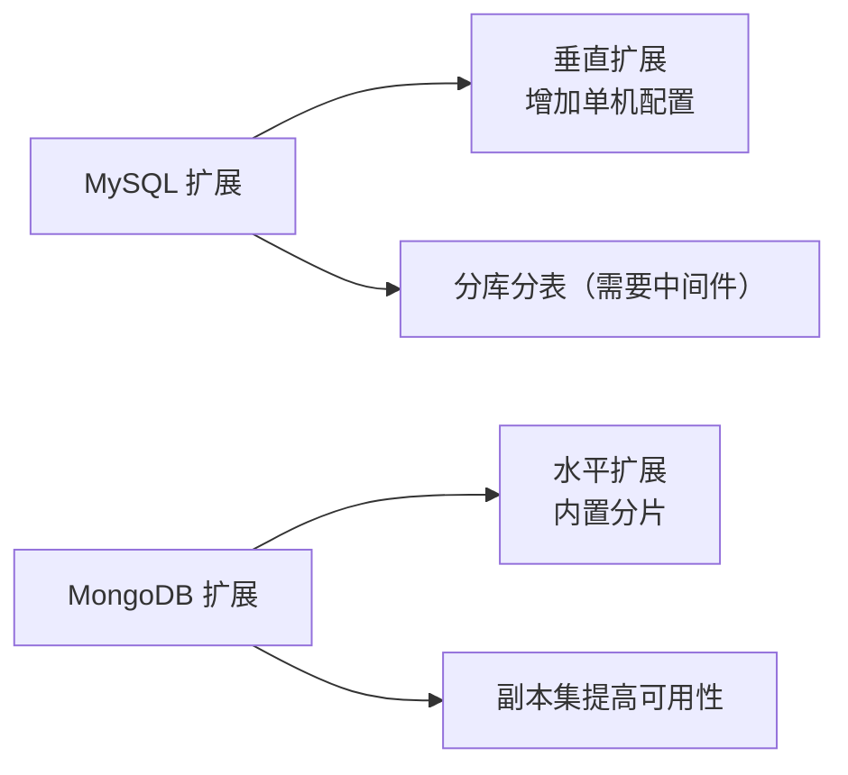

# MongoDB 与 MySQL 对比

面试官问："你们项目为什么用 MongoDB 而不是 MySQL？"

候选人小冯答："因为 MongoDB 性能更好..."

面试官追问："性能好在哪里？什么场景下 MySQL 比 MongoDB 更合适？"

小冯答不上来。

【面试官心理】
这道题考查的是候选人对数据库选型的理解。能说清楚 MongoDB 和 MySQL 的适用场景，说明真正做过技术选型评估，而不是盲目追新。

---

## 一、核心差异概览

| 维度 | MySQL | MongoDB |
| --- | --- | --- |
| 数据库类型 | 关系型数据库（RDBMS） | 文档型数据库（NoSQL） |
| 数据模型 | 表（行与列） | 文档（BSON/JSON） |
| 模式 | 固定模式（Schema） | 动态模式（Flexible Schema） |
| 事务 | 支持完整 ACID 事务 | 支持单文档事务（4.0+） |
| JOIN | 支持多表 JOIN | 不支持 JOIN，用嵌入替代 |
| 扩展性 | 垂直扩展为主 | 水平扩展（分片）更易 |
| 索引 | B+Tree 索引 | B-Tree 索引 |
| SQL | 使用 SQL 查询 | 使用 MongoDB Query Language |

---

## 二、数据模型对比

### 2.1 MySQL：关系模型

```sql
-- 用户表
CREATE TABLE users (
    id INT PRIMARY KEY,
    name VARCHAR(50),
    email VARCHAR(100)
);

-- 订单表
CREATE TABLE orders (
    id INT PRIMARY KEY,
    user_id INT,
    product VARCHAR(100),
    price DECIMAL(10, 2),
    FOREIGN KEY (user_id) REFERENCES users(id)
);

-- 查询用户及其订单
SELECT u.name, o.product, o.price
FROM users u
JOIN orders o ON u.id = o.user_id
WHERE u.id = 1;
```

### 2.2 MongoDB：文档模型

```javascript
// 用户文档
{
    "_id": ObjectId("..."),
    "name": "张三",
    "email": "zhang@example.com",
    "orders": [
        {
            "product": "iPhone",
            "price": 6999
        },
        {
            "product": "MacBook",
            "price": 9999
        }
    ]
}
```

**MongoDB 的嵌入模式**：订单直接嵌入用户文档中，不需要 JOIN。

```javascript
// 查询用户及其订单（一条查询）
db.users.findOne({ "_id": 1 })
```

:::tip 💡
MongoDB 的嵌入模式适合"一对少"（one-to-few）关系。对于"一对多"（one-to-many）或"多对多"，需要考虑引用（Reference）而非嵌入。
:::

---

## 三、模式设计对比

### 3.1 MySQL 的固定模式

```sql
CREATE TABLE products (
    id INT PRIMARY KEY AUTO_INCREMENT,
    name VARCHAR(100) NOT NULL,
    price DECIMAL(10, 2) NOT NULL,
    created_at TIMESTAMP DEFAULT CURRENT_TIMESTAMP
);

-- 字段类型在创建时就固定
-- 添加新字段需要 ALTER TABLE
ALTER TABLE products ADD COLUMN description TEXT;
```

### 3.2 MongoDB 的灵活模式

```javascript
// 文档 A
{
    "_id": 1,
    "name": "iPhone",
    "price": 6999
}

// 文档 B（不同的字段）
{
    "_id": 2,
    "name": "Samsung",
    "price": 5999,
    "description": "三星手机",
    "rating": 4.5  // 新增字段，无需修改表结构
}
```

:::warning ⚠️
MongoDB 的"无模式"不等于"无结构"。实际上应该设计好集合的结构，只是可以动态添加字段。生产环境中，提前设计好数据结构能避免性能问题和数据混乱。
:::

---

## 四、事务能力对比 🔴

### 4.1 MySQL 完整事务支持

```sql
START TRANSACTION;

UPDATE accounts SET balance = balance - 1000 WHERE user_id = 1;
UPDATE accounts SET balance = balance + 1000 WHERE user_id = 2;

-- 如果任何一步失败，自动回滚
COMMIT;  -- 或 ROLLBACK;
```

### 4.2 MongoDB 单文档事务（JDK 4.0+）

```javascript
// 单个文档内的操作是原子的
db.accounts.updateOne(
    { user_id: 1 },
    { $inc: { balance: -1000 } }
);
db.accounts.updateOne(
    { user_id: 2 },
    { $inc: { balance: 1000 } }
);

// 跨文档事务（4.0+）
session = db.getMongo().startSession();
session.startTransaction();
try {
    session.getDatabase("shop").accounts.updateOne(
        { user_id: 1 },
        { $inc: { balance: -1000 } }
    );
    session.getDatabase("shop").accounts.updateOne(
        { user_id: 2 },
        { $inc: { balance: 1000 } }
    );
    session.commitTransaction();
} catch (e) {
    session.abortTransaction();
}
```

:::warning ⚠️
MongoDB 的多文档事务有性能开销，生产环境中应尽量把相关数据放在同一个文档中，用嵌入代替跨文档事务。
:::

---

## 五、JOIN 能力对比

### 5.1 MySQL 原生支持 JOIN

```sql
-- 多表 JOIN
SELECT u.name, COUNT(o.id) as order_count
FROM users u
LEFT JOIN orders o ON u.id = o.user_id
GROUP BY u.id;
```

### 5.2 MongoDB 不支持 JOIN，推荐聚合管道

```javascript
// $lookup 替代 LEFT JOIN
db.users.aggregate([
    {
        $lookup: {
            from: "orders",
            localField: "_id",
            foreignField: "user_id",
            as: "user_orders"
        }
    },
    {
        $project: {
            "name": 1,
            "order_count": { $size: "$user_orders" }
        }
    }
])
```

---

## 六、性能与扩展性对比 🔴

### 6.1 MySQL 性能特点

- **读密集型**：B+Tree 索引使得范围查询非常高效
- **关联查询**：JOIN 操作在数据量适中时性能良好
- **垂直扩展**：通过增加机器配置提升性能
- **水平扩展**：分库分表实现困难，需要中间件

### 6.2 MongoDB 性能特点

- **写密集型**：无模式设计减少了写入时的约束检查
- **水平扩展**：内置分片功能，数据自动分布到多个节点
- **文档更新**：单文档原子操作，无锁竞争

```javascript
// MongoDB 分片示例
sh.shardCollection("shop.orders", { "user_id": "hashed" })
```

**扩展性对比**：



---

## 七、适用场景对比 🟡

### 7.1 选 MySQL 的场景

- **强事务需求**：金融、支付、订单等需要完整 ACID 事务的场景
- **复杂关联查询**：多表 JOIN、聚合查询
- **结构化数据**：字段类型固定、数据关系复杂
- **数据一致性要求高**：强一致性业务

**典型场景**：
- 电商订单系统
- 银行账户系统
- ERP 系统

### 7.2 选 MongoDB 的场景

- **快速迭代**：字段经常变化，模式不固定
- **大数据量**：需要水平扩展，日志、埋点数据
- **文档模型自然**：JSON 数据、对象存储
- **高并发写入**：无事务约束的日志、监控数据

**典型场景**：
- 社交 Feed流
- 物联网 sensor 数据
- 快速迭代的 MVP 产品
- 用户行为分析

---

## 八、面试官追问 🔴

**面试官**："MongoDB 的索引和 MySQL 的索引有什么区别？"

**标准回答**：
- MongoDB 使用 B-Tree 索引（不是 B+Tree）
- MongoDB 的索引可以建在任何嵌套字段上，包括数组字段
- MongoDB 支持索引覆盖（covering index）
- 两者都使用相同的索引类型（B-Tree/B+Tree），但优化策略不同

**面试官追问**："MongoDB 适合做金融系统吗？为什么？"

**标准回答**：
- JDK 4.0+ 支持多文档事务，但性能不如 MySQL
- 金融系统需要强一致性、复杂报表JOIN，MySQL 更成熟
- 但如果并发写入量大、数据结构灵活，MongoDB 也能胜任

**面试官追问**："你们项目是怎么做技术选型的？"

**标准回答**：从数据模型是否灵活、事务需求强弱、并发量、数据规模、团队熟悉度等维度综合评估，而不是盲目追新。

---

## 九、总结

MongoDB 和 MySQL 不是非此即彼的关系，而是**互补的**：

- **MySQL**：结构化数据、强事务、复杂查询
- **MongoDB**：灵活模型、大数据量、高并发写入

实际项目中，根据业务场景选择合适的数据库，甚至可以**混合使用**——核心数据放 MySQL，非核心数据放 MongoDB。
