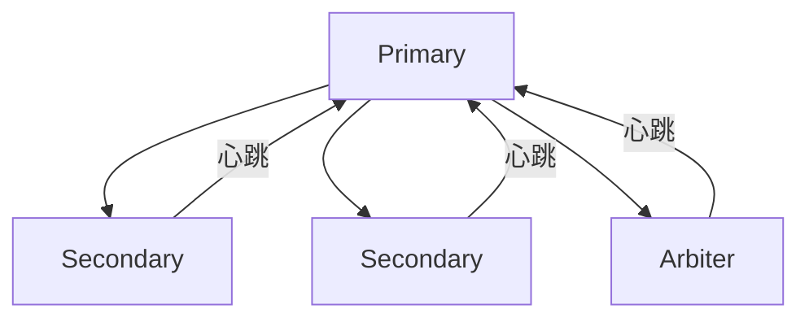
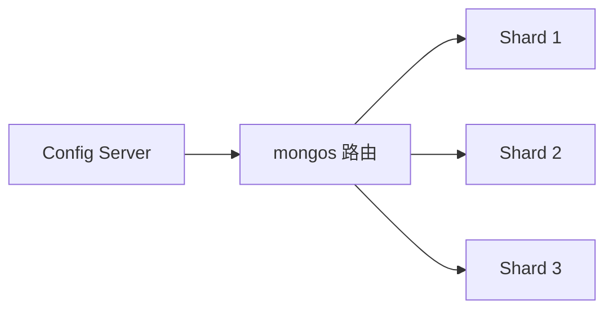

# MongoDB 文档型实战

MongoDB 是互联网公司存储半结构化数据的标配，但大多数候选人对它的理解只停留在"像 JSON 一样存数据"。

我面试过太多人说用过 MongoDB，结果问到副本集原理就卡壳，问到聚合管道就只会 `$match` 和 `$group`，问到索引设计原则就一脸懵。这不是"用过"，这是"见过"。

这个模块，帮你把 MongoDB 从"见过"变成"真正掌握"。

## 一、数据模型与 CRUD 🔴

### 1.1 文档结构

MongoDB 以 BSON 格式存储文档，概念对应关系：

| SQL 概念 | MongoDB 概念 |
| --- | --- |
| Database | Database |
| Table | Collection |
| Row | Document |
| Column | Field |
| Index | Index |
| Join | `$lookup` 聚合 |

**嵌套文档示例**

```json
{
  "_id": ObjectId("..."),
  "username": "zhangsan",
  "profile": {
    "age": 28,
    "city": "Beijing",
    "tags": ["Java", "Redis", "MySQL"]
  },
  "orders": [
    { "orderId": "A1001", "amount": 299 },
    { "orderId": "A1002", "amount": 599 }
  ]
}
```

**面试官心理**
我问他 MongoDB 和 MySQL 的本质区别，十个候选人八个说"NoSQL vs SQL"。这是无效回答。我真正想听的是：MongoDB 的文档模型天然支持嵌套，MySQL 需要拆表做外键关联；MongoDB 适合读多写少的场景，MySQL 适合强事务的场景。能说出这个的才是真正理解过的。

### 1.2 常用 CRUD 操作

```javascript
// 插入
db.users.insertOne({ username: "zhangsan", age: 28 })
db.users.insertMany([...])

// 查询
db.users.find({ age: { $gte: 18 } })           // 条件查询
db.users.find({ "profile.city": "Beijing" })   // 嵌套字段
db.users.find({}, { username: 1, _id: 0 })     // 投影，只返回 username

// 更新
db.users.updateOne(
  { username: "zhangsan" },
  { $set: { age: 29 } }
)

// 批量更新
db.users.updateMany(
  { status: "inactive" },
  { $set: { status: "archived" } }
)

// 删除
db.users.deleteOne({ username: "zhangsan" })
```

### 1.3 数组查询

```javascript
// 查询数组包含某个元素
db.users.find({ tags: "Java" })

// 查询数组同时包含多个元素（顺序无关）
db.users.find({ tags: { $all: ["Java", "Redis"] } })

// 按数组元素数量查询
db.users.find({ orders: { $size: 3 } })  // 正好 3 个订单
```

**面试官心理**
数组查询是 MongoDB 的高频考点。我会追问：`$all` 和 `$in` 的区别是什么？只会背的会说"都是查数组"。正确答案是：`$in` 匹配字段值在列表中，`$all` 匹配字段包含所有指定元素（顺序无关）。`$in` 可以匹配单个元素，`$all` 必须全部匹配。

## 二、聚合管道 🔴

### 2.1 管道基础

```javascript
db.orders.aggregate([
  // $match：过滤（尽量靠前，减少数据量）
  { $match: { status: "completed" } },

  // $group：分组聚合
  { $group: {
      _id: "$userId",
      totalAmount: { $sum: "$amount" },
      orderCount: { $sum: 1 }
  }},

  // $sort：排序
  { $sort: { totalAmount: -1 } },

  // $limit：取 Top N
  { $limit: 10 },

  // $project：投影
  { $project: {
      userId: "$_id",
      totalAmount: 1,
      _id: 0
  }}
])
```

### 2.2 常用聚合操作符

| 操作符 | 作用 | 示例 |
| --- | --- | --- |
| `$sum` | 求和 | `{ $sum: "$amount" }` |
| `$avg` | 平均值 | `{ $avg: "$score" }` |
| `$min` / `$max` | 最小/最大值 | `{ $max: "$price" }` |
| `$push` | 聚合到数组 | `{ $push: "$product" }` |
| `$lookup` | 左连接 | 关联其他集合 |

### 2.3 $lookup 关联查询

```javascript
// 关联 users 集合
db.orders.aggregate([
  { $match: { status: "completed" } },
  { $lookup: {
      from: "users",           // 关联的集合
      localField: "userId",    // 本地字段
      foreignField: "_id",     // 关联字段
      as: "userInfo"           // 输出字段名
  }},
  { $unwind: "$userInfo" },
  { $project: {
      orderId: 1,
      amount: 1,
      username: "$userInfo.username"
  }}
])
```

**面试官心理**
`$lookup` 我会追问两个问题：第一，`$unwind` 干什么用的？不 unwind 行不行？第二，为什么 `$lookup` 不能像 SQL JOIN 那样直接用？答出"因为 MongoDB 是文档数据库，嵌套结构不需要每次都关联"的，说明理解了这个设计哲学。

## 三、索引策略 🔴

### 3.1 索引类型

```javascript
// 单字段索引
db.users.createIndex({ username: 1 })

// 复合索引（最左前缀原则）
db.users.createIndex({ city: 1, age: 1, username: 1 })

// 多键索引（数组字段）
db.users.createIndex({ tags: 1 })

// 文本索引（全文搜索）
db.products.createIndex({ description: "text" })

// 地理空间索引
db.stores.createIndex({ location: "2dsphere" })
```

### 3.2 复合索引设计原则

```javascript
// 查询条件：{ city: "Beijing", age: { $gte: 18 }, username: "zhang*" }
// 排序条件：{ createTime: -1 }

// 正确顺序： equality(精确匹配) -> range(范围) -> sort(排序)
// 索引：{ city: 1, age: 1, createTime: -1 }
// 注意：username 的模糊查询不走索引，所以不放索引中
```

**面试官心理**
复合索引的顺序是 MongoDB 面试的重灾区。我会问：" `{ age: 1, city: 1 }` 和 `{ city: 1, age: 1 }` 有什么区别？"只会背"最左前缀"的没理解本质。正确答案是：第一个索引只能命中 `age` 或 `age + city`，第二个索引只能命中 `city` 或 `city + age`。查询模式决定索引顺序，不是固定的"谁在前面"。

### 3.3 索引命中分析

```javascript
// 查看查询是否命中索引
db.users.find({ city: "Beijing" }).explain("executionStats")
```

| 字段 | 含义 |
| --- | --- |
| `winningPlan.stage` | COLLSCAN（全表扫描）/ IXSCAN（索引扫描） |
| `totalKeysExamined` | 扫描的索引键数量 |
| `totalDocsExamined` | 扫描的文档数量 |
| `executionTimeMillis` | 执行时间 |

**面试官心理**
我会问："`totalKeysExamined` 和 `totalDocsExamined` 的关系是什么？"答"越小越好"的没理解索引原理。正确答案是：如果 `totalDocsExamined` 远大于返回文档数，说明可能需要回表或索引选择不当。理想情况是 `totalKeysExamined` 接近 `nReturned`。

## 四、副本集与高可用 🟡

### 4.1 副本集架构



- **Primary**：接收所有写操作
- **Secondary**：从 Primary 异步复制
- **Arbiter**：只参与投票，不存数据

### 4.2 故障转移

```javascript
// 手动触发选举
rs.freeze(300)  // 冻结 300 秒，禁止成为 Primary
rs.stepDown()   // 主动让出 Primary
```

**面试官心理**
副本集故障转移是生产高频问题。我会问："Primary 宕机后，什么时候会重新选主？"只会说"自动切换"的没实战经验。正确答案是：10 秒内 Primary 没响应，心跳超时，触发选举。选举需要多数派同意，所以副本集至少要 3 个节点或 2+1 Arbiter。

### 4.3 数据同步

- **Initial Sync**：全量同步，从 Primary 拉取所有数据
- **Replication**：增量同步，用 oplog 重放操作

```javascript
// 查看复制状态
db.printReplicationInfo()
// 查看从节点延迟
db.printSlaveReplicationInfo()
```

## 五、分片集群 🟡

### 5.1 分片架构



- **mongos**：路由节点，不存数据，转发请求
- **shard**：数据节点，存储分片数据
- **config server**：存储元数据（片键 -> shard 映射）

### 5.2 片键选择原则

- **选择区分度高的字段**：如 `userId`、`orderId`
- **避免单一热点**：如 `status`（只有几个值）
- **避免随机写入**：如 `ObjectId`（会导致数据不集中）

**面试官心理**
片键选择是 P7 的高频考点。我会问："如果我用 `userId` 做片键，查询单个用户的时候，mongos 怎么路由的？"只会说"自动路由"的没研究过原理。正确答案是：mongos 先查 config server，找到目标 shard，直接路由过去，不需要广播全部分片。

## 六、面试题分级速查

| 级别 | 高频问题 | 期望回答 |
| --- | --- | --- |
| P5 | CRUD 操作、聚合管道基础、索引类型 | 能完成基本操作，不怵基础追问 |
| P6 | 复合索引设计、副本集原理、数据同步 | 能优化查询，有实战经验 |
| P7 | 片键设计、分片集群、高可用方案 | 有架构视野，能设计分布式存储 |

## 七、学习路径指引

**P5 阶段（会用）**
- 搞懂文档模型和 CRUD 操作
- 会用 `$match`、`$group`、`$project`
- 理解单字段索引和复合索引的区别

**P6 阶段（精通）**
- 能设计合理的复合索引
- 理解副本集故障转移原理
- 能分析慢查询并优化

**P7 阶段（架构）**
- 能设计分片策略和片键
- 理解 MongoDB 的局限性
- 有生产环境运维和调优经验

---

:::tip 💡
MongoDB 面试的核心是"文档模型思维"：不要用 SQL 的思维去套 MongoDB，理解嵌入式文档和关联文档的取舍，才能真正用好 MongoDB。
:::
