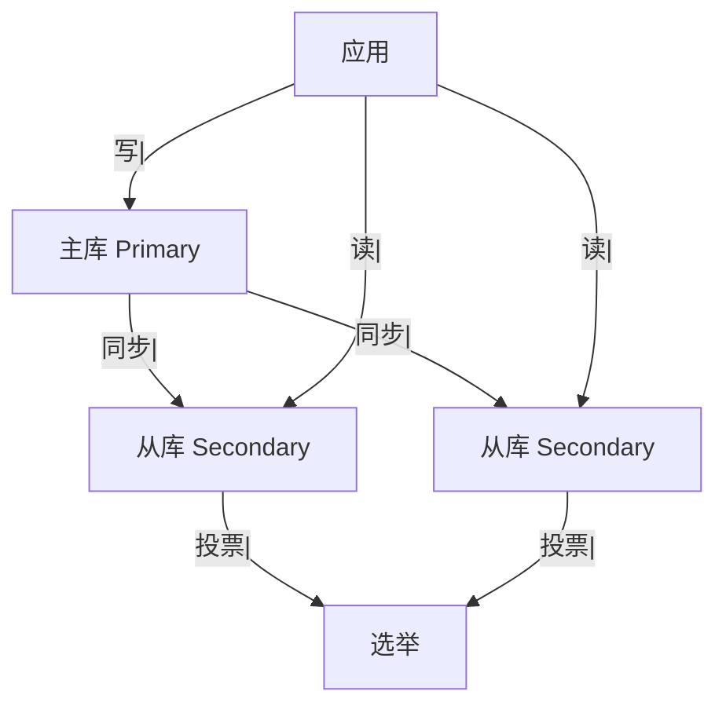
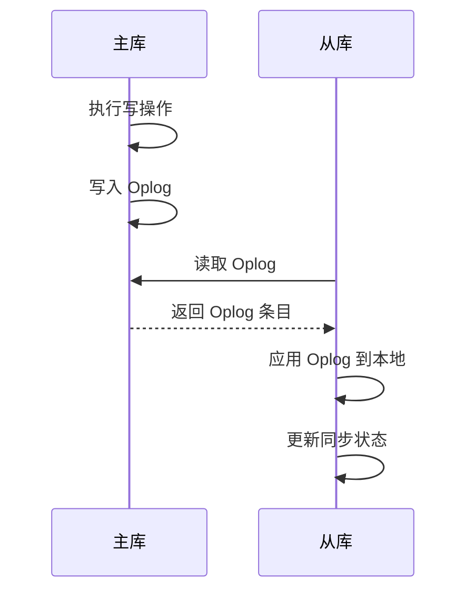

候选人小张在字节 P6 面试中，面试官问：

"MongoDB 怎么实现高可用？"

小张说："用复制集，一主多从。"

面试官追问："主库挂了怎么选新主库？"

小张说："投票...多数原则？"

面试官继续追问："投票是怎么算的？arbiter 是什么？"

小张答不上来了。

【面试官心理】
这道题我用来测试候选人对 MongoDB 高可用机制的理解深度。能说出复制集的占 60%，能讲清选举机制的占 20%，能说清 arbiter 和 oplog 的占 10%。

## 一、复制集架构 🔴

### 1.1 基本架构



### 1.2 复制集成员

| 角色 | 说明 | 可投票 | 可选主 |
| --- | --- | --- | --- |
| Primary | 主节点，处理所有写操作 | ✅ | ✅ |
| Secondary | 从节点，复制主节点数据 | ✅ | ✅ |
| Arbiter | 仲裁节点，不存储数据 | ✅ | ❌ |
| Delayed Secondary | 延迟从节点，用于数据恢复 | ✅ | ❌ |

### 1.3 复制集配置

```javascript
// 初始化复制集
rs.initiate({
    _id: "rs0",
    members: [
        { _id: 0, host: "mongodb0:27017", priority: 2 },
        { _id: 1, host: "mongodb1:27017", priority: 1 },
        { _id: 2, host: "mongodb2:27017", priority: 1 }
    ]
});
```

## 二、数据同步机制 🔴

### 2.1 Oplog

```javascript
// Oplog (Operations Log) 是复制集的核心
// 每个主节点都有一个 local.oplog.rs 集合

// Oplog 记录所有写操作
db.oplog.rs.find().sort({ts: -1}).limit(1)

// Oplog 结构
{
    ts: Timestamp(1234567890, 1),  // 操作时间戳
    t: 1,                          // 选举编号
    h: 1234567890,                // 操作哈希
    op: "i",                      // 操作类型: i=insert, u=update, d=delete
    ns: "test.users",            // 命名空间
    o: { name: "张三", age: 25 }  // 操作文档
}
```

### 2.2 同步过程



### 2.3 同步类型

```javascript
// Initial Sync：初始同步（全量复制）
// 从库加入复制集时的首次同步

// Steady Sync：增量同步
// 从库已经同步过，通过 Oplog 增量同步

// Resync：重新同步
// 从库数据落后太多时重新同步
```

## 三、选举机制 🟡

### 3.1 选举触发条件

```javascript
// 触发选举的条件：
// 1. 主库不可用
// 2. 从库发现主库心跳超时
// 3. 管理员手动触发
db.adminCommand({replSetStepDown: true})
```

```javascript
// 心跳超时配置
// 默认 10 秒内没有收到心跳，认为主库不可用
```

### 3.2 选举算法

```javascript
// MongoDB 使用 Bully 算法 + 优先级的变体

// 选举优先级
// priority 越高的节点越容易成为主库
{
    priority: 2,  // 默认 1，可设置 0-1000
}

// 选举步骤：
// 1. 从库检测到主库不可用
// 2. 从库发起选举请求
// 3. 其他节点投票
// 4. 得到多数票的节点成为新主库
```

### 3.3 多数原则

```javascript
// 多数原则：超过一半的投票成员同意

// 3 节点复制集：需要 2 票
// 5 节点复制集：需要 3 票

// Arbiter 不存储数据，但可以投票
// 用于解决平票问题
{
    _id: 3,
    host: "arbiter:27017",
    arbiterOnly: true
}
```

## 四、读写策略 🟡

### 4.1 读偏好设置

```javascript
// 默认：读主库
db.users.find().readPref("primary")

// 读从库
db.users.find().readPref("secondaryPreferred")

// 最近从库
db.users.find().readPref("nearest")

// 标签匹配
db.users.find().readPref("secondary", [{dc: "beijing"}])
```

### 4.2 写策略

```javascript
// 默认：写入主库，等待主库确认
db.users.insert({name: "张三"})

// 写入多数节点
db.users.insert(
    {name: "张三"},
    {writeConcern: {w: "majority"}}
)

// 写入指定数量节点
db.users.insert(
    {name: "张三"},
    {writeConcern: {w: 2, wtimeout: 5000}}
)
```

### 4.3 Write Concern

```javascript
// Write Concern 级别
{w: 0}           // 不等待确认
{w: 1}           // 只等主库确认（默认）
{w: "majority"}  // 等多数节点确认
{w: 3}           // 等 3 个节点确认

// Journal 确认
{j: true}        // 等日志写入确认

// 超时
{wtimeout: 3000} // 等待超时（毫秒）
```

## 五、生产配置 🟡

### 5.1 推荐配置

```javascript
// 最小高可用配置：3 节点复制集
// 一主 + 两从

// 推荐配置
{
    _id: "rs0",
    members: [
        {
            _id: 0,
            host: "primary:27017",
            priority: 2,
            votes: 1
        },
        {
            _id: 1,
            host: "secondary1:27017",
            priority: 1,
            votes: 1
        },
        {
            _id: 2,
            host: "secondary2:27017",
            priority: 1,
            votes: 1
        }
    ],
    settings: {
        electionTimeoutMillis: 15000,  // 选举超时
        heartbeatTimeoutSecs: 10       // 心跳超时
    }
}
```

### 5.2 监控复制延迟

```javascript
// 查看复制延迟
db.adminCommand({replSetGetStatus: 1})

// 输出示例：
// "syncingTo": "primary:27017"
// "optime": Timestamp(1234567890, 1)
// "optimeDate": ISODate("2024-01-01T12:00:00Z")

// 复制延迟：主库 optime - 从库 optime
```

:::tip 💡
生产环境中，建议监控复制延迟和 Oplog 大小。如果从库延迟过大，可能是网络问题或从库负载过高。
:::

【面试官心理】
能说出"arbiter 不存储数据但可以投票"的候选人，基本都理解 MongoDB 复制集的原理。这是 P6 的水准。
