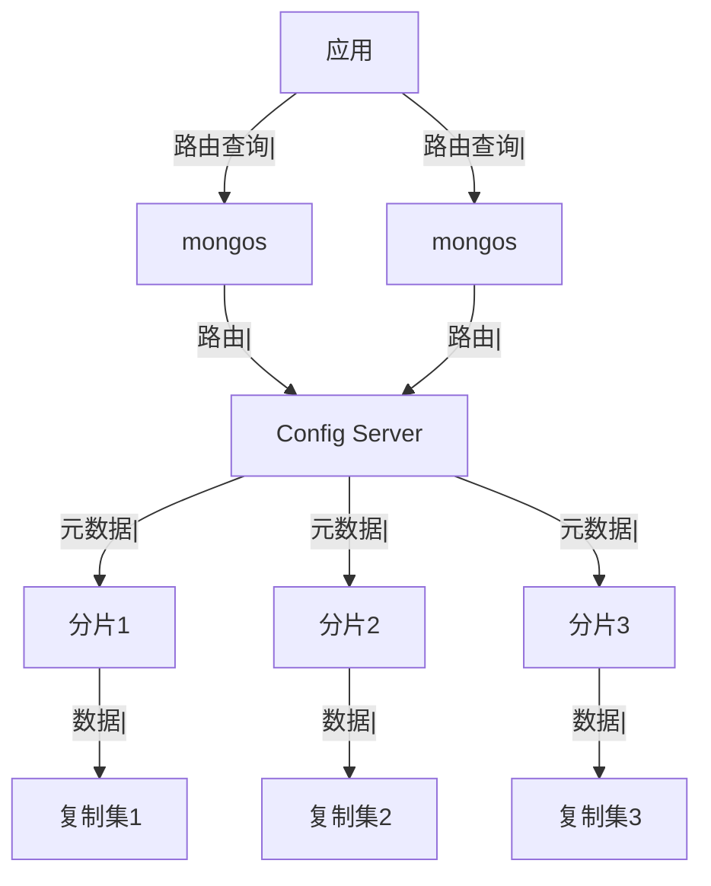
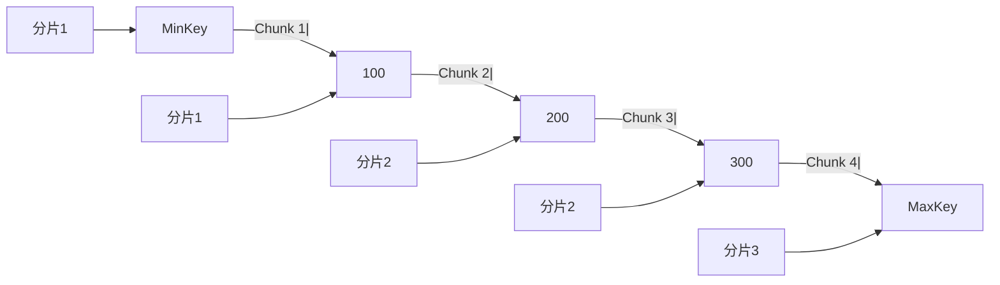

候选人小李在字节 P7 架构面中，面试官问：

"MongoDB 怎么支持海量数据存储？"

小李说："用分片集群，把数据分散到多个节点。"

面试官追问："数据是怎么分片的？mongos 是什么？"

小李说："mongos 是路由...？"

面试官继续追问："分片键怎么选？"

小李答不上来了。

【面试官心理】
这道题我用来测试候选人对 MongoDB 分片集群的理解深度。能说出分片集群架构的占 50%，能讲清组件作用的占 20%，能说清分片键选择的占 10%。

## 一、分片集群架构 🔴

### 1.1 核心组件



| 组件 | 作用 |
| --- | --- |
| mongos | 查询路由，分发请求到分片 |
| Config Server | 存储集群元数据（分片信息、Chunk 信息） |
| Shard | 实际存储数据的节点（通常是复制集） |

### 1.2 配置分片集群

```javascript
// 启动 mongos
mongos --configdb "config1:27019,config2:27019,config3:27019"

// 添加分片
sh.addShard("shard1:27017")
sh.addShard("shard2:27017")

// 查看分片状态
sh.status()
```

## 二、数据分片机制 🔴

### 2.1 Chunk

```javascript
// MongoDB 将数据分成 Chunk（数据块）
// 默认每个 Chunk 64MB

// Chunk 存储在 Config Server 中
use config
db.chunks.findOne()

// 示例
{
    _id: "shard1-users-123456",
    ns: "test.users",           // 命名空间
    min: {user_id: MinKey},     // Chunk 范围
    max: {user_id: 100000},
    shard: "shard1",            // 所属分片
    jumbo: false                // 是否过大
}
```

### 2.2 分片键范围



### 2.3 自动均衡

```javascript
// 开启分片
sh.enableSharding("test")

// 对集合启用分片
sh.shardCollection("test.orders", {order_id: "hashed"})

// MongoDB 自动进行 Chunk 分裂和迁移
// 当某个分片数据过多时，会迁移 Chunk 到其他分片
```

## 三、查询路由 🟡

### 3.1 查询分发

```javascript
// mongos 查询路由

// 基于分片键的查询
db.orders.find({order_id: "12345"})
// mongos 直接定位到对应分片

// 非分片键查询（广播查询）
db.orders.find({status: "completed"})
// mongos 向所有分片发送查询，合并结果
```

### 3.2 广播查询的性能问题

```javascript
// ❌ 广播查询：慢
db.orders.find({status: "completed"})  // 查所有分片

// ✅ 分片键查询：快
db.orders.find({order_id: "12345"})    // 只查一个分片
```

### 3.3 sort 和 limit

```javascript
// mongos 对分布式 sort 的处理
db.orders.find().sort({create_time: -1}).limit(10)

// 如果按分片键排序，mongos 直接从目标分片取结果
// 如果按非分片键排序，mongos 从所有分片取数据再合并排序
```

## 四、Config Server 🟡

### 4.1 Config Server 存储内容

```javascript
// Config Server 存储的元数据

// 分片信息
db.shards.findOne()
// {_id: "shard1", host: "shard1/replica1:27017,..."}

// 命名空间信息
db.databases.findOne()
// {_id: "test", primary: "shard1", partitioned: true}

// Chunk 信息
db.chunks.findOne()
// {_id: "test.orders-user_id_12345", ...}
```

### 4.2 Config Server 推荐配置

```javascript
// Config Server 必须是复制集
// 推荐 3 节点复制集

{
    _id: "configReplSet",
    configsvr: true,
    members: [
        {_id: 0, host: "config1:27019"},
        {_id: 1, host: "config2:27019"},
        {_id: 2, host: "config3:27019"}
    ]
}
```

## 五、生产最佳实践 🟡

### 5.1 分片数量建议

```javascript
// 分片数量 = (数据总量 / 单分片容量) * 安全系数

// 例如：
// 数据总量：1TB
// 单分片容量：500GB
// 安全系数：1.5
// 分片数量 = (1TB / 500GB) * 1.5 = 3

// 建议：
// - 早期：2-3 个分片
// - 中期：按需扩容
// - 每个分片建议容量不超过 2TB
```

### 5.2 Chunk 大小配置

```javascript
// 默认 Chunk 大小 64MB
// 可以调整，但建议不要改

// 过大的 Chunk：
// - 迁移时间长
// - 内存压力大

// 过小的 Chunk：
// - 迁移频繁
// - 元数据过多

// 可以在集合级别设置
db.createCollection("orders", {timeseries: {timeField: "ts"}})
```

### 5.3 均衡器配置

```javascript
// 查看均衡器状态
sh.getBalancerState()  // true = 开启

// 手动均衡
sh.moveChunk("test.orders", {order_id: "12345"}, "shard2")

// 暂停均衡（维护时使用）
sh.stopBalancer()

// 恢复均衡
sh.startBalancer()
```

:::tip 💡
生产环境中，建议在业务低峰期进行分片迁移，避免影响性能。定期监控分片间的数据分布是否均衡。
:::

【面试官心理】
能说出"广播查询"和"mongos 合并排序"原理的候选人，基本都有实际使用分片集群的经验。这是 P7 的水准。
