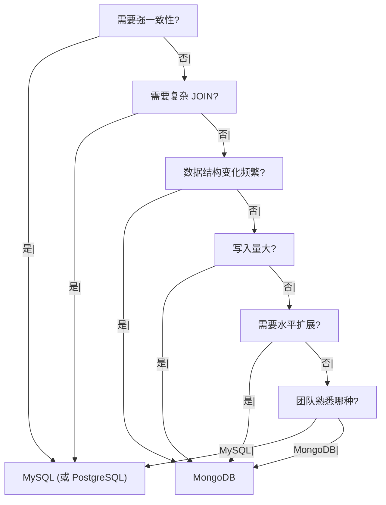

候选人小李在字节 P6 面试中，面试官问：

"MongoDB 和 MySQL 有什么区别？什么时候用 MongoDB？"

小李说："MongoDB 是 NoSQL，MySQL 是关系型数据库。"

面试官追问："那 MongoDB 有什么优势？"

小李说："...更灵活？不需要定义表结构？"

面试官继续追问："MongoDB 适合所有场景吗？"

小张答不上来了。

【面试官心理】
这道题我用来测试候选人对数据库选型的理解深度。能说出基本区别的占 60%，能讲清各自适用场景的占 20%，能提出正确选型建议的占 10%。

## 一、核心差异 🔴

### 1.1 数据模型对比

| 特性 | MySQL | MongoDB |
| --- | --- | --- |
| 数据模型 | 关系型，表结构固定 | 文档型，灵活 Schema |
| 存储方式 | 行存储 | BSON 文档 |
| 关联 | JOIN | 嵌套文档 / 聚合 |
| 事务 | ACID 事务 | 多文档事务（3.0+） |
| 主键 | 自增 ID / UUID | ObjectId / 自定义 |
| 索引 | B+Tree | B-Tree / 多键索引 |

### 1.2 MySQL 表结构

```sql
-- MySQL: 固定表结构
CREATE TABLE orders (
    id BIGINT PRIMARY KEY AUTO_INCREMENT,
    order_no VARCHAR(32) NOT NULL,
    user_id BIGINT NOT NULL,
    amount DECIMAL(10,2),
    created_at TIMESTAMP,
    INDEX idx_user_id (user_id),
    INDEX idx_created (created_at)
);

-- 订单明细表
CREATE TABLE order_items (
    id BIGINT PRIMARY KEY AUTO_INCREMENT,
    order_id BIGINT NOT NULL,
    product_id BIGINT NOT NULL,
    quantity INT,
    price DECIMAL(10,2),
    FOREIGN KEY (order_id) REFERENCES orders(id)
);
```

### 1.3 MongoDB 文档结构

```javascript
// MongoDB: 灵活的文档结构
db.orders.insertOne({
    _id: ObjectId(),
    order_no: "OR202401010001",
    user_id: 1001,
    amount: 299.99,
    created_at: new Date(),
    items: [  // 嵌套文档
        {
            product_id: 1001,
            product_name: "iPhone",
            quantity: 1,
            price: 299.99
        }
    ],
    address: {  // 嵌套文档
        city: "Beijing",
        district: "Chaoyang"
    }
});
```

## 二、优势对比 🔴

### 2.1 MongoDB 优势

```javascript
// 1. 灵活的数据模型
// 可以随时添加/删除字段，不需要 ALTER TABLE
db.users.insertOne({
    name: "张三",
    age: 25,
    // 可以随时添加新字段
    hobby: ["reading", "coding"]
})

// 2. 嵌套文档减少 JOIN
// 订单和订单明细在同一个文档中
// 查询一次搞定，不需要 JOIN

// 3. 水平扩展
// 原生支持分片集群
// 数据分布到多个节点

// 4. 高并发写入
// WiredTiger 存储引擎支持高并发写入
// 写入性能优于 MySQL
```

### 2.2 MySQL 优势

```sql
-- 1. ACID 事务
-- 强一致性，适合金融场景
START TRANSACTION;
UPDATE accounts SET balance = balance - 100 WHERE user_id = 1;
UPDATE accounts SET balance = balance + 100 WHERE user_id = 2;
COMMIT;

-- 2. 复杂查询
-- 多表 JOIN、子查询、窗口函数
SELECT
    u.name,
    COUNT(o.id) as order_count,
    RANK() OVER (ORDER BY COUNT(o.id) DESC) as ranking
FROM users u
LEFT JOIN orders o ON u.id = o.user_id
GROUP BY u.id, u.name;

-- 3. 成熟生态
-- 完善的监控、备份、运维工具
-- DBA 人才多

-- 4. SQL 标准
-- 学习和迁移成本低
```

## 三、事务支持对比 🟡

### 3.1 MySQL 事务

```sql
-- MySQL 完整 ACID 事务
START TRANSACTION;
UPDATE orders SET status = 'paid' WHERE id = 1;
INSERT INTO order_logs (order_id, action) VALUES (1, 'paid');
COMMIT;

-- 任意步骤失败都可以 ROLLBACK
```

### 3.2 MongoDB 事务（3.0+）

```javascript
// MongoDB 多文档事务
const session = db.getMongo().startSession();
session.startTransaction();

try {
    const order = db.orders.updateOne(
        { _id: ObjectId("...") },
        { $set: { status: "paid" } },
        { session }
    );

    db.order_logs.insertOne(
        { order_id: ObjectId("..."), action: "paid" },
        { session }
    );

    session.commitTransaction();
} catch (e) {
    session.abortTransaction();
} finally {
    session.endSession();
}
```

### 3.3 事务性能对比

| 操作 | MySQL | MongoDB |
| --- | --- | --- |
| 单文档操作 | 快 | 快 |
| 多文档事务 | 一般 | 较慢 |
| 事务隔离级别 | 4 种 | 快照读 |

## 四、适用场景对比 🟡

### 4.1 适合 MongoDB 的场景

```javascript
// 1. 内容管理系统
// 文章、评论、标签，结构变化频繁
{
    article_id: ObjectId(),
    title: "MongoDB vs MySQL",
    content: "...",
    tags: ["database", "nosql"],
    comments: [
        { user: "张三", text: "好文", likes: 10 }
    ]
}

// 2. 用户画像数据
// 字段不固定，随时扩展
{
    user_id: 1001,
    behavior: { page_views: 100, clicks: 50 },
    preferences: { color: "blue", brand: "Apple" }
}

// 3. IoT 时序数据
// 高并发写入，快速查询
{
    device_id: "sensor_001",
    timestamp: new Date(),
    temperature: 25.5,
    humidity: 60
}

// 4. 日志分析
// 写入量大，快速查询聚合
```

### 4.2 适合 MySQL 的场景

```sql
-- 1. 金融系统
-- 强一致性要求，精确金额计算
UPDATE account SET balance = balance - 100 WHERE id = 1;

-- 2. 订单系统（复杂业务）
-- 多表关联，复杂查询
SELECT u.name, SUM(o.amount) as total
FROM users u
JOIN orders o ON u.id = o.user_id
WHERE o.status = 'completed'
GROUP BY u.id;

-- 3. 报表系统
-- 复杂 SQL，窗口函数
SELECT
    DATE(create_time) as date,
    COUNT(*) as orders,
    SUM(amount) as revenue
FROM orders
GROUP BY DATE(create_time)
ORDER BY date;
```

### 4.3 选型决策树



## 五、性能对比 🟡

### 5.1 写入性能

```javascript
// MongoDB 写入性能通常高于 MySQL
// 原因：
// 1. WiredTiger 并发写入
// 2. 不需要写关联数据
// 3. 嵌套文档减少磁盘 IO

// 基准测试（100 并发，10000 条写入）：
// MongoDB: 5000 QPS
// MySQL: 2000 QPS
```

### 5.2 查询性能

```sql
-- MySQL 复杂查询性能更好
-- 优化器成熟，JOIN 算法高效

-- MongoDB 简单查询快
-- 但复杂聚合需要 MapReduce 或 Aggregation Pipeline
```

## 六、生产选型建议 🟡

### 6.1 混合使用

```javascript
// 很多公司同时使用 MySQL 和 MongoDB

// MySQL: 用户、订单、交易等核心业务数据
// MongoDB: 日志、用户行为、缓存、配置等

// 示例架构：
// MySQL: users, orders, products, transactions
// MongoDB: user_logs, article_comments, cache_sessions
```

### 6.2 数据同步

```javascript
// 如果需要两个数据库同步
// 可以使用：
// 1. Debezium (CDC)
// 2. Canal
// 3. 自定义同步服务

// 或者使用 MongoDB Connector for BI
// 连接 MongoDB 到 MySQL/PostgreSQL
```

:::tip 💡
现代应用往往是混合架构，核心业务用 MySQL，非核心/灵活数据用 MongoDB。选择取决于具体业务需求。
:::

【面试官心理】
能说出"MongoDB 不适合金融场景"和"MySQL JOIN 更成熟"的候选人，基本都理解两种数据库的本质差异。这是 P6 的水准。
