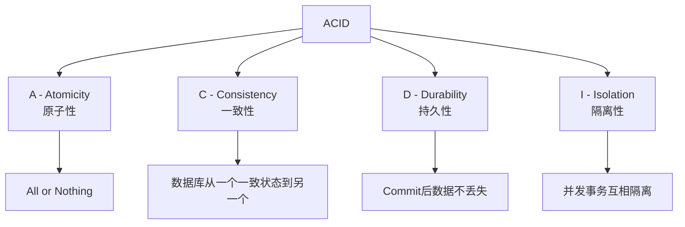
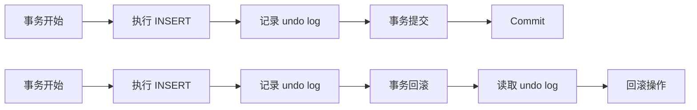
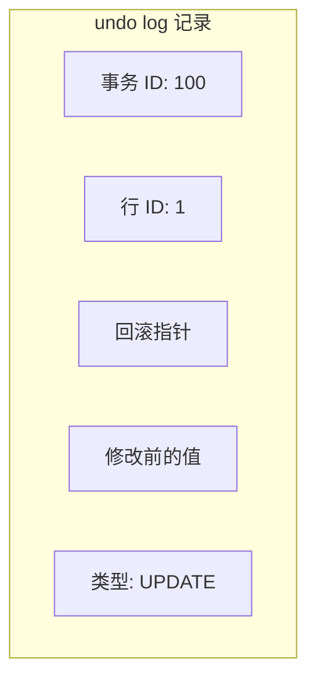

# 事务四大特性（ACID）

> 面试官问：「什么是事务？」你答：「事务就是一批 SQL 要么全成功要么全失败」——面试官追问「那你能详细说说 ACID 四个特性吗？以及 InnoDB 是怎么保证的？」你又沉默了。ACID 是 MySQL 事务的基础，但 P6 面试不仅仅要求背概念，而是要求理解底层实现机制。

## 面试官最关心的 3 个问题（快速自测）

| 问题 | 考察点 | 难度 |
|------|--------|------|
| ACID 四个特性分别是什么？ InnoDB 如何实现？ | 原理理解 | 🔴 高频 |
| 原子性和持久性是如何保证的？ | 底层实现 | 🟡 中频 |
| 一致性是数据库的特性还是应用层的特性？ | 概念理解 | 🟡 中频 |

---

## 一、ACID 概述



---

## 二、Atomicity（原子性）

### 2.1 定义

**原子性**：事务是最小执行单位，事务中的操作要么全部成功，要么全部失败回滚，不存在部分成功的情况。

### 2.2 InnoDB 如何实现

依赖 **undo log（回滚日志）** 实现。



### 2.3 undo log 工作原理

```sql
-- 事务开始
BEGIN;

-- 步骤1：记录修改前的数据到 undo log
-- 假设原数据 id=1, name='张三'
INSERT INTO users (id, name) VALUES (1, '李四');

-- undo log 内容：{id=1, name='张三'}（修改前的值）

-- 步骤2：执行提交或回滚
COMMIT;  -- 提交事务

-- 或者
ROLLBACK;  -- 回滚：读取 undo log，恢复 name='张三'
```

### 2.4 undo log 存储结构



---

## 三、Consistency（一致性）

### 3.1 定义

**一致性**：事务执行前后，数据库从一个一致状态转换到另一个一致状态。

### 3.2 一致性的理解

```
一致状态 = 满足所有约束（主键、唯一、外键、CHECK）
```

| 场景 | 是否一致 |
|------|----------|
| A 账户转出 100，B 账户转入 100 | ✅ 一致 |
| A 账户转出 100，B 账户未收到 | ❌ 不一致 |
| 违反主键约束的插入 | ❌ 不一致 |

### 3.3 一致性由谁保证？

| 层面 | 保证机制 |
|------|----------|
| **数据库层** | 约束检查、锁机制 |
| **应用程序层** | 业务逻辑正确性 |
| **InnoDB 层** | 原子性、隔离性、redo log |

> **重要理解**：一致性是数据库和应用层共同保证的。数据库保证原子性和隔离性，应用层保证业务逻辑正确性。

---

## 四、Durability（持久性）

### 4.1 定义

**持久性**：事务一旦提交，其对数据库的修改应该是永久性的，即使系统崩溃也不会丢失。

### 4.2 InnoDB 如何实现

依赖 **redo log（重做日志）** 和 **Buffer Pool** 实现。


### 4.3 WAL（Write-Atern Log）机制

**核心思想**：先写日志，再写磁盘。

```sql
-- 传统方式（慢）
UPDATE users SET name='王五' WHERE id=1;
-- 直接写磁盘：随机 I/O

-- WAL 方式（快）
1. 写入 redo log（顺序 I/O）
2. 更新 Buffer Pool（内存）
3. 后台刷盘（顺序 I/O）
```

**为什么 redo log 更快**？
- 磁盘顺序写入比随机写入快 100 倍以上
- redo log 是追加写入（append-only）

### 4.4 redo log 与 binlog 的区别

| 对比维度 | redo log | binlog |
|----------|----------|--------|
| **所属层** | InnoDB 存储引擎层 | MySQL Server 层 |
| **作用** | 崩溃恢复 | 主从复制、数据恢复 |
| **内容** | 物理修改（哪个页的哪个偏移） | 逻辑修改（SQL 语句） |
| **格式** | 固定格式 | STATEMENT/ROW/MIXED |
| **刷盘时机** | 事务 commit 时 | 可配置（sync_binlog） |
| **循环覆盖** | 是（ib_logfile0/1） | 否（追加写入） |

---

## 五、Isolation（隔离性）

### 5.1 定义

**隔离性**：并发执行的事务互相隔离，不互相干扰。

### 5.2 隔离级别

| 隔离级别 | 脏读 | 不可重复读 | 幻读 |
|----------|------|-----------|------|
| READ UNCOMMITTED | 可能 | 可能 | 可能 |
| READ COMMITTED | 不可能 | 可能 | 可能 |
| REPEATABLE READ（默认） | 不可能 | 不可能 | 可能 |
| SERIALIZABLE | 不可能 | 不可能 | 不可能 |

### 5.3 InnoDB 隔离级别实现

| 隔离级别 | 实现方式 |
|----------|----------|
| READ UNCOMMITTED | 无锁 |
| READ COMMITTED | MVCC |
| REPEATABLE READ | MVCC + 间隙锁 |
| SERIALIZABLE | 锁（所有读取加锁） |

> InnoDB 在 REPEATABLE READ 级别下，通过 MVCC + Next-Key Lock 解决幻读问题。

---

## 六、四种特性的实现总结


| 特性 | 实现机制 | 日志/锁 |
|------|----------|---------|
| 原子性 | undo log | 回滚段 |
| 一致性 | 约束 + 业务逻辑 | - |
| 持久性 | redo log | ib_logfile |
| 隔离性 | MVCC + 锁 | readview + 行锁/间隙锁 |

---

## 七、常见面试陷阱

:::danger 陷阱 1：混淆 binlog 和 redo log 的作用
错误理解：「binlog 和 redo log 都是用于崩溃恢复」
正确理解：binlog 主要用于主从复制和数据恢复，redo log 用于崩溃恢复。redo log 是 InnoDB 层面的，binlog 是 MySQL Server 层面的。
:::

:::danger 陷阱 2：认为一致性只靠数据库保证
错误理解：「只要数据库没报错就是一致的」
正确理解：一致性需要应用层和数据库层共同保证。例如转账操作，数据库层面余额不能为负，但应用层要保证转出账户余额充足。
:::

:::danger 陷阱 3：不清楚事务开始时机
错误理解：「START TRANSACTION 就是事务开始」
正确理解：在 InnoDB 中，事务开始于第一条 SQL（autocommit=0 时），或第一条 DML 语句（autocommit=1 时）。
:::

---

## 八、加分回答

> 💡 **binlog 的三种格式与事务一致性**：
> - **STATEMENT**：记录 SQL 语句，可能导致主从不一致（如 NOW() 函数）
> - **ROW**：记录行修改前后的镜像，保证一致性，但日志量大
> - **MIXED**：混用，优先 STATEMENT，必要时切换 ROW

> 💡 **组提交（Group Commit）优化**：
> MySQL 5.6+ 支持 redo log 组提交，合并多个事务的刷盘操作，提升并发性能：
> ```sql
> -- 开启 binlog 组提交
> sync_binlog = 1000  -- 每 1000 次刷盘
> ```

> 💡 **两阶段提交（2PC）与数据一致性**：
> 事务提交时，redo log 和 binlog 必须同时成功，否则会导致主从不一致：
> 1. 写入 redo log（prepare）
> 2. 写入 binlog
> 3. 提交事务（commit）
> 崩溃恢复时，检查 redo log 和 binlog 的一致性。

---

## 九、总结对比表

| 特性 | 定义 | 实现机制 | 常见问题 |
|------|------|----------|----------|
| **原子性** | 全部成功或全部失败 | undo log | 回滚失败 |
| **一致性** | 从一致状态到一致状态 | 约束 + 应用逻辑 | 数据不一致 |
| **持久性** | 提交后数据不丢失 | redo log + WAL | 刷盘失败 |
| **隔离性** | 并发事务互不干扰 | MVCC + 锁 | 脏读/幻读 |

| 日志类型 | 作用 | 所属层 | 循环覆盖 |
|----------|------|--------|----------|
| redo log | 崩溃恢复 | InnoDB | 是 |
| undo log | 回滚 | InnoDB | 是 |
| binlog | 主从复制 | MySQL Server | 否 |