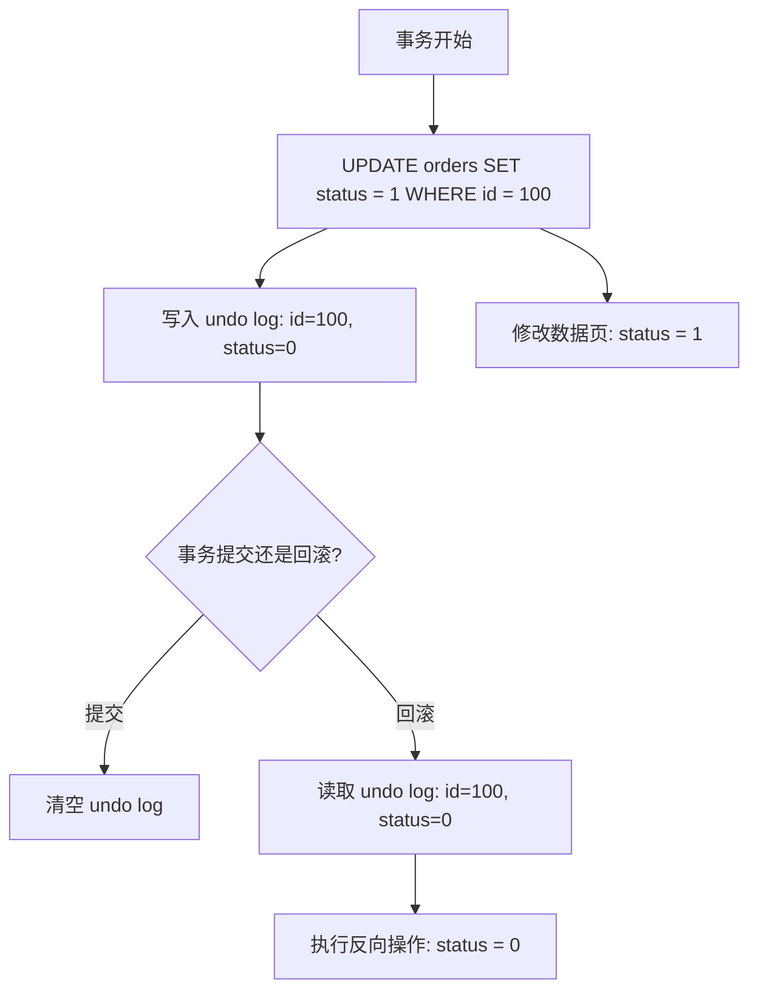
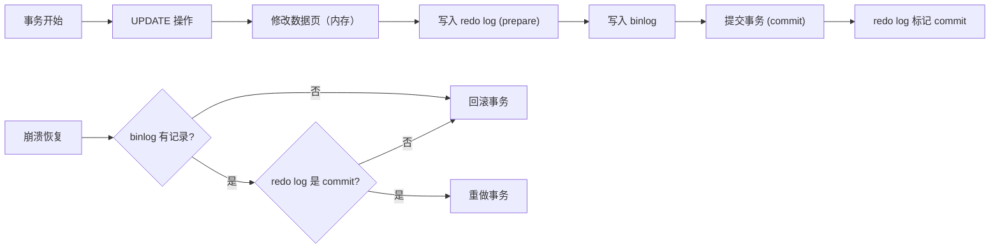
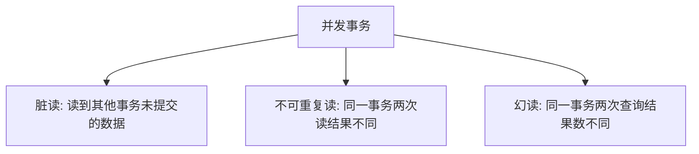
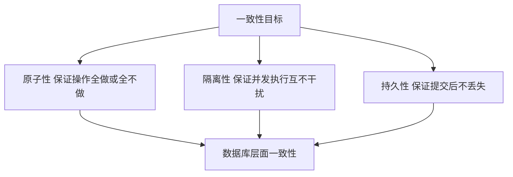

候选人小钱在阿里 P6 面试中，面试官问：

"什么是事务？事务有哪些特性？"

小钱秒答："ACID，原子性、一致性、隔离性、持久性。"

面试官点点头："那 MySQL 是怎么保证原子性的？"

小钱说："用 undo log 回滚。"面试官："undo log 怎么实现？redo log 和 undo log 的区别是什么？"

小张愣了一下："undo 是回滚用的，redo 是...重做？"

面试官："一致性怎么保证？"

小钱答不上来了。

【面试官心理】
ACID 是 MySQL 面试的必考题。能把四个特性说出来的占 90%，能讲清每个特性的实现机制的占 30%，能把四个特性串联成一个完整故事的占 10%。这道题是区分"背过八股"和"真正理解"的分水岭。

## 一、ACID 是什么 🔴

### 1.1 四大特性定义

```
原子性（Atomicity）：事务是最小执行单位，要么全成功，要么全失败
一致性（Consistency）：事务执行前后，数据库状态必须保持一致
隔离性（Isolation）：并发执行的事务互不干扰
持久性（Durability）：事务提交后，数据永久保存
```

### 1.2 ❌ 错误理解

**候选人原话**："一致性就是指事务执行完后，数据是一致的，比如转账前后总额不变。"

**问题诊断**：
- 把一致性当成了"结果"，忽略了它是"约束"
- 一致性不是事务保证的，是由业务规则 + 其他三个特性共同保证的
- 原子性、隔离性、持久性是手段，一致性是目标

**面试官内心 OS**：这个候选人背了概念，但没有理解 ACID 之间的关系。

:::tip 💡
理解一致性的关键：一致性是**业务层面的约束**（如余额不能为负），而原子性、隔离性、持久性是 MySQL **保证一致性的手段**。如果业务本身定义了错误的一致性规则（如允许余额为负），MySQL 也会执行。
:::

## 二、原子性：要么全做，要么全不做 🔴

### 2.1 undo log 的工作原理

MySQL 的原子性靠 **undo log** 实现。undo log 记录了数据修改前的值（反向操作），用于回滚。



### 2.2 undo log 的结构

```sql
-- undo log 记录的内容
{
    "table_name": "orders",
    "primary_key": "id=100",
    "old_value": {"status": 0, "amount": 100},
    "new_value": {"status": 1, "amount": 200},
    "undo_type": "UPDATE"
}
```

### 2.3 undo log 的类型

| 类型 | 作用 | 存储位置 |
| --- | --- | --- |
| INSERT undo | 回滚 INSERT 操作 | 事务提交后可释放 |
| UPDATE undo | 回滚 UPDATE/DELETE 操作 | 可能是 MVCC 需要，延迟释放 |

```sql
-- 查看 undo log 使用情况
SELECT * FROM information_schema.INNODB_TRX;  -- 事务信息
SELECT * FROM information_schema.INNODB_UNDO_LOGS;  -- undo log 状态
```

【面试官心理】
我问他原子性的实现，很多人会说"用事务控制"，但说不清楚具体机制。能说出 undo log 并解释其工作原理的，基本都有源码阅读经验。

## 三、持久性：提交了就不会丢 🔴

### 3.1 redo log 的工作原理

MySQL 的持久性靠 **redo log** 实现。redo log 记录了数据修改后的值（正向操作），用于崩溃恢复。

```
为什么需要 redo log？
- 数据页太大，直接写磁盘太慢（随机 IO）
- redo log 是顺序写，性能高
- 事务提交时，写 redo log 即可认为持久化成功
```

### 3.2 redo log 的两阶段提交



两阶段提交保证：
1. binlog 和 redo log 的一致性
2. 崩溃时能恢复到正确状态

:::warning ⚠️
两阶段提交是 MySQL 最常被追问的知识点之一。如果 redo log 和 binlog 的状态不一致，会导致数据丢失或数据不一致。面试时被追问两阶段提交，要能画图说明。
:::

### 3.3 redo log 和 undo log 的区别

| 特性 | redo log | undo log |
| --- | --- | --- |
| 作用 | 恢复已提交的事务 | 回滚未提交的事务 |
| 记录内容 | 修改后的值（正向） | 修改前的值（反向） |
| 存储位置 | redo log buffer → 磁盘 | undo log pages → 磁盘 |
| 释放时机 | 事务提交后即可覆盖 | 可能有 MVCC 引用，延迟释放 |
| 用途 | 崩溃恢复 | 事务回滚 |

## 四、隔离性：并发控制的核心 🔴

### 4.1 并发问题的来源



| 问题 | 含义 | 严重程度 |
| --- | --- | --- |
| 脏读 | 读到未提交的数据 | 最严重 |
| 不可重复读 | 读到其他事务已提交的数据 | 中等 |
| 幻读 | 读到其他事务新增的数据 | 中等 |

### 4.2 隔离级别与问题对照

| 隔离级别 | 脏读 | 不可重复读 | 幻读 |
| --- | --- | --- | --- |
| Read Uncommitted | 可能 | 可能 | 可能 |
| Read Committed | 不可能 | 可能 | 可能 |
| Repeatable Read | 不可能 | 不可能 | 可能（MySQL 用 MVCC 解决） |
| Serializable | 不可能 | 不可能 | 不可能 |

```sql
-- 查看当前隔离级别
SHOW VARIABLES LIKE 'transaction_isolation';
-- REPEATABLE-READ

-- 设置隔离级别
SET SESSION TRANSACTION ISOLATION LEVEL READ COMMITTED;
```

【面试官心理】
隔离级别这张表几乎是面试必考。能背下来的占 80%，能解释 MySQL 在 RR 级别下如何用 MVCC 解决幻读的占 30%。这是 P6 和 P7 的分水岭。

## 五、一致性：最终目标 🟡

### 5.1 一致性的三层含义

```
应用层面一致性：业务规则约束（如余额 >= 0）
数据库层面一致性：ACID 中的 C，由 AID 保证
分布式一致性：CAP 理论中的 C（P2C 架构中是最终一致）
```

### 5.2 事务一致性的保证



【面试官心理】
我问他一致性的实现，很多人会卡壳。因为一致性不是一个独立实现的特性，而是其他三个特性的**结果**。能讲清楚这个关系的，基本都是 P7 以上的水准。

## 六、面试追问链

**第一层**：ACID 是什么？
- 候选人：原子性、一致性、隔离性、持久性

**第二层**：MySQL 怎么实现原子性？
- 候选人：undo log

**第三层**：undo log 和 redo log 的区别？
- 候选人：undo 回滚未提交，redo 恢复已提交

**第四层**：两阶段提交是什么？为什么需要？
- 候选人：...（大部分人答不上来）

**第五层**：一致性怎么保证？
- 候选人：...（只有理解原理的能答）

## 七、生产避坑

### 7.1 长事务的危害

```sql
-- ❌ 长事务：占用锁资源，导致其他事务等待
START TRANSACTION;
-- 业务处理...
-- 网络延迟...
-- 用户思考...
-- 30 分钟后才提交
COMMIT;

-- ✅ 正确做法：拆分事务
-- 将大批量操作拆分成小批次
FOR batch IN batches:
    START TRANSACTION;
    -- 处理 1000 条
    COMMIT;
```

### 7.2 监控事务超时

```sql
-- 查看当前长事务
SELECT * FROM information_schema.INNODB_TRX
WHERE trx_started < NOW() - INTERVAL 60 SECOND;
```

:::tip 💡
生产环境中，事务超时时间建议设置在 30 秒以内，避免长时间占用锁资源导致其他请求堆积。
:::
