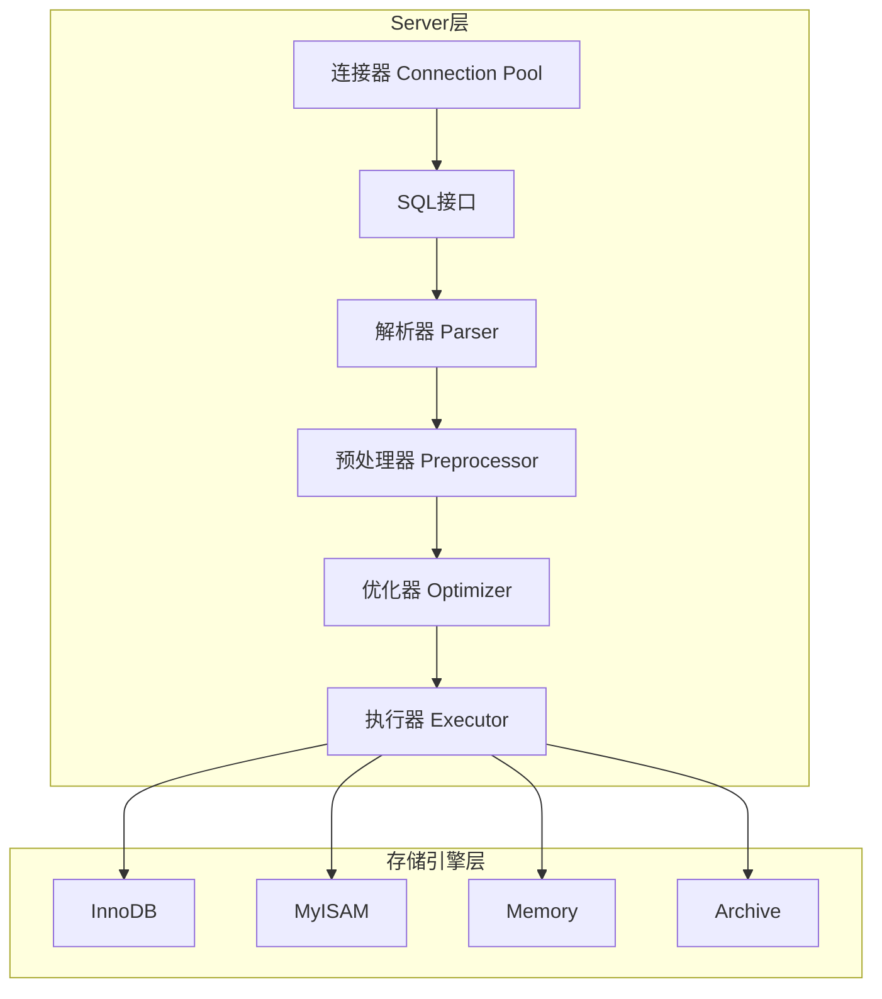
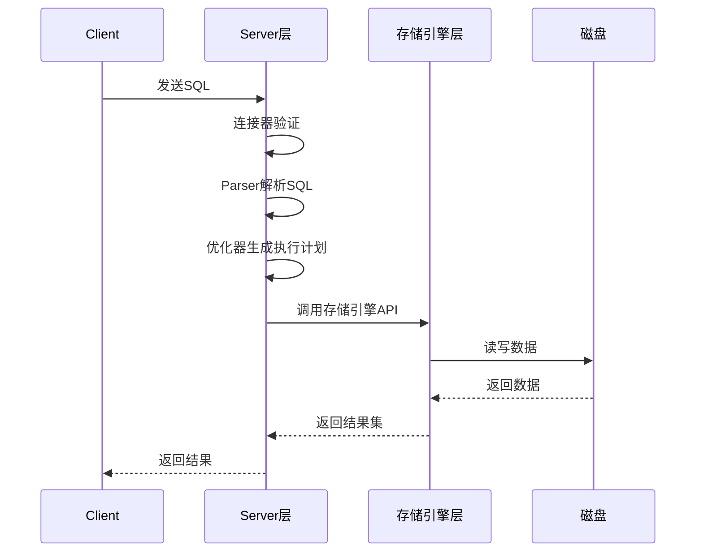

候选人小赵坐在字节跳动的面试间，面试官翻到简历上"熟悉 MySQL 原理"这一行，开口问道：

"MySQL 的整体架构是什么样的？Server 层和存储引擎层分别负责什么？"

小赵说："就是...客户端连上来，然后执行 SQL，存储引擎负责存取数据。"面试官点点头，继续追问："那 Server 层里的优化器是干什么的？一条 SQL 是怎么变成执行计划的？"

小赵开始支支吾吾。面试官又问："InnoDB 和 MyISAM 在架构上有什么区别？为什么现在基本都是用 InnoDB？"

小赵说："InnoDB 支持事务..."面试官打断："那为什么有些场景 MyISAM 还在用？"

小赵彻底卡住了。

【面试官心理】
我问他架构，其实不是在考背书。我想知道的是：他有没有真正理解 MySQL 是一个分层架构的系统，每一层都有自己擅长的场景。Server 层做 SQL 解析和优化，存储引擎层负责数据存取和索引。知道这个分层，才算入门了 MySQL。

## 一、MySQL 整体架构 🔴

### 1.1 架构全景图

MySQL 的架构可以分为两大部分：**Server 层**和**存储引擎层**。这种分层设计是 MySQL 能在十几二十年里屹立不倒的根本原因——解耦。



### 1.2 Server 层核心组件

**连接器（Connection Pool）**：管理客户端连接、认证、线程复用。一个 MySQL 服务端进程可以处理成千上万个连接，靠的就是连接池。生产环境里，数据库连接数被打满是常见问题。

**SQL 接口（SQL Interface）**：接收 SQL 语句，调用存储过程、触发器等。

**解析器（Parser）**：将 SQL 文本解析成**解析树（Parse Tree）**。这一步做语法分析和语义分析。

**预处理器（Preprocessor）**：检查表名、列名是否合法，做权限检查。

**优化器（Optimizer）**：这是 Server 层的灵魂。同一条 SQL 可以有无数种执行路径，优化器负责选择**成本最低**的那条。

```sql
-- 这条 SQL 有两种执行方式
SELECT * FROM orders WHERE user_id = 100 AND status = 'paid';

-- 方式A：先过滤 user_id，再过滤 status
-- 方式B：先过滤 status，再过滤 user_id
-- 优化器会根据索引统计信息选择
```

**执行器（Executor）**：调用存储引擎的接口，逐条读取数据。

### 1.3 存储引擎层

存储引擎层负责数据的存取和索引管理。MySQL 支持多种存储引擎，但真正要掌握的只有 InnoDB。

| 组件 | 职责 |
| --- | --- |
| 缓冲区管理 | 管理 Buffer Pool cache 数据页和索引页 |
| 事务管理 | 负责 ACID 事务特性 |
| 锁管理 | 行级锁、间隙锁、临键锁 |
| 日志管理 | Redo Log、Undo Log |
| 备份恢复 | Crash Safe 能力 |

### 1.4 ❌ 错误示范

**候选人原话**："MySQL 就是把数据存在磁盘上，然后通过 SQL 来操作。"

**问题诊断**：
- 完全不理解分层架构，把 MySQL 等同于"磁盘存储"
- 不知道 Server 层和存储引擎层的边界
- 混淆了"存储引擎"和"文件系统"

**面试官内心 OS**：这个人肯定没看过《高性能 MySQL》，甚至没读过 MySQL 官方文档的架构介绍。

:::warning ⚠️
很多候选人会把 MySQL 和 InnoDB 混为一谈。MySQL 是一个数据库管理系统，InnoDB 是 MySQL 默认的存储引擎。这是一个"包含"关系，不是等价关系。
:::

## 二、Server 层 vs 存储引擎层 🔴

### 2.1 职责边界

这是面试中最容易混淆的点。记住一个核心原则：**Server 层负责"说什么"，存储引擎层负责"怎么做"**。



Server 层负责：
- 连接管理
- SQL 解析与改写
- 查询优化与执行计划生成
- 跨引擎功能（视图、触发器、存储过程）

存储引擎层负责：
- 数据存取（InnoDB 是行存储，MyISAM 是堆表）
- 索引管理
- 事务实现
- 锁实现
- Crash Safe

### 2.2 优化器在 Server 层的地位

优化器是 Server 层最重要的组件，也是面试高频追问点。

```sql
EXPLAIN SELECT * FROM users WHERE email = 'test@example.com';
```

优化器会考虑：
- **索引选择性**：有多少不同的值
- **表统计信息**：基数（Cardinality）、数据分布
- **成本估算**：IO 成本、CPU 成本
- **启发式规则**：某些规则会优先选择

:::tip 💡
优化器不是万能的。有时候人工干预比优化器更聪明。比如在数据倾斜严重的场景下，优化器可能选错索引，这时需要用 `FORCE INDEX` 强制指定。
:::

【面试官心理】
我问 Server 层和存储引擎层的区别，其实是在试探他对 MySQL 架构的理解深度。能说出分层架构只是基本操作，能讲清楚优化器在 Server 层、存储引擎负责事务和锁的边界，才算真正理解。下一层追问通常会落到 InnoDB 的独有能力上。

## 三、InnoDB vs MyISAM 的架构定位 🟡

### 3.1 核心差异

```sql
-- 查看表使用的存储引擎
SHOW TABLE STATUS FROM db_name WHERE Name = 'orders';

-- 查看当前默认存储引擎
SHOW VARIABLES LIKE 'default_storage_engine';
```

| 特性 | InnoDB | MyISAM |
| --- | --- | --- |
| 事务支持 | ✅ 支持 | ❌ 不支持 |
| 行级锁 | ✅ 支持 | ❌ 仅表级锁 |
| 外键约束 | ✅ 支持 | ❌ 不支持 |
| Crash Safe | ✅ 完整（redo log） | ❌ 仅 frm + MYD + MYI |
| 聚簇索引 | ✅ 是 | ❌ 非聚簇 |
| 全文索引 | ✅（5.6+） | ✅ 原生支持 |
| 计数 COUNT(*) | 需扫描全表 | 有专用计数器 |
| 适用场景 | OLTP，高并发 | OLAP，只读场景 |

### 3.2 为什么 InnoDB 是默认引擎

InnoDB 之所以成为 MySQL 5.5+ 的默认存储引擎，核心原因是**事务支持和行级锁**。

```sql
-- InnoDB 的行级锁示例
START TRANSACTION;
SELECT * FROM orders WHERE user_id = 100 FOR UPDATE;  -- 仅锁定这一行
UPDATE orders SET status = 'shipped' WHERE order_id = 5001;
COMMIT;  -- 释放锁
```

而 MyISAM 在高并发下是表级锁，一个写锁会阻塞所有读和写。2010 年之前 MyISAM 还能在某些场景下看到，但随着业务并发量增长，MyISAM 的锁机制会成为性能瓶颈。

:::warning ⚠️
MyISAM 虽然被 InnoDB 全面超越，但有一个场景还有价值：**只读表或者 COUNT(*) 密集型查询**。MyISAM 的元数据存储了精确的行数，不需要扫描表。但说实话，这种场景也越来越少了。
:::

### 3.3 追问升级

**P6 追问**：InnoDB 和 MyISAM 在数据页结构上有什么区别？

InnoDB 使用 16KB 的数据页（可配置），每个页包含 Page Header、Page Directory、System Records 等结构。MyISAM 的数据页结构完全不同，它是非聚簇索引，数据和索引分离。

**P7 追问**：为什么 InnoDB 要设计成聚簇索引？

聚簇索引的数据行直接存储在 B+Tree 的叶子节点上，而非聚簇索引的叶子节点只存储主键值（或行指针）。聚簇索引的优势是**范围查询极快**，因为数据是有序存储的。但代价是**插入性能受主键顺序影响严重**，使用 UUID 做主键会导致频繁的页分裂。

## 四、生产避坑

### 4.1 连接池被打满

```sql
-- 查看当前连接数
SHOW STATUS LIKE 'Threads_connected';
SHOW VARIABLES LIKE 'max_connections';

-- 查看最大历史连接数
SHOW STATUS LIKE 'Max_used_connections';
```

连接池被打满是生产环境的高频问题。当连接数达到 `max_connections` 时，新请求会被拒绝。

**解决方案**：
- 合理设置 `max_connections`（不是越大越好，内存开销）
- 使用连接池（Druid、HikariCP）
- 监控连接数，设置告警阈值

### 4.2 存储引擎混用问题

有些遗留系统里，部分表用 InnoDB、部分表用 MyISAM。跨引擎 JOIN 时，优化器的策略会变得复杂。MyISAM 的表没有事务，崩溃后可能丢数据，备份恢复时需要额外注意。

### 4.3 Buffer Pool 配置

InnoDB 的 Buffer Pool 是核心内存区域，用来缓存数据页和索引页。

```sql
-- 查看 Buffer Pool 大小
SHOW VARIABLES LIKE 'innodb_buffer_pool_size';

-- 动态调整（MySQL 5.7+）
SET GLOBAL innodb_buffer_pool_size = 12 * 1024 * 1024 * 1024;  -- 12GB
```

:::tip 💡
Buffer Pool 应该设置为机器内存的 60%~80%。如果机器内存 64G，MySQL 分配 40G 左右给 Buffer Pool，剩下的给 OS 和其他用途。
:::

## 五、工程选型

### 5.1 什么场景用什么存储引擎

| 场景 | 推荐引擎 | 原因 |
| --- | --- | --- |
| OLTP 业务系统 | InnoDB | 事务、行锁、Crash Safe |
| 日志表（只写少读） | MyISAM / Memory | 写性能好 |
| 全文搜索 | InnoDB（5.6+）/ MyISAM | MyISAM 全文索引更成熟 |
| 只读统计表 | Memory | 数据存内存，速度最快 |
| 高并发写入 | InnoDB | 行锁减少竞争 |

### 5.2 迁移策略

如果项目还在用 MyISAM，迁移到 InnoDB 需要注意：

```sql
-- 批量转换存储引擎
ALTER TABLE orders ENGINE = InnoDB;

-- 注意：大表转换会锁表，应该用 pt-online-schema-change
```

:::warning ⚠️
迁移 MyISAM 到 InnoDB 最大的坑是：**外键约束**。MyISAM 不支持外键，迁移后如果有外键关系，InnoDB 的外键级联行为可能导致意外的数据删除。
:::
