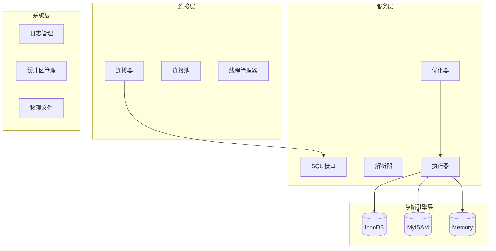
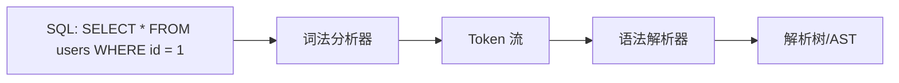
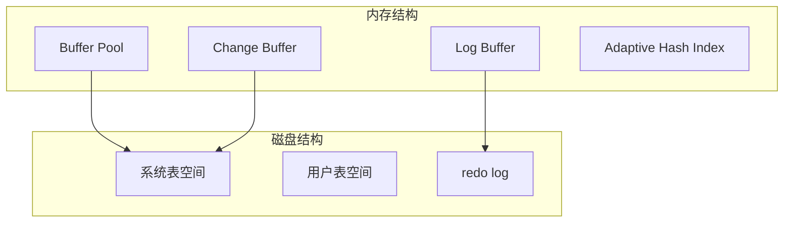

# MySQL 架构

> 面试官问：「一条 SQL 语句在 MySQL 中是怎么执行的？」你从头说起，面试官却眉头一皱——因为大部分候选人都漏掉了关键的一层。如果你也只说「连接器 → 解析器 → 优化器 → 执行器」，那这道题你最多拿 60 分。

## 面试官最关心的 3 个问题（快速自测）

| 问题 | 考察点 | 难度 |
|------|--------|------|
| MySQL 由哪几层组成？各层职责是什么？ | 架构理解 | 🟢 低频 |
| 一条查询语句的执行流程是怎样的？ | 执行链路 | 🔴 高频 |
| MySQL 8.0 相比 5.7 有哪些重大架构变化？ | 版本差异 | 🟡 中频 |

---

## 一、MySQL 逻辑架构

MySQL 采用分层架构，从上到下分为四层：



### 1. 连接层（Connection Layer）

负责客户端连接管理与线程处理：

- **连接器**：管理客户端与 MySQL 服务器之间的连接，包括 TCP 握手、认证、连接超时等
- **连接池**：复用已建立的连接，避免频繁创建/销毁线程的开销
- **线程管理器**：管理连接对应的服务线程

```sql
-- 查看连接状态
SHOW STATUS LIKE 'Threads_connected';
SHOW STATUS LIKE 'Max_used_connections';
```

> MySQL 默认连接数 `max_connections=151`，生产环境通常调大到 `500-2000`。

### 2. 服务层（Server Layer）

MySQL 的核心逻辑层，包含 SQL 处理的全部组件：

| 组件 | 职责 |
|------|------|
| **SQL Interface** | 接收并执行 DML、DDL、存储过程等 SQL 命令 |
| **Parser** | 词法分析 + 语法解析，生成解析树 |
| **Optimizer** | 成本优化，选择最优执行计划 |
| **Caches & Buffers** | 查询缓存（MySQL 8.0 已移除） |

### 3. 存储引擎层（Storage Engine Layer）

负责数据的物理存储和读取。MySQL 支持多种存储引擎，插件式架构：

| 引擎 | 事务 | 锁粒度 | 适用场景 |
|------|------|--------|----------|
| **InnoDB** | ✅ 支持 | 行级锁 | OLTP、高并发、需事务 |
| **MyISAM** | ❌ 不支持 | 表级锁 | 只读/低写入、压缩表 |
| **Memory** | ❌ 不支持 | 表级锁 | 临时表、缓存 |

### 4. 系统层（System Layer）

包含日志系统、缓冲区管理等基础设施。

---

## 二、一条查询语句的执行流程

以 `SELECT * FROM users WHERE id = 1` 为例：

### Step 1：连接器 - 建立连接

```sql
mysql -h127.0.0.1 -uroot -p123456 -P3306
```

连接器完成身份认证，验证用户密码，查询权限表。

### Step 2：查询缓存 - 检查缓存（MySQL 8.0 前）

```sql
-- MySQL 5.7 查询缓存命中机制
SELECT SQL_CACHE * FROM users WHERE id = 1;
```

> **注意**：MySQL 8.0 已移除查询缓存，因为命中率极低（频繁更新的表）。

### Step 3：解析器 - 词法分析 + 语法解析



生成语法树，验证 SQL 语法是否正确。

### Step 4：优化器 - 生成执行计划

优化器负责：

- 选择使用哪个索引
- 决定表的连接顺序
- 计算各执行方案的成本

```sql
-- 查看优化器选择的执行计划
EXPLAIN SELECT * FROM users WHERE id = 1;
```

### Step 5：执行器 - 调用引擎接口

```java
// 伪代码：执行器工作流程
execute(TABLE users) {
    // 调用 InnoDB 引擎接口获取数据
    rows = engine.execute("SELECT * FROM users WHERE id = 1");

    // 检查用户是否有读取权限
    if (!hasPrivilege(rows)) {
        throw "SELECT privilege denied";
    }

    return rows;
}
```

---

## 三、存储引擎结构

### InnoDB 架构



| 组件 | 作用 |
|------|------|
| **Buffer Pool** | 缓存表数据和索引，减少磁盘 I/O |
| **Change Buffer** | 缓存二级索引的更新，减少随机 I/O |
| **Log Buffer** | 缓存 redo log，减少磁盘刷盘频率 |
| **Adaptive Hash Index** | 自适应哈希索引，加速等值查询 |

### InnoDB vs MyISAM 核心区别

| 对比维度 | InnoDB | MyISAM |
|----------|--------|--------|
| **事务支持** | ✅ ACID | ❌ 不支持 |
| **锁粒度** | 行级锁 | 表级锁 |
| **MVCC** | ✅ 支持 | ❌ 不支持 |
| **外键** | ✅ 支持 | ❌ 不支持 |
| **崩溃恢复** | 自动恢复 | 需手动修复 |
| **count(*) 性能** | 全表扫描 | 维护计数器 |
| **适用场景** | 高并发、事务 | 只读、压缩 |

---

## 四、MySQL 8.0 重大变化

| 特性 | MySQL 5.7 | MySQL 8.0 |
|------|------------|-----------|
| **查询缓存** | 存在（命中率低） | ❌ 已移除 |
| **角色管理** | 用户 + 权限分离 | 引入角色概念 |
| **窗口函数** | ❌ 不支持 | ✅ 支持 |
| **CTE** | ❌ 不支持 | ✅ 支持 |
| **字符集** | `utf8`（伪 UTF-8） | `utf8mb4`（真 UTF-8） |
| **隐藏索引** | ❌ 不支持 | ✅ 支持 |
| **直方图** | ❌ 不支持 | ✅ 支持 |
| **JSON 增强** | 基本支持 | 原生 JSON 函数 |

---

## 五、常见面试陷阱

:::danger 陷阱 1：混淆连接层与引擎层
错误回答：「MySQL 有一个优化器层负责执行 SQL」
正确理解：连接层负责建立连接，服务层的优化器负责生成执行计划，存储引擎层负责实际的数据读写。
:::

:::danger 陷阱 2：认为查询缓存在 MySQL 8.0 仍可用
错误回答：「可以通过 SQL_CACHE 开启查询缓存」
正确理解：MySQL 8.0 已完全移除查询缓存，这是官方明确说明的改进。
:::

:::danger 陷阱 3：忽略存储引擎的可插拔特性
错误回答：「MySQL 只能使用 InnoDB」
正确理解：MySQL 是插件式存储引擎架构，可以根据场景选择不同引擎（如 MyISAM、Memory）。
:::

---

## 六、加分回答

> 💡 **架构设计的哲学**：MySQL 将 SQL 处理层和存储层分离，使得上层可以独立优化（如优化器），下层可以替换（如 InnoDB、MyISAM）。这与计算机系统中的「层次化设计」思想一致——每一层只关心自己的职责，层与层之间通过接口通信。

> 💡 **性能优化思路**：根据执行流程，性能瓶颈可能出现在：
> 1. 连接层：连接数耗尽 → 增加 `max_connections`
> 2. 服务层：优化器选错索引 → 使用 `EXPLAIN` 分析
> 3. 引擎层：Buffer Pool 命中率低 → 调大 `innodb_buffer_pool_size`
> 4. 磁盘 I/O：随机读写多 → 使用 SSD 或开启 Change Buffer

---

## 七、总结对比表

| 组件 | 属于哪层 | 核心职责 |
|------|----------|----------|
| 连接器 | 连接层 | 身份认证、权限验证 |
| Parser | 服务层 | 词法分析、语法解析 |
| Optimizer | 服务层 | 生成最优执行计划 |
| Executor | 服务层 | 调用引擎接口、权限检查 |
| Buffer Pool | 引擎层 | 缓存数据页 |
| InnoDB | 引擎层 | 事务、行锁、崩溃恢复 |
| redo log | 引擎层 | 崩溃恢复的物理日志 |