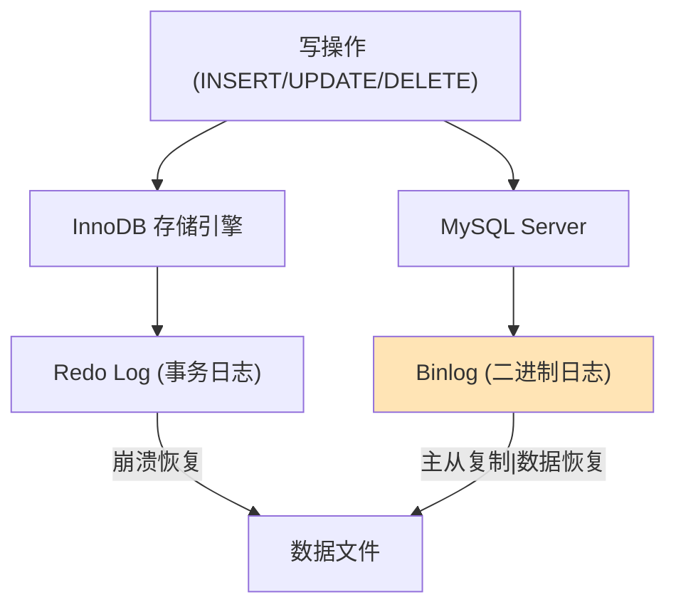

候选人小张在美团二面中，面试官问：

"MySQL 的 binlog 有几种格式？你们用的哪种？为什么？"

小张说："有 STATEMENT、ROW、MIXED 三种格式，我们用的 ROW。"

面试官追问："为什么用 ROW 格式？STATEMENT 格式有什么问题？"

小张说："ROW 更精确..."

面试官继续追问："ROW 格式有什么缺点？你们考虑过吗？"

小张答不上来了。

【面试官心理】
这道题我用来测试候选人对 binlog 格式的理解深度。能说出三种格式名称的占 60%，能讲清各自优缺点的占 30%，能说出选型理由的占 15%。binlog 格式是 MySQL 面试的进阶知识点。

## 一、binlog 的作用 🔴

### 1.1 binlog 是什么

binlog（Binary Log）是 MySQL 服务端产生的二进制日志，记录了所有数据库的修改操作。



### 1.2 binlog 和 redo log 的区别

| 特性 | binlog | redo log |
| --- | --- | --- |
| 作用 | 记录所有修改操作 | 记录物理页修改 |
| 属于 | MySQL Server 层 | InnoDB 存储引擎层 |
| 格式 | SQL 语句 / 行变化 | 物理页修改 |
| 用途 | 主从复制、数据恢复 | 崩溃恢复 |
| 何时清理 | 可配置（expire_logs_days） | 覆盖式写入 |

## 二、STATEMENT 格式 🔴

### 2.1 原理

STATEMENT 格式记录的是**原始 SQL 语句**。

```sql
-- 主库执行
UPDATE orders SET create_time = NOW() WHERE id = 1;

-- binlog 记录
#240111 12:00:00 server id 1  Query  thread_id=10  exec_time=0
UPDATE orders WHERE id = 1 AND create_time = NOW();
```

### 2.2 优点

- **日志量小**：只记录 SQL，不记录每行数据变化
- **可读性好**：人类可读的 SQL 语句
- **审计方便**：可以直接查看执行了什么操作

### 2.3 缺点

```sql
-- ❌ 问题1：函数结果不确定
UPDATE orders SET update_time = NOW() WHERE id = 1;
-- NOW() 在主库和从库执行时值不同！

-- ❌ 问题2：触发器可能不一致
CREATE TRIGGER tr_update AFTER UPDATE ON orders
FOR EACH ROW
INSERT INTO order_log VALUES (NOW(), NEW.id);
-- 触发器在从库执行时，NOW() 值不同

-- ❌ 问题3：存储过程
CREATE PROCEDURE p_update_order()
BEGIN
    UPDATE orders SET amount = amount + 1 WHERE id = 1;
    INSERT INTO log VALUES (NOW());
END;
-- 从库执行时，NOW() 不同
```

:::warning ⚠️
STATEMENT 格式在高并发场景下可能导致主从数据不一致。MySQL 5.1 之前默认使用 STATEMENT 格式，但 MySQL 5.7+ 推荐使用 ROW 格式。
:::

## 三、ROW 格式 🔴

### 3.1 原理

ROW 格式记录的是**每一行数据的变化**。

```sql
-- 主库执行
UPDATE orders SET status = 2 WHERE id = 1;

-- binlog 记录（伪SQL）
### UPDATE orders WHERE id=1 AND @1=1 AND @2='1001' AND @3=1
### SET @1=1 @2='1001' @3=2
-- @1=id, @2=user_id, @3=status
```

### 3.2 优点

- **数据一致性**：直接记录行变化，主从完全一致
- **无函数问题**：不依赖函数执行结果
- **无触发器问题**：触发器的影响也被记录

### 3.3 缺点

- **日志量大**：每行变化都要记录，可能大 10 倍
- **可读性差**：ROW 格式的 binlog 不是人类可读的
- **分析困难**：使用 mysqlbinlog 分析时需要指定 -v

```bash
# 查看 ROW 格式的 binlog
mysqlbinlog -v mysql-bin.000001

# 输出：
# at 1234
# 240111 12:00:00 server id 1  Table_map: orders mapped to number 100
# Update_rows: table 100 flags: STMT_END_F
### UPDATE orders
### WHERE
###   @1=1
###   @2='1001'
###   @3=1
### SET
###   @1=1
###   @2='1001'
###   @3=2
```

## 四、MIXED 格式 🔴

### 4.1 原理

MIXED 格式自动选择 STATEMENT 或 ROW：

- **使用 STATEMENT**：确定性 SQL（如 UPDATE orders SET amount = 100 WHERE id = 1）
- **使用 ROW**：不确定性 SQL（如 UPDATE orders SET time = NOW()）

```sql
-- 设置 MIXED 格式
SET GLOBAL binlog_format = 'MIXED';

-- MySQL 自动判断：
-- 确定性 SQL → STATEMENT
UPDATE orders SET amount = 100 WHERE id = 1;  -- STATEMENT

-- 不确定性 SQL → ROW
UPDATE orders SET update_time = NOW() WHERE id = 1;  -- ROW
```

### 4.2 自动切换规则

MySQL 根据以下规则自动切换：

1. 使用了 `NOW()`, `RAND()`, `UUID()` 等非确定性函数
2. 使用了触发器或存储过程
3. 访问了用户变量
4. 使用了 `LOAD_FILE()`, `UUID_SHORT()` 等函数
5. 使用了 `INSERT DELAYED`
6. 涉及多表更新

## 五、三种格式对比 🟡

### 5.1 对比表

| 特性 | STATEMENT | ROW | MIXED |
| --- | --- | --- | --- |
| 日志量 | 小 | 大 | 中 |
| 数据一致性 | 可能不一致 | 完全一致 | 自动保证 |
| 可读性 | 好 | 差 | 一般 |
| 主从延迟 | 低 | 可能高 | 中 |
| 适用场景 | 简单查询 | 复杂查询 | 推荐使用 |

### 5.2 选型建议

| 场景 | 推荐格式 | 原因 |
| --- | --- | --- |
| 简单 OLTP | MIXED | 平衡性能和安全 |
| 复杂查询 | ROW | 保证一致性 |
| 日志审计 | STATEMENT | 可读性好 |
| 数据恢复 | ROW | 精确恢复 |

### 5.3 生产配置

```ini
# my.cnf
[mysqld]
binlog_format = ROW
binlog_row_image = FULL  # 记录完整行变化
binlog_rows_query_log_events = ON  # 记录查询语句
```

:::tip 💡
`binlog_row_image` 参数控制 ROW 格式下记录多少数据：
- FULL：记录修改前后的完整行
- MINIMAL：只记录修改的列
- NOBLOB：和 FULL 类似，但忽略未修改的 BLOB 列
:::

## 六、binlog 分析与恢复 🟡

### 6.1 查看 binlog 文件

```sql
-- 查看所有 binlog 文件
SHOW BINARY LOGS;

-- 查看当前 binlog
SHOW MASTER STATUS;
```

### 6.2 数据恢复

```bash
# 基于时间点恢复
mysqlbinlog --stop-datetime='2024-11-11 12:00:00' mysql-bin.000001 | mysql

# 基于位置恢复
mysqlbinlog --start-position=1234 --stop-position=5678 mysql-bin.000001 | mysql
```

### 6.3 分析 binlog

```bash
# 查看 SQL 语句
mysqlbinlog mysql-bin.000001

# 查看详细行变化
mysqlbinlog -v mysql-bin.000001

# 只查看特定表的变更
mysqlbinlog mysql-bin.000001 -d mydb -t orders
```

【面试官心理】
能说出 binlog 分析命令的候选人，基本都有数据恢复经验。能说清楚 ROW 格式下 `binlog_row_image` 参数作用的，是 P7 的水准。

## 七、面试追问链 🟡

**第一层**：binlog 有几种格式？
- 候选人：STATEMENT、ROW、MIXED

**第二层**：STATEMENT 格式有什么问题？
- 候选人：函数、NOW() 等可能导致主从不一致

**第三层**：ROW 格式有什么缺点？
- 候选人：日志量大

**第四层**：binlog 和 redo log 的区别？
- 候选人：binlog 用于主从复制，redo log 用于崩溃恢复
