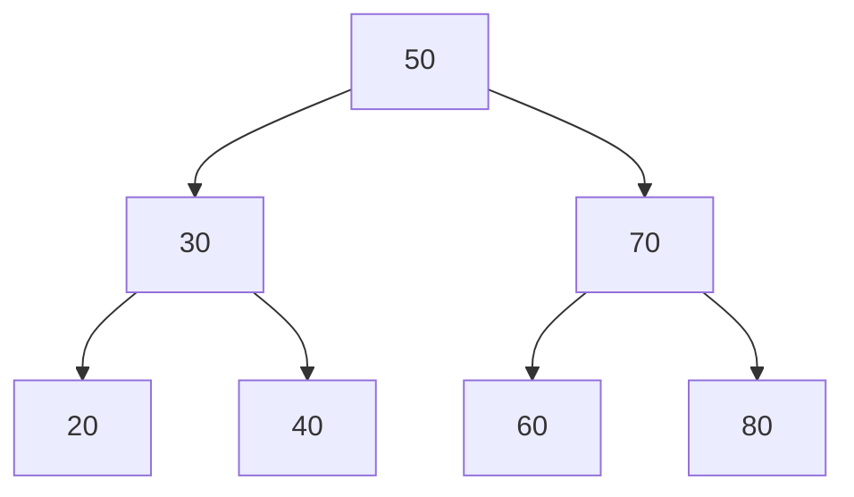
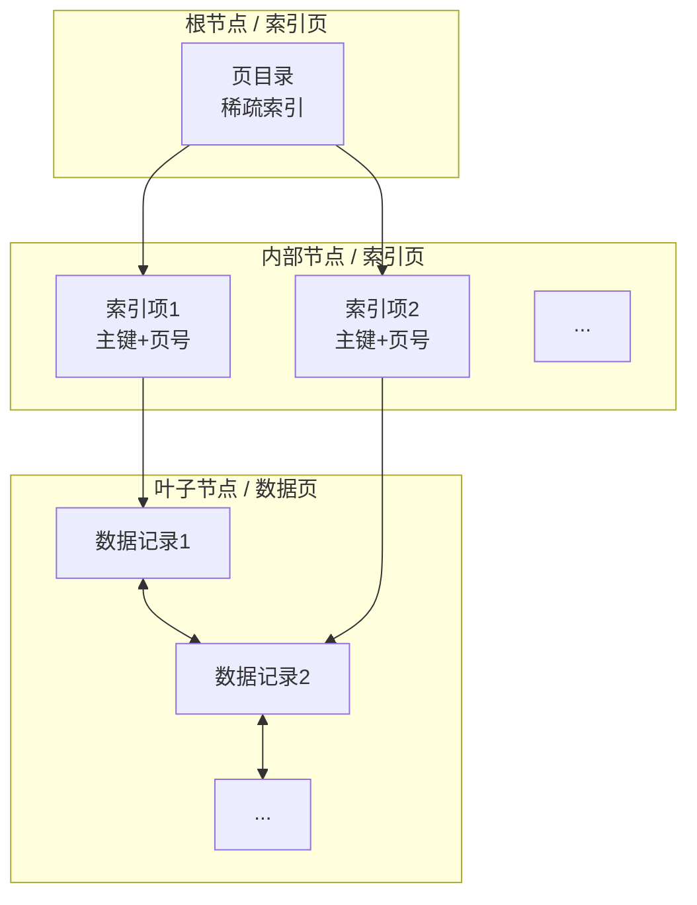
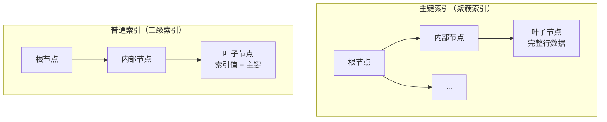

# B+Tree 索引原理

> 面试官问：「为什么 MySQL 选择 B+Tree 而不是 B-Tree 作为索引结构？」你说「因为 B+Tree 性能更好」——然后面试官追问「好在哪里？为什么不用红黑树或哈希表？」你沉默了。这是 P6 MySQL 面试的最高频问题，也是一道区分 P6 和 P7 的分水岭。

## 面试官最关心的 3 个问题（快速自测）

| 问题 | 考察点 | 难度 |
|------|--------|------|
| B+Tree 和 B-Tree 的核心区别是什么？ | 索引结构 | 🔴 高频 |
| 为什么 MySQL 索引使用 B+Tree 而不是 B-Tree？ | 设计权衡 | 🔴 高频 |
| B+Tree 的高度是多少？怎么估算？ | 性能分析 | 🟡 中频 |

---

## 一、从二分查到 B+Tree 的演进

### 1.1 线性查找 O(n)

```java
// 线性查找：在 100 万条数据中查找目标
for (int i = 0; i < 1000000; i++) {
    if (data[i] == target) return i; // 最坏情况 100 万次
}
```

### 1.2 二分查找 O(log n)

```java
// 二分查找：有序数组中查找
int left = 0, right = arr.length - 1;
while (left <= right) {
    int mid = (left + right) / 2;
    if (arr[mid] == target) return mid;
    else if (arr[mid] < target) left = mid + 1;
    else right = mid - 1;
}
// 100 万数据只需要约 20 次比较
```

**问题**：数据存储在磁盘，二分查找需要频繁随机 I/O，成本极高。

### 1.3 平衡二叉树（AVL / 红黑树）



**问题**：树高 = `log₂(n)`，100 万数据树高约 20，但每个节点只有一个数据，查找仍需 20 次磁盘 I/O。

### 1.4 B-Tree：多路平衡查找树

```mermaid
graph TD
    A[页目录 | 15 | 30 | 50 | 70]
    A --> B[数据页1]
    A --> C[数据页2]
    A --> D[数据页3]
    A --> E[数据页4]
    B --> B1[10]
    B --> B2[15]
    C --> C1[20]
    C --> C2[30]
```

每个节点可存储多个数据，`m` 阶 B-Tree：
- 每个节点最多 `m` 个子节点
- 每个节点最多 `m-1` 个数据
- 树高 `≈ log_m(n)`

**优势**：相同数据量下，树高更矮，减少磁盘 I/O。

### 1.5 B+Tree：B-Tree 的进化

```mermaid
graph TD
    A[页目录 | 30 | 60 | 90]
    A --> B[索引页1<br/>10, 20, 30]
    A --> C[索引页2<br/>40, 50, 60]
    A --> D[索引页3<br/>70, 80, 90]

    B --> E1[数据页]
    B --> E2[数据页]
    C --> E3[数据页]
    C --> E4[数据页]
    D --> E5[数据页]
    D --> E6[数据页]

    E1 --> K1[10, 11, 12...]
    E2 --> K2[28, 29, 30...]
    E3 --> K3[40, 41, 42...]
```

---

## 二、B+Tree vs B-Tree 核心区别

| 特性 | B-Tree | B+Tree |
|------|--------|--------|
| **数据存储位置** | 节点同时存储索引和数据 | 只有叶子节点存储数据 |
| **叶子节点连接** | ❌ 无链表连接 | ✅ 双向链表连接 |
| **查询稳定性** | 可能命中任意节点 | 必须查到叶子节点 |
| **范围查询** | 需要回溯遍历 | 直接链表遍历 |
| **磁盘读写** | 非叶子节点也存储数据，节点大 | 非叶子节点只存索引，节点小 |

### 为什么 B+Tree 更适合数据库索引？

**场景对比**：查找 `[30, 60]` 范围内的所有数据

**B-Tree**：
1. 从根节点找到 30（二分查找）
2. 找到包含 30 的叶子节点
3. 遍历叶子节点找到 30
4. **回溯到父节点**找到 40、50
5. **再回溯**找到 60
6. 多次回溯，I/O 开销大

**B+Tree**：
1. 从根节点找到 30
2. 找到包含 30 的叶子节点
3. **沿叶子节点链表**顺序遍历 30、40、50、60
4. 无需回溯，I/O 开销小

---

## 三、MySQL 中 B+Tree 的具体实现

### InnoDB 索引页结构

InnoDB 中，**数据页大小默认 16KB**，采用 B+Tree 组织索引：



### 索引页内部结构

```
┌─────────────────────────────────────────────────────┐
│  File Header (38 byte)     页头信息                  │
├─────────────────────────────────────────────────────┤
│  Page Header (56 byte)    页级索引信息              │
├─────────────────────────────────────────────────────┤
│  Infimum + Supremum       系统记录                   │
├─────────────────────────────────────────────────────┤
│  User Records             用户记录（数据行）          │
│  ├─ 记录头信息 (5 byte)                             │
│  ├─ 变长字段长度 (2n byte)                          │
│  ├─ NULL标志位 (n byte)                             │
│  └─ 列数据 (n byte)                                 │
├─────────────────────────────────────────────────────┤
│  Free Space               空闲空间                   │
├─────────────────────────────────────────────────────┤
│  Page Directory           页目录（行定位辅助）        │
├─────────────────────────────────────────────────────┤
│  File Trailer (8 byte)    页尾校验                   │
└─────────────────────────────────────────────────────┘
```

### B+Tree 高度计算

假设：
- 索引字段为主键 `BIGINT`（8 字节）
- 每条索引项 = 主键（8B）+ 页号（6B）= 14B
- 每页 16KB = 16384 字节
- 每页可存索引项数 = `16384 / 14 ≈ 1170`

**树高为 3 的 B+Tree 能存多少数据？**

| 层级 | 节点数 | 说明 |
|------|--------|------|
| 根节点 | 1 | 索引页 |
| 第一层 | `1170` | 索引页 |
| 第二层 | `1170² = 1,368,900` | 索引页 |
| 第三层 | `1170³ = 1,601,466,000` | 数据页 |

> **结论**：3 层 B+Tree 最多可存储 **16 亿**条数据，查询任意一条记录最多只需 3 次磁盘 I/O。

---

## 四、为什么不用其他数据结构？

### 对比：红黑树（平衡二叉树）

| 对比 | B+Tree（m 叉树） | 红黑树（二叉树） |
|------|------------------|------------------|
| **树高** | 约 `log_m(n)` | `log_2(n)` |
| 100 万数据树高 | `log_1170(1,000,000) ≈ 2.7` | `log_2(1,000,000) ≈ 20` |
| 磁盘 I/O 次数 | 3 次 | 20 次 |
| **根本原因** | 多叉减少树高 | 每节点只存 1 个数据 |

### 对比：哈希表

| 对比 | B+Tree | 哈希表 |
|------|--------|--------|
| **等值查询** | O(log n) | O(1) ✅ |
| **范围查询** | O(log n + k) ✅ | O(n) ❌ |
| **排序** | 支持（链表有序）✅ | 不支持 ❌ |
| **最左前缀匹配** | 支持 ✅ | 不支持 ❌ |
| **内存占用** | 较高 | 较高（需全量加载） |

**哈希索引适用场景**：
- 等值查询（如 `WHERE id = 1`）
- 不需要范围查询和排序

---

## 五、常见面试陷阱

:::danger 陷阱 1：混淆 B-Tree 和 B+Tree
错误说法：「B+Tree 就是 B-Tree，只是名字不同」
正确理解：两者核心区别是数据存储位置和叶子节点连接方式，这导致 B+Tree 在范围查询和查询稳定性上明显优于 B-Tree。
:::

:::danger 陷阱 2：认为 B+Tree 高度固定不变
错误说法：「MySQL 索引高度都是 3 层」
正确理解：树高取决于数据量、页大小、索引字段长度。数据量越大，树高越高。InnoDB 页大小可调整（`innodb_page_size`）。
:::

:::danger 陷阱 3：忽略主键长度对索引的影响
错误说法：「索引字段长度无所谓」
正确理解：主键越长，每页能存的索引项越少，树高越高。UUID（36 字节）做主键比自增 BIGINT（8 字节）树高更高。
:::

:::tip 正确示例
主键长度对比（B+Tree 3 层，页大小 16KB）：

| 主键类型 | 主键长度 | 每页索引项数 | 最大数据量 |
|----------|----------|--------------|------------|
| BIGINT | 8 字节 | 1170 | **16 亿** |
| UUID | 36 字节 | 440 | **0.85 亿** |
| VARCHAR(32) | 32 字节 | 505 | **1.3 亿** |
:::

---

## 六、InnoDB 主键索引与普通索引



### 查询流程对比

**场景**：查找 `name = '张三'` 的完整记录

**使用二级索引查询**：
```sql
SELECT * FROM users WHERE name = '张三';
```

1. 在 `name` 索引树中查找 `'张三'`，得到主键 `id = 100`
2. **回表**：再通过主键索引找到完整行数据
3. 共需要 **2 次 B+Tree 查询**

---

## 七、加分回答

> 💡 **为什么 MySQL 选择 B+Tree 而不是跳表（Skip List）？**
> 实际上，MySQL 有使用跳表的场景——Redis ZSet 使用跳表实现有序集合。但 MySQL 选择 B+Tree 的原因是：
> 1. **磁盘友好**：B+Tree 的节点是连续磁盘空间，跳表是链表结构（随机指针）
> 2. **范围查询**：B+Tree 叶子节点天然有序链表，跳表范围查询需要额外处理
> 3. **历史原因**：B-Tree/B+Tree 在数据库领域有 40 年历史，成熟稳定

> 💡 **索引设计最佳实践**：
> 1. **主键使用自增 BIGINT**，避免 UUID 导致树高增加
> 2. **索引字段不宜过长**，尽量使用短类型（如 TINYINT 替代 VARCHAR）
> 3. **控制索引数量**，每个索引都是一棵独立的 B+Tree，过多索引影响写入性能

---

## 八、总结对比表

| 数据结构 | 等值查询 | 范围查询 | 排序 | 树高（100万数据） | 磁盘友好性 |
|----------|---------|---------|------|-------------------|------------|
| **B+Tree** | O(log n) | O(log n + k) | ✅ | ~3 | ✅ 优秀 |
| 红黑树 | O(log n) | O(log n + k) | ✅ | ~20 | ❌ 差 |
| 哈希表 | O(1) | O(n) | ❌ | 1 | ❌ 差 |
| 跳表 | O(log n) | O(log n + k) | ✅ | ~20 | ❌ 一般 |

| 索引类型 | B-Tree | B+Tree |
|----------|--------|--------|
| 数据存储 | 所有节点 | 仅叶子节点 |
| 叶子连接 | ❌ 无 | ✅ 双向链表 |
| 范围查询 | 需回溯 | 直接遍历 |
| 查询稳定性 | 不稳定 | 必须到叶子 |