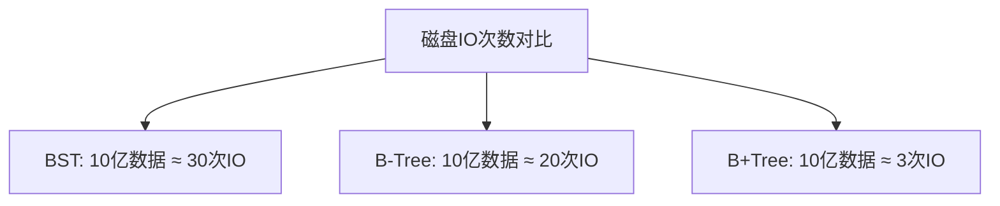
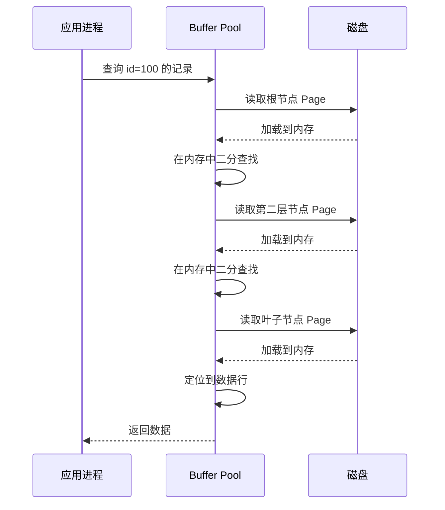

候选人小孙参加阿里 P6 面试，面试官翻到简历上"熟练使用索引"这一行，问：

"MySQL 的索引是什么数据结构？为什么不用二叉树或者跳表？"

小孙说："用的是 B+Tree，比二叉树查找快。"面试官追问："B+Tree 相比二叉树好在哪？为什么不用 B-Tree？"

小孙："B+Tree...树的高度更低？"面试官："为什么 B+Tree 的树高更低？"

小孙停顿了一下，说："因为每个节点可以存多个key..."面试官又问："那 B-Tree 和 B+Tree 的核心区别是什么？叶子节点存不存数据，这个区别会带来什么性能差异？"

小孙彻底卡住了。

【面试官心理】
B+Tree 这道题我用来判断候选人对数据库索引的理解深度。能背出"B+Tree 查询稳定"的人很多，但能讲清楚"为什么 B+Tree 更适合磁盘存储"、"非叶子节点不存数据能放更多索引项"这些原理的人不到 30%。

## 一、从二叉树到 B+Tree 的演进 🔴

### 1.1 演进背景

MySQL 的索引不能用简单的二叉树，因为**磁盘 IO 才是查询的瓶颈**，不是内存比较。

磁盘读写以**页（Page）**为单位，机械硬盘一次 IO 读取 4KB/8KB/16KB（取决于硬件）。如果用二叉树，每个节点只存一个 key，意味着每读取一个 key 可能需要一次 IO。B+Tree 让每个节点存多个 key，从而**减少 IO 次数**。



### 1.2 B-Tree vs B+Tree 的结构差异

```mermaid
graph TD
    subgraph B-Tree结构
        BA[根节点: [20, 40]]
        BA --> B1[[15, 18]]
        BA --> B2[[25, 35]]
        BA --> B3[[50, 60]]
        B1 --> D1[/数据1/]
        B2 --> D2[/数据2/]
        B3 --> D3[/数据3/]
    end
    subgraph B+Tree结构
        BB[根节点: [20, 40]]
        BB --> C1[[10, 20]]
        BB --> C2[[30, 50]]
        C1 --> C11[[5, 10]]
        C1 --> C12[[15, 20]]
        C11 --> L1[/数据/]
        C12 --> L2[/数据/]
        C2 --> C21[[25, 30]]
        C2 --> C22[[40, 50]]
        C21 --> L3[/数据/]
        C22 --> L4[/数据/]
    end
```

### 1.3 核心差异表

| 特性 | B-Tree | B+Tree |
| --- | --- | --- |
| 叶子节点 | 所有节点都存数据 | 只有叶子节点存数据 |
| 叶子节点关系 | 无链表 | 有双向链表 |
| 范围查询 | 需要回溯 | 顺序遍历链表即可 |
| 查询稳定性 | 最坏 O(log n)，最好 O(1) | 稳定 O(log n) |
| 磁盘IO效率 | 非叶子节点也存数据，节点存 key 少 | 非叶子节点只存索引，放更多 key |
| 空间利用率 | 较低 | 更高 |

### 1.4 ❌ 错误示范

**候选人原话**："B+Tree 比 B-Tree 快，因为 B+Tree 叶子节点有链表。"

**问题诊断**：
- 混淆了"快"的原因。B+Tree 快不是因为链表，是因为**非叶子节点不存数据，每个节点能放更多 key，树高更矮，IO 更少**
- 把链表当成 B+Tree 的核心优势，忽略了更重要的非叶子节点设计
- 不理解链表解决的是"范围查询"问题，不是"查找"问题

**面试官内心 OS**：这个候选人肯定看过网上的对比文章，但没理解本质原因。

:::warning ⚠️
面试中最常犯的错误是把 B+Tree 的优点背串了。B-Tree 和 B+Tree 的本质区别就两点：**叶子节点存不存数据** 和 **叶子节点有没有链表**。其余的所有优势都是这两点的推论。
:::

## 二、MySQL 为什么选择 B+Tree 🔴

### 2.1 磁盘友好的数据结构

MySQL 的 InnoDB 引擎将数据划分为**页（Page）**，默认大小 16KB。每个节点（Page）在 B+Tree 中占一页。

```sql
-- 查看 InnoDB 页大小
SHOW VARIABLES LIKE 'innodb_page_size';  -- 默认 16384 字节 = 16KB
```

非叶子节点只存**索引值 + 指针**。假设主键是 BIGINT（8 字节），指针 6 字节，一个非叶子节点能存：

```
16KB / 14字节 ≈ 1170 个索引项
```

三层 B+Tree 能存储：

```
第一层: 1 个根节点
第二层: 1170 个非叶子节点
第三层: 1170 × 1170 ≈ 137 万个叶子节点
每个叶子节点 16KB，存 100 条数据（平均每行 160 字节）
总容量: 137 万 × 100 ≈ 1.37 亿条数据
```

只需 **3 次磁盘 IO** 就能定位到任何一条数据。

### 2.2 B-Tree 为什么不够好

B-Tree 的非叶子节点也存数据，这意味着每个节点能存的 key 更少，树高更高。

```
同样的 16KB 页，B-Tree 每个节点只能存 700 个 key
三层 B-Tree: 700 × 700 = 49 万个叶子节点
容量只有 B+Tree 的 1/27
```

:::tip 💡
B-Tree 在查询单一数据时可能更快（因为非叶子节点也可能命中数据），但 MySQL 的查询场景中**范围查询（ORDER BY, BETWEEN, `>`、`<`）占了大部分**，B+Tree 的顺序 IO 优势碾压了这一点点单次查询的优势。
:::

【面试官心理】
我问他为什么 MySQL 选 B+Tree，其实是在判断他有没有从"磁盘 IO 视角"思考问题。只知道 B+Tree 快，不知道为什么快的人，下一层追问"给个数字，3 层 B+Tree 能存多少数据"就会崩掉。

## 三、B+Tree 的查询过程 🟡

### 3.1 聚簇索引的查找流程



注意：**只有第一次读取节点需要磁盘 IO，后续都在内存中操作**。Buffer Pool 就是干这个的。

### 3.2 范围查询的优势

```sql
-- 范围查询: 查询 id 在 1000 到 2000 之间的所有记录
SELECT * FROM orders WHERE order_id BETWEEN 1000 AND 2000;
```

B-Tree 的范围查询：找到 1000，回溯到根，再找 2000，路径可能不同，需要多次查找。

B+Tree 的范围查询：
1. 找到 1000 所在的叶子节点
2. 沿着叶子节点的链表顺序遍历，直到超过 2000


链表让范围查询变成**顺序 IO**，而顺序 IO 在机械硬盘上的性能是随机 IO 的 100 倍以上。

## 四、InnoDB 页结构详解 🟡

### 4.1 页的内部结构

InnoDB 的 16KB 数据页结构：

```
+----------------------------------------------------------+
| Page Header (38字节)                                      |
|  - Page Number, Page Type, Records Count, etc.           |
+----------------------------------------------------------+
| Infimum + Supremum (26字节)                              |
|  - 虚拟行，定义下界和上界                                  |
+----------------------------------------------------------+
| User Records (可变)                                      |
|  - 实际数据行                                              |
+----------------------------------------------------------+
| Free Space (可变)                                        |
|  - 空闲空间，新插入的数据在这里分配                        |
+----------------------------------------------------------+
| Page Directory (可变)                                    |
|  - 页内记录的稀疏索引，二分查找用                          |
+----------------------------------------------------------+
| File Trailer (8字节)                                      |
|  - 校验页完整性                                            |
+----------------------------------------------------------+
```

### 4.2 行格式与空间开销

InnoDB 的行格式（Row Format）影响每行数据的存储空间：

```sql
-- 查看表的行格式
SHOW TABLE STATUS FROM db_name LIKE 'orders';
```

| 行格式 | 最大行长度 | 变长字段存储 | 适用场景 |
| --- | --- | --- | --- |
| Compact | 65535 字节 | 仅存前 768 字节 + 20 字节指针 | 默认格式 |
| Redundant | 65535 字节 | 完整存储 | 兼容老格式 |
| Dynamic | 65535 字节 | 仅存 20 字节指针 | 推荐格式 |
| Compressed | 65535 字节 | 压缩存储 | 大表优化 |

【面试官心理】
问到页结构的候选人很少，但如果能讲清楚 Page Directory 和 Infimum/Supremum 的作用，基本就是 P7 的水准了。普通候选人连 Page Header 里有什么都不知道。

## 五、生产避坑

### 5.1 主键长度影响索引大小

主键越长，每个索引项就越大，树高越高，查询越慢。

```sql
-- ❌ 差的主键选择
CREATE TABLE orders (
    order_id VARCHAR(36) PRIMARY KEY,  -- UUID，36字节，索引项太大
    ...
);

-- ✅ 的主键选择
CREATE TABLE orders (
    order_id BIGINT PRIMARY KEY AUTO_INCREMENT,  -- 8字节，索引紧凑
    ...
);
```

用 UUID 做主键，B+Tree 的插入性能会退化 10 倍以上，因为 UUID 无序，每次插入都可能触发页分裂。

### 5.2 页分裂问题


:::tip 💡
自增主键的优势：每次插入都在页尾追加，不需要页分裂。UUID 或者雪花 ID 虽然分布式友好，但会频繁触发页分裂，严重影响写入性能。解决方案：用改进的主键设计，比如 Twitter 的 Snowflake 改造成时间有序的 ID。
:::

## 六、工程选型

### 6.1 索引设计原则

| 原则 | 说明 | 反例 |
| --- | --- | --- |
| 主键用整型自增 | 8字节，整形比较快，无需回表 | UUID 主键 |
| 联合索引字段顺序 | 区分度高的放前面 | (sex, user_id) |
| 避免冗余索引 | (A) 和 (A,B) 索引有重叠 | 建了两个相同前缀的索引 |
| 控制索引长度 | 字符串前缀索引 | 全列索引 on TEXT 字段 |

### 6.2 索引不是越多越好

```sql
-- ❌ 索引过多的问题
CREATE TABLE orders (
    ...
    INDEX idx_user_id (user_id),
    INDEX idx_status (status),
    INDEX idx_create_time (create_time),
    INDEX idx_user_status (user_id, status),  -- 冗余
    INDEX idx_all (user_id, status, create_time)  -- 冗余
);
```

索引过多的问题：
- **写入变慢**：每次 INSERT/UPDATE/DELETE 都要维护所有索引
- **占用空间**：索引可能比数据还大
- **优化器困惑**：可能选错索引

:::warning ⚠️
生产环境里，因为索引过多导致写入性能下降 50% 的案例比比皆是。原则是：单个表的索引数量不超过 5 个，非必要不加索引。
:::
