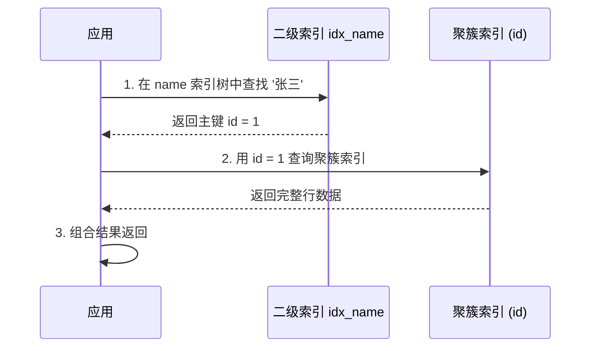

候选人小周参加字节 P6 面试，面试官问：

"聚簇索引和二级索引有什么区别？为什么说二级索引查询要回表？"

小周说："聚簇索引就是主键索引，二级索引是非主键索引，二级索引查完要回表查主键。"面试官点点头，继续追问：

"那如果我有一个查询 `SELECT id, name FROM users WHERE name = '张三'`，id 是主键，name 上有索引，需要回表吗？"

小周说："需要..."面试官打断："为什么？明明查的 id 和 name，而 name 索引的叶子节点就存了 id 啊。"

小周卡住了。

【面试官心理】
这道题我用来测试候选人对"回表"的理解深度。知道回表概念的人占 60%，能讲清楚"覆盖索引"（不需要回表）的人占 20%，能结合 EXPLAIN 分析的人占 10%。这个递进很清晰。

## 一、聚簇索引与二级索引的核心差异 🔴

### 1.1 存储结构对比

```mermaid
graph TD
    subgraph 聚簇索引 (Clustered Index)
        CA[根节点]
        CA --> CB[非叶子节点: 存 key+指针]
        CB --> CC1[叶子节点: 存完整数据行]
        CB --> CC2[叶子节点: 存完整数据行]
        CC1 --> DA[/row1: id=1, name=张三, age=25/]
        CC1 --> DB[/row2: id=3, name=李四, age=30/]
        CC2 --> DC[/row5: id=5, name=王五, age=28/]
    end
    subgraph 二级索引 (Secondary Index)
        SA[name 索引的根节点]
        SA --> SB1[叶子: name=张三 -> id=1]
        SA --> SB2[叶子: name=李四 -> id=3]
        SA --> SB3[叶子: name=王五 -> id=5]
    end
```

**聚簇索引**：数据行就存储在 B+Tree 的叶子节点中。数据即索引，索引即数据。

**二级索引**：叶子节点只存储**索引列的值 + 主键值**，不存完整数据行。查到的只是主键，还需要再查一次聚簇索引才能取到完整数据——这就是"回表"。

### 1.2 InnoDB 的主键选择策略

InnoDB 强制要求每张表有主键，原因就在聚簇索引上——**没有主键，数据存在哪？**

```sql
-- 三种主键选择方式
-- 1. 显式主键
CREATE TABLE t1 (id BIGINT PRIMARY KEY, ...);

-- 2. 自增主键 (推荐)
CREATE TABLE t2 (id BIGINT AUTO_INCREMENT PRIMARY KEY, ...);

-- 3. 唯一键 (没有显式主键时)
CREATE TABLE t3 (email VARCHAR(100) UNIQUE, name VARCHAR(50));
-- 如果没有任何唯一键，InnoDB 会生成 6 字节的隐藏主键
```

:::warning ⚠️
如果没有显式主键，InnoDB 会生成一个隐藏的 ROW_ID 列作为聚簇索引的 key。这个隐藏主键没有业务意义，而且所有无主键表共享同一个全局计数器，在高并发下可能有性能问题。所以，**永远显式定义主键**。
:::

### 1.3 ❌ 错误示范

**候选人原话**："聚簇索引就是主键索引，二级索引就是普通索引，它们的区别就是主键只有一个。"

**问题诊断**：
- 混淆了概念。"聚簇"描述的是数据的存储方式，不是索引类型
- 不理解聚簇索引的数据和索引是同一个结构
- 不知道回表的开销有多大

**面试官内心 OS**：这个候选人知道主键和普通索引的区别，但完全不理解背后的存储模型。

:::tip 💡
记住一个核心区别：**聚簇索引的叶子节点存完整行数据，二级索引的叶子节点存主键值**。就这么一句话，涵盖了整个回表机制的本质。
:::

## 二、回表机制详解 🔴

### 2.1 回表的完整流程

```sql
-- 表结构
CREATE TABLE users (
    id BIGINT PRIMARY KEY,       -- 聚簇索引
    name VARCHAR(50),
    age INT,
    email VARCHAR(100),
    INDEX idx_name (name)         -- 二级索引
);

-- 执行这条 SQL
SELECT * FROM users WHERE name = '张三';
```



这就是回表：**先在二级索引查到主键，再用主键回聚簇索引取完整数据**。

### 2.2 什么时候不需要回表？

回到开头那道追问：

```sql
-- 需要回表: 查了 * (所有字段)
SELECT * FROM users WHERE name = '张三';

-- 不需要回表: 只需要 id 和 name，都在二级索引叶子节点中
SELECT id, name FROM users WHERE name = '张三';
```

这就是**覆盖索引**——查询的所有字段都在二级索引的叶子节点中，不需要回表。

```sql
-- EXPLAIN 分析
EXPLAIN SELECT id, name FROM users WHERE name = '张三';
-- Extra 列显示: Using index (覆盖索引，未回表)

EXPLAIN SELECT * FROM users WHERE name = '张三';
-- Extra 列显示: NULL (需要回表)
```

### 2.3 回表的性能影响

回表意味着**多一次 B+Tree 查找**。对于高并发查询来说，这个开销不可忽视。

```sql
-- 如果二级索引的区分度很低（很多重复值）
-- 比如: 性别字段，只有男女两种值
SELECT * FROM users WHERE sex = 'M';

-- sex 索引的叶子节点可能返回 100 万个 id
-- 100 万次回表查询 = 灾难
```

所以二级索引的**区分度**非常重要。区分度 = 不同值数量 / 总行数，接近 1 最好。

【面试官心理】
我追问"需不需要回表"，其实是在判断候选人会不会优化 SQL。能说出"EXPLAIN 看 Extra 列"、知道"Using index"意味着覆盖索引的，基本是 P6+。能主动设计覆盖索引的候选人凤毛麟角。

## 三、主键选择策略 🟡

### 3.1 自增主键 vs 业务主键

```sql
-- 方案 A: 自增主键
CREATE TABLE orders (
    id BIGINT PRIMARY KEY AUTO_INCREMENT,  -- 8 字节，顺序写入
    order_no VARCHAR(32) UNIQUE,            -- 业务主键，仅用于业务展示
    ...
);

-- 方案 B: 业务主键 (UUID)
CREATE TABLE orders (
    id VARCHAR(36) PRIMARY KEY,  -- 36 字节，随机写入
    ...
);
```

| 维度 | 自增主键 | UUID / 业务主键 |
| --- | --- | --- |
| 写入性能 | 极好（页尾追加，无页分裂） | 差（随机插入，频繁页分裂） |
| 索引大小 | 8 字节，紧凑 | 36+ 字节，索引膨胀 |
| 联合索引 | 不影响其他索引 | UUID 做联合索引会导致索引臃肿 |
| 分布式 | 需要分布式 ID 生成器 | 原生支持（但 MySQL 里 UUID 依然有页分裂问题） |
| 可读性 | 不可读（123456） | 可读（3F2504E0-...） |

### 3.2 联合主键的坑

```sql
-- ❌ 联合主键设计
CREATE TABLE order_items (
    order_id BIGINT,
    item_id BIGINT,
    quantity INT,
    PRIMARY KEY (order_id, item_id)
);

-- 问题: 如果 item_id 是区分度更高的字段，但被放在了联合主键的第二位
-- 等价于: 每个 order_id 下，item_id 是唯一的
-- 但查询: SELECT * FROM order_items WHERE item_id = ? 无法使用联合主键的有效前缀
```

:::tip 💡
联合主键的索引是聚簇索引，所以联合主键的字段顺序就是聚簇索引的 B+Tree 排序顺序。如果业务查询条件主要用 item_id，应该把 item_id 放在前面，或者单独建二级索引。
:::

## 四、二级索引的查询优化 🟡

### 4.1 索引覆盖设计

在设计联合索引时，把高频查询字段加进去，避免回表。

```sql
-- 业务场景: 订单列表页，只需要 order_id, order_no, create_time, status
-- 普通索引设计
CREATE INDEX idx_create_time ON orders (create_time);
-- 查询: SELECT order_id, order_no, create_time, status FROM orders ORDER BY create_time LIMIT 20;
-- 问题: create_time 索引只能定位主键，还需要回表查 status

-- 覆盖索引设计
CREATE INDEX idx_create_time ON orders (create_time, order_id, order_no, status);
-- 查询: SELECT order_id, order_no, create_time, status FROM orders ORDER BY create_time LIMIT 20;
-- 覆盖索引，顺序扫描即可，不需要回表
```

### 4.2 前缀索引与回表

```sql
-- 前缀索引: 只索引字符串的前 N 个字符
CREATE INDEX idx_email ON users (email(10));

-- 覆盖索引 + 前缀索引
-- 问题: SELECT * FROM users WHERE email = 'test@example.com';
-- email(10) 存的是 'test@examp'，不够区分，需要回表比对完整值
-- SELECT email FROM users WHERE email = 'test@example.com';
-- 也需要回表，因为存的就是前缀，不是完整值
```

:::warning ⚠️
前缀索引无法使用覆盖索引优化，因为索引里存的不是完整值，回表是必然的。
:::

【面试官心理】
问完聚簇索引和二级索引的区别后，我通常会追问覆盖索引。候选人能说出"把查询字段加到索引里"这句话，就说明他有实战优化经验。如果还能用 EXPLAIN 证明，更是加分。

## 五、生产避坑

### 5.1 索引下推与回表的关系

MySQL 5.6+ 的**索引下推（ICP）**可以在索引遍历过程中提前过滤数据，减少回表次数。

```sql
-- 联合索引 (name, age)
SELECT * FROM users WHERE name LIKE '张%' AND age = 25;

-- 没有 ICP: 先用 name 索引找到所有 '张' 开头的记录，返回所有主键，逐一回表查 age
-- 有 ICP: 在索引遍历过程中同时用 age=25 过滤，只回表符合 age 条件的记录
```

### 5.2 深分页与回表

```sql
-- 深分页是回表问题的极端体现
SELECT * FROM orders WHERE status = 'paid' ORDER BY create_time DESC LIMIT 1000000, 20;

-- 问题: 走 status 索引，找到 100 万个主键，逐一回表查完整数据
-- 回表 100 万次 = 查询超时
```

**解决方案**：

```sql
-- 方案 1: 延迟关联 - 先查出 ID，再用 ID 查完整数据
SELECT * FROM orders o
INNER JOIN (
    SELECT order_id FROM orders WHERE status = 'paid' ORDER BY create_time DESC LIMIT 1000000, 20
) t ON o.order_id = t.order_id;

-- 方案 2: 游标分页 - 记住上一页最后一条的 ID
SELECT * FROM orders WHERE status = 'paid' AND order_id < #{last_order_id}
ORDER BY create_time DESC LIMIT 20;
```

:::tip 💡
深分页的本质问题不是 LIMIT，而是**回表次数太多**。任何能减少回表次数的方案都是好方案。
:::

## 六、工程选型

| 场景 | 建议 | 原因 |
| --- | --- | --- |
| OLTP 业务表 | 自增主键 | 写入性能最佳 |
| 日志/流水表 | 自增主键 | 纯追加，无页分裂 |
| 需要分布式 ID | Snowflake 变种 | 保证趋势递增 |
| 分库分表场景 | 雪花 ID | 全局唯一 |
| 历史数据归档 | 无主键（归档表） | 节省空间 |

| 索引设计 | 目的 |
| --- | --- |
| 覆盖索引 | 减少回表次数 |
| 联合索引最左前缀 | 一个索引服务多个查询 |
| 前缀索引 | 节省索引空间（牺牲区分度） |
| 唯一索引 | 数据唯一性 + 加速查询 |
