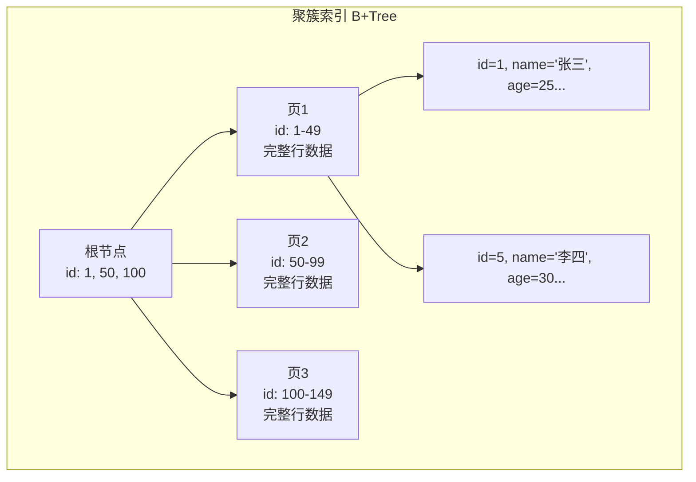
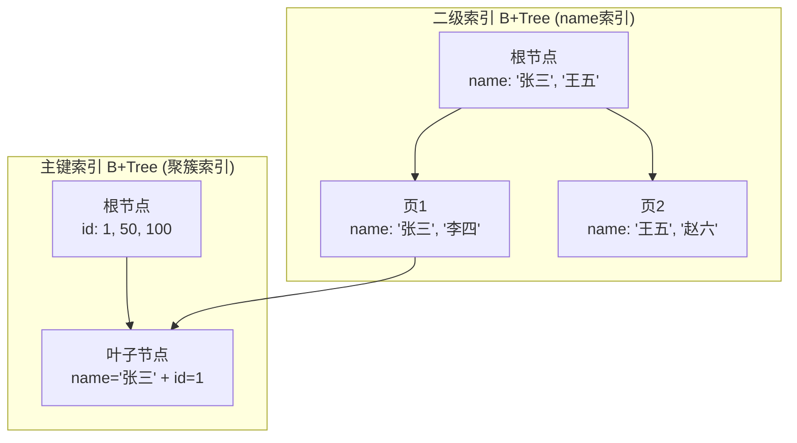
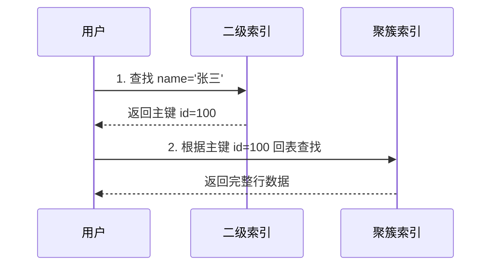

# 聚簇索引 vs 二级索引

> 面试官问：「聚簇索引和二级索引有什么区别？」你答：「聚簇索引叶子节点存完整数据，二级索引叶子节点存主键」——面试官追问：「那为什么查询时有时快有时慢？」你沉默了。这道题的关键不在于背概念，而在于理解「回表」对性能的影响。

## 面试官最关心的 3 个问题（快速自测）

| 问题 | 考察点 | 难度 |
|------|--------|------|
| 聚簇索引和二级索引的数据存储方式有何不同？ | 索引结构 | 🔴 高频 |
| 什么是回表？为什么有时需要回表？ | 查询流程 | 🔴 高频 |
| 如何避免回表？覆盖索引是什么原理？ | 性能优化 | 🟡 中频 |

---

## 一、核心概念

### 1.1 聚簇索引（Clustered Index）

InnoDB 中，**主键索引即聚簇索引**。数据行的物理存储顺序与索引逻辑顺序一致。



### 1.2 二级索引（Secondary Index）

除主键索引外的所有索引，也称为「非聚簇索引」或「辅助索引」。



---

## 二、核心区别对比

| 对比维度 | 聚簇索引 | 二级索引 |
|----------|----------|----------|
| **数量** | 每表仅 1 个 | 每表可多个 |
| **叶子节点存储** | 完整行数据 | 索引列 + 主键 |
| **数据物理顺序** | 与索引顺序一致 | 与数据物理顺序无关 |
| **创建方式** | 主键自动创建 | 手动 `CREATE INDEX` |
| **查询** | 直接获取数据 | 可能需要回表 |

---

## 三、回表查询详解

### 3.1 什么是回表？

使用二级索引查询时，如果查询的字段不在索引中，需要**再通过主键回到聚簇索引查找完整数据**，这个过程称为「回表」。



### 3.2 两次查询示例

```sql
-- 表结构
CREATE TABLE users (
    id BIGINT PRIMARY KEY,      -- 聚簇索引
    name VARCHAR(50),
    age INT,
    email VARCHAR(100),
    phone VARCHAR(20),
    INDEX idx_name (name)      -- 二级索引
);

-- 查询语句
SELECT * FROM users WHERE name = '张三';
```

**查询流程**：

1. 在 `idx_name` 索引树中查找 `'张三'`
2. 找到叶子节点 `{name: '张三', id: 100}`
3. **回表**：用 `id=100` 在主键索引中查找完整行数据
4. 返回 `id, name, age, email, phone` 全部字段

### 3.3 回表性能影响

| 查询类型 | 回表次数 | 性能 |
|----------|----------|------|
| `SELECT *` | 必须回表 | 较慢 |
| `SELECT 主键` | 无需回表 | 快 |
| `SELECT 索引覆盖字段` | 无需回表 | 快 |

---

## 四、覆盖索引（Covering Index）

### 4.1 概念

如果一个查询的所有字段都包含在索引中，**无需回表**，直接返回结果。这就是「覆盖索引」。

```sql
-- 覆盖索引查询
SELECT id, name FROM users WHERE name = '张三';
```

这里 `id` 和 `name` 都在 `idx_name` 索引中，无需回表。

### 4.2 回表 vs 覆盖索引


### 4.3 建立覆盖索引优化查询

```sql
-- 原查询（需回表）
SELECT name, age, email FROM users WHERE name = '张三';

-- 优化：建立覆盖索引
CREATE INDEX idx_covering ON users(name, age, email);

-- 现在只需一次索引查询，无需回表
```

### 4.4 覆盖索引验证

```sql
EXPLAIN SELECT name, age, email FROM users WHERE name = '张三';
```

观察 `EXPLAIN` 结果中的 `Extra` 字段：

| Extra 值 | 含义 |
|----------|------|
| `Using index` | **覆盖索引**，无需回表，性能最佳 |
| `Using index condition` | 使用索引下推 |
| `Using where` | 使用 WHERE 条件过滤 |
| `Using filesort` | 需要额外排序 |

---

## 五、联合索引与回表

### 5.1 联合索引结构

```sql
CREATE INDEX idx_user ON users(name, age, email);
```

```mermaid
graph TD
    subgraph "联合索引 B+Tree (name, age, email)"
        A[根节点<br/>name: '张三'/page1, '王五'/page2]
        A --> B[页1<br/>name='张三', age: 25, 30<br/>email: a@x.com, b@x.com]
        A --> C[页2<br/>name='王五', age: 28<br/>email: c@x.com]
    end

    B --> D[叶子节点<br/>('张三', 25, 'a@x.com', id=1)]
    B --> E[叶子节点<br/>('张三', 30, 'b@x.com', id=5)]
```

### 5.2 查询分析

| SQL 语句 | 是否使用索引 | 回表情况 |
|----------|-------------|----------|
| `WHERE name = '张三'` | ✅ 命中 | 需回表 |
| `WHERE name = '张三' AND age = 25` | ✅ 命中 | 需回表 |
| `SELECT name, age WHERE name = '张三'` | ✅ 命中 | **无需回表（覆盖索引）** |
| `SELECT name, age, email WHERE name = '张三'` | ✅ 命中 | **无需回表（覆盖索引）** |
| `WHERE age = 25` | ❌ 不命中 | 全表扫描 |

---

## 六、常见面试陷阱

:::danger 陷阱 1：误以为每表只能有一个索引
错误理解：「聚簇索引只有一个，所以二级索引也只能有一个」
正确理解：每表只能有一个聚簇索引（数据物理存储方式），但可以有多个二级索引。
:::

:::danger 陷阱 2：忽略主键选择对性能的影响
错误理解：「用什么做主键都一样」
正确理解：InnoDB 采用聚簇索引存储数据，主键长度直接影响索引大小和查询效率。UUID 做主键会导致：
- 索引页能存的索引项更少
- 树高增加
- 查询性能下降
:::

:::danger 陷阱 3：认为覆盖索引字段越多越好
错误理解：「把所有字段都加到索引里，避免回表」
正确理解：过多字段会使索引变大，每次写入都要维护索引，增加写入开销。需要权衡查询优化和写入性能。
:::

---

## 七、实战优化案例

### 案例：用户表高频查询优化

```sql
-- 原始表结构
CREATE TABLE orders (
    id BIGINT PRIMARY KEY,
    user_id BIGINT NOT NULL,
    product_name VARCHAR(100),
    price DECIMAL(10,2),
    status TINYINT,
    create_time DATETIME,
    INDEX idx_user_id (user_id)
);

-- 高频查询：查询某用户的所有订单
-- 查询1：SELECT * FROM orders WHERE user_id = 100;
-- 查询2：SELECT user_id, status, create_time FROM orders WHERE user_id = 100 ORDER BY create_time DESC;
```

**优化方案**：

```sql
-- 方案1：覆盖索引优化查询2
CREATE INDEX idx_user_status_time ON orders(user_id, status, create_time);

-- 方案2：如果查询2不带 status
CREATE INDEX idx_user_time ON orders(user_id, create_time DESC);
```

### 性能对比

| 查询 | 优化前 | 优化后 | 提升 |
|------|--------|--------|------|
| `SELECT * WHERE user_id = ?` | 索引 + 回表 | 索引 + 回表 | - |
| `SELECT status, create_time WHERE user_id = ?` | 索引 + 回表 | **索引覆盖** | 减少 1 次 I/O |

---

## 八、加分回答

> 💡 **InnoDB 和 MyISAM 的索引差异**：
> - **InnoDB**：主键是聚簇索引，数据与索引在同一棵 B+Tree 中
> - **MyISAM**：主键也是二级索引，数据单独存储，索引树叶子节点存的是数据地址（行号）
>
> 这意味着 MyISAM 的主键查询同样需要一次「回表」（虽然是读取地址），而 InnoDB 聚簇索引查询无需回表。

> 💡 **索引下推（ICP）与回表的结合**：
> MySQL 5.6+ 引入索引下推优化，在二级索引遍历时，先用 WHERE 条件过滤非目标记录，减少回表次数。
>
> ```sql
> SELECT * FROM users WHERE name LIKE '张%' AND age = 25;
> ```
> - 无 ICP：先找到所有 `name LIKE '张%'` 的记录，然后逐一回表，再在服务器层过滤 `age = 25`
> - 有 ICP：在索引树遍历时直接过滤 `age = 25`，减少回表次数

---

## 九、总结对比表

| 维度 | 聚簇索引 | 二级索引 |
|------|----------|----------|
| 定义 | 数据行的物理存储顺序与索引顺序一致 | 独立的索引结构 |
| 叶子节点 | 存储完整行数据 | 存储索引列 + 主键值 |
| 数量 | 每表 1 个 | 每表多个 |
| 查询特点 | 无需回表 | 可能需要回表 |
| 适用字段 | 主键 | 查询条件字段 |
| 更新代价 | 主键更新可能移动整行 | 索引更新代价相对小 |

| 优化手段 | 适用场景 | 原理 |
|----------|----------|------|
| 覆盖索引 | 查询字段可完全包含在索引中 | 避免回表，直接返回 |
| 索引列顺序优化 | 多条件查询 | 区分度高的列放前面 |
| 延迟关联 | 分页查询 | 先查主键，再关联获取字段 |