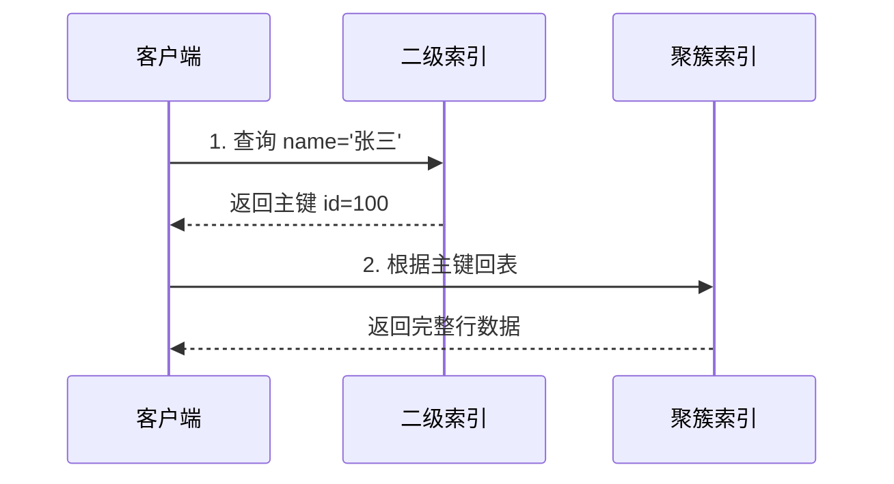
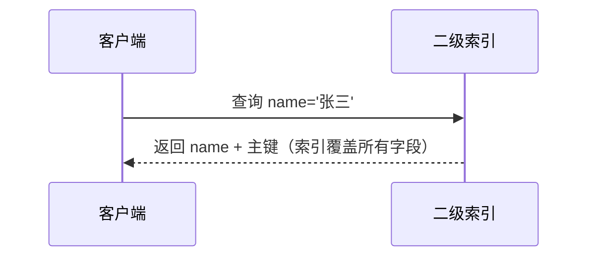
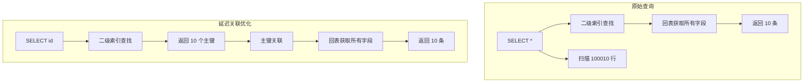

# 覆盖索引与回表

> 面试官问：「如何优化这条 SQL `SELECT * FROM users WHERE name = '张三'`？」你说「建索引」——面试官追问「建完索引后还是慢，怎么优化？」你说「换主键」——面试官说「不对」。真正的问题是「回表」，而解决方案是「覆盖索引」。

## 面试官最关心的 3 个问题（快速自测）

| 问题 | 考察点 | 难度 |
|------|--------|------|
| 什么是回表？为什么需要回表？ | 原理理解 | 🔴 高频 |
| 覆盖索引的原理是什么？ | 性能优化 | 🔴 高频 |
| 如何判断查询是否使用了覆盖索引？ | 实战分析 | 🟡 中频 |

---

## 一、回表与覆盖索引的核心概念

### 1.1 回表（Table Lookup）

使用二级索引查询时，如果要查询的字段不在索引中，需要**回到聚簇索引通过主键获取完整数据**，这个过程称为「回表」。



### 1.2 覆盖索引（Covering Index）

如果查询的所有字段都包含在索引中，**无需回表**，直接从索引返回结果。



---

## 二、回表查询示例

### 2.1 表结构与数据

```sql
CREATE TABLE users (
    id BIGINT PRIMARY KEY,          -- 聚簇索引
    name VARCHAR(50),               -- 二级索引
    age INT,
    email VARCHAR(100),
    phone VARCHAR(20),
    INDEX idx_name (name)            -- 二级索引
);

-- 插入测试数据
INSERT INTO users VALUES (1, '张三', 25, 'zhang@x.com', '13800138001');
INSERT INTO users VALUES (2, '李四', 30, 'li@x.com', '13800138002');
INSERT INTO users VALUES (3, '王五', 28, 'wang@x.com', '13800138003');
```

### 2.2 查询场景对比

| SQL 语句 | 是否回表 | 说明 |
|----------|----------|------|
| `SELECT id, name FROM users WHERE name = '张三'` | ❌ 不回表 | id 和 name 都在索引中 |
| `SELECT name FROM users WHERE name = '张三'` | ❌ 不回表 | name 在索引中 |
| `SELECT * FROM users WHERE name = '张三'` | ✅ 回表 | * 包含所有字段，需要回表 |
| `SELECT age, email FROM users WHERE name = '张三'` | ✅ 回表 | age, email 不在索引中 |

---

## 三、覆盖索引原理

### 3.1 索引组织结构

```sql
-- 索引: idx_name(name)
-- 索引项: (name, 主键 id)

-- 查询: SELECT name FROM users WHERE name = '张三'
-- 索引树已经包含 name 和 id，查询直接返回
```

### 3.2 覆盖索引验证

```sql
EXPLAIN SELECT name FROM users WHERE name = '张三';
```

```
+----+-------------+-------+------------+------+---------------+----------+---------+-------+------+----------+-------------+
| id | select_type | table | type       | key  | key_len       | ref      | rows    | Extra |     |          |             |
+----+-------------+-------+------------+------+---------------+----------+---------+-------+------+----------+-------------+
| 1  | SIMPLE      | users | ref        | idx_name | 53       | const    | 1       | Using index |     |          |             |
+----+-------------+-------+------------+------+---------------+----------+---------+-------+------+----------+-------------+
```

**关键字段解析**：

| 字段 | 含义 | 覆盖索引特征 |
|------|------|-------------|
| `type` | 连接类�� | `ref` = 索引等值查询 |
| `key` | 实际使用的索引 | `idx_name` |
| `Extra` | 附加信息 | **Using index** = 覆盖索引 |

### 3.3 Extra 字段含义对比

| Extra 值 | 含义 | 性能 |
|----------|------|------|
| `Using index` | **覆盖索引**，无需回表 | ✅ 最佳 |
| `Using index condition` | 使用索引下推 | ✅ 良好 |
| `Using where` | 服务器层过滤 | 一般 |
| `Using filesort` | 需要额外排序 | ❌ 差 |
| `Using temporary` | 需要临时表 | ❌ 差 |

---

## 四、联合索引覆盖查询

### 4.1 联合索引设计

```sql
-- 常见查询场景
SELECT * FROM orders WHERE user_id = 100;
SELECT user_id, status FROM orders WHERE user_id = 100;
SELECT user_id, status, create_time FROM orders WHERE user_id = 100 ORDER BY create_time DESC;

-- 优化：建立覆盖索引
CREATE INDEX idx_user_status_time ON orders(user_id, status, create_time);
```

### 4.2 查询类型分析

```sql
-- Q1: SELECT * FROM orders WHERE user_id = 100;
-- 使用索引 + 回表（需要所有字段）

-- Q2: SELECT user_id, status FROM orders WHERE user_id = 100;
-- 使用索引 + 不回表（覆盖索引）

-- Q3: SELECT user_id, status, create_time FROM orders WHERE user_id = 100 ORDER BY create_time DESC;
-- 使用索引 + 不回表 + 避免 filesort（覆盖索引 + 有序）
```

### 4.3 EXPLAIN 分析

```sql
EXPLAIN SELECT user_id, status, create_time FROM orders WHERE user_id = 100 ORDER BY create_time DESC;
```

```
+----+-------------+--------+------------+------+---------------------+---------------------+---------+-------+------+----------+--------------------------+
| id | select_type | table  | type       | key  | key_len             | ref                 | rows    | Extra |     |          |                          |
+----+-------------+--------+------------+------+---------------------+---------------------+---------+-------+------+----------+--------------------------+
| 1  | SIMPLE      | orders | ref        | idx_user_status_time | 8                   | const   | 5     | Using index |     |                          |  -- Using index = 覆盖索引
+----+-------------+--------+------------+------+---------------------+---------------------+---------+-------+------+----------+--------------------------+
```

---

## 五、分页查询与覆盖索引

### 5.1 延迟关联优化

```sql
-- 原始分页查询（需要回表）
SELECT * FROM orders WHERE user_id = 100 LIMIT 100000, 10;

-- 优化：延迟关联，先查主键，再关联获取字段
SELECT o.* FROM orders o
INNER JOIN (
    SELECT id FROM orders WHERE user_id = 100 LIMIT 100000, 10
) t ON o.id = t.id;
```

### 5.2 优化原理



**性能差异**：
- 原始查询：回表 100010 次
- 延迟关联：回表 10 次

---

## 六、常见面试陷阱

:::danger 陷阱 1：认为覆盖索引只能覆盖 WHERE 条件
错误理解：「覆盖索引就是查询条件字段在索引中」
正确理解：覆盖索引要求查询的**所有字段**（SELECT、WHERE、ORDER BY 等）都在索引中。
:::

:::danger 陷阱 2：覆盖索引字段越多越好
错误理解：「把所有字段都加到索引里避免回表」
正确理解：过多字段会增大索引体积，每次写入都要维护，增加写入延迟。需要权衡读性能和写性能。
:::

:::danger 陷阱 3：忽略主键在覆盖索引中的作用
错误理解：「二级索引查询需要回表是因为查询了 *」
正确理解：二级索引叶子节点存储的是「索引值 + 主键」，即使查询 `SELECT name`（name 在索引中），也需要主键值才能唯一确定行。主键不是回表的原因，但回表是通过主键实现的。
:::

---

## 七、实战优化案例

### 案例：用户订单列表查询优化

**原始需求**：展示用户的所有订单列表

```sql
-- 表结构
CREATE TABLE orders (
    id BIGINT PRIMARY KEY,
    user_id BIGINT NOT NULL,
    order_no VARCHAR(32),
    amount DECIMAL(10,2),
    status TINYINT,
    create_time DATETIME,
    INDEX idx_user_id (user_id)
);

-- 高频查询
SELECT * FROM orders WHERE user_id = ? ORDER BY create_time DESC LIMIT 20;
```

**问题分析**：
- 使用 `idx_user_id` 索引查找
- 需要回表获取所有字段
- 需要 `Using filesort` 排序

**优化方案**：

```sql
-- 方案1：覆盖索引（SELECT 字段）
CREATE INDEX idx_user_id_cover ON orders(user_id, create_time DESC);

-- 查询
SELECT id, order_no, amount, status, create_time
FROM orders
WHERE user_id = 100
ORDER BY create_time DESC
LIMIT 20;

-- 方案2：延迟关联（SELECT * 但分页大）
SELECT o.* FROM orders o
INNER JOIN (
    SELECT id FROM orders WHERE user_id = 100 ORDER BY create_time DESC LIMIT 100000, 20
) t ON o.id = t.id;
```

### 性能对比

| 方案 | 回表次数 | 文件排序 | 适用场景 |
|------|----------|----------|----------|
| 原始查询 | 全量回表 | 需要 | 小表、低频查询 |
| 覆盖索引 | 无需回表 | 索引有序，无需 | 高频查询、字段可预见 |
| 延迟关联 | 分页数回表 | 无 | 深分页、大偏移 |

---

## 八、加分回答

> 💡 **索引条件下推（ICP）与覆盖索引的关系**：
> ICP 在索引遍历时提前过滤数据，减少回表次数；覆盖索引完全避免回表。两者结合效果最佳：
>
> ```sql
> -- 索引: (name, age, email)
> -- 查询: SELECT name, age FROM users WHERE name LIKE '张%' AND age = 25;
> ```
>
> - 无 ICP/覆盖：先找到 `name LIKE '张%'`，回表，过滤 `age = 25`
> - 有 ICP：索引遍历时过滤 `age = 25`，减少回表
> - 覆盖索引：`name, age` 都在索引中，完全不回表

> 💡 **联合索引列顺序与覆盖索引**：
> 建立覆盖索引时，需要考虑查询中字段的顺序。尽量将高频查询的字段放前面，并确保所有查询字段都在索引中。

---

## 九、总结对比表

| 查询类型 | 是否回表 | 是否覆盖索引 | 性能 |
|----------|----------|--------------|------|
| `SELECT id FROM t WHERE name = ?` | ❌ | ✅ | 最优 |
| `SELECT name FROM t WHERE name = ?` | ❌ | ✅ | 最优 |
| `SELECT * FROM t WHERE name = ?` | ✅ | ❌ | 一般 |
| `SELECT age, email FROM t WHERE name = ?` | ✅ | ❌ | 较差 |

| 优化手段 | 原理 | 适用场景 |
|----------|------|----------|
| 覆盖索引 | 所有字段在索引中，无需回表 | 查询字段固定、可预见 |
| 延迟关联 | 先查主键，再关联获取字段 | 深分页、大偏移 |
| 索引覆盖 + 排序 | 索引有序，避免 filesort | 分页排序查询 |