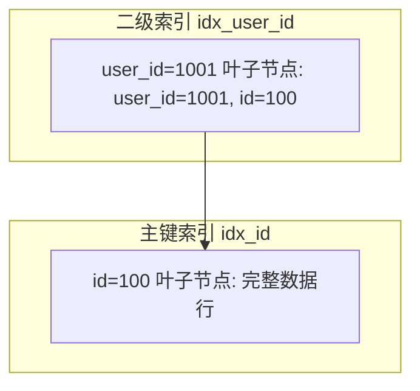
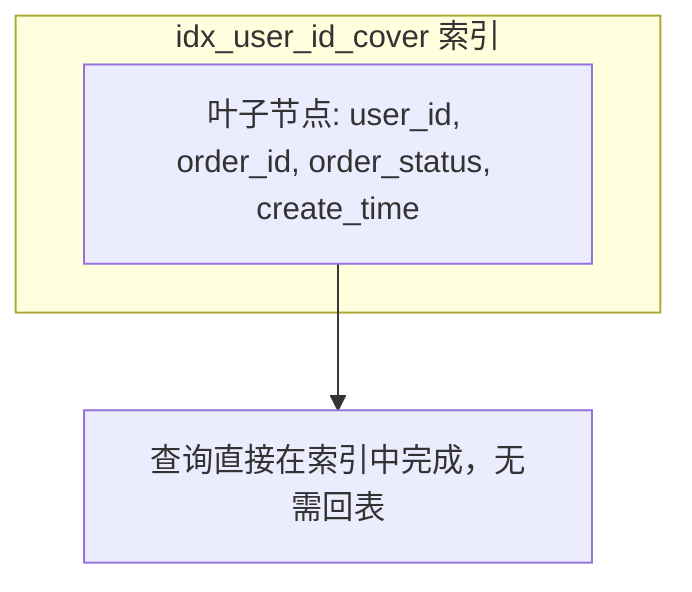

候选人小张在美团二面中，面试官看了他写的慢查询：

```sql
SELECT order_id, order_status, create_time FROM orders WHERE user_id = '1001';
```

问："这条 SQL 怎么优化？"

小张说："给 user_id 加个索引？"面试官："加了索引之后，还需要访问回表吗？"

小张愣了一下："需要吧...？"

面试官："那能不能不回表？"

小张卡住了。

【面试官心理】
这道题我用来区分"知道加索引"和"会优化索引"的候选人。知道加索引的占 80%，知道什么叫回表的占 50%，能说出覆盖索引并正确设计的占 20%。覆盖索引是 MySQL 优化的核心技术，但真正理解的人不多。

## 一、回表是什么 🔴

### 1.1 从索引到数据的距离

InnoDB 中，主键索引（聚簇索引）的叶子节点存的是完整数据行，而普通索引（二级索引）的叶子节点只存主键值。



当查询的字段不在二级索引中时，就需要先查二级索引拿到主键 id，再去主键索引查完整数据，这个过程叫**回表**。

```sql
-- 这条 SQL 需要回表
SELECT order_id, order_status, create_time FROM orders WHERE user_id = '1001';
-- idx_user_id 只包含 (user_id, id)，不包含 order_status 和 create_time

-- 回表过程：
-- 1. 在 idx_user_id 中找到 user_id=1001 对应的所有 id
-- 2. 用 id 去主键索引查完整行
-- 3. 取出 order_status 和 create_time
```

### 1.2 回表的代价

回表意味着**至少两次 B+Tree 查找**。如果匹配的行很多，回表就是性能杀手。

```sql
-- user_id=1001 的订单有 5000 条
-- 就要回表 5000 次
EXPLAIN SELECT order_id, order_status, create_time FROM orders WHERE user_id = '1001';
```

| 字段 | 值 | 含义 |
| --- | --- | --- |
| type | range | 范围查询 |
| key | idx_user_id | 走了这个索引 |
| rows | 5000 | 预计返回 5000 行 |
| Extra | Using index condition | 需要回表 |

### 1.3 ❌ 错误示范

**候选人原话**："给 user_id 加了索引就快了，因为不用全表扫描了。"

**问题诊断**：
- 忽略了回表的代价
- 如果查询返回数据量大，回表次数多，反而比全表扫描更慢
- 没有分析执行计划

## 二、覆盖索引：消除回表 🔴

### 2.1 什么是覆盖索引

如果查询所需的字段**全部**在二级索引中，就不需要回表，这就是**覆盖索引**（Covering Index）。

```sql
-- 覆盖索引：把查询字段都包含在索引里
ALTER TABLE orders ADD INDEX idx_user_id_cover (user_id, order_id, order_status, create_time);

-- 现在这条 SQL 不需要回表
SELECT order_id, order_status, create_time FROM orders WHERE user_id = '1001';
```



### 2.2 执行计划的变化

```sql
-- 使用覆盖索引后的执行计划
EXPLAIN SELECT order_id, order_status, create_time FROM orders WHERE user_id = '1001';
```

| 字段 | 使用前 | 使用后 |
| --- | --- | --- |
| type | range | range |
| key | idx_user_id | idx_user_id_cover |
| rows | 5000 | 5000 |
| Extra | Using index condition | **Using index** |

`Using index` 表示触发了覆盖索引，**不需要回表**。

:::tip 💡
`Using index condition` 和 `Using index` 区别：
- `Using index condition`：使用了索引但需要回表
- `Using index`：完全在索引中完成，叫"索引覆盖"

记住这两个的区别，面试时被问到能加分。
:::

## 三、复合索引字段顺序的艺术 🟡

### 3.1 最左前缀原则

复合索引 `(A, B, C)` 意味着：

```
索引按 A 排序，A 相同时按 B 排序，B 相同时按 C 排序
```

```sql
-- 假设有索引 (user_id, order_status, create_time)

-- ✅ 能用索引：满足最左前缀
SELECT * FROM orders WHERE user_id = '1001';
SELECT * FROM orders WHERE user_id = '1001' AND order_status = 1;

-- ❌ 不能用索引：跳过最左列
SELECT * FROM orders WHERE order_status = 1;
SELECT * FROM orders WHERE order_status = 1 AND create_time > '2024-01-01';
```

### 3.2 覆盖索引的字段顺序设计

覆盖索引要同时满足两个条件：
1. **WHERE 条件字段在前**（保证能定位数据）
2. **SELECT 字段紧跟其后**（实现覆盖）

```sql
-- 场景：经常查询某用户的所有已完成订单
-- WHERE: user_id = ? AND order_status = ?
-- SELECT: order_id, create_time

-- ✅ 正确设计
ALTER TABLE orders ADD INDEX idx_cover (user_id, order_status, order_id, create_time);

-- ❌ 错误设计：SELECT 字段放在最后
ALTER TABLE orders ADD INDEX idx_cover_wrong (user_id, order_status, create_time, order_id);
-- 这样 order_id 不在索引树中，还是需要回表
```

### 3.3 设计原则


:::warning ⚠️
覆盖索引不是越大越好。索引字段太多会导致：
1. 索引体积变大，写入变慢
2. 索引维护成本增加
3. 占用更多内存

原则：只为高频查询建立覆盖索引，不要过度设计。
:::

## 四、实战优化案例 🟡

### 4.1 案例：订单列表查询优化

```sql
-- 原始慢查询：100ms+
SELECT id, order_no, status, amount, create_time
FROM orders
WHERE user_id = '1001' AND status IN (1, 2, 3)
ORDER BY create_time DESC
LIMIT 20;
```

优化前执行计划：

| key | rows | Extra |
| --- | --- | --- |
| idx_user_id | 5000 | Using where; Using filesort |

问题：查了 5000 行，排序在内存/磁盘中完成。

优化后：

```sql
-- 建覆盖索引
ALTER TABLE orders ADD INDEX idx_user_status_cover (
    user_id, status, create_time, id, order_no, amount
);

-- 验证优化效果
EXPLAIN SELECT id, order_no, status, amount, create_time
FROM orders
WHERE user_id = '1001' AND status IN (1, 2, 3)
ORDER BY create_time DESC
LIMIT 20;
```

优化后执行计划：

| key | rows | Extra |
| --- | --- | --- |
| idx_user_status_cover | 50 | Using index |

`Using index`，不需要回表，不需要额外排序（索引本身按 create_time 排序）。

### 4.2 索引下推与覆盖索引的配合

MySQL 5.6 引入了索引下推（ICP），可以在索引遍历过程中进行过滤。

```sql
-- 假设索引 (user_id, status, create_time)
SELECT * FROM orders WHERE user_id = '1001' AND status IN (1, 2, 3);
```

- **无 ICP**：先通过 user_id 找到所有记录，回表，再过滤 status
- **有 ICP**：在索引中同时过滤 user_id 和 status，减少回表次数

【面试官心理】
问到覆盖索引时，我通常会追问 ICP（索引下推）。能说出两者配合减少回表次数的，基本都有源码阅读经验或者深入学习过 MySQL 原理。

## 五、什么时候不需要覆盖索引

### 5.1 数据量小时

```sql
-- 用户表只有 1000 条记录
-- 全表扫描可能比走索引更快
SELECT name, email FROM users WHERE age = 25;
```

### 5.2 SELECT *

```sql
-- ❌ 如果真的需要所有字段，索引覆盖没有意义
SELECT * FROM orders WHERE user_id = '1001';
-- 无论怎么建索引，SELECT * 总是需要回表取其他字段
```

:::tip 💡
解决 SELECT * 的问题：除非真的需要所有字段，否则明确列出需要的字段。这样不仅支持覆盖索引优化，还减少网络传输量。
:::

## 六、生产避坑

### 6.1 索引不是万能药

```sql
-- ❌ 过度使用覆盖索引
-- 每次查询都建一个专属索引
ALTER TABLE orders ADD INDEX idx_cover1 (user_id, f1, f2, f3);
ALTER TABLE orders ADD INDEX idx_cover2 (status, f1, f2, f4);
ALTER TABLE orders ADD INDEX idx_cover3 (create_time, f2, f3, f5);
-- 索引数量爆炸，写入性能严重下降
```

### 6.2 监控索引使用情况

```sql
-- 查看索引使用频率
SELECT * FROM performance_schema.table_io_waits_summary_by_index_usage
WHERE object_schema = 'db_name' AND object_name = 'orders'
ORDER BY count_star DESC;
```

【面试官心理】
我问他"能不能不回表"，其实是在测试他对 InnoDB 索引结构的理解深度。知道主键索引和二级索引差异的占 50%，能设计出覆盖索引的占 20%，能权衡索引体积和查询性能的占 10%。这道题是 P6 和 P7 的分水岭。
