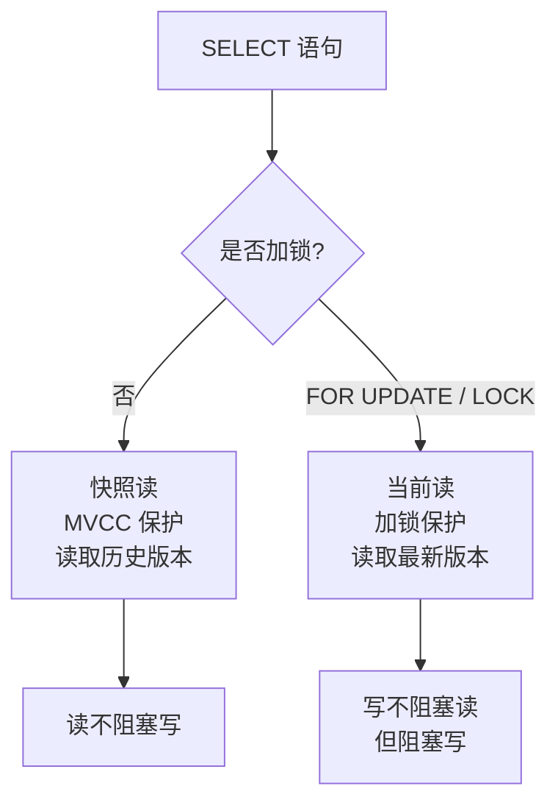
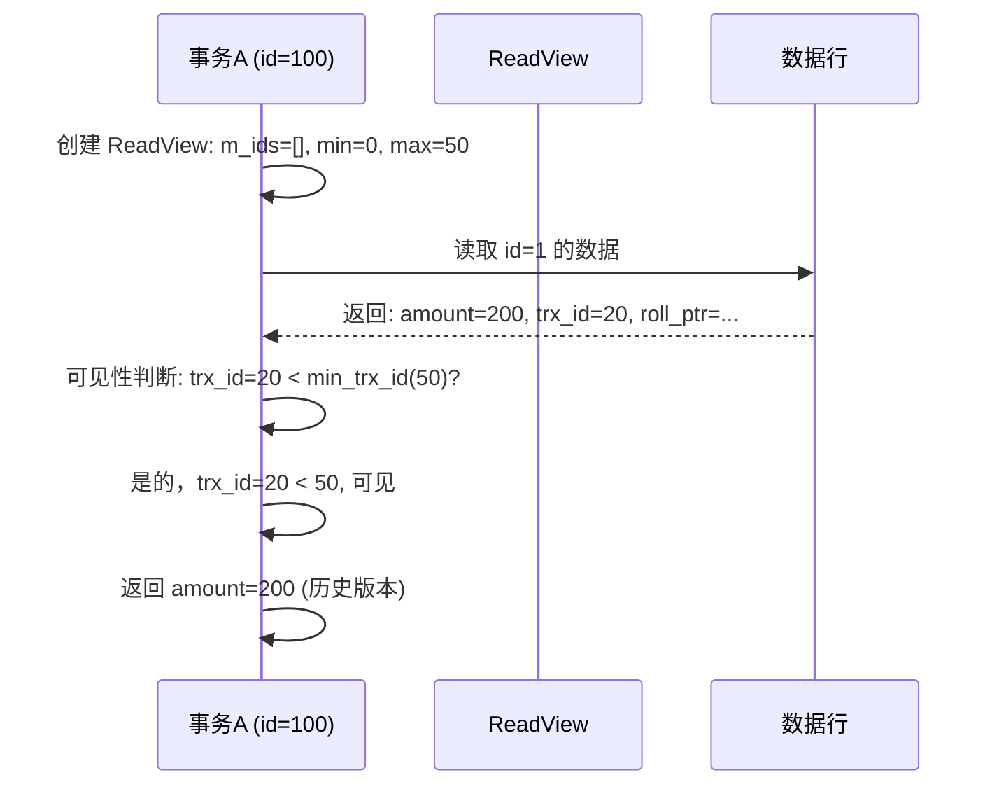
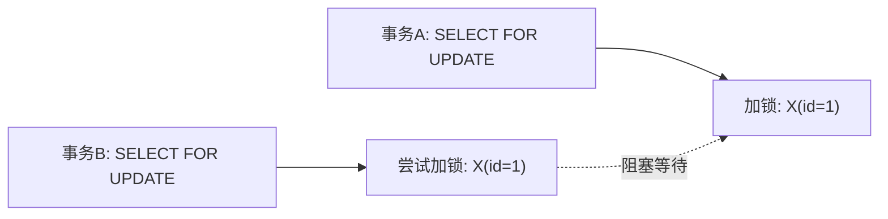
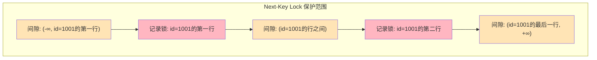

候选人小李在字节三面中，面试官问：

"SELECT * FROM orders WHERE id = 1 和 SELECT * FROM orders WHERE id = 1 FOR UPDATE 有什么区别？"

小李说："FOR UPDATE 会加锁。"

面试官追问："加了什么锁？锁住后，其他事务还能读取这条数据吗？"

小李说："应该不能...吧？"

面试官继续追问："如果用快照读呢？其他事务能读到吗？"

小李彻底懵了。

【面试官心理】
这道题我用来区分"知道加锁"和"理解锁机制"的候选人。能说出 FOR UPDATE 加排他锁的占 60%，能区分快照读和当前读的占 30%，能说清 MVCC 和锁如何配合的占 10%。当前读和快照读是 MySQL 并发控制的核心概念。

## 一、两种读的本质区别 🔴

### 1.1 快照读（Snapshot Read）

快照读读取的是**历史版本**的数据，不加锁。

```sql
-- 快照读：MVCC 保护，读取历史版本
SELECT * FROM orders WHERE id = 1;
SELECT * FROM orders WHERE status = 1 ORDER BY create_time LIMIT 10;
```

### 1.2 当前读（Current Read）

当前读读取的是**最新版本**的数据，并且加锁。

```sql
-- 当前读：读取最新版本，加锁
SELECT * FROM orders WHERE id = 1 FOR UPDATE;  -- 排他锁
SELECT * FROM orders WHERE id = 1 LOCK IN SHARE MODE;  -- 共享锁
INSERT INTO orders (...) VALUES (...);  -- 插入加排他锁
UPDATE orders SET status = 1 WHERE id = 1;  -- 更新加排他锁
DELETE FROM orders WHERE id = 1;  -- 删除加排他锁
```

### 1.3 对比表

| 特性 | 快照读 | 当前读 |
| --- | --- | --- |
| 读取版本 | 历史版本（MVCC） | 最新版本 |
| 加锁 | 不加锁 | 加锁 |
| 并发性能 | 高 | 低 |
| 读取数据 | 可能不是最新 | 一定是最新 |
| 适用场景 | 普通查询 | 修改操作 |



【面试官心理】
我问他快照读和当前读的区别，很多候选人会说"一个是读一个是写"。但能讲清楚 MVCC 保护快照读、锁保护当前读的候选人，基本都理解 MySQL 的并发控制机制。

## 二、MVCC 如何实现快照读 🔴

### 2.1 快照读的完整流程

```sql
-- 事务A (id=100) 执行快照读
SELECT * FROM orders WHERE id = 1;
```



### 2.2 为什么快照读不加锁

快照读通过 ReadView 读取历史版本，不需要对数据行加锁，因为：
1. 其他事务修改数据会创建新版本，不影响历史版本
2. 历史版本通过 undo log 链维护，有 MVCC 机制保护
3. 读取历史版本不会阻塞写操作

## 三、锁如何实现当前读 🔴

### 3.1 当前读必须加锁的原因

```sql
-- 事务A 执行当前读
START TRANSACTION;
SELECT * FROM orders WHERE id = 1 FOR UPDATE;
-- 加排他锁 X

-- 事务B 执行当前读
START TRANSACTION;
SELECT * FROM orders WHERE id = 1 FOR UPDATE;
-- 被阻塞！等待事务A 释放锁
```



### 3.2 为什么当前读需要读取最新版本

```sql
-- 场景：余额扣减
START TRANSACTION;

-- ❌ 快照读：不读取最新版本，可能超扣
SELECT balance FROM accounts WHERE id = 1;  -- balance=100
-- 此时其他事务已将 balance 改为 50

-- 业务计算：100 - 50 = 50
UPDATE accounts SET balance = 50 WHERE id = 1;  -- 错误！应该扣成 0

-- ✅ 当前读：必须读取最新版本
SELECT balance FROM accounts WHERE id = 1 FOR UPDATE;  -- balance=50
-- 其他事务在此等待

-- 业务计算：50 - 50 = 0
UPDATE accounts SET balance = 0 WHERE id = 1;  -- 正确！
COMMIT;
```

:::warning ⚠️
如果 UPDATE 语句不先加锁，直接 UPDATE 时 MySQL 也会加锁。但先 SELECT FOR UPDATE 再 UPDATE 是更安全的做法，可以避免竞态条件。
:::

## 四、两者的组合使用 🟡

### 4.1 典型的事务模式

```sql
-- 订单支付流程
START TRANSACTION;

-- 1. 读取订单最新状态（当前读，加锁）
SELECT * FROM orders WHERE id = 1 FOR UPDATE;
-- 其他事务无法修改此订单

-- 2. 业务判断
IF order.status != '待支付' THEN
    ROLLBACK;  -- 已支付，直接返回
END IF;

-- 3. 更新订单状态
UPDATE orders SET status = '已支付' WHERE id = 1;

-- 4. 扣减余额（当前读，加锁）
UPDATE accounts SET balance = balance - amount WHERE user_id = ?;

COMMIT;
```

### 4.2 一致性读和一致性写的配合

```sql
-- ❌ 错误：先快照读，再当前写
START TRANSACTION;
SELECT * FROM orders WHERE id = 1;  -- 快照读，看到 status='待支付'
-- 其他事务已将 status 改为 '已取消'

-- 业务判断：通过，继续处理
UPDATE orders SET status = '已支付' WHERE id = 1;  -- 错误！已取消的订单被支付了

-- ✅ 正确：先当前读，再一致性写
START TRANSACTION;
SELECT * FROM orders WHERE id = 1 FOR UPDATE;  -- 当前读，看到最新 status='待支付'
-- 其他事务无法修改

-- 业务判断：通过
UPDATE orders SET status = '已支付' WHERE id = 1;  -- 正确
```

## 五、RR 级别下的幻读问题 🟡

### 5.1 快照读幻读：MVCC 解决

```sql
-- 事务A (RR)
START TRANSACTION;

-- 快照读：读取历史版本，不会幻读
SELECT * FROM orders WHERE user_id = '1001';  -- 10 条

-- 事务B 插入新订单
INSERT INTO orders (user_id, amount) VALUES ('1001', 100);
COMMIT;

-- 快照读：看不到新插入，RR 级别下 ReadView 不变
SELECT * FROM orders WHERE user_id = '1001';  -- 还是 10 条
```

### 5.2 当前读幻读：Next-Key Lock 解决

```sql
-- 事务A (RR)
START TRANSACTION;

-- 当前读：读取最新版本，需要防止幻读
SELECT * FROM orders WHERE user_id = '1001' FOR UPDATE;
-- 加 Next-Key Lock: 锁定 user_id='1001' 的所有现有行 + 前后间隙

-- 事务B 尝试插入
INSERT INTO orders (user_id, amount) VALUES ('1001', 100);
-- 被阻塞！Next-Key Lock 锁住了插入位置
```



【面试官心理】
能区分快照读幻读和当前读幻读，并说明它们分别由什么机制解决的候选人，基本都是 P7 水准。RR 级别下 MySQL 的幻读解决是一个复杂的机制。

## 六、生产避坑 🟡

### 6.1 快照读误用导致数据不一致

```java
// ❌ 错误代码
@Transactional
public void transfer(Long fromId, Long toId, BigDecimal amount) {
    Account from = accountRepository.findById(fromId);  // 快照读
    Account to = accountRepository.findById(toId);      // 快照读

    if (from.getBalance().compareTo(amount) < 0) {
        throw new BusinessException("余额不足");
    }

    from.setBalance(from.getBalance().subtract(amount));
    to.setBalance(to.getBalance().add(amount));

    accountRepository.save(from);
    accountRepository.save(to);
}
```

**问题**：快照读看到的 balance 可能是历史版本，导致重复扣款。

**解决方案**：使用 `@Modifying` 注解或原生 SQL 的 `SELECT ... FOR UPDATE`。

```java
// ✅ 正确代码
@Query("SELECT a FROM Account a WHERE a.id = :id")
Account findByIdForUpdate(@Param("id") Long id);  // 当前读

@Transactional
public void transfer(Long fromId, Long toId, BigDecimal amount) {
    Account from = accountRepository.findByIdForUpdate(fromId);  // 当前读
    Account to = accountRepository.findByIdForUpdate(toId);      // 当前读

    if (from.getBalance().compareTo(amount) < 0) {
        throw new BusinessException("余额不足");
    }

    from.setBalance(from.getBalance().subtract(amount));
    to.setBalance(to.getBalance().add(amount));

    accountRepository.save(from);
    accountRepository.save(to);
}
```

### 6.2 当前读导致的死锁

```sql
-- 事务A
START TRANSACTION;
SELECT * FROM orders WHERE id = 1 FOR UPDATE;  -- 锁定 id=1
SELECT * FROM orders WHERE id = 2 FOR UPDATE;  -- 锁定 id=2

-- 事务B（并发）
START TRANSACTION;
SELECT * FROM orders WHERE id = 2 FOR UPDATE;  -- 锁定 id=2
SELECT * FROM orders WHERE id = 1 FOR UPDATE;  -- 尝试锁定 id=1，被 A 阻塞
-- 死锁！事务A 持有 id=2 的锁，等待 id=1
-- 事务B 持有 id=1 的锁，等待 id=2
```

:::tip 💡
解决死锁的方法：按固定顺序加锁。所有事务都先锁定 id 小的记录，再锁定 id 大的记录。
:::

## 七、面试追问链 🟡

**第一层**：快照读和当前读的区别是什么？
- 候选人：快照读不加锁读历史版本，当前读加锁读最新版本

**第二层**：MVCC 保护的是哪种读？
- 候选人：快照读

**第三层**：RR 级别下，快照读能防止幻读吗？
- 候选人：能，通过 ReadView 读取历史版本

**第四层**：如果既要快照读的一致性，又要防止幻读，怎么办？
- 候选人：在同一个事务中混合使用快照读和当前读，或使用 SERIALIZABLE 级别
